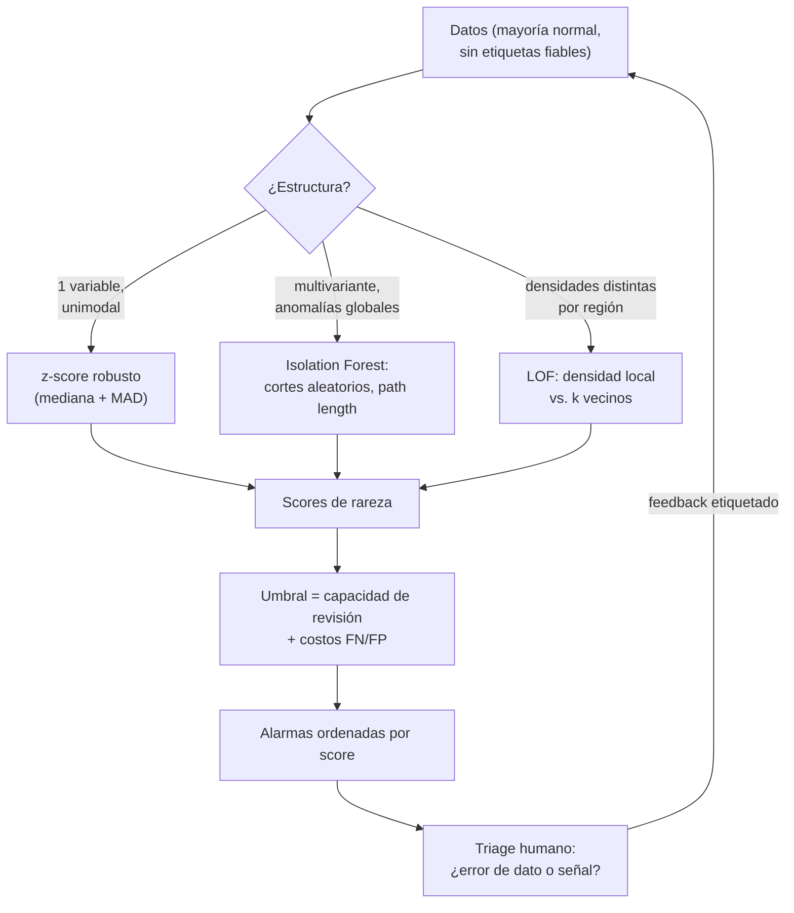

# 044 — Detección de anomalías

> [← Clase anterior](../../../classes/part-03-classical-machine-learning/043-clustering-y-reduccion-de-dimensionalidad/README.md) · [Índice de la parte](../README.md) · [Clase siguiente →](../../../classes/part-03-classical-machine-learning/045-series-temporales-y-backtesting/README.md)

**Parte:** 03 — Machine learning clásico  
**Nivel:** intermedio · **Horas estimadas:** 6  
**Laboratorio:** `ml` · **Estado:** `EXECUTABLE_CORE`

## 🎯 Propósito

Comprender **detección de anomalías** dentro de la evolución de la inteligencia
artificial, implementar un experimento mínimo verificable y distinguir qué parte
constituye evidencia frente a una afirmación todavía no comprobada.

## 📚 Resultados de aprendizaje

Al finalizar podrás:

1. Explicar detección de anomalías usando los conceptos `anomalías`, `aislamiento`, `densidad`, `umbrales`.
2. Ejecutar el laboratorio con una semilla explícita y revisar su contrato JSON.
3. Identificar al menos un supuesto, una limitación y un riesgo de aplicación.
4. Comparar el enfoque con la etapa anterior de la ruta de aprendizaje.
5. Producir una evidencia reproducible y una conclusión que no exceda los datos.

## 🧩 Conceptos centrales

`anomalías`, `aislamiento`, `densidad`, `umbrales`

## 🗺️ Ubicación en el mapa de la IA

La detección de anomalías invierte la pregunta habitual del ML: en lugar de modelar lo que
las clases tienen en común, modela **lo normal** para señalar lo que se desvía. Es el
puente entre el clustering de la clase anterior (densidad, distancia) y aplicaciones donde
las etiquetas son escasas por definición — fraude, fallas de máquinas, intrusiones,
monitoreo de modelos en producción. Sus tres familias (estadística, densidad, aislamiento)
reaparecen después en la observabilidad de sistemas de IA: detectar drift de datos es
detectar anomalías sobre las features.

## 📖 Fundamentos

### 📏 Enfoque estadístico: z-score y variantes robustas

Si una variable es aproximadamente normal, la desviación estandarizada mide rareza:

```text
z = (x − μ) / σ          |z| > 3  →  ~0.3 % de los datos legítimos (regla clásica)
```

Problema: μ y σ se calculan con los mismos datos que contienen las anomalías, y ambas son
sensibles a outliers (la anomalía "se esconde" inflando σ: efecto *masking*). Variante
robusta con mediana y MAD (desviación absoluta mediana):

```text
z_robusto = (x − mediana) / (1.4826 · MAD)      MAD = mediana(|xᵢ − mediana|)
```

El factor 1.4826 hace comparable el MAD con σ bajo normalidad. Límites del enfoque:
univariante (o exige modelar la covarianza: distancia de Mahalanobis) y supone una forma
de distribución.

### 🌲 Isolation Forest: aislar en lugar de modelar

Idea (Liu, Ting & Zhou 2008): las anomalías son **pocas y diferentes**, así que son más
fáciles de aislar con cortes aleatorios. Se construyen árboles con splits aleatorios
(feature aleatoria, corte aleatorio en su rango); la profundidad a la que un punto queda
solo (*path length* h(x)) mide su rareza: los outliers se aíslan cerca de la raíz.

```text
score(x) = 2^( −E[h(x)] / c(n) )     c(n) ≈ 2·ln(n−1) + 0.5772 − 2(n−1)/n
```

- score → 1: anomalía (camino corto); score ≈ 0.5: punto ordinario.
- c(n) normaliza por la profundidad esperada de un árbol binario de búsqueda con n puntos.
- Complejidad casi lineal, funciona en alta dimensión moderada, no exige distribución.
- Hiperparámetro clave: `contamination` (fracción esperada de anomalías) que fija el
  umbral sobre el score — es una decisión, no una propiedad de los datos.

### 🏘️ LOF: densidad local relativa

*Local Outlier Factor* (Breunig et al. 2000) compara la densidad alrededor de un punto con
la de sus k vecinos:

```text
LOF(x) ≈ densidad media de los k vecinos / densidad local de x
```

LOF ≈ 1: tan denso como sus vecinos (normal); LOF ≫ 1: mucho menos denso que su entorno
(anomalía **local**). Su ventaja distintiva: detecta el punto que es raro *para su
región* aunque globalmente parezca ordinario (una compra de 200 USD puede ser normal en
una cuenta y anómala en otra). Costo O(n²) ingenuo; sensible a la elección de k.

### 🎯 Evaluación y decisión

Las anomalías son raras (0.1-5 %): la accuracy es inútil (el baseline "todo normal"
acierta 99 %+). Se evalúa con precision-recall sobre las alarmas, y el umbral se fija con
la **capacidad de revisión** (si el equipo puede investigar 100 casos/día, el umbral
correcto entrega ~100 alarmas/día ordenadas por score) y el costo asimétrico FN/FP
(clase 039). Distinguir además: **outlier** (error de dato, se limpia) vs. **anomalía de
interés** (fraude, falla: es la señal). El mismo detector encuentra ambos; el triage es
humano y de dominio.

## 🧮 Ejemplo trabajado

Montos de 10 transacciones (USD): [12, 15, 11, 14, 13, 12, 16, 15, 13, 480].

```text
Con todo incluido: μ = 60.1, σ ≈ 140  → z(480) = (480−60.1)/140 ≈ 3.0  (apenas dispara)
                                        z(16)  = (16−60.1)/140 ≈ −0.31 (los normales quedan "raros de tan cerca")
Robusto: mediana = 13.5, MAD = mediana(|x−13.5|) = mediana([1.5, 1.5, 2.5, 0.5, 0.5,
         1.5, 2.5, 1.5, 0.5, 466.5]) = 1.5
z_rob(480) = (480 − 13.5) / (1.4826·1.5) ≈ 466.5 / 2.224 ≈ 209.8
```

El z-score clásico casi no detecta el fraude porque el propio fraude infló σ de ~1.5 a
140 (masking); el robusto lo señala con z ≈ 210. Lección: los estimadores del "perfil
normal" no deben dejarse contaminar por lo que se busca detectar.

## 📊 Propiedades y comparación

| Método | Supuestos | Tipo de anomalía | Costo | Alta dimensión | Hiperparámetros |
|---|---|---|---|---|---|
| z-score / MAD | Distribución unimodal | Global, univariante | O(n) | No (por variable) | Umbral |
| Mahalanobis | Gaussiana multivariante | Global, correlacionada | O(nd²) | Media | Umbral |
| Isolation Forest | Pocas y diferentes | Global, multivariante | ~O(n log n) | Buena | n árboles, contamination |
| LOF | Densidad localmente comparable | **Local** | O(n²) | Mala | k, umbral |
| Basado en clusters | Clusters válidos | Punto lejos de todo centroide | Según método | Media | k del clustering |



## ⚠️ Errores conceptuales frecuentes

1. **"|z|>3 es el umbral universal."** Solo calibra bajo normalidad; con colas pesadas
   dispara constantemente y con σ contaminada no dispara nunca (masking). El umbral es una
   decisión operativa, no una constante física.
2. **"El detector encuentra fraudes."** Encuentra *raros*: errores de tipeo, clientes
   legítimos excéntricos y fraudes por igual. Sin triage humano y feedback etiquetado, la
   precisión de alarmas se desconoce.
3. **"Accuracy 99.5 %: el detector es excelente."** Con 0.5 % de anomalías, "todo es
   normal" logra 99.5 %. Las métricas relevantes son precision/recall de la clase rara y
   alarmas por unidad de revisión.
4. **"Isolation Forest no tiene supuestos."** Supone que las anomalías son pocas y
   separables por cortes alineados a los ejes; anomalías que solo se ven en combinaciones
   lineales de features (o contextuales/temporales) se le escapan.
5. **"Entreno el perfil normal con todos los datos."** Si el histórico ya contiene
   anomalías, el modelo las aprende como normales. Lo correcto es depurar el train
   (robustez, revisión) o usar métodos que toleren contaminación declarada.

## 🚀 Del aprendizaje a la operación

Un detector operativo necesita: bucle de feedback donde cada alarma revisada devuelve una
etiqueta (convirtiendo gradualmente el problema en supervisado), recalibración del perfil
normal con ventanas móviles (lo normal deriva: estacionalidad, nuevos productos), control
de la tasa de alarmas alineado con la capacidad del equipo (alarm fatigue destruye el
sistema más preciso), explicación por alarma (qué features dispararon el score, para
acelerar el triage) y métricas de negocio — fraude evitado por hora de analista — además
de las métricas de la clase rara.

## 🧪 Laboratorio

```bash
python lab.py
```

El laboratorio llama a `ai_evolution.labs.run_lab("ml")`. Esta
decisión evita 183 implementaciones divergentes: cada clase tiene un entrypoint
propio, pero los motores didácticos se prueban como una biblioteca común.

### 🔍 Evidencia esperada

- tipo de laboratorio y semilla;
- entradas o decisiones observables;
- resultado estructurado;
- lista `evidence` con hechos que pueden inspeccionarse;
- lista `limitations` que impide presentar la demo como producción.

## 📓 Notebooks

- [📓 `notebook.ipynb`](notebook.ipynb): recorrido guiado con la materia resumida.
- [✍️ `notebook_student.ipynb`](notebook_student.ipynb): ejercicios para resolver.
- [✅ `notebook_solution.ipynb`](notebook_solution.ipynb): solución de referencia explicada.

## 📝 Evaluación

| Criterio | Peso |
|---|---:|
| Comprensión conceptual | 25 % |
| Ejecución reproducible | 25 % |
| Interpretación basada en evidencia | 25 % |
| Riesgos, límites y mejora propuesta | 25 % |

Consulta [assessment.md](assessment.md) para preguntas y criterio de aceptación.

## ⚠️ Errores comunes

| Síntoma | Causa probable | Corrección |
|---|---|---|
| El código corre, pero no hay conclusión | Se confundió ejecución con aprendizaje | Explica qué demuestra y qué no demuestra |
| El resultado cambia sin explicación | No se registró semilla o configuración | Conserva semilla, versión y parámetros |
| Se promete uso real | Se extrapoló desde una demo educativa | Declara entorno, datos, límites y revisión humana |
| Se copia una métrica aislada | No existe baseline ni costo de error | Añade comparación y criterio de decisión |

## ❓ Preguntas frecuentes

**¿Debo usar una API comercial?**  
No. El núcleo funciona localmente. Las extensiones LIVE se documentan por separado.

**¿El laboratorio representa una implementación industrial?**  
No por sí solo. Enseña el contrato y el patrón; producción exige integración,
seguridad, observabilidad, pruebas y operación.

**¿Dónde profundizo?**  
Revisa las especializaciones enlazadas en el README raíz y la ruta siguiente.

## 🔗 Referencias

- [Liu, Ting & Zhou (2008), "Isolation Forest", IEEE ICDM. DOI 10.1109/ICDM.2008.17](https://doi.org/10.1109/ICDM.2008.17)
- [Breunig, Kriegel, Ng & Sander (2000), "LOF: Identifying Density-Based Local Outliers", ACM SIGMOD. DOI 10.1145/342009.335388](https://doi.org/10.1145/342009.335388)
- [Chandola, Banerjee & Kumar (2009), "Anomaly Detection: A Survey", ACM Computing Surveys. DOI 10.1145/1541880.1541882](https://doi.org/10.1145/1541880.1541882)
- [scikit-learn User Guide — Novelty and Outlier Detection](https://scikit-learn.org/stable/modules/outlier_detection.html)
- [Hastie, Tibshirani, Friedman — *The Elements of Statistical Learning* (2e), PDF oficial (contexto de densidad y vecinos, cap. 13-14)](https://hastie.su.domains/ElemStatLearn/)

---

## ⬅️ Clase anterior

[043 — Clustering y reducción de dimensionalidad](../../part-03-classical-machine-learning/043-clustering-y-reduccion-de-dimensionalidad/README.md)

## ➡️ Siguiente clase

[045 — Series temporales y backtesting](../../part-03-classical-machine-learning/045-series-temporales-y-backtesting/README.md)
