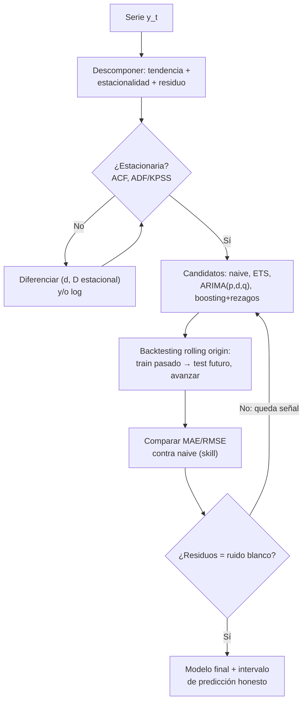

# 045 — Series temporales y backtesting

> [← Clase anterior](../../../classes/part-03-classical-machine-learning/044-deteccion-de-anomalias/README.md) · [Índice de la parte](../README.md) · [Clase siguiente →](../../../classes/part-03-classical-machine-learning/046-sistemas-de-recomendacion/README.md)

**Parte:** 03 — Machine learning clásico  
**Nivel:** intermedio · **Horas estimadas:** 6  
**Laboratorio:** `ml` · **Estado:** `EXECUTABLE_CORE`

## 🎯 Propósito

Comprender **series temporales y backtesting** dentro de la evolución de la inteligencia
artificial, implementar un experimento mínimo verificable y distinguir qué parte
constituye evidencia frente a una afirmación todavía no comprobada.

## 📚 Resultados de aprendizaje

Al finalizar podrás:

1. Explicar series temporales y backtesting usando los conceptos `series`, `ventana`, `backtesting`, `forecasting`.
2. Ejecutar el laboratorio con una semilla explícita y revisar su contrato JSON.
3. Identificar al menos un supuesto, una limitación y un riesgo de aplicación.
4. Comparar el enfoque con la etapa anterior de la ruta de aprendizaje.
5. Producir una evidencia reproducible y una conclusión que no exceda los datos.

## 🧩 Conceptos centrales

`series`, `ventana`, `backtesting`, `forecasting`

## 🗺️ Ubicación en el mapa de la IA

Las series temporales rompen el supuesto i.i.d. sobre el que descansa todo lo anterior:
las observaciones están ordenadas y correlacionadas, y el futuro no está disponible al
entrenar. Esta clase adapta el protocolo de la clase 037 al tiempo — el split aleatorio se
convierte en **backtesting** con ventanas — e introduce el modelado clásico (tendencia,
estacionalidad, ARIMA de Box & Jenkins, 1970). La disciplina de "validar solo hacia
adelante" que se aprende aquí es la misma que gobierna la evaluación de agentes y modelos
en producción: todo sistema desplegado vive en una serie temporal.

## 📖 Fundamentos

### 🧱 Descomposición y estacionariedad

Una serie `y_t` se piensa como composición de **tendencia** (nivel que cambia lento),
**estacionalidad** (patrón periódico: semana, año) y **residuo**:

```text
aditiva:        y_t = T_t + S_t + e_t      (amplitud estacional constante)
multiplicativa: y_t = T_t · S_t · e_t      (amplitud crece con el nivel → log la vuelve aditiva)
```

Una serie es (débilmente) **estacionaria** si su media, varianza y autocovarianzas no
dependen de t. Importa porque los modelos clásicos (AR, MA, ARMA) suponen
estacionariedad: sus parámetros son constantes en el tiempo. Herramientas para llegar a
ella: **diferenciación** `y'_t = y_t − y_{t−1}` (elimina tendencia; la estacional,
`y_t − y_{t−s}`, elimina el patrón de período s) y transformación log (estabiliza
varianza). El diagnóstico usa la **ACF** (autocorrelación por rezago): una serie no
estacionaria muestra ACF que decae muy lento; los tests formales (ADF, KPSS) contrastan
raíz unitaria.

### 📐 La familia ARIMA (conceptual)

ARIMA(p, d, q) combina tres piezas sobre la serie diferenciada d veces:

```text
AR(p):  y_t = c + φ₁y_{t−1} + ... + φ_p y_{t−p} + e_t     (regresión sobre su pasado)
MA(q):  y_t = c + e_t + θ₁e_{t−1} + ... + θ_q e_{t−q}     (media móvil de errores pasados)
I(d):   aplicar d diferenciaciones antes de modelar
```

Casos límite instructivos: ARIMA(0,1,0) es el **paseo aleatorio** (`y_t = y_{t−1} + e_t`,
cuya mejor predicción es el último valor: el baseline *naive*); AR(1) con |φ|<1 revierte
a la media a velocidad φ. La metodología Box-Jenkins: identificar (p,d,q) con ACF/PACF,
estimar, validar residuos (deben ser ruido blanco: sin autocorrelación restante) e
iterar. SARIMA añade los mismos bloques en el período estacional. En la práctica moderna,
ARIMA compite con suavizado exponencial (ETS) y con gradient boosting sobre features de
calendario y rezagos (clase 041 + 042).

### ⏮️ Backtesting: validación que respeta la flecha del tiempo

El split aleatorio mezclaría futuro en el train (fuga temporal). El backtesting simula el
uso real: entrenar con el pasado, predecir el futuro inmediato, avanzar y repetir.

```text
Origen rodante (rolling origin / walk-forward):
  fold 1: train [1..100]  → test [101..112]
  fold 2: train [1..112]  → test [113..124]   (ventana expansiva)
  fold 3: train [1..124]  → test [125..136]
  ...                                          (ventana deslizante: se descarta lo más viejo)
```

Reglas anti-fuga específicas: los rezagos y estadísticas móviles se calculan solo con
datos ≤ t; el escalado se ajusta con cada train del fold; si hay retardo de publicación
del dato (la cifra de hoy se conoce mañana), el backtest debe respetarlo; y los **gaps**
entre train y test evitan que la autocorrelación de corto plazo filtre información.
Métricas: MAE, RMSE, MAPE (cuidado con ceros) y siempre el *skill* relativo al baseline
naive o naive estacional: `skill = 1 − MAE_modelo / MAE_naive`.

## 🧮 Ejemplo trabajado

Serie de ventas semanales: [10, 12, 11, 13, 12, 14, 13, 15]. Comparamos el baseline naive
(`ŷ_t = y_{t−1}`) contra una media móvil de 3 (`ŷ_t = media(y_{t−1}, y_{t−2}, y_{t−3})`),
prediciendo t = 4..8 (backtest de origen rodante, horizonte 1):

```text
t  real  naive  |err|   MM3                    |err|
4  13    11     2       (10+12+11)/3 = 11.00   2.00
5  12    13     1       (12+11+13)/3 = 12.00   0.00
6  14    12     2       (11+13+12)/3 = 12.00   2.00
7  13    14     1       (13+12+14)/3 = 13.00   0.00
8  15    13     2       (12+14+13)/3 = 13.00   2.00
MAE naive = 8/5 = 1.60          MAE MM3 = 6/5 = 1.20
skill = 1 − 1.20/1.60 = 0.25    (la MM3 mejora 25 % al naive)
```

La serie alterna subidas y bajadas (autocorrelación negativa a rezago 1): el naive siempre
llega "una semana tarde", la media móvil la suaviza. Primera diferencia:
[2, −1, 2, −1, 2, −1, 2] — patrón claro que un AR(1) con φ < 0 modelaría; nada de esto se
ve si se evalúa con un split aleatorio.

## 📊 Propiedades y comparación

| Método | Supuestos | Estacionalidad | Exógenas | Interpretación | Cuándo |
|---|---|---|---|---|---|
| Naive / naive estacional | Ninguno | Solo el estacional | No | Total | SIEMPRE como baseline |
| Media móvil / ETS | Nivel/tendencia suaves | ETS sí | No | Alta | Series cortas, univariantes |
| ARIMA / SARIMA | Estacionariedad tras d | SARIMA | ARIMAX | Media (coeficientes) | Autocorrelación clara |
| Boosting con rezagos | Features bien hechas | Vía features calendario | Sí, natural | Baja | Muchas series + exógenas |

| Esquema de validación | ¿Respeta el tiempo? | Uso |
|---|---|---|
| Split aleatorio / k-fold | ❌ (fuga temporal) | Nunca en series |
| Hold-out temporal único | ✅ | Chequeo rápido, alta varianza |
| Rolling origin expansivo | ✅ | Estándar; usa todo el histórico |
| Ventana deslizante | ✅ | Cuando lo viejo ya no representa |



## ⚠️ Errores conceptuales frecuentes

1. **"Hice k-fold sobre la serie y el modelo es buenísimo."** El fold entrenó con el
   futuro del que predice: fuga temporal pura. En series, la única validación válida
   avanza en el tiempo.
2. **"R² de 0.98 prediciendo el nivel."** Con series persistentes, predecir `y_{t−1}`
   ya da R² altísimo. El mérito se mide contra el naive (skill), no contra la media.
3. **"Mi modelo detectó la tendencia" (ajustada sobre toda la serie).** Cualquier
   suavizado descriptivo (media centrada, filtros bidireccionales) usa datos futuros:
   sirve para describir, no para predecir ni para generar features.
4. **"Más horizonte, misma confianza."** El error crece con el horizonte (en un paseo
   aleatorio, la varianza crece linealmente con h); un backtest serio reporta métricas
   POR horizonte, no promediadas.
5. **"La estacionalidad es obvia, el modelo la aprenderá solo."** Sin el rezago
   estacional o la feature de calendario, un modelo de rezagos cortos no puede ver el
   período; el naive estacional lo humilla.

## 🚀 Del aprendizaje a la operación

Producción añade: re-entrenos programados con ventanas que reflejen la vida útil real de
los patrones, monitoreo del error en vivo contra el error prometido por el backtest (si
divergen, hubo fuga o el régimen cambió), manejo de datos que llegan tarde o se corrigen
(la serie "real" de hace un mes puede cambiar), intervalos de predicción calibrados para
decisiones de inventario/capacidad, y detección de cambios de régimen (una pandemia
invalida el histórico: saber CUÁNDO tirar datos es tan importante como modelarlos).

## 🧪 Laboratorio

```bash
python lab.py
```

El laboratorio llama a `ai_evolution.labs.run_lab("ml")`. Esta
decisión evita 180 implementaciones divergentes: cada clase tiene un entrypoint
propio, pero los motores didácticos se prueban como una biblioteca común.

### 🔍 Evidencia esperada

- tipo de laboratorio y semilla;
- entradas o decisiones observables;
- resultado estructurado;
- lista `evidence` con hechos que pueden inspeccionarse;
- lista `limitations` que impide presentar la demo como producción.

## 📓 Notebooks

- [📓 `notebook.ipynb`](notebook.ipynb): recorrido guiado con la materia resumida.
- [✍️ `notebook_student.ipynb`](notebook_student.ipynb): ejercicios para resolver.
- [✅ `notebook_solution.ipynb`](notebook_solution.ipynb): solución de referencia explicada.

## 📝 Evaluación

| Criterio | Peso |
|---|---:|
| Comprensión conceptual | 25 % |
| Ejecución reproducible | 25 % |
| Interpretación basada en evidencia | 25 % |
| Riesgos, límites y mejora propuesta | 25 % |

Consulta [assessment.md](assessment.md) para preguntas y criterio de aceptación.

## ⚠️ Errores comunes

| Síntoma | Causa probable | Corrección |
|---|---|---|
| El código corre, pero no hay conclusión | Se confundió ejecución con aprendizaje | Explica qué demuestra y qué no demuestra |
| El resultado cambia sin explicación | No se registró semilla o configuración | Conserva semilla, versión y parámetros |
| Se promete uso real | Se extrapoló desde una demo educativa | Declara entorno, datos, límites y revisión humana |
| Se copia una métrica aislada | No existe baseline ni costo de error | Añade comparación y criterio de decisión |

## ❓ Preguntas frecuentes

**¿Debo usar una API comercial?**  
No. El núcleo funciona localmente. Las extensiones LIVE se documentan por separado.

**¿El laboratorio representa una implementación industrial?**  
No por sí solo. Enseña el contrato y el patrón; producción exige integración,
seguridad, observabilidad, pruebas y operación.

**¿Dónde profundizo?**  
Revisa las especializaciones enlazadas en el README raíz y la ruta siguiente.

## 🔗 Referencias

- [Hyndman & Athanasopoulos — *Forecasting: Principles and Practice* (3e), libro completo gratuito en línea](https://otexts.com/fpp3/)
- [Box, Jenkins, Reinsel & Ljung — *Time Series Analysis: Forecasting and Control* (5e, 2015). DOI 10.1002/9781118619193 (edición 4e)](https://doi.org/10.1002/9781118619193)
- [Bergmeir & Benítez (2012), "On the Use of Cross-validation for Time Series Predictor Evaluation", *Information Sciences*. DOI 10.1016/j.ins.2011.12.028](https://doi.org/10.1016/j.ins.2011.12.028)
- [scikit-learn — TimeSeriesSplit (validación con orden temporal)](https://scikit-learn.org/stable/modules/generated/sklearn.model_selection.TimeSeriesSplit.html)
- [statsmodels — Time Series Analysis (ARIMA, descomposición, ACF/PACF)](https://www.statsmodels.org/stable/tsa.html)

---

## ⬅️ Clase anterior

[044 — Detección de anomalías](../../part-03-classical-machine-learning/044-deteccion-de-anomalias/README.md)

## ➡️ Siguiente clase

[046 — Sistemas de recomendación](../../part-03-classical-machine-learning/046-sistemas-de-recomendacion/README.md)
