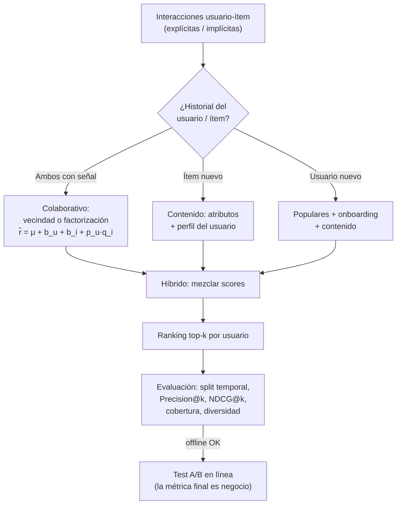

# 046 — Sistemas de recomendación

> [← Clase anterior](../../../classes/part-03-classical-machine-learning/045-series-temporales-y-backtesting/README.md) · [Índice de la parte](../README.md) · [Clase siguiente →](../../../classes/part-03-classical-machine-learning/047-metricas-calibracion-sesgo-y-costo-de-error/README.md)

**Parte:** 03 — Machine learning clásico  
**Nivel:** intermedio · **Horas estimadas:** 6  
**Laboratorio:** `retrieval` · **Estado:** `EXECUTABLE_CORE`

## 🎯 Propósito

Comprender **sistemas de recomendación** dentro de la evolución de la inteligencia
artificial, implementar un experimento mínimo verificable y distinguir qué parte
constituye evidencia frente a una afirmación todavía no comprobada.

## 📚 Resultados de aprendizaje

Al finalizar podrás:

1. Explicar sistemas de recomendación usando los conceptos `filtrado colaborativo`, `contenido`, `ranking`, `cold-start`.
2. Ejecutar el laboratorio con una semilla explícita y revisar su contrato JSON.
3. Identificar al menos un supuesto, una limitación y un riesgo de aplicación.
4. Comparar el enfoque con la etapa anterior de la ruta de aprendizaje.
5. Producir una evidencia reproducible y una conclusión que no exceda los datos.

## 🧩 Conceptos centrales

`filtrado colaborativo`, `contenido`, `ranking`, `cold-start`

## 🗺️ Ubicación en el mapa de la IA

Los recomendadores son el sistema de ML clásico con más impacto económico directo: deciden
qué ve cada usuario en comercio, streaming y redes. Técnicamente sintetizan casi todo lo
anterior — similitud y distancia (clase 043), factorización de matrices (álgebra de la
clase 005), ranking y métricas por posición — y son el antecedente conceptual de la
recuperación de información que la parte 08 usa en RAG: recomendar es rankear ítems para
un usuario, recuperar es rankear documentos para una consulta. El Netflix Prize
(2006-2009) hizo de la factorización el estándar del campo.

## 📖 Fundamentos

### 🧩 El problema y sus datos

Matriz de interacciones R (usuarios × ítems) casi vacía (típico: > 99 % de celdas
desconocidas). Feedback **explícito** (ratings 1-5: escaso y sesgado) o **implícito**
(clics, compras, tiempo de reproducción: abundante, pero la ausencia NO es rechazo — solo
no exposición). El objetivo real no es rellenar la matriz sino producir un **ranking
top-k** útil por usuario.

### 👥 Filtrado colaborativo por vecindad

"Usuarios que coinciden en el pasado coincidirán en el futuro." Dos variantes:

- **User-based:** buscar usuarios similares al objetivo y promediar sus valoraciones.
- **Item-based** (más estable y usado): similitud entre columnas de R; recomendar ítems
  similares a los que el usuario ya valoró.

```text
similitud coseno:  sim(a, b) = (a·b) / (‖a‖·‖b‖)   sobre las co-valoraciones
predicción:        r̂(u, i) = Σⱼ sim(i, j)·r(u, j) / Σⱼ |sim(i, j)|
```

No necesita features de los ítems; sufre con la dispersión (pocas co-valoraciones →
similitudes ruidosas) y no puede recomendar ítems sin historial.

### 📄 Basado en contenido

Representar cada ítem con sus atributos (género, texto, tags → vectores TF-IDF o
embeddings) y recomendar ítems similares al **perfil del usuario** (agregado de lo que
consumió). Resuelve el cold-start de ítems nuevos (tienen atributos desde el día cero) y
da recomendaciones explicables ("porque viste X"); a cambio, encierra al usuario en más
de lo mismo (sobre-especialización) y exige buenos atributos.

### 🔢 Factorización de matrices

La idea ganadora del Netflix Prize (Koren, Bell & Volinsky 2009): aprender un espacio
**latente** de dimensión k donde usuario e ítem son vectores, y la afinidad es su producto
interno:

```text
r̂(u, i) = μ + b_u + b_i + p_u · q_i
min Σ_{(u,i) observados} ( r(u,i) − r̂(u,i) )² + λ( ‖p_u‖² + ‖q_i‖² + b_u² + b_i² )
```

- μ = media global; b_u, b_i = sesgos de usuario e ítem (un usuario duro, un ítem popular).
- Se optimiza con SGD o ALS **solo sobre las celdas observadas** (no es SVD clásica, que
  exigiría matriz completa); λ regulariza como en la clase 038.
- Los factores latentes capturan dimensiones no etiquetadas (p. ej. "acción vs. drama")
  que emergen de los datos: son los embeddings primitivos.
- Para feedback implícito se ponderan las celdas por confianza (Hu, Koren & Volinsky 2008).

### 📏 Evaluación de rankings y cold-start

El split debe ser **temporal por usuario** (entrenar con su pasado, evaluar su futuro).
Métricas top-k: Precision@k y Recall@k (aciertos entre los k recomendados);
**NDCG@k** descuenta por posición (`DCG = Σ relᵢ/log₂(i+1)` normalizado por el ranking
ideal); cobertura del catálogo y diversidad completan la foto — optimizar solo exactitud
produce listas de éxitos idénticas para todos. **Cold-start:** usuario nuevo → contenido,
populares, onboarding; ítem nuevo → contenido; sistema nuevo → híbridos. Todo recomendador
serio es híbrido: colaborativo cuando hay señal, contenido donde no la hay.

## 🧮 Ejemplo trabajado

Ratings (1-5) de 4 usuarios sobre 4 películas; ¿qué recomendar a Ana, que no vio D?

```text
        A     B     C     D
Ana     5     4     1     ?
Beto    5     5     2     4
Carla   1     2     5     2
Dani    4     4     1     5
```

Similitud coseno de Ana con cada usuario (sobre las columnas A, B, C que comparten):

```text
sim(Ana, Beto)  = (25+20+2)/(√42·√54) ≈ 47/47.62 ≈ 0.987
sim(Ana, Carla) = (5+8+5)/(√42·√30)   ≈ 18/35.50 ≈ 0.507
sim(Ana, Dani)  = (20+16+1)/(√42·√33) ≈ 37/37.23 ≈ 0.994
```

Predicción para D ponderando por similitud:

```text
r̂(Ana, D) = (0.987·4 + 0.507·2 + 0.994·5) / (0.987 + 0.507 + 0.994)
          = (3.948 + 1.014 + 4.970) / 2.488 ≈ 9.93 / 2.488 ≈ 3.99
```

Se recomienda D (≈ 4/5). Nota el mecanismo: Beto y Dani, con gustos casi idénticos a Ana,
dominan la predicción; Carla — de gustos opuestos — apenas pesa. Con similitud de coseno
*centrado* (restando la media de cada usuario) Carla incluso restaría, capturando que su
2 en D es, para ella, una valoración relativamente positiva.

## 📊 Propiedades y comparación

| Enfoque | Necesita | Cold-start ítem | Cold-start usuario | Serendipia | Explicable |
|---|---|---|---|---|---|
| Colaborativo (vecindad) | Solo interacciones | ❌ | ❌ | Alta | Media ("usuarios como tú") |
| Contenido | Atributos de ítems | ✅ | Parcial (onboarding) | Baja (burbuja) | Alta ("porque viste X") |
| Factorización | Muchas interacciones | ❌ | ❌ | Alta | Baja (factores latentes) |
| Popularidad (baseline) | Nada | ✅ | ✅ | Nula | Total |
| Híbrido | Todo lo anterior | ✅ | ✅ | Ajustable | Media |



## ⚠️ Errores conceptuales frecuentes

1. **"La celda vacía significa que no le gusta."** En feedback implícito, la ausencia es
   sobre todo falta de exposición. Tratar los no-vistos como negativos duros sesga el
   modelo hacia lo ya popular.
2. **"Evalúo con split aleatorio de interacciones."** Mezcla el futuro del usuario en su
   train (fuga temporal, clase 045) y sobreestima. El split correcto es temporal.
3. **"RMSE bajo = buen recomendador."** El Netflix Prize lo enseñó: optimizar el rating
   puntual no optimiza el ranking top-k que el usuario ve, ni la diversidad, ni el
   negocio. Se evalúa con métricas de ranking y A/B.
4. **"El recomendador descubre mis gustos."** También los *crea*: el feedback loop
   (recomiendo → clic → reentreno con ese clic) amplifica lo popular y estrecha la
   burbuja; sin corrección de sesgo de exposición, el sistema se retroalimenta.
5. **"Factorización = SVD del álgebra."** La SVD clásica exige matriz completa; aquí se
   optimiza solo sobre celdas observadas con regularización — un problema distinto,
   no convexo, resuelto con SGD/ALS.

## 🚀 Del aprendizaje a la operación

Un recomendador real separa **recall** (candidatos: cientos, con ANN sobre embeddings) de
**ranking** (modelo fino sobre los candidatos) por latencia; añade reglas de negocio
(stock, edad, ya-comprado), control del feedback loop (exploración: una fracción del
tráfico prueba ítems poco expuestos), actualización cercana al tiempo real de los perfiles,
y una jerarquía de evaluación en tres niveles — offline (NDCG), online (CTR, conversión) y
de largo plazo (retención, diversidad consumida) — porque optimizar el clic de hoy puede
degradar el catálogo que el usuario descubre en un año.

## 🧪 Laboratorio

```bash
python lab.py
```

El laboratorio llama a `ai_evolution.labs.run_lab("retrieval")`. Esta
decisión evita 180 implementaciones divergentes: cada clase tiene un entrypoint
propio, pero los motores didácticos se prueban como una biblioteca común.

### 🔍 Evidencia esperada

- tipo de laboratorio y semilla;
- entradas o decisiones observables;
- resultado estructurado;
- lista `evidence` con hechos que pueden inspeccionarse;
- lista `limitations` que impide presentar la demo como producción.

## 📓 Notebooks

- [📓 `notebook.ipynb`](notebook.ipynb): recorrido guiado con la materia resumida.
- [✍️ `notebook_student.ipynb`](notebook_student.ipynb): ejercicios para resolver.
- [✅ `notebook_solution.ipynb`](notebook_solution.ipynb): solución de referencia explicada.

## 📝 Evaluación

| Criterio | Peso |
|---|---:|
| Comprensión conceptual | 25 % |
| Ejecución reproducible | 25 % |
| Interpretación basada en evidencia | 25 % |
| Riesgos, límites y mejora propuesta | 25 % |

Consulta [assessment.md](assessment.md) para preguntas y criterio de aceptación.

## ⚠️ Errores comunes

| Síntoma | Causa probable | Corrección |
|---|---|---|
| El código corre, pero no hay conclusión | Se confundió ejecución con aprendizaje | Explica qué demuestra y qué no demuestra |
| El resultado cambia sin explicación | No se registró semilla o configuración | Conserva semilla, versión y parámetros |
| Se promete uso real | Se extrapoló desde una demo educativa | Declara entorno, datos, límites y revisión humana |
| Se copia una métrica aislada | No existe baseline ni costo de error | Añade comparación y criterio de decisión |

## ❓ Preguntas frecuentes

**¿Debo usar una API comercial?**  
No. El núcleo funciona localmente. Las extensiones LIVE se documentan por separado.

**¿El laboratorio representa una implementación industrial?**  
No por sí solo. Enseña el contrato y el patrón; producción exige integración,
seguridad, observabilidad, pruebas y operación.

**¿Dónde profundizo?**  
Revisa las especializaciones enlazadas en el README raíz y la ruta siguiente.

## 🔗 Referencias

- [Koren, Bell & Volinsky (2009), "Matrix Factorization Techniques for Recommender Systems", IEEE Computer. DOI 10.1109/MC.2009.263](https://doi.org/10.1109/MC.2009.263)
- [Sarwar, Karypis, Konstan & Riedl (2001), "Item-Based Collaborative Filtering Recommendation Algorithms", WWW '01. DOI 10.1145/371920.372071](https://doi.org/10.1145/371920.372071)
- [Hu, Koren & Volinsky (2008), "Collaborative Filtering for Implicit Feedback Datasets", IEEE ICDM. DOI 10.1109/ICDM.2008.22](https://doi.org/10.1109/ICDM.2008.22)
- [Ricci, Rokach & Shapira (eds.) — *Recommender Systems Handbook* (3e, 2022). DOI 10.1007/978-1-0716-2197-4](https://doi.org/10.1007/978-1-0716-2197-4)
- [scikit-learn User Guide — Nearest Neighbors (base de la vecindad y similitud)](https://scikit-learn.org/stable/modules/neighbors.html)

---

## ⬅️ Clase anterior

[045 — Series temporales y backtesting](../../part-03-classical-machine-learning/045-series-temporales-y-backtesting/README.md)

## ➡️ Siguiente clase

[047 — Métricas, calibración, sesgo y costo de error](../../part-03-classical-machine-learning/047-metricas-calibracion-sesgo-y-costo-de-error/README.md)
