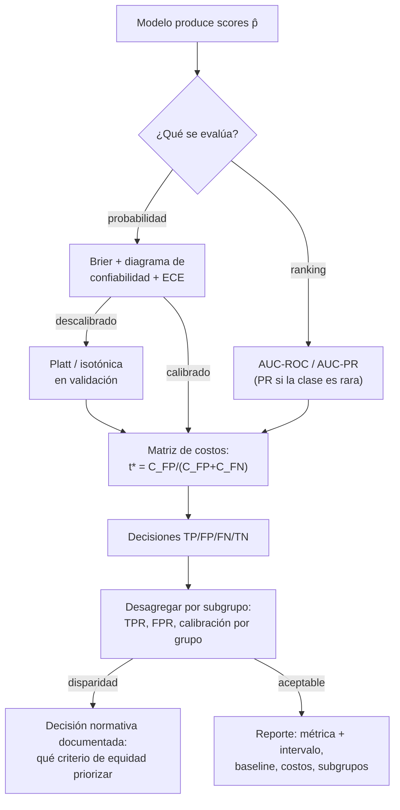

# 047 — Métricas, calibración, sesgo y costo de error

> [← Clase anterior](../../../classes/part-03-classical-machine-learning/046-sistemas-de-recomendacion/README.md) · [Índice de la parte](../README.md) · [Clase siguiente →](../../../classes/part-03-classical-machine-learning/048-proyecto-producto-ml-reproducible/README.md)

**Parte:** 03 — Machine learning clásico  
**Nivel:** intermedio · **Horas estimadas:** 6  
**Laboratorio:** `evaluation` · **Estado:** `EXECUTABLE_CORE`

## 🎯 Propósito

Comprender **métricas, calibración, sesgo y costo de error** dentro de la evolución de la inteligencia
artificial, implementar un experimento mínimo verificable y distinguir qué parte
constituye evidencia frente a una afirmación todavía no comprobada.

## 📚 Resultados de aprendizaje

Al finalizar podrás:

1. Explicar métricas, calibración, sesgo y costo de error usando los conceptos `métricas`, `calibración`, `fairness`, `costo`.
2. Ejecutar el laboratorio con una semilla explícita y revisar su contrato JSON.
3. Identificar al menos un supuesto, una limitación y un riesgo de aplicación.
4. Comparar el enfoque con la etapa anterior de la ruta de aprendizaje.
5. Producir una evidencia reproducible y una conclusión que no exceda los datos.

## 🧩 Conceptos centrales

`métricas`, `calibración`, `fairness`, `costo`

## 🗺️ Ubicación en el mapa de la IA

Esta clase cierra el círculo metodológico de la parte 03: después de aprender a entrenar
modelos, sistematiza cómo **juzgarlos**. Una métrica mal elegida convierte un buen
pipeline en una mala decisión; la calibración conecta scores con probabilidades
accionables; el análisis por subgrupos convierte "el modelo funciona" en "¿para quién
funciona?". Estas herramientas — matriz de confusión, curvas ROC/PR, Brier, matrices de
costo, criterios de equidad — son las mismas con las que después se auditan LLM, agentes
y cualquier sistema que decida sobre personas.

## 📖 Fundamentos

### 🔢 Matriz de confusión y métricas derivadas

Toda decisión binaria produce cuatro conteos: TP, FP, FN, TN. De ahí:

```text
precision = TP/(TP+FP)     "de las alarmas, cuántas eran reales"
recall    = TP/(TP+FN)     "de los casos reales, cuántos atrapé"  (= sensibilidad, TPR)
FPR       = FP/(FP+TN)     "de los negativos, cuántos molesté"
F1        = 2·P·R/(P+R)    media armónica: castiga el desbalance entre P y R
accuracy  = (TP+TN)/n      engañosa con clases desbalanceadas
```

Precision y recall están en tensión: mover el umbral hacia abajo sube recall y baja
precision. Cuál priorizar es una decisión de costos, no de estadística.

### 📈 Curvas: ROC vs. Precision-Recall

Barriendo el umbral se obtienen curvas que evalúan el **score completo**, no una decisión:

- **ROC** (TPR vs. FPR): AUC-ROC = probabilidad de que un positivo al azar reciba score
  mayor que un negativo al azar (0.5 = azar). Insensible a la prevalencia: útil para
  comparar modelos, engañosa con clases muy raras (un FPR "bajo" puede ser una avalancha
  de falsas alarmas en números absolutos).
- **Precision-Recall:** con prevalencia baja es la curva honesta — su baseline es la
  prevalencia misma, no 0.5. Con 1 % de positivos, un AUC-ROC de 0.95 puede convivir con
  precision < 0.2 en todo umbral útil.

### 🌡️ Calibración y Brier

Un score es **calibrado** si p̂ = 0.7 implica ~70 % de positivos reales. El **Brier
score** mide el error cuadrático de la probabilidad y se descompone (Murphy, 1973):

```text
Brier = (1/n) Σ (p̂ᵢ − yᵢ)²  =  incertidumbre − resolución + descalibración
```

- *Incertidumbre* = p̄(1−p̄): piso impuesto por la prevalencia, no reducible.
- *Resolución*: cuánto separan los scores a los grupos con distinta frecuencia real (más es mejor).
- *Descalibración* (reliability): distancia entre score y frecuencia observada (menos es mejor).

Diagnóstico: diagrama de confiabilidad + ECE (error de calibración esperado por bins).
Corrección sin reentrenar: Platt o isotónica en validación (clase 039). AUC mide solo
*ranking*; Brier/log-loss miden ranking Y calibración: dos modelos con igual AUC pueden
diferir radicalmente como estimadores de probabilidad.

### 💰 Matriz de costos: de métrica a decisión

Asignar costo a cada celda (C_TP, C_FP, C_FN, C_TN) convierte la evaluación en
optimización del costo esperado. Con scores calibrados, la decisión óptima por caso es
umbral `t* = C_FP/(C_FP + C_FN)` (con C_TP = C_TN = 0); sobre un conjunto:

```text
costo total = FP·C_FP + FN·C_FN     → elegir el umbral que lo minimiza en validación
```

Dos modelos deben compararse por costo total con SUS umbrales óptimos respectivos, no por
accuracy con t = 0.5.

### ⚖️ Sesgo y equidad entre subgrupos

Las métricas agregadas ocultan disparidades. Con grupos A y B (género, edad, región…):

- **Paridad demográfica:** misma tasa de predicción positiva por grupo.
- **Igualdad de oportunidades** (Hardt et al. 2016): mismo recall (TPR) por grupo.
- **Igualdad de odds:** mismo TPR y mismo FPR por grupo.
- **Calibración por grupo:** p̂ significa lo mismo en A que en B.

Resultado central (Kleinberg et al. 2016; Chouldechova 2017): con prevalencias distintas
entre grupos, calibración por grupo e igualdad de tasas de error son **matemáticamente
incompatibles** salvo casos triviales (el caso COMPAS: calibrado por raza, pero FPR del
doble para acusados negros). Elegir qué criterio priorizar es una decisión normativa que
la técnica informa pero no resuelve; el mínimo exigible es **reportar** las métricas por
subgrupo.

## 🧮 Ejemplo trabajado

Screening de una enfermedad con prevalencia 1 %: 10 000 personas, 100 enfermas. Test con
recall 90 % y FPR 5 %:

```text
TP = 90    FN = 10    FP = 0.05·9900 = 495    TN = 9405
accuracy  = (90+9405)/10000 = 0.9495          ← parece excelente
precision = 90/(90+495) ≈ 0.154               ← 85 % de las alarmas son falsas
```

El baseline "nadie está enfermo" logra accuracy 0.99 — mayor que el test — con recall 0.
Con costos C_FN = 1000 (enfermo no detectado) y C_FP = 20 (confirmación innecesaria):

```text
costo del test    = 495·20 + 10·1000 = 9900 + 10000 = 19 900
costo del "nadie" = 100·1000         = 100 000
```

El test que la accuracy declaraba "peor que no hacer nada" ahorra el 80 % del costo. Y el
Brier de un modelo que asignara p̂ = 0.5 a todos sería 0.25, mientras el trivial
p̂ = 0.01 constante logra ≈ 0.0099: mejor Brier con cero resolución — por eso la
descomposición (y no el número solo) es la lectura correcta.

## 📊 Propiedades y comparación

| Métrica | Evalúa | Sensible a prevalencia | Necesita umbral | Úsala cuando |
|---|---|---|---|---|
| Accuracy | Decisión | Mucho (engañosa) | Sí | Clases balanceadas, costos simétricos |
| Precision / Recall / F1 | Decisión | Sí (esa es su gracia) | Sí | Clase positiva rara o costosa |
| AUC-ROC | Ranking | No | No | Comparar scores; cuidado con clase rara |
| AUC-PR | Ranking | Sí | No | Clase rara: la curva honesta |
| Log-loss / Brier | Probabilidad | Sí | No | Los scores alimentan decisiones por costo |
| ECE / confiabilidad | Calibración | Sí | No | Antes de usar t* por costos |
| Costo esperado | Decisión + negocio | Sí | Sí (t*) | Siempre que haya matriz de costos |



## ⚠️ Errores conceptuales frecuentes

1. **"Accuracy 95 %: excelente modelo."** Con prevalencia 1 %, el baseline trivial da
   99 %. Toda métrica se lee contra la prevalencia y el baseline, nunca en absoluto.
2. **"AUC-ROC alto = modelo útil en producción."** El AUC evalúa el ranking global con
   pares sintéticos; el uso real opera en UN umbral, con prevalencia y costos concretos.
   Con clase rara, mirar la curva PR y el costo esperado.
3. **"Mis probabilidades salen del modelo, así que son probabilidades."** La salida de
   `predict_proba` puede estar sistemáticamente desalineada con las frecuencias reales
   (boosting, redes). Sin verificar calibración, el umbral por costos decide mal.
4. **"El modelo es justo: no usa la variable protegida."** Los proxies (código postal,
   historial) reconstruyen la variable omitida. La equidad se verifica midiendo por
   subgrupo, no inspeccionando la lista de features.
5. **"Buscaré un modelo calibrado y con tasas de error iguales entre grupos."** Con
   prevalencias distintas es imposible (teorema de imposibilidad); hay que elegir qué
   propiedad priorizar y documentar la decisión.

## 🚀 Del aprendizaje a la operación

Operar la evaluación implica: intervalos de confianza (bootstrap) sobre cada métrica
antes de declarar mejoras, monitoreo de calibración en producción (se degrada con el
drift antes que el AUC), revisión periódica de la matriz de costos con el negocio (los
costos cambian), paneles por subgrupo con alertas de disparidad, y un registro de
decisiones (modelo + umbral + versión de datos) por cada predicción servida — sin esa
trazabilidad, ni la auditoría de equidad ni la explicación de un caso individual son
posibles.

## 🧪 Laboratorio

```bash
python lab.py
```

El laboratorio llama a `ai_evolution.labs.run_lab("evaluation")`. Esta
decisión evita 183 implementaciones divergentes: cada clase tiene un entrypoint
propio, pero los motores didácticos se prueban como una biblioteca común.

### 🔍 Evidencia esperada

- tipo de laboratorio y semilla;
- entradas o decisiones observables;
- resultado estructurado;
- lista `evidence` con hechos que pueden inspeccionarse;
- lista `limitations` que impide presentar la demo como producción.

## 📓 Notebooks

- [📓 `notebook.ipynb`](notebook.ipynb): recorrido guiado con la materia resumida.
- [✍️ `notebook_student.ipynb`](notebook_student.ipynb): ejercicios para resolver.
- [✅ `notebook_solution.ipynb`](notebook_solution.ipynb): solución de referencia explicada.

## 📝 Evaluación

| Criterio | Peso |
|---|---:|
| Comprensión conceptual | 25 % |
| Ejecución reproducible | 25 % |
| Interpretación basada en evidencia | 25 % |
| Riesgos, límites y mejora propuesta | 25 % |

Consulta [assessment.md](assessment.md) para preguntas y criterio de aceptación.

## ⚠️ Errores comunes

| Síntoma | Causa probable | Corrección |
|---|---|---|
| El código corre, pero no hay conclusión | Se confundió ejecución con aprendizaje | Explica qué demuestra y qué no demuestra |
| El resultado cambia sin explicación | No se registró semilla o configuración | Conserva semilla, versión y parámetros |
| Se promete uso real | Se extrapoló desde una demo educativa | Declara entorno, datos, límites y revisión humana |
| Se copia una métrica aislada | No existe baseline ni costo de error | Añade comparación y criterio de decisión |

## ❓ Preguntas frecuentes

**¿Debo usar una API comercial?**  
No. El núcleo funciona localmente. Las extensiones LIVE se documentan por separado.

**¿El laboratorio representa una implementación industrial?**  
No por sí solo. Enseña el contrato y el patrón; producción exige integración,
seguridad, observabilidad, pruebas y operación.

**¿Dónde profundizo?**  
Revisa las especializaciones enlazadas en el README raíz y la ruta siguiente.

## 🔗 Referencias

- [Hastie, Tibshirani, Friedman — *The Elements of Statistical Learning* (2e), cap. 7 "Model Assessment and Selection", PDF oficial](https://hastie.su.domains/ElemStatLearn/)
- [Brier (1950), "Verification of Forecasts Expressed in Terms of Probability", *Monthly Weather Review*. DOI 10.1175/1520-0493(1950)078<0001:VOFEIT>2.0.CO;2](https://doi.org/10.1175/1520-0493%281950%29078%3C0001:VOFEIT%3E2.0.CO;2)
- [Hardt, Price & Srebro (2016), "Equality of Opportunity in Supervised Learning", NeurIPS. arXiv:1610.02413](https://arxiv.org/abs/1610.02413)
- [Kleinberg, Mullainathan & Raghavan (2016), "Inherent Trade-Offs in the Fair Determination of Risk Scores". arXiv:1609.05807](https://arxiv.org/abs/1609.05807)
- [Chouldechova (2017), "Fair Prediction with Disparate Impact", *Big Data* 5(2). DOI 10.1089/big.2016.0047](https://doi.org/10.1089/big.2016.0047)
- [scikit-learn User Guide — Metrics and scoring](https://scikit-learn.org/stable/modules/model_evaluation.html)

<!-- papers:inicio -->

---

## 📜 Papers que fundamentan esta clase

> Bloque generado por `python scripts/link_papers_to_classes.py`. La fuente es [`papers/catalog/papers.json`](../../../papers/catalog/papers.json).

| Paper | Año | Qué desbloqueó | Miniatura |
|---|---:|---|---|
| [P80 · Modelización estadística: las dos culturas](../../../papers/foundational/P80_dos_culturas/README.md) | 2001 | Nombra la división que organiza el campo: suponer un mecanismo generador frente a medir la capacidad de predecir. | [notebook](../../../notebooks/papers/P80_dos_culturas.ipynb) |
| [P82 · Predecir buenas probabilidades con aprendizaje supervisado](../../../papers/foundational/P82_calibracion/README.md) | 2005 | Separa dos cosas que se confundían: ordenar bien los ejemplos y estimar bien la probabilidad de cada uno. | [notebook](../../../notebooks/papers/P82_calibracion.ipynb) |

Cada ficha explica el problema anterior, la matemática mínima, los límites y los errores de atribución más frecuentes. Para leerlas con método: [cómo leer un paper de IA](../../../papers/guides/COMO_LEER_UN_PAPER_DE_IA.md) · [anexos matemáticos](../../../papers/annexes/README.md).
<!-- papers:fin -->
---

## ⬅️ Clase anterior

[046 — Sistemas de recomendación](../../part-03-classical-machine-learning/046-sistemas-de-recomendacion/README.md)

## ➡️ Siguiente clase

[048 — Proyecto: producto ML reproducible](../../part-03-classical-machine-learning/048-proyecto-producto-ml-reproducible/README.md)
