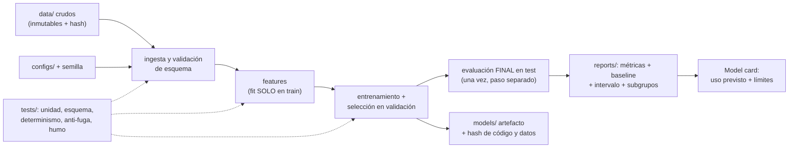

# 048 — Proyecto: producto ML reproducible

> [← Clase anterior](../../../classes/part-03-classical-machine-learning/047-metricas-calibracion-sesgo-y-costo-de-error/README.md) · [Índice de la parte](../README.md) · [Clase siguiente →](../../../classes/part-04-neural-networks-and-deep-learning/049-perceptron-y-limites-de-separabilidad/README.md)

**Parte:** 03 — Machine learning clásico  
**Nivel:** intermedio · **Horas estimadas:** 10  
**Laboratorio:** `capstone` · **Estado:** `EXECUTABLE_CORE`

## 🎯 Propósito

Comprender **proyecto: producto ml reproducible** dentro de la evolución de la inteligencia
artificial, implementar un experimento mínimo verificable y distinguir qué parte
constituye evidencia frente a una afirmación todavía no comprobada.

## 📚 Resultados de aprendizaje

Al finalizar podrás:

1. Explicar proyecto: producto ml reproducible usando los conceptos `pipeline`, `baseline`, `validación`, `serving`.
2. Ejecutar el laboratorio con una semilla explícita y revisar su contrato JSON.
3. Identificar al menos un supuesto, una limitación y un riesgo de aplicación.
4. Comparar el enfoque con la etapa anterior de la ruta de aprendizaje.
5. Producir una evidencia reproducible y una conclusión que no exceda los datos.

## 🧩 Conceptos centrales

`pipeline`, `baseline`, `validación`, `serving`

## 🗺️ Ubicación en el mapa de la IA

Este proyecto integra las once clases de la parte 03 en un artefacto único: un pipeline
supervisado de punta a punta cuyo valor no es la métrica sino la **reproducibilidad** — que
cualquier revisor obtenga el mismo número desde los mismos datos con un comando. Es la
transición del ML como experimento al ML como ingeniería (MLOps), y el mismo estándar de
evidencia que el programa exigirá después a redes profundas, LLM y agentes: si el
resultado no se puede reproducir, no es un resultado.

## 📖 Fundamentos

### 🏗️ Anatomía de un proyecto ML reproducible

```text
proyecto/
├── data/            crudos INMUTABLES + procesados regenerables (nunca editar a mano)
├── src/             pipeline: ingesta → features → entrenamiento → evaluación
├── configs/         hiperparámetros y rutas en archivos versionados (no hardcodeados)
├── models/          artefactos entrenados con hash/versión
├── reports/         métricas y figuras GENERADAS por el pipeline
├── tests/           unitarias (features, contratos) + de humo (pipeline end-to-end)
└── README.md        cómo reproducir en UN comando; supuestos y límites
```

Principios: el dato crudo es de solo lectura; todo lo derivado se regenera con código;
el pipeline es una función determinista `datos + config + semilla → modelo + métricas`;
cada resultado publicado lleva el commit que lo produjo.

### 🎲 Las cinco fuentes de irreproducibilidad

1. **Datos:** el archivo "final_v2_DEFINITIVO.csv" que nadie sabe cómo se generó.
   Antídoto: datos crudos inmutables + script de derivación + hash del dataset.
2. **Azar no controlado:** splits, inicializaciones y muestreos sin semilla fija.
   Antídoto: semillas explícitas en la config; reportar varias semillas (media ± desv.).
3. **Entorno:** versiones distintas de librerías cambian resultados. Antídoto:
   dependencias con versiones exactas (lockfile) y entorno declarado.
4. **Fuga del protocolo:** decisiones tomadas mirando el test (clases 037 y 042).
   Antídoto: el pipeline entrena y selecciona sin acceso al test; el test se evalúa en un
   paso final separado y auditable.
5. **Proceso manual:** "ejecuté las celdas del notebook en cierto orden". Antídoto:
   pipeline como script/DAG con un solo punto de entrada.

### 📊 El experimento como contrato

Cada corrida registra: config completa, semilla, hash de datos y código, métricas con
baseline, y limitaciones. El resultado se compara SIEMPRE contra el baseline trivial
(clase 037) y contra el modelo anterior; una mejora sin intervalo (bootstrap o varias
semillas) no es una mejora, es una fluctuación con buena prensa. El informe honesto
declara: qué datos, qué protocolo, qué métrica con qué costos, qué subgrupos (clase 047)
y qué NO se puede concluir.

### 🔁 Del notebook al pipeline

El notebook es para explorar; el producto vive en módulos probados:

```text
notebook (exploración) → funciones puras en src/ → tests → pipeline CLI → CI
```

Tests mínimos de un proyecto ML: unitarios de features (casos borde, nulos), contrato de
esquema de datos (columnas, tipos, rangos), determinismo (misma semilla → mismo
resultado), anti-fuga (el preprocesador no ve el test), y humo end-to-end con datos
pequeños. La *model card* final documenta uso previsto, datos, métricas por subgrupo y
límites — el equivalente ML del `limitations` que este programa exige en cada laboratorio.

## 🧮 Ejemplo trabajado

Presupuesto de experimento para un clasificador de churn (10 000 clientes, 8 % de bajas):

```text
1. Congelar protocolo: split temporal 70/15/15, métrica = costo esperado
   (C_FN = 200 retención perdida, C_FP = 10 llamada), baseline = "nadie se da de baja".
2. Baseline: costo = 800·200 = 160 000 → traducido al split de test (120 bajas): 24 000.
3. Modelo 1 (logística, semillas 1..5): costo test 15 800 ± 900.
4. Modelo 2 (gradient boosting, semillas 1..5): costo test 14 200 ± 1 100.
5. ¿Modelo 2 > Modelo 1? La diferencia (1 600) es mayor que una desviación pero los
   intervalos se solapan → se reporta como "mejora probable, no concluyente"; decisión:
   desplegar logística (más simple, calibrada) y seguir midiendo.
```

La disciplina está en el paso 1 (nada se decide después de ver el test) y en el paso 5
(la conclusión no excede la evidencia — el hábito que este programa entrena desde la
clase 008).

## 📊 Propiedades y comparación

| Nivel de madurez | Datos | Código | Experimentos | ¿Reproducible? |
|---|---|---|---|---|
| 0: notebook suelto | Archivo local editado | Celdas en orden mental | Ninguno registrado | No |
| 1: scripts + git | Crudos congelados | Versionado | Semilla fija, config en código | A veces |
| 2: pipeline + config | Hash + derivación scriptada | Testeado, CI | Config versionada, métricas emitidas | Sí, en la máquina |
| 3: entorno declarado | Versionados (DVC o similar) | CI + entorno lockeado | Registro por corrida (tracking) | Sí, por terceros |



## ⚠️ Errores conceptuales frecuentes

1. **"El notebook ES el proyecto."** El notebook con estado oculto y orden de ejecución
   manual es la fuente n.º 1 de resultados no reproducibles; es la herramienta de
   exploración, no el artefacto final.
2. **"Fijé la semilla, ya es reproducible."** La semilla reproduce UNA realización; si la
   conclusión cambia con la semilla, lo reproducible es el azar, no el hallazgo. Se
   reporta sobre varias semillas.
3. **"La métrica subió: despliego."** Sin intervalo, baseline y verificación de que el
   protocolo no se rompió (¿alguien iteró contra el test?), una subida de métrica es la
   forma más cara de ruido.
4. **"Reproducible = mismo número exacto siempre."** El estándar práctico es:
   determinismo dado (datos, config, semilla, entorno), y conclusiones **estables** ante
   variaciones razonables de semilla y particiones.
5. **"La documentación se escribe al final."** La model card y las limitaciones se llenan
   durante el desarrollo; al final nadie recuerda qué datos se descartaron ni por qué.

## 🚀 Del aprendizaje a la operación

Lo que este proyecto educativo aún no cubre y producción exige: registro de experimentos
multiusuario (MLflow o equivalente), versionado de datos a escala (DVC, lakehouse),
despliegue del artefacto con contrato de entrada/salida y monitoreo de drift + reentrenos
(clases 042 y 045), aprobación humana y auditoría para decisiones sensibles (clase 047),
y un ciclo de rollback: si el modelo nuevo empeora el costo en producción, volver al
anterior debe ser un comando, no una crisis.

## 🧪 Laboratorio

```bash
python lab.py
```

El laboratorio llama a `ai_evolution.labs.run_lab("capstone")`. Esta
decisión evita 183 implementaciones divergentes: cada clase tiene un entrypoint
propio, pero los motores didácticos se prueban como una biblioteca común.

### 🔍 Evidencia esperada

- tipo de laboratorio y semilla;
- entradas o decisiones observables;
- resultado estructurado;
- lista `evidence` con hechos que pueden inspeccionarse;
- lista `limitations` que impide presentar la demo como producción.

## 📓 Notebooks

- [📓 `notebook.ipynb`](notebook.ipynb): recorrido guiado con la materia resumida.
- [✍️ `notebook_student.ipynb`](notebook_student.ipynb): ejercicios para resolver.
- [✅ `notebook_solution.ipynb`](notebook_solution.ipynb): solución de referencia explicada.

## 📝 Evaluación

| Criterio | Peso |
|---|---:|
| Comprensión conceptual | 25 % |
| Ejecución reproducible | 25 % |
| Interpretación basada en evidencia | 25 % |
| Riesgos, límites y mejora propuesta | 25 % |

Consulta [assessment.md](assessment.md) para preguntas y criterio de aceptación.

## ⚠️ Errores comunes

| Síntoma | Causa probable | Corrección |
|---|---|---|
| El código corre, pero no hay conclusión | Se confundió ejecución con aprendizaje | Explica qué demuestra y qué no demuestra |
| El resultado cambia sin explicación | No se registró semilla o configuración | Conserva semilla, versión y parámetros |
| Se promete uso real | Se extrapoló desde una demo educativa | Declara entorno, datos, límites y revisión humana |
| Se copia una métrica aislada | No existe baseline ni costo de error | Añade comparación y criterio de decisión |

## ❓ Preguntas frecuentes

**¿Debo usar una API comercial?**  
No. El núcleo funciona localmente. Las extensiones LIVE se documentan por separado.

**¿El laboratorio representa una implementación industrial?**  
No por sí solo. Enseña el contrato y el patrón; producción exige integración,
seguridad, observabilidad, pruebas y operación.

**¿Dónde profundizo?**  
Revisa las especializaciones enlazadas en el README raíz y la ruta siguiente.

## 🔗 Referencias

- [Sculley et al. (2015), "Hidden Technical Debt in Machine Learning Systems", NeurIPS 28 (PDF oficial)](https://papers.nips.cc/paper_files/paper/2015/hash/86df7dcfd896fcaf2674f757a2463eba-Abstract.html) — uso: referencia consultada en su fuente original
- [Mitchell et al. (2019), "Model Cards for Model Reporting", ACM FAT*. DOI 10.1145/3287560.3287596](https://doi.org/10.1145/3287560.3287596) — uso: fuente primaria del mecanismo estudiado
- [Gebru et al. (2021), "Datasheets for Datasets", CACM 64(12). DOI 10.1145/3458723](https://doi.org/10.1145/3458723) — uso: fuente primaria del mecanismo estudiado
- [Pineau et al. (2021), "Improving Reproducibility in Machine Learning Research", JMLR 22 (texto oficial)](https://jmlr.org/papers/v22/20-303.html) — uso: referencia consultada en su fuente original
- [scikit-learn — Common pitfalls and recommended practices](https://scikit-learn.org/stable/common_pitfalls.html) — uso: referencia consultada en su fuente original
- [Hastie, Tibshirani, Friedman — *The Elements of Statistical Learning* (2e), cap. 7 (protocolo de evaluación), PDF oficial](https://hastie.su.domains/ElemStatLearn/) — uso: desarrollo extendido del tema

---

## ⬅️ Clase anterior

[047 — Métricas, calibración, sesgo y costo de error](../../part-03-classical-machine-learning/047-metricas-calibracion-sesgo-y-costo-de-error/README.md)

## ➡️ Siguiente clase

[049 — Perceptrón y límites de separabilidad](../../part-04-neural-networks-and-deep-learning/049-perceptron-y-limites-de-separabilidad/README.md)
