# 📊 Parte 03 — Machine learning clásico

**Nivel:** intermedio · **Duración sugerida:** 5–6 semanas ·
**Clases:** 12

Cubre el aprendizaje a partir de datos antes de las redes profundas, con énfasis en baselines, validación, interpretabilidad y costo de error.

## 🧭 Secuencia de la parte

```mermaid
flowchart LR
    L037["037<br/>Flujo supervisado y<br/>partición train-validation-test"]
    L038["038<br/>Regresión lineal, regularización<br/>y diagnóstico"]
    L039["039<br/>Clasificación logística y<br/>umbrales"]
    L040["040<br/>Árboles de decisión<br/>y reglas interpretables"]
    L041["041<br/>Random Forest, boosting<br/>y ensembles"]
    L042["042<br/>Ingeniería y selección<br/>de características"]
    L043["043<br/>Clustering y reducción<br/>de dimensionalidad"]
    L044["044<br/>Detección de anomalías"]
    L045["045<br/>Series temporales y<br/>backtesting"]
    L046["046<br/>Sistemas de recomendación"]
    L047["047<br/>Métricas, calibración, sesgo<br/>y costo de<br/>error"]
    L048["048<br/>Proyecto: producto ML<br/>reproducible"]
    L037 --> L038
    L038 --> L039
    L039 --> L040
    L040 --> L041
    L041 --> L042
    L042 --> L043
    L043 --> L044
    L044 --> L045
    L045 --> L046
    L046 --> L047
    L047 --> L048
```

## 📚 Clases

| ID | Tema | Laboratorio | Horas |
|---:|---|---|---:|
| 037 | [Flujo supervisado y partición train-validation-test](037-flujo-supervisado-y-particion-train-validation-test/README.md) | `ml` | 6 |
| 038 | [Regresión lineal, regularización y diagnóstico](038-regresion-lineal-regularizacion-y-diagnostico/README.md) | `ml` | 6 |
| 039 | [Clasificación logística y umbrales](039-clasificacion-logistica-y-umbrales/README.md) | `ml` | 6 |
| 040 | [Árboles de decisión y reglas interpretables](040-arboles-de-decision-y-reglas-interpretables/README.md) | `ml` | 6 |
| 041 | [Random Forest, boosting y ensembles](041-random-forest-boosting-y-ensembles/README.md) | `ml` | 6 |
| 042 | [Ingeniería y selección de características](042-ingenieria-y-seleccion-de-caracteristicas/README.md) | `ml` | 6 |
| 043 | [Clustering y reducción de dimensionalidad](043-clustering-y-reduccion-de-dimensionalidad/README.md) | `ml` | 6 |
| 044 | [Detección de anomalías](044-deteccion-de-anomalias/README.md) | `ml` | 6 |
| 045 | [Series temporales y backtesting](045-series-temporales-y-backtesting/README.md) | `ml` | 6 |
| 046 | [Sistemas de recomendación](046-sistemas-de-recomendacion/README.md) | `retrieval` | 6 |
| 047 | [Métricas, calibración, sesgo y costo de error](047-metricas-calibracion-sesgo-y-costo-de-error/README.md) | `evaluation` | 6 |
| 048 | [Proyecto: producto ML reproducible](048-proyecto-producto-ml-reproducible/README.md) | `capstone` | 10 |

## 📝 Evaluación de la parte

- 40 % laboratorios y notebooks.
- 25 % explicaciones y comparación de enfoques.
- 20 % evaluación de riesgos y limitaciones.
- 15 % mini-proyecto o integración.

[⬅️ Parte 02 — IA probabilística, evolutiva y de decisión](../part-02-probabilistic-evolutionary-and-decision-ai/README.md) · [🏠 Volver al programa](../../README.md) · [➡️ Parte 04 — Redes neuronales y deep learning](../part-04-neural-networks-and-deep-learning/README.md)
