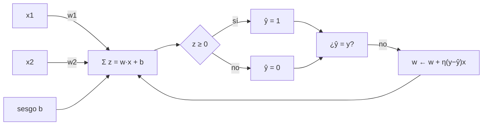

# 049 — Perceptrón y límites de separabilidad

> [← Clase anterior](../../../classes/part-03-classical-machine-learning/048-proyecto-producto-ml-reproducible/README.md) · [Índice de la parte](../README.md) · [Clase siguiente →](../../../classes/part-04-neural-networks-and-deep-learning/050-mlp-y-backpropagation/README.md)

**Parte:** 04 — Redes neuronales y deep learning  
**Nivel:** intermedio-avanzado · **Horas estimadas:** 6  
**Laboratorio:** `neural` · **Estado:** `EXECUTABLE_CORE`

## 🎯 Propósito

Comprender **perceptrón y límites de separabilidad** dentro de la evolución de la inteligencia
artificial, implementar un experimento mínimo verificable y distinguir qué parte
constituye evidencia frente a una afirmación todavía no comprobada.

## 📚 Resultados de aprendizaje

Al finalizar podrás:

1. Explicar perceptrón y límites de separabilidad usando los conceptos `perceptrón`, `separabilidad`, `pesos`, `sesgo`.
2. Ejecutar el laboratorio con una semilla explícita y revisar su contrato JSON.
3. Identificar al menos un supuesto, una limitación y un riesgo de aplicación.
4. Comparar el enfoque con la etapa anterior de la ruta de aprendizaje.
5. Producir una evidencia reproducible y una conclusión que no exceda los datos.

## 🧩 Conceptos centrales

`perceptrón`, `separabilidad`, `pesos`, `sesgo`

## 🗺️ Ubicación en el mapa de la IA

El perceptrón (Rosenblatt, 1958) es la primera máquina de aprendizaje conexionista:
en lugar de programar reglas simbólicas, ajusta pesos a partir de ejemplos. Su límite
—solo resuelve problemas linealmente separables, como demostraron Minsky y Papert en
1969 con XOR— provocó el primer "invierno" de las redes neuronales y motiva directamente
la clase siguiente: capas ocultas y backpropagation rompen esa barrera.

## 📖 Fundamentos

### 🧠 De la neurona biológica al modelo matemático

Una neurona artificial recibe entradas x = (x₁, …, xₙ), las pondera con pesos
w = (w₁, …, wₙ), suma un sesgo b y aplica una función de activación. El perceptrón
usa la función escalón:

```text
z = w · x + b = Σᵢ wᵢ·xᵢ + b
ŷ = 1  si z ≥ 0
ŷ = 0  si z < 0
```

Geométricamente, `w · x + b = 0` define un hiperplano: una recta en 2D, un plano en 3D.
El perceptrón clasifica según el lado del hiperplano en que cae cada punto. El sesgo b
desplaza el hiperplano fuera del origen; sin él, la frontera pasaría siempre por (0, 0).

### 🔁 Regla de aprendizaje del perceptrón

El algoritmo de Rosenblatt recorre los ejemplos y corrige solo cuando se equivoca:

```text
para cada época:
    para cada ejemplo (x, y):
        ŷ = escalón(w · x + b)
        si ŷ ≠ y:
            w ← w + η · (y − ŷ) · x
            b ← b + η · (y − ŷ)
```

Con η (tasa de aprendizaje) > 0, la corrección empuja el hiperplano hacia el ejemplo
mal clasificado: si y = 1 y ŷ = 0, suma x a los pesos (acerca la frontera); si y = 0 y
ŷ = 1, resta x. El **teorema de convergencia del perceptrón** (Novikoff, 1962) garantiza
que si los datos son linealmente separables con margen γ > 0, el algoritmo converge en
un número finito de actualizaciones, acotado por (R/γ)², donde R es el radio de los datos.

### 🚧 Separabilidad lineal y el problema XOR

Un conjunto es **linealmente separable** si existe un hiperplano que deja todas las
instancias positivas a un lado y las negativas al otro. XOR no lo es. Prueba por
contradicción con las cuatro entradas booleanas (y = 1 para (0,1) y (1,0)):

```text
(0,0) → 0:  b < 0
(0,1) → 1:  w₂ + b ≥ 0
(1,0) → 1:  w₁ + b ≥ 0
(1,1) → 0:  w₁ + w₂ + b < 0

Sumando las filas 2 y 3:  w₁ + w₂ + 2b ≥ 0  →  w₁ + w₂ + b ≥ −b > 0
Contradicción con la fila 4. No existe (w₁, w₂, b) que satisfaga las cuatro.
```

Minsky y Papert (*Perceptrons*, 1969) formalizaron esta y otras limitaciones (paridad,
conectividad), lo que redujo drásticamente la financiación del conexionismo hasta que
el MLP con backpropagation (clase 050) mostró que **componer** unidades no lineales
en capas resuelve XOR y mucho más.

## 🧮 Ejemplo trabajado

Entrenamos un perceptrón para la función AND con w = (0, 0), b = 0, η = 1 y regla
escalón(z ≥ 0 → 1). Primeras dos épocas (solo se muestran los pasos con actualización):

| Paso | x | y | z = w·x+b | ŷ | error (y−ŷ) | w nuevo | b nuevo |
|---|---|---:|---:|---:|---:|---|---:|
| 1.1 | (0,0) | 0 | 0 | 1 | −1 | (0,0) | −1 |
| 1.4 | (1,1) | 1 | −1 | 0 | +1 | (1,1) | 0 |
| 2.1 | (0,0) | 0 | 0 | 1 | −1 | (1,1) | −1 |
| 2.2 | (0,1) | 0 | 0 | 1 | −1 | (1,0) | −2 |
| 2.4 | (1,1) | 1 | −1 | 0 | +1 | (2,1) | −1 |

Continuando el mismo procedimiento, el algoritmo converge en la época 6 con
**w = (2, 1), b = −3**: comprueba que 2x₁ + x₂ − 3 ≥ 0 solo para (1,1). La frontera
de decisión es la recta 2x₁ + x₂ = 3. Si repites el proceso con XOR, las
actualizaciones ciclan indefinidamente: no hay hiperplano que encontrar.

## 📊 Propiedades y comparación

| Modelo | Frontera | Salida | Entrenamiento | Converge si… |
|---|---|---|---|---|
| Perceptrón | lineal | binaria dura (0/1) | regla de error, online | datos separables (garantía finita) |
| Regresión logística | lineal | probabilidad σ(z) | descenso de gradiente sobre pérdida convexa | siempre (mínimo global) |
| SVM lineal | lineal de margen máximo | binaria + margen | optimización convexa | siempre |
| MLP (clase 050) | no lineal | flexible | backpropagation, no convexo | sin garantía global |



## ⚠️ Errores conceptuales frecuentes

1. **"El perceptrón minimiza una función de pérdida diferenciable."** No: la regla de
   Rosenblatt es una corrección por error con salida escalón, no descenso de gradiente
   sobre una pérdida suave (eso es la regresión logística o ADALINE).
2. **"Si el perceptrón no converge, hay que entrenar más épocas."** Si los datos no son
   linealmente separables, ninguna cantidad de épocas ayuda: el algoritmo cicla.
3. **"XOR demostró que las redes neuronales no sirven."** Demostró que *una capa* no
   basta; un MLP con una capa oculta de 2 neuronas resuelve XOR exactamente.
4. **"El sesgo b es opcional."** Sin sesgo, la frontera pasa por el origen y problemas
   triviales (p. ej. AND) pueden volverse irresolubles según la codificación.
5. **"Más features siempre ayudan a separar."** Proyectar a dimensiones altas puede
   lograr separabilidad, pero también memorización sin generalización: separar el
   conjunto de entrenamiento no implica clasificar bien datos nuevos.

## 🚀 Del aprendizaje a la operación

Entre este núcleo educativo y un clasificador real faltan: features numéricas
estandarizadas (no entradas booleanas de juguete), validación con datos separados
del entrenamiento, una pérdida calibrada en probabilidad si la decisión tiene costos
asimétricos, y monitoreo de deriva de datos. Hoy nadie despliega un perceptrón puro,
pero su regla de actualización sobrevive en cada capa lineal de una red moderna.

## 🧪 Laboratorio

```bash
python lab.py
```

El laboratorio llama a `ai_evolution.labs.run_lab("neural")`. Esta
decisión evita 183 implementaciones divergentes: cada clase tiene un entrypoint
propio, pero los motores didácticos se prueban como una biblioteca común.

### 🔍 Evidencia esperada

- tipo de laboratorio y semilla;
- entradas o decisiones observables;
- resultado estructurado;
- lista `evidence` con hechos que pueden inspeccionarse;
- lista `limitations` que impide presentar la demo como producción.

## 📓 Notebooks

- [📓 `notebook.ipynb`](notebook.ipynb): recorrido guiado con la materia resumida.
- [✍️ `notebook_student.ipynb`](notebook_student.ipynb): ejercicios para resolver.
- [✅ `notebook_solution.ipynb`](notebook_solution.ipynb): solución de referencia explicada.

## 📝 Evaluación

| Criterio | Peso |
|---|---:|
| Comprensión conceptual | 25 % |
| Ejecución reproducible | 25 % |
| Interpretación basada en evidencia | 25 % |
| Riesgos, límites y mejora propuesta | 25 % |

Consulta [assessment.md](assessment.md) para preguntas y criterio de aceptación.

## ⚠️ Errores comunes

| Síntoma | Causa probable | Corrección |
|---|---|---|
| El código corre, pero no hay conclusión | Se confundió ejecución con aprendizaje | Explica qué demuestra y qué no demuestra |
| El resultado cambia sin explicación | No se registró semilla o configuración | Conserva semilla, versión y parámetros |
| Se promete uso real | Se extrapoló desde una demo educativa | Declara entorno, datos, límites y revisión humana |
| Se copia una métrica aislada | No existe baseline ni costo de error | Añade comparación y criterio de decisión |

## ❓ Preguntas frecuentes

**¿Debo usar una API comercial?**  
No. El núcleo funciona localmente. Las extensiones LIVE se documentan por separado.

**¿El laboratorio representa una implementación industrial?**  
No por sí solo. Enseña el contrato y el patrón; producción exige integración,
seguridad, observabilidad, pruebas y operación.

**¿Dónde profundizo?**  
Revisa las especializaciones enlazadas en el README raíz y la ruta siguiente.

## 🔗 Referencias

- Rosenblatt, F. (1958). *The perceptron: a probabilistic model for information storage and organization in the brain*. Psychological Review, 65(6). [doi:10.1037/h0042519](https://doi.org/10.1037/h0042519)
- Goodfellow, I., Bengio, Y. y Courville, A. (2016). *Deep Learning*, cap. 6 (Deep Feedforward Networks). [deeplearningbook.org/contents/mlp.html](https://www.deeplearningbook.org/contents/mlp.html)
- Bishop, C. (2006). *Pattern Recognition and Machine Learning*, cap. 4 (Linear Models for Classification). [PDF oficial gratuito](https://www.microsoft.com/en-us/research/publication/pattern-recognition-machine-learning/)
- Documentación de PyTorch: [`torch.nn.Linear`](https://pytorch.org/docs/stable/generated/torch.nn.Linear.html)

<!-- papers:inicio -->

---

## 📜 Papers que fundamentan esta clase

> Bloque generado por `python scripts/link_papers_to_classes.py`. La fuente es [`papers/catalog/papers.json`](../../../papers/catalog/papers.json).

| Paper | Año | Qué desbloqueó | Miniatura |
|---|---:|---|---|
| [P01 · El perceptrón: un modelo probabilístico de almacenamiento y organización de información en el cerebro](../../../papers/foundational/P01_perceptron/README.md) | 1958 | Primera máquina que aprende sus propios pesos a partir de ejemplos en lugar de ejecutar reglas escritas por una persona. | [notebook](../../../notebooks/papers/P01_perceptron.ipynb) |

Cada ficha explica el problema anterior, la matemática mínima, los límites y los errores de atribución más frecuentes. Para leerlas con método: [cómo leer un paper de IA](../../../papers/guides/COMO_LEER_UN_PAPER_DE_IA.md) · [anexos matemáticos](../../../papers/annexes/README.md).
<!-- papers:fin -->
---

## ⬅️ Clase anterior

[048 — Proyecto: producto ML reproducible](../../part-03-classical-machine-learning/048-proyecto-producto-ml-reproducible/README.md)

## ➡️ Siguiente clase

[050 — MLP y backpropagation](../../part-04-neural-networks-and-deep-learning/050-mlp-y-backpropagation/README.md)
