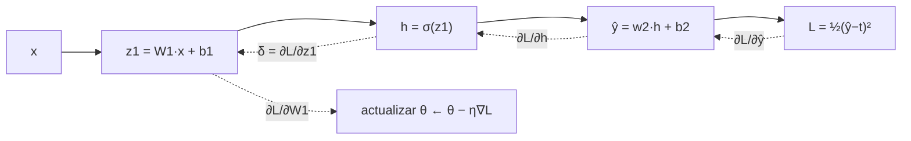

# 050 — MLP y backpropagation

> [← Clase anterior](../../../classes/part-04-neural-networks-and-deep-learning/049-perceptron-y-limites-de-separabilidad/README.md) · [Índice de la parte](../README.md) · [Clase siguiente →](../../../classes/part-04-neural-networks-and-deep-learning/051-activaciones-inicializacion-y-normalizacion/README.md)

**Parte:** 04 — Redes neuronales y deep learning  
**Nivel:** intermedio-avanzado · **Horas estimadas:** 6  
**Laboratorio:** `neural` · **Estado:** `EXECUTABLE_CORE`

## 🎯 Propósito

Comprender **mlp y backpropagation** dentro de la evolución de la inteligencia
artificial, implementar un experimento mínimo verificable y distinguir qué parte
constituye evidencia frente a una afirmación todavía no comprobada.

## 📚 Resultados de aprendizaje

Al finalizar podrás:

1. Explicar mlp y backpropagation usando los conceptos `MLP`, `backpropagation`, `gradiente`, `pérdida`.
2. Ejecutar el laboratorio con una semilla explícita y revisar su contrato JSON.
3. Identificar al menos un supuesto, una limitación y un riesgo de aplicación.
4. Comparar el enfoque con la etapa anterior de la ruta de aprendizaje.
5. Producir una evidencia reproducible y una conclusión que no exceda los datos.

## 🧩 Conceptos centrales

`MLP`, `backpropagation`, `gradiente`, `pérdida`

## 🗺️ Ubicación en el mapa de la IA

El perceptrón multicapa (MLP) rompe el límite de separabilidad lineal de la clase 049:
componer capas de unidades no lineales permite aproximar funciones arbitrarias.
Backpropagation (Rumelhart, Hinton y Williams, 1986) hizo entrenable esa composición
al calcular gradientes de forma eficiente con la regla de la cadena, y es el motor de
todo lo que sigue en esta parte: CNN, RNN, Transformers y modelos generativos se
entrenan exactamente con este algoritmo.

## 📖 Fundamentos

### 🏗️ El perceptrón multicapa

Un MLP alterna transformaciones afines y no linealidades:

```text
h⁽¹⁾ = f(W⁽¹⁾ x + b⁽¹⁾)          capa oculta
ŷ    = g(W⁽²⁾ h⁽¹⁾ + b⁽²⁾)       capa de salida
```

La no linealidad f (sigmoide, tanh, ReLU) es imprescindible: sin ella, la composición
de capas lineales colapsa en una única transformación lineal. El **teorema de
aproximación universal** (Cybenko, 1989; Hornik, 1991) garantiza que un MLP con una
capa oculta suficientemente ancha aproxima cualquier función continua sobre un compacto
con precisión arbitraria — pero no dice cuántas neuronas hacen falta ni cómo encontrar
los pesos: eso lo resuelve (parcialmente) el entrenamiento por gradiente.

### 🎯 Función de pérdida y descenso de gradiente

El entrenamiento minimiza una pérdida L(θ) sobre los datos. Para regresión, el error
cuadrático L = ½(ŷ − t)²; para clasificación, la entropía cruzada. El descenso de
gradiente actualiza cada parámetro en contra de su derivada parcial:

```text
θ ← θ − η · ∂L/∂θ
```

El problema es calcular ∂L/∂θ para millones de parámetros distribuidos en capas.

### 🔗 Backpropagation: la regla de la cadena organizada

Backpropagation calcula todos los gradientes en dos pasadas sobre el **grafo de
cómputo**:

```text
1. Forward: evaluar la red guardando los valores intermedios (z, h, ŷ).
2. Backward: propagar δ = ∂L/∂z de la salida hacia la entrada:
   δ_salida = ∂L/∂ŷ · g'(z_salida)
   δ_capa   = (Wᵀ_siguiente · δ_siguiente) ⊙ f'(z_capa)
   ∂L/∂W    = δ · hᵀ_anterior         ∂L/∂b = δ
```

Cada gradiente local se calcula una sola vez y se reutiliza (programación dinámica):
el coste del backward es del mismo orden que el forward, O(número de pesos). Esto es
lo que hace viable entrenar redes profundas; los frameworks modernos (autograd de
PyTorch) construyen el grafo y aplican estas fórmulas automáticamente.

### 🕳️ Por qué el paisaje no es convexo

La pérdida de un MLP tiene simetrías (permutar neuronas ocultas no cambia la función)
y no linealidades que crean múltiples mínimos y puntos de silla. No hay garantía de
mínimo global; en la práctica, el descenso estocástico con buenas inicializaciones
(clase 051) y optimizadores (clase 052) encuentra soluciones útiles.

## 🧮 Ejemplo trabajado

Red 2-2-1: entrada x = (1, 0.5), oculta sigmoide σ, salida lineal, pérdida L = ½(ŷ−t)²
con objetivo t = 1. Pesos: W⁽¹⁾ = [[0.1, 0.2], [0.3, 0.4]], b⁽¹⁾ = (0,0),
w⁽²⁾ = (0.5, −0.5), b⁽²⁾ = 0.

**Forward:**

```text
z₁ = 0.1·1 + 0.2·0.5 = 0.20  →  h₁ = σ(0.20) = 0.5498
z₂ = 0.3·1 + 0.4·0.5 = 0.50  →  h₂ = σ(0.50) = 0.6225
ŷ  = 0.5·0.5498 − 0.5·0.6225 = −0.0363
L  = ½(−0.0363 − 1)² = 0.5370
```

**Backward** (usando σ'(z) = h(1−h)):

```text
∂L/∂ŷ  = ŷ − t = −1.0363
∂L/∂w⁽²⁾ = (ŷ−t)·h = (−0.5698, −0.6451)      ∂L/∂b⁽²⁾ = −1.0363
∂L/∂h₁ = (ŷ−t)·0.5  = −0.5182                ∂L/∂h₂ = (ŷ−t)·(−0.5) = +0.5182
σ'(z₁) = 0.5498·0.4502 = 0.2475              σ'(z₂) = 0.6225·0.3775 = 0.2350
δ₁ = −0.5182·0.2475 = −0.1283                δ₂ = +0.5182·0.2350 = +0.1218
∂L/∂W⁽¹⁾ = [δ₁·x ; δ₂·x] = [[−0.1283, −0.0641], [0.1218, 0.0609]]
```

**Actualización** con η = 0.1: w⁽²⁾ ← (0.5570, −0.4355), b⁽²⁾ ← 0.1036, etc.
Un segundo forward con estos pesos da una pérdida menor: el gradiente funcionó.

## 📊 Propiedades y comparación

| Aspecto | Perceptrón (049) | MLP + backprop | Diferenciación numérica |
|---|---|---|---|
| Frontera | lineal | no lineal arbitraria | — |
| Coste del gradiente | no aplica | O(pesos), 1 backward | O(pesos²), 1 forward por peso |
| Exactitud del gradiente | — | exacta (analítica) | aproximada (error de truncamiento) |
| Garantía de convergencia | sí, si separable | no (paisaje no convexo) | no |
| XOR | imposible | 2 neuronas ocultas bastan | — |



## ⚠️ Errores conceptuales frecuentes

1. **"Backpropagation es un algoritmo de aprendizaje."** Es solo el cálculo eficiente
   del gradiente; el aprendizaje lo hace el optimizador (SGD, Adam) que usa ese gradiente.
2. **"Más capas siempre aproximan mejor."** El teorema universal ya se cumple con una
   capa; la profundidad ayuda a la *eficiencia* de la representación, pero agrava los
   problemas de gradiente (clases 051 y 054).
3. **"El gradiente indica la dirección al mínimo global."** Indica el descenso más
   rápido *local*; en paisajes no convexos puede llevar a mínimos locales o sillas.
4. **"Sin activaciones no lineales, una red profunda sigue siendo profunda."**
   W₃(W₂(W₁x)) = (W₃W₂W₁)x: colapsa a una sola capa lineal.
5. **"Backprop necesita derivar la red a mano."** La diferenciación automática en modo
   reverso aplica la regla de la cadena sobre el grafo de cómputo sin derivación manual.

## 🚀 Del aprendizaje a la operación

Entre este backward a mano y entrenar un modelo real faltan: minibatches y
vectorización en GPU, inicialización y normalización correctas (clase 051),
un optimizador con momento (clase 052), regularización contra el sobreajuste,
y validación honesta con datos nunca vistos. La matemática, sin embargo, es
exactamente la de esta clase: cada `loss.backward()` de PyTorch ejecuta estas fórmulas.

## 🧪 Laboratorio

```bash
python lab.py
```

El laboratorio llama a `ai_evolution.labs.run_lab("neural")`. Esta
decisión evita 183 implementaciones divergentes: cada clase tiene un entrypoint
propio, pero los motores didácticos se prueban como una biblioteca común.

### 🔍 Evidencia esperada

- tipo de laboratorio y semilla;
- entradas o decisiones observables;
- resultado estructurado;
- lista `evidence` con hechos que pueden inspeccionarse;
- lista `limitations` que impide presentar la demo como producción.

## 📓 Notebooks

- [📓 `notebook.ipynb`](notebook.ipynb): recorrido guiado con la materia resumida.
- [✍️ `notebook_student.ipynb`](notebook_student.ipynb): ejercicios para resolver.
- [✅ `notebook_solution.ipynb`](notebook_solution.ipynb): solución de referencia explicada.

## 📝 Evaluación

| Criterio | Peso |
|---|---:|
| Comprensión conceptual | 25 % |
| Ejecución reproducible | 25 % |
| Interpretación basada en evidencia | 25 % |
| Riesgos, límites y mejora propuesta | 25 % |

Consulta [assessment.md](assessment.md) para preguntas y criterio de aceptación.

## ⚠️ Errores comunes

| Síntoma | Causa probable | Corrección |
|---|---|---|
| El código corre, pero no hay conclusión | Se confundió ejecución con aprendizaje | Explica qué demuestra y qué no demuestra |
| El resultado cambia sin explicación | No se registró semilla o configuración | Conserva semilla, versión y parámetros |
| Se promete uso real | Se extrapoló desde una demo educativa | Declara entorno, datos, límites y revisión humana |
| Se copia una métrica aislada | No existe baseline ni costo de error | Añade comparación y criterio de decisión |

## ❓ Preguntas frecuentes

**¿Debo usar una API comercial?**  
No. El núcleo funciona localmente. Las extensiones LIVE se documentan por separado.

**¿El laboratorio representa una implementación industrial?**  
No por sí solo. Enseña el contrato y el patrón; producción exige integración,
seguridad, observabilidad, pruebas y operación.

**¿Dónde profundizo?**  
Revisa las especializaciones enlazadas en el README raíz y la ruta siguiente.

## 🔗 Referencias

- Rumelhart, D., Hinton, G. y Williams, R. (1986). *Learning representations by back-propagating errors*. Nature, 323. [doi:10.1038/323533a0](https://doi.org/10.1038/323533a0)
- Cybenko, G. (1989). *Approximation by superpositions of a sigmoidal function*. [doi:10.1007/BF02551274](https://doi.org/10.1007/BF02551274)
- Goodfellow, I., Bengio, Y. y Courville, A. (2016). *Deep Learning*, cap. 6 (Deep Feedforward Networks). [deeplearningbook.org/contents/mlp.html](https://www.deeplearningbook.org/contents/mlp.html)
- Documentación de PyTorch: [mecánica de autograd](https://pytorch.org/docs/stable/notes/autograd.html)

<!-- papers:inicio -->

---

## 📜 Papers que fundamentan esta clase

> Bloque generado por `python scripts/link_papers_to_classes.py`. La fuente es [`papers/catalog/papers.json`](../../../papers/catalog/papers.json).

| Paper | Año | Qué desbloqueó | Miniatura |
|---|---:|---|---|
| [P02 · Aprender representaciones retropropagando errores](../../../papers/foundational/P02_backpropagation/README.md) | 1986 | Un procedimiento práctico para entrenar capas ocultas: la red descubre representaciones intermedias que nadie diseñó. | [notebook](../../../notebooks/papers/P02_backpropagation.ipynb) |

Cada ficha explica el problema anterior, la matemática mínima, los límites y los errores de atribución más frecuentes. Para leerlas con método: [cómo leer un paper de IA](../../../papers/guides/COMO_LEER_UN_PAPER_DE_IA.md) · [anexos matemáticos](../../../papers/annexes/README.md).
<!-- papers:fin -->
---

## ⬅️ Clase anterior

[049 — Perceptrón y límites de separabilidad](../../part-04-neural-networks-and-deep-learning/049-perceptron-y-limites-de-separabilidad/README.md)

## ➡️ Siguiente clase

[051 — Activaciones, inicialización y normalización](../../part-04-neural-networks-and-deep-learning/051-activaciones-inicializacion-y-normalizacion/README.md)
