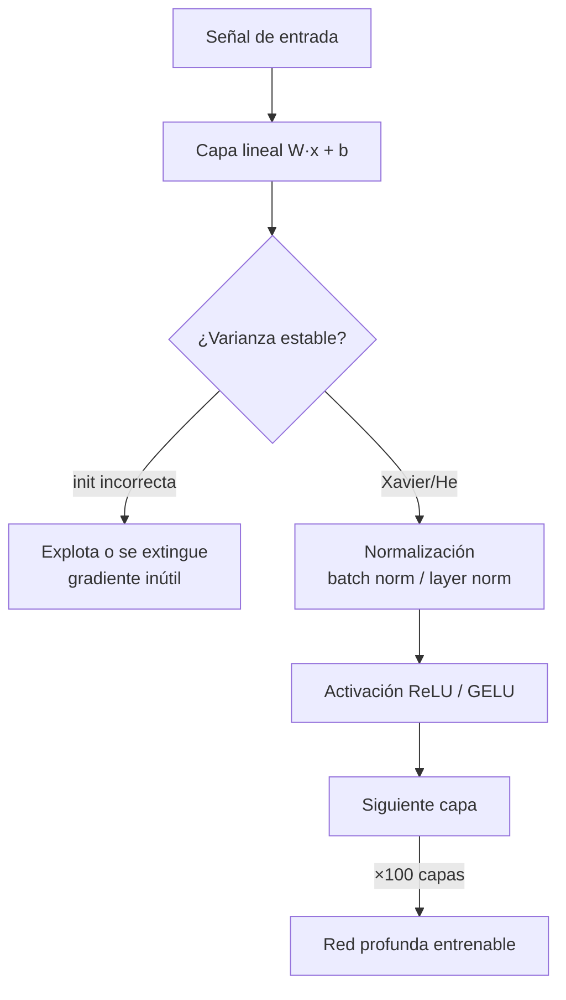

# 051 — Activaciones, inicialización y normalización

> [← Clase anterior](../../../classes/part-04-neural-networks-and-deep-learning/050-mlp-y-backpropagation/README.md) · [Índice de la parte](../README.md) · [Clase siguiente →](../../../classes/part-04-neural-networks-and-deep-learning/052-optimizadores-regularizacion-y-schedulers/README.md)

**Parte:** 04 — Redes neuronales y deep learning  
**Nivel:** intermedio-avanzado · **Horas estimadas:** 6  
**Laboratorio:** `neural` · **Estado:** `EXECUTABLE_CORE`

## 🎯 Propósito

Comprender **activaciones, inicialización y normalización** dentro de la evolución de la inteligencia
artificial, implementar un experimento mínimo verificable y distinguir qué parte
constituye evidencia frente a una afirmación todavía no comprobada.

## 📚 Resultados de aprendizaje

Al finalizar podrás:

1. Explicar activaciones, inicialización y normalización usando los conceptos `ReLU`, `GELU`, `inicialización`, `normalización`.
2. Ejecutar el laboratorio con una semilla explícita y revisar su contrato JSON.
3. Identificar al menos un supuesto, una limitación y un riesgo de aplicación.
4. Comparar el enfoque con la etapa anterior de la ruta de aprendizaje.
5. Producir una evidencia reproducible y una conclusión que no exceda los datos.

## 🧩 Conceptos centrales

`ReLU`, `GELU`, `inicialización`, `normalización`

## 🗺️ Ubicación en el mapa de la IA

Backpropagation (clase 050) funciona en teoría con cualquier activación y pesos
iniciales, pero en la práctica las redes profundas no entrenaban hasta que se
entendió cómo mantener sanas las señales y los gradientes capa a capa. ReLU,
la inicialización de Xavier/He y batch normalization son las tres piezas que, entre
2010 y 2015, convirtieron "redes de 3 capas" en "redes de 100+ capas" y habilitaron
CNN profundas (clase 053) y Transformers (clase 055).

## 📖 Fundamentos

### ⚡ Funciones de activación

| Función | Fórmula | Rango | Derivada | Problema típico |
|---|---|---|---|---|
| Sigmoide | σ(z) = 1/(1+e⁻ᶻ) | (0,1) | σ(1−σ) ≤ 0.25 | saturación: gradiente ≈ 0 en las colas |
| Tanh | tanh(z) | (−1,1) | 1−tanh² ≤ 1 | satura, pero centrada en 0 |
| ReLU | max(0, z) | [0,∞) | 0 o 1 | "neuronas muertas" (z<0 siempre) |
| Leaky ReLU | max(αz, z), α≈0.01 | (−∞,∞) | α o 1 | mitiga neuronas muertas |
| GELU | z·Φ(z) | (−0.17,∞) aprox. | suave | coste ligeramente mayor; estándar en Transformers |

La sigmoide multiplica el gradiente por ≤ 0.25 en cada capa: tras 10 capas, el
gradiente puede reducirse en 0.25¹⁰ ≈ 10⁻⁶ (gradiente que desaparece). ReLU tiene
derivada 1 en la zona activa, lo que preserva la magnitud del gradiente y además
produce activaciones dispersas (muchos ceros exactos).

### 🎲 Inicialización: Xavier/Glorot y He

Si los pesos iniciales son demasiado grandes, las activaciones explotan o saturan;
demasiado pequeños, la señal se extingue. El criterio es conservar la **varianza** de
la señal al atravesar cada capa. Para z = Σ wᵢxᵢ con n entradas independientes:

```text
Var(z) = n · Var(w) · Var(x)
```

Para que Var(z) ≈ Var(x) hace falta Var(w) = 1/n. Equilibrando forward y backward:

```text
Xavier/Glorot (tanh, sigmoide):  Var(w) = 2 / (n_in + n_out)
He (ReLU):                        Var(w) = 2 / n_in
```

El factor 2 de He compensa que ReLU anula la mitad de las activaciones (mitad de la
varianza). Con estas fórmulas, una red de decenas de capas mantiene señales de
magnitud estable desde el primer paso de entrenamiento.

### 📏 Normalización: batch norm y layer norm

**Batch normalization** (Ioffe y Szegedy, 2015) estandariza cada activación usando
las estadísticas del minibatch y reintroduce escala y desplazamiento aprendibles:

```text
μ = media del batch      σ² = varianza del batch
x̂ᵢ = (xᵢ − μ) / √(σ² + ε)
yᵢ = γ · x̂ᵢ + β           (γ, β aprendibles)
```

Efectos: permite tasas de aprendizaje mayores, reduce la sensibilidad a la
inicialización y actúa como regularizador suave (el ruido de las estadísticas del
batch). En inferencia se usan medias móviles acumuladas, no las del batch — por eso
`model.eval()` cambia el comportamiento. **Layer normalization** (Ba et al., 2016)
normaliza sobre las features de *cada ejemplo* en vez de sobre el batch: no depende
del tamaño de batch y es la opción estándar en RNN y Transformers.

## 🧮 Ejemplo trabajado

**Inicialización.** Capa de 256 → 256 unidades:

```text
Xavier: Var(w) = 2/(256+256) = 1/256   →  std = 1/16 = 0.0625
He:     Var(w) = 2/256                 →  std = 0.0884
```

Si en cambio usaras std = 1: Var(z) = 256 → std(z) = 16; con sigmoide, prácticamente
todas las unidades saturan y el gradiente se anula desde el paso 1.

**Batch norm a mano.** Batch de 4 activaciones x = (1, 2, 3, 4), γ = 2, β = 1, ε ≈ 0:

```text
μ = 2.5      σ² = ((−1.5)² + (−0.5)² + 0.5² + 1.5²)/4 = 1.25      √σ² = 1.1180
x̂ = (−1.3416, −0.4472, +0.4472, +1.3416)
y  = 2·x̂ + 1 = (−1.6833, +0.1056, +1.8944, +3.6833)
```

La salida tiene media β = 1 y desviación γ = 2 exactas: la red controla la
distribución de sus activaciones con dos parámetros aprendidos.

## 📊 Propiedades y comparación

| Técnica | Qué estabiliza | Cuándo se aplica | Coste | Limitación |
|---|---|---|---|---|
| ReLU/GELU | gradiente (derivada ≈ 1) | siempre (diseño) | nulo | neuronas muertas (ReLU) |
| Xavier/He | varianza inicial de señales | solo en t=0 | nulo | el entrenamiento puede degradarla |
| Batch norm | distribución de activaciones | cada forward | ~30 % más lento | depende del tamaño de batch |
| Layer norm | ídem, por ejemplo | cada forward | similar | menos eficaz en CNN pequeñas |



## ⚠️ Errores conceptuales frecuentes

1. **"La inicialización da igual porque el entrenamiento la corrige."** Con una mala
   escala inicial el gradiente desaparece o explota en el primer paso: no hay señal
   con la que corregir nada.
2. **"ReLU no es diferenciable en 0, así que backprop falla."** El punto único de no
   diferenciabilidad tiene medida cero; se toma subgradiente 0 o 1 y funciona.
3. **"Batch norm normaliza los datos de entrada."** Normaliza activaciones *internas*
   de cada capa, con estadísticas del minibatch; la estandarización de entrada es otra
   cosa (preprocesamiento).
4. **"Batch norm se comporta igual en entrenamiento e inferencia."** No: en inferencia
   usa medias móviles acumuladas. Olvidar `model.eval()` es un bug clásico.
5. **"Inicializar todo a cero es lo más neutro."** Con pesos idénticos todas las
   neuronas de una capa reciben el mismo gradiente y aprenden lo mismo para siempre
   (falta de ruptura de simetría).

## 🚀 Del aprendizaje a la operación

En un sistema real estas decisiones vienen empaquetadas: `torch.nn.init` aplica
Xavier/He según la activación declarada, y las arquitecturas estándar ya traen la
normalización correcta para su dominio. Lo que sigue siendo trabajo del ingeniero es
diagnosticar cuándo fallan: activaciones saturadas, pérdida que no baja en el paso 1,
o métricas que cambian entre `train()` y `eval()` apuntan exactamente a los conceptos
de esta clase.

## 🧪 Laboratorio

```bash
python lab.py
```

El laboratorio llama a `ai_evolution.labs.run_lab("neural")`. Esta
decisión evita 183 implementaciones divergentes: cada clase tiene un entrypoint
propio, pero los motores didácticos se prueban como una biblioteca común.

### 🔍 Evidencia esperada

- tipo de laboratorio y semilla;
- entradas o decisiones observables;
- resultado estructurado;
- lista `evidence` con hechos que pueden inspeccionarse;
- lista `limitations` que impide presentar la demo como producción.

## 📓 Notebooks

- [📓 `notebook.ipynb`](notebook.ipynb): recorrido guiado con la materia resumida.
- [✍️ `notebook_student.ipynb`](notebook_student.ipynb): ejercicios para resolver.
- [✅ `notebook_solution.ipynb`](notebook_solution.ipynb): solución de referencia explicada.

## 📝 Evaluación

| Criterio | Peso |
|---|---:|
| Comprensión conceptual | 25 % |
| Ejecución reproducible | 25 % |
| Interpretación basada en evidencia | 25 % |
| Riesgos, límites y mejora propuesta | 25 % |

Consulta [assessment.md](assessment.md) para preguntas y criterio de aceptación.

## ⚠️ Errores comunes

| Síntoma | Causa probable | Corrección |
|---|---|---|
| El código corre, pero no hay conclusión | Se confundió ejecución con aprendizaje | Explica qué demuestra y qué no demuestra |
| El resultado cambia sin explicación | No se registró semilla o configuración | Conserva semilla, versión y parámetros |
| Se promete uso real | Se extrapoló desde una demo educativa | Declara entorno, datos, límites y revisión humana |
| Se copia una métrica aislada | No existe baseline ni costo de error | Añade comparación y criterio de decisión |

## ❓ Preguntas frecuentes

**¿Debo usar una API comercial?**  
No. El núcleo funciona localmente. Las extensiones LIVE se documentan por separado.

**¿El laboratorio representa una implementación industrial?**  
No por sí solo. Enseña el contrato y el patrón; producción exige integración,
seguridad, observabilidad, pruebas y operación.

**¿Dónde profundizo?**  
Revisa las especializaciones enlazadas en el README raíz y la ruta siguiente.

## 🔗 Referencias

- Glorot, X. y Bengio, Y. (2010). *Understanding the difficulty of training deep feedforward neural networks*. AISTATS. [proceedings.mlr.press/v9/glorot10a.html](https://proceedings.mlr.press/v9/glorot10a.html)
- He, K. et al. (2015). *Delving Deep into Rectifiers: Surpassing Human-Level Performance on ImageNet Classification*. [arXiv:1502.01852](https://arxiv.org/abs/1502.01852)
- Ioffe, S. y Szegedy, C. (2015). *Batch Normalization: Accelerating Deep Network Training by Reducing Internal Covariate Shift*. [arXiv:1502.03167](https://arxiv.org/abs/1502.03167)
- Ba, J., Kiros, J. y Hinton, G. (2016). *Layer Normalization*. [arXiv:1607.06450](https://arxiv.org/abs/1607.06450)
- Goodfellow, I., Bengio, Y. y Courville, A. (2016). *Deep Learning*, cap. 8. [deeplearningbook.org/contents/optimization.html](https://www.deeplearningbook.org/contents/optimization.html)
- Documentación de PyTorch: [`torch.nn.init`](https://pytorch.org/docs/stable/nn.init.html)

<!-- papers:inicio -->

---

## 📜 Papers que fundamentan esta clase

> Bloque generado por `python scripts/link_papers_to_classes.py`. La fuente es [`papers/catalog/papers.json`](../../../papers/catalog/papers.json).

| Paper | Año | Qué desbloqueó | Miniatura |
|---|---:|---|---|
| [P02 · Aprender representaciones retropropagando errores](../../../papers/foundational/P02_backpropagation/README.md) | 1986 | Un procedimiento práctico para entrenar capas ocultas: la red descubre representaciones intermedias que nadie diseñó. | [notebook](../../../notebooks/papers/P02_backpropagation.ipynb) |
| [P40 · Dropout: una forma simple de evitar el sobreajuste en redes neuronales](../../../papers/foundational/P40_dropout/README.md) | 2014 | Apagar unidades al azar durante el entrenamiento equivale a entrenar un ensamblado exponencial de subredes que comparten pesos. | [notebook](../../../notebooks/papers/P40_dropout.ipynb) |
| [P43 · Normalización por lotes: acelerar el entrenamiento profundo](../../../papers/foundational/P43_batchnorm/README.md) | 2015 | Normalizar las activaciones dentro de la red permite tasas de aprendizaje mucho mayores y hace el entrenamiento profundo mucho menos frágil. | [notebook](../../../notebooks/papers/P43_batchnorm.ipynb) |
| [P44 · Aprendizaje residual profundo para reconocimiento de imágenes](../../../papers/foundational/P44_resnet/README.md) | 2015 | El atajo identidad hace apilables cientos de capas. Es la misma idea aditiva de la LSTM, aplicada a la profundidad. | [notebook](../../../notebooks/papers/P44_resnet.ipynb) |

Cada ficha explica el problema anterior, la matemática mínima, los límites y los errores de atribución más frecuentes. Para leerlas con método: [cómo leer un paper de IA](../../../papers/guides/COMO_LEER_UN_PAPER_DE_IA.md) · [anexos matemáticos](../../../papers/annexes/README.md).
<!-- papers:fin -->
---

## ⬅️ Clase anterior

[050 — MLP y backpropagation](../../part-04-neural-networks-and-deep-learning/050-mlp-y-backpropagation/README.md)

## ➡️ Siguiente clase

[052 — Optimizadores, regularización y schedulers](../../part-04-neural-networks-and-deep-learning/052-optimizadores-regularizacion-y-schedulers/README.md)
