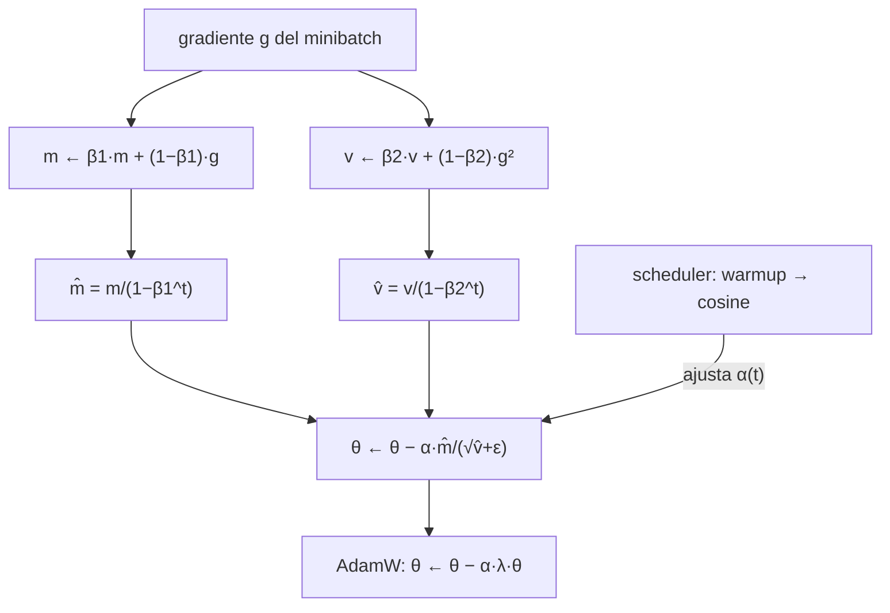

# 052 — Optimizadores, regularización y schedulers

> [← Clase anterior](../../../classes/part-04-neural-networks-and-deep-learning/051-activaciones-inicializacion-y-normalizacion/README.md) · [Índice de la parte](../README.md) · [Clase siguiente →](../../../classes/part-04-neural-networks-and-deep-learning/053-cnn-y-aprendizaje-espacial/README.md)

**Parte:** 04 — Redes neuronales y deep learning  
**Nivel:** intermedio-avanzado · **Horas estimadas:** 6  
**Laboratorio:** `optimization` · **Estado:** `EXECUTABLE_CORE`

## 🎯 Propósito

Comprender **optimizadores, regularización y schedulers** dentro de la evolución de la inteligencia
artificial, implementar un experimento mínimo verificable y distinguir qué parte
constituye evidencia frente a una afirmación todavía no comprobada.

## 📚 Resultados de aprendizaje

Al finalizar podrás:

1. Explicar optimizadores, regularización y schedulers usando los conceptos `SGD`, `AdamW`, `dropout`, `scheduler`.
2. Ejecutar el laboratorio con una semilla explícita y revisar su contrato JSON.
3. Identificar al menos un supuesto, una limitación y un riesgo de aplicación.
4. Comparar el enfoque con la etapa anterior de la ruta de aprendizaje.
5. Producir una evidencia reproducible y una conclusión que no exceda los datos.

## 🧩 Conceptos centrales

`SGD`, `AdamW`, `dropout`, `scheduler`

## 🗺️ Ubicación en el mapa de la IA

Con el gradiente ya disponible (clase 050) y señales estables (clase 051), queda la
pregunta operativa central del deep learning: *cómo usar ese gradiente*. SGD con
momento, Adam/AdamW, dropout, weight decay y los schedulers de tasa de aprendizaje
son el "manual de vuelo" con el que se entrenan desde CNN hasta los LLM actuales;
casi cualquier receta de entrenamiento moderna es una combinación de estas piezas.

## 📖 Fundamentos

### 📉 SGD y minibatches

El descenso de gradiente **estocástico** estima el gradiente con un minibatch de B
ejemplos en lugar del dataset completo:

```text
θ ← θ − η · (1/B) Σ_{i∈batch} ∇L_i(θ)
```

El ruido del muestreo abarata cada paso y, además, ayuda a escapar de puntos de
silla. B pequeño = más ruido y más pasos; B grande = gradiente más fiel pero pasos
más caros y a veces peor generalización.

### 🎳 Momento (momentum)

El momento acumula una media móvil de gradientes, como una bola con inercia:

```text
v ← μ·v + ∇L(θ)        (μ ≈ 0.9)
θ ← θ − η·v
```

Acelera en direcciones consistentes (el valle) y amortigua oscilaciones en
direcciones que cambian de signo (las paredes del valle). Nesterov evalúa el
gradiente en la posición "anticipada" θ − ημv, con corrección más fina.

### 🧭 Adam y AdamW

**Adam** (Kingma y Ba, 2014) mantiene medias móviles del gradiente (m, primer momento)
y de su cuadrado (v, segundo momento), y adapta la escala por parámetro:

```text
m ← β₁·m + (1−β₁)·g            (β₁ = 0.9)
v ← β₂·v + (1−β₂)·g²           (β₂ = 0.999)
m̂ = m/(1−β₁ᵗ)    v̂ = v/(1−β₂ᵗ)     ← corrección de sesgo inicial
θ ← θ − α · m̂ / (√v̂ + ε)
```

La división por √v̂ hace que parámetros con gradientes históricamente grandes den
pasos pequeños y viceversa: cada parámetro tiene su tasa efectiva. **AdamW**
(Loshchilov y Hutter, 2017) separa el weight decay de la actualización adaptativa
(`θ ← θ − α·λ·θ` aparte), porque mezclar L2 dentro de Adam lo distorsiona; AdamW es
el estándar de facto para Transformers.

### 🛡️ Regularización

- **Weight decay / L2**: penaliza ‖θ‖² empujando los pesos hacia cero; controla la
  complejidad efectiva del modelo.
- **Dropout** (Srivastava et al., 2014): durante el entrenamiento anula cada
  activación con probabilidad p y escala el resto por 1/(1−p) (*inverted dropout*);
  en inferencia no hace nada. Obliga a redundancia: ninguna neurona puede depender
  de otra concreta. Equivale a entrenar un ensamble implícito de subredes.
- **Early stopping**: detener cuando la métrica de *validación* deja de mejorar.
- **Aumento de datos**: regulariza atacando el problema en la fuente.

### ⏱️ Schedulers y warmup

La tasa de aprendizaje óptima cambia durante el entrenamiento. Recetas comunes:
*step decay* (dividir η por 10 cada k épocas), *cosine annealing* (decaimiento suave
hasta ~0) y **warmup** (crecer linealmente desde ~0 durante los primeros pasos, crítico
en Transformers: al inicio las estimaciones m̂, v̂ de Adam son ruidosas y un η grande
puede desestabilizar la red).

## 🧮 Ejemplo trabajado

**Una actualización de Adam a mano** (primer paso, t = 1): parámetro θ = 1.0,
gradiente g = 0.5, α = 0.001, β₁ = 0.9, β₂ = 0.999, ε = 10⁻⁸, m₀ = v₀ = 0.

```text
m = 0.9·0 + 0.1·0.5   = 0.05
v = 0.999·0 + 0.001·0.25 = 0.00025
m̂ = 0.05 / (1−0.9¹)   = 0.05/0.1   = 0.5
v̂ = 0.00025 / (1−0.999¹) = 0.00025/0.001 = 0.25
Δθ = −0.001 · 0.5 / (√0.25 + 10⁻⁸) = −0.001 · 0.5/0.5 = −0.001
θ ← 1.0 − 0.001 = 0.999
```

Nota el efecto de la corrección de sesgo: sin ella, m = 0.05 y v = 0.00025 darían un
paso distorsionado; con ella, el primer paso vale exactamente −α·g/|g| = −α, es decir,
Adam da pasos de tamaño ≈ α independientes de la escala del gradiente.

**Dropout a mano**: activaciones h = (2, 4, 6) con p = 0.5 y máscara (1, 0, 1):
salida entrenamiento = (2/0.5, 0, 6/0.5) = (4, 0, 12). En inferencia: (2, 4, 6) sin
cambios — la esperanza coincide gracias al escalado 1/(1−p).

## 📊 Propiedades y comparación

| Optimizador | Estado extra | Tasa por parámetro | Sensible a escala de g | Uso típico |
|---|---|---|---|---|
| SGD | ninguno | no | sí | visión (con momento), máxima simplicidad |
| SGD + momento | v (1× params) | no | sí | CNN clásicas; buena generalización |
| Adam | m, v (2× params) | sí | no (normaliza) | por defecto en la mayoría de tareas |
| AdamW | m, v (2× params) | sí | no | Transformers, LLM (con warmup + cosine) |



## ⚠️ Errores conceptuales frecuentes

1. **"Adam siempre es mejor que SGD."** Adam converge más rápido en pasos, pero en
   visión SGD+momento bien ajustado generaliza a veces mejor; "mejor" depende de tarea
   y presupuesto de ajuste.
2. **"Dropout se aplica también en inferencia."** No: en inferencia se desactiva; el
   escalado 1/(1−p) durante el entrenamiento mantiene la esperanza correcta.
3. **"Weight decay y L2 son siempre lo mismo."** Coinciden en SGD puro; en Adam
   difieren (la L2 pasa por la normalización adaptativa) — esa es la razón de AdamW.
4. **"Si la pérdida de entrenamiento baja, todo va bien."** El sobreajuste se detecta
   en validación; entrenar más allá del punto de quiebre empeora el modelo real.
5. **"El warmup es un truco opcional."** En Transformers grandes, omitirlo produce
   divergencia temprana reproducible: las primeras estimaciones de v̂ son tan ruidosas
   que los pasos iniciales pueden ser enormes.

## 🚀 Del aprendizaje a la operación

Un entrenamiento real añade: búsqueda de hiperparámetros con presupuesto explícito,
*gradient clipping* para picos, precisión mixta (float16) con escalado de pérdida,
checkpoints reanudables y registro de curvas de entrenamiento/validación. La receta
"AdamW + warmup + cosine + weight decay" es un punto de partida sólido, no un dogma:
cada dominio la recalibra empíricamente.

## 🧪 Laboratorio

```bash
python lab.py
```

El laboratorio llama a `ai_evolution.labs.run_lab("optimization")`. Esta
decisión evita 183 implementaciones divergentes: cada clase tiene un entrypoint
propio, pero los motores didácticos se prueban como una biblioteca común.

### 🔍 Evidencia esperada

- tipo de laboratorio y semilla;
- entradas o decisiones observables;
- resultado estructurado;
- lista `evidence` con hechos que pueden inspeccionarse;
- lista `limitations` que impide presentar la demo como producción.

## 📓 Notebooks

- [📓 `notebook.ipynb`](notebook.ipynb): recorrido guiado con la materia resumida.
- [✍️ `notebook_student.ipynb`](notebook_student.ipynb): ejercicios para resolver.
- [✅ `notebook_solution.ipynb`](notebook_solution.ipynb): solución de referencia explicada.

## 📝 Evaluación

| Criterio | Peso |
|---|---:|
| Comprensión conceptual | 25 % |
| Ejecución reproducible | 25 % |
| Interpretación basada en evidencia | 25 % |
| Riesgos, límites y mejora propuesta | 25 % |

Consulta [assessment.md](assessment.md) para preguntas y criterio de aceptación.

## ⚠️ Errores comunes

| Síntoma | Causa probable | Corrección |
|---|---|---|
| El código corre, pero no hay conclusión | Se confundió ejecución con aprendizaje | Explica qué demuestra y qué no demuestra |
| El resultado cambia sin explicación | No se registró semilla o configuración | Conserva semilla, versión y parámetros |
| Se promete uso real | Se extrapoló desde una demo educativa | Declara entorno, datos, límites y revisión humana |
| Se copia una métrica aislada | No existe baseline ni costo de error | Añade comparación y criterio de decisión |

## ❓ Preguntas frecuentes

**¿Debo usar una API comercial?**  
No. El núcleo funciona localmente. Las extensiones LIVE se documentan por separado.

**¿El laboratorio representa una implementación industrial?**  
No por sí solo. Enseña el contrato y el patrón; producción exige integración,
seguridad, observabilidad, pruebas y operación.

**¿Dónde profundizo?**  
Revisa las especializaciones enlazadas en el README raíz y la ruta siguiente.

## 🔗 Referencias

- Kingma, D. y Ba, J. (2014). *Adam: A Method for Stochastic Optimization*. [arXiv:1412.6980](https://arxiv.org/abs/1412.6980) — uso: fuente primaria del mecanismo estudiado
- Loshchilov, I. y Hutter, F. (2017). *Decoupled Weight Decay Regularization* (AdamW). [arXiv:1711.05101](https://arxiv.org/abs/1711.05101) — uso: fuente primaria del mecanismo estudiado
- Srivastava, N. et al. (2014). *Dropout: A Simple Way to Prevent Neural Networks from Overfitting*. JMLR 15. [jmlr.org/papers/v15/srivastava14a.html](https://jmlr.org/papers/v15/srivastava14a.html) — uso: referencia consultada en su fuente original
- Goodfellow, I., Bengio, Y. y Courville, A. (2016). *Deep Learning*, cap. 8 (Optimization). [deeplearningbook.org/contents/optimization.html](https://www.deeplearningbook.org/contents/optimization.html) — uso: desarrollo extendido del tema
- Documentación de PyTorch: [`torch.optim`](https://pytorch.org/docs/stable/optim.html) — uso: referencia consultada en su fuente original

<!-- papers:inicio -->

---

## 📜 Papers que fundamentan esta clase

> Bloque generado por `python scripts/link_papers_to_classes.py`. La fuente es [`papers/catalog/papers.json`](../../../papers/catalog/papers.json).

| Paper | Año | Qué desbloqueó | Miniatura |
|---|---:|---|---|
| [P40 · Dropout: una forma simple de evitar el sobreajuste en redes neuronales](../../../papers/foundational/P40_dropout/README.md) | 2014 | Apagar unidades al azar durante el entrenamiento equivale a entrenar un ensamblado exponencial de subredes que comparten pesos. | [notebook](../../../notebooks/papers/P40_dropout.ipynb) |
| [P41 · Adam: un método de optimización estocástica](../../../papers/foundational/P41_adam/README.md) | 2014 | Un paso de aprendizaje por dimensión, adaptado a la escala de su propio gradiente. Es el optimizador por defecto de casi todo lo que vino después. | [notebook](../../../notebooks/papers/P41_adam.ipynb) |
| [P43 · Normalización por lotes: acelerar el entrenamiento profundo](../../../papers/foundational/P43_batchnorm/README.md) | 2015 | Normalizar las activaciones dentro de la red permite tasas de aprendizaje mucho mayores y hace el entrenamiento profundo mucho menos frágil. | [notebook](../../../notebooks/papers/P43_batchnorm.ipynb) |

Cada ficha explica el problema anterior, la matemática mínima, los límites y los errores de atribución más frecuentes. Para leerlas con método: [cómo leer un paper de IA](../../../papers/guides/COMO_LEER_UN_PAPER_DE_IA.md) · [anexos matemáticos](../../../papers/annexes/README.md).
<!-- papers:fin -->
<!-- bibliografia:inicio -->

---

## 📚 Bibliografía de apoyo

> Bloque generado por `python scripts/link_sources_to_classes.py`. Cada obra lleva su localizador verificado en [`sources/bibliography.json`](../../../sources/bibliography.json).

Los papers dicen **de dónde salió** el mecanismo. Estas obras lo **desarrollan** con el espacio que una clase no tiene: teoría completa, demostraciones y ejercicios.

| Obra | Edición | Localizador | Papel en esta clase |
|---|---|---|---|
| Goodfellow, Ian, Bengio, Yoshua y Courville, Aaron — *Deep Learning* | 2016 | [ISBN 9780262035613](https://openlibrary.org/isbn/9780262035613) · [web de la obra](https://www.deeplearningbook.org/) | citada en las referencias de esta clase · cap. 8 · obra de referencia de la parte 04 |
| Murphy, Kevin P. — *Probabilistic Machine Learning* | 2022 | [ISBN 9780262046824](https://openlibrary.org/isbn/9780262046824) · [web de la obra](https://probml.github.io/pml-book/) | obra de referencia de la parte 04 · modelos profundos desde la probabilidad |
<!-- bibliografia:fin -->

---

## ⬅️ Clase anterior

[051 — Activaciones, inicialización y normalización](../../part-04-neural-networks-and-deep-learning/051-activaciones-inicializacion-y-normalizacion/README.md)

## ➡️ Siguiente clase

[053 — CNN y aprendizaje espacial](../../part-04-neural-networks-and-deep-learning/053-cnn-y-aprendizaje-espacial/README.md)
