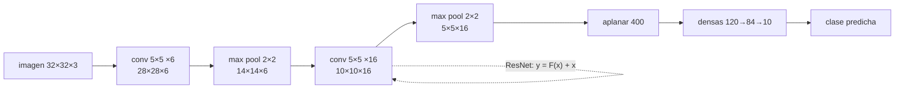

# 053 — CNN y aprendizaje espacial

> [← Clase anterior](../../../classes/part-04-neural-networks-and-deep-learning/052-optimizadores-regularizacion-y-schedulers/README.md) · [Índice de la parte](../README.md) · [Clase siguiente →](../../../classes/part-04-neural-networks-and-deep-learning/054-rnn-lstm-y-secuencias/README.md)

**Parte:** 04 — Redes neuronales y deep learning  
**Nivel:** intermedio-avanzado · **Horas estimadas:** 6  
**Laboratorio:** `perception` · **Estado:** `EXECUTABLE_CORE`

## 🎯 Propósito

Comprender **cnn y aprendizaje espacial** dentro de la evolución de la inteligencia
artificial, implementar un experimento mínimo verificable y distinguir qué parte
constituye evidencia frente a una afirmación todavía no comprobada.

## 📚 Resultados de aprendizaje

Al finalizar podrás:

1. Explicar cnn y aprendizaje espacial usando los conceptos `convolución`, `pooling`, `receptive field`, `visión`.
2. Ejecutar el laboratorio con una semilla explícita y revisar su contrato JSON.
3. Identificar al menos un supuesto, una limitación y un riesgo de aplicación.
4. Comparar el enfoque con la etapa anterior de la ruta de aprendizaje.
5. Producir una evidencia reproducible y una conclusión que no exceda los datos.

## 🧩 Conceptos centrales

`convolución`, `pooling`, `receptive field`, `visión`

## 🗺️ Ubicación en el mapa de la IA

Las redes convolucionales incorporan al MLP (clase 050) un sesgo inductivo espacial:
los patrones visuales son locales e invariantes a traslación. De LeNet-5 (LeCun, 1998,
lectura de cheques) a AlexNet (2012, punto de inflexión del deep learning moderno) y
ResNet (He et al., 2015, redes de 100+ capas), las CNN demostraron que aprender las
features supera a diseñarlas a mano, y su vocabulario (stride, padding, campos
receptivos) reaparece en los Transformers de visión.

## 📖 Fundamentos

### 🔲 La operación de convolución

Una capa convolucional desliza un **kernel** (filtro) de pesos K sobre la entrada I
y calcula en cada posición un producto punto local (en deep learning se implementa
como correlación cruzada, sin voltear el kernel):

```text
S(i, j) = Σₘ Σₙ I(i+m, j+n) · K(m, n) + b
```

Frente a una capa densa, la convolución impone dos restricciones que son su fuerza:

- **Conectividad local**: cada salida mira solo una ventana K×K de la entrada.
- **Pesos compartidos**: el mismo kernel se aplica en todas las posiciones →
  detecta el mismo patrón esté donde esté (equivarianza a traslación) y reduce
  drásticamente los parámetros.

El **tamaño de salida** con entrada N×N, kernel K×K, padding P y stride S:

```text
salida = ⌊(N − K + 2P) / S⌋ + 1
```

Una capa tiene C_out filtros, cada uno de tamaño K×K×C_in:
parámetros = C_out·(K·K·C_in + 1).

### 🌊 Pooling y jerarquía de features

**Max pooling** (o promedio) reduce la resolución tomando el máximo de cada ventana
(típicamente 2×2, stride 2). Aporta invarianza local a pequeñas traslaciones y reduce
cómputo. Apilando conv + pooling, el **campo receptivo** (la región de la imagen
original que influye en una activación) crece capa a capa: las primeras capas detectan
bordes y texturas; las intermedias, partes; las profundas, objetos. Para capas
convolucionales apiladas, el campo receptivo crece según
RF_l = RF_{l−1} + (K−1)·Πproducto de strides anteriores; dos capas 3×3 "ven" 5×5,
tres capas 3×3 "ven" 7×7 — con menos parámetros y más no linealidad que un único 7×7
(la razón del diseño de VGG).

### 🏛️ De LeNet a ResNet

```text
LeNet-5 (1998):   conv 5×5 + pooling ×2 → densas. ~60k parámetros, dígitos MNIST.
AlexNet (2012):   ReLU + dropout + GPU. Ganó ImageNet por >10 puntos de error.
VGG (2014):       solo kernels 3×3 apilados; profundidad regular (16-19 capas).
ResNet (2015):    bloques residuales y = F(x) + x. 152 capas entrenables.
```

El **bloque residual** de ResNet es el aporte conceptual clave: en lugar de aprender
la transformación completa H(x), la capa aprende el residuo F(x) = H(x) − x. El
atajo (skip connection) da al gradiente una autopista directa hacia las capas
tempranas y resuelve la *degradación* (redes más profundas entrenaban peor que las
someras incluso en entrenamiento, sin ser sobreajuste). Las skip connections son hoy
ubicuas: también los Transformers las usan en cada bloque.

## 🧮 Ejemplo trabajado

**Convolución 2×2 a mano** (stride 1, sin padding). Entrada 4×4 y kernel:

```text
I = | 1 2 0 1 |        K = |  1  0 |
    | 0 1 3 2 |            |  0 −1 |
    | 1 0 2 1 |
    | 2 1 0 1 |
```

Cada salida es I(i,j)·1 + I(i+1,j+1)·(−1) (los otros dos pesos son 0). Salida 3×3
(tamaño: (4−2+0)/1 + 1 = 3):

```text
S = | 1−1  2−3  0−2 |   | 0 −1 −2 |
    | 0−0  1−2  3−1 | = | 0 −1  2 |
    | 1−1  0−0  2−1 |   | 0  0  1 |
```

Este kernel responde a diferencias diagonales: un detector de borde primitivo.

**Tamaños y parámetros (estilo LeNet)**: entrada 32×32×3, capa de 6 filtros 5×5,
stride 1, sin padding → salida (32−5)/1+1 = **28×28×6**;
parámetros = 6·(5·5·3 + 1) = **456**. Una capa densa equivalente
(3072 → 4704 unidades) necesitaría ~14.5 millones de pesos: la compartición de pesos
reduce 5 órdenes de magnitud.

## 📊 Propiedades y comparación

| Aspecto | Capa densa | Convolución | Pooling |
|---|---|---|---|
| Parámetros | n_in·n_out | C_out·(K²·C_in+1) | 0 |
| Estructura espacial | la destruye | la preserva | la reduce con invarianza |
| Invarianza a traslación | no | equivarianza | invarianza local |
| Campo receptivo | global | local, crece con profundidad | duplica el crecimiento |
| Uso típico | cabeza clasificadora | extracción de features | reducción de resolución |



## ⚠️ Errores conceptuales frecuentes

1. **"La convolución de deep learning voltea el kernel."** Los frameworks implementan
   correlación cruzada; como los pesos se aprenden, la distinción es irrelevante en la
   práctica (el kernel aprendido absorbe el volteo).
2. **"Pooling aprende parámetros."** Max/average pooling no tiene pesos; solo reduce
   resolución. Hoy a menudo se sustituye por convoluciones con stride 2.
3. **"Más profundidad siempre mejoraba antes de ResNet."** Al contrario: la
   *degradación* (peor error de entrenamiento al profundizar) era el bloqueo; el
   bloque residual la resolvió, no el sobreajuste.
4. **"El campo receptivo de una neurona es su kernel."** Es la región de la *imagen
   original* que la influye, y crece con cada capa apilada: dos 3×3 ven 5×5.
5. **"Las CNN son invariantes a rotación y escala."** Solo tienen equivarianza a
   traslación; rotaciones y escalas se atacan con aumento de datos.

## 🚀 Del aprendizaje a la operación

Un sistema de visión real parte casi siempre de una CNN (o ViT) preentrenada en
ImageNet y ajusta sobre el dominio propio (clase 059); añade aumento de datos,
evaluación por clase (no solo accuracy global), calibración de confianza y pruebas
frente a cambios de cámara, iluminación y distribución. La convolución de esta clase
es la misma; lo que cambia es todo el andamiaje de datos y evaluación alrededor.

## 🧪 Laboratorio

```bash
python lab.py
```

El laboratorio llama a `ai_evolution.labs.run_lab("perception")`. Esta
decisión evita 183 implementaciones divergentes: cada clase tiene un entrypoint
propio, pero los motores didácticos se prueban como una biblioteca común.

### 🔍 Evidencia esperada

- tipo de laboratorio y semilla;
- entradas o decisiones observables;
- resultado estructurado;
- lista `evidence` con hechos que pueden inspeccionarse;
- lista `limitations` que impide presentar la demo como producción.

## 📓 Notebooks

- [📓 `notebook.ipynb`](notebook.ipynb): recorrido guiado con la materia resumida.
- [✍️ `notebook_student.ipynb`](notebook_student.ipynb): ejercicios para resolver.
- [✅ `notebook_solution.ipynb`](notebook_solution.ipynb): solución de referencia explicada.

## 📝 Evaluación

| Criterio | Peso |
|---|---:|
| Comprensión conceptual | 25 % |
| Ejecución reproducible | 25 % |
| Interpretación basada en evidencia | 25 % |
| Riesgos, límites y mejora propuesta | 25 % |

Consulta [assessment.md](assessment.md) para preguntas y criterio de aceptación.

## ⚠️ Errores comunes

| Síntoma | Causa probable | Corrección |
|---|---|---|
| El código corre, pero no hay conclusión | Se confundió ejecución con aprendizaje | Explica qué demuestra y qué no demuestra |
| El resultado cambia sin explicación | No se registró semilla o configuración | Conserva semilla, versión y parámetros |
| Se promete uso real | Se extrapoló desde una demo educativa | Declara entorno, datos, límites y revisión humana |
| Se copia una métrica aislada | No existe baseline ni costo de error | Añade comparación y criterio de decisión |

## ❓ Preguntas frecuentes

**¿Debo usar una API comercial?**  
No. El núcleo funciona localmente. Las extensiones LIVE se documentan por separado.

**¿El laboratorio representa una implementación industrial?**  
No por sí solo. Enseña el contrato y el patrón; producción exige integración,
seguridad, observabilidad, pruebas y operación.

**¿Dónde profundizo?**  
Revisa las especializaciones enlazadas en el README raíz y la ruta siguiente.

## 🔗 Referencias

- LeCun, Y., Bottou, L., Bengio, Y. y Haffner, P. (1998). *Gradient-based learning applied to document recognition*. Proc. IEEE. [doi:10.1109/5.726791](https://doi.org/10.1109/5.726791)
- Krizhevsky, A., Sutskever, I. y Hinton, G. (2017). *ImageNet classification with deep convolutional neural networks*. Comm. ACM. [doi:10.1145/3065386](https://doi.org/10.1145/3065386)
- He, K., Zhang, X., Ren, S. y Sun, J. (2015). *Deep Residual Learning for Image Recognition*. [arXiv:1512.03385](https://arxiv.org/abs/1512.03385)
- Goodfellow, I., Bengio, Y. y Courville, A. (2016). *Deep Learning*, cap. 9 (Convolutional Networks). [deeplearningbook.org/contents/convnets.html](https://www.deeplearningbook.org/contents/convnets.html)
- Documentación de PyTorch: [`torch.nn.Conv2d`](https://pytorch.org/docs/stable/generated/torch.nn.Conv2d.html)

---

## ⬅️ Clase anterior

[052 — Optimizadores, regularización y schedulers](../../part-04-neural-networks-and-deep-learning/052-optimizadores-regularizacion-y-schedulers/README.md)

## ➡️ Siguiente clase

[054 — RNN, LSTM y secuencias](../../part-04-neural-networks-and-deep-learning/054-rnn-lstm-y-secuencias/README.md)
