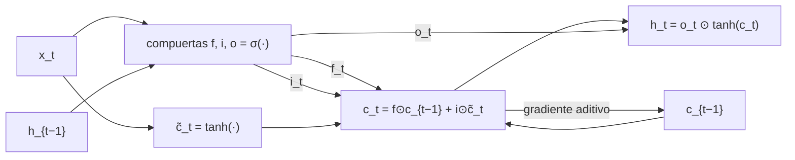

# 054 — RNN, LSTM y secuencias

> [← Clase anterior](../../../classes/part-04-neural-networks-and-deep-learning/053-cnn-y-aprendizaje-espacial/README.md) · [Índice de la parte](../README.md) · [Clase siguiente →](../../../classes/part-04-neural-networks-and-deep-learning/055-atencion-y-arquitectura-transformer/README.md)

**Parte:** 04 — Redes neuronales y deep learning  
**Nivel:** intermedio-avanzado · **Horas estimadas:** 6  
**Laboratorio:** `neural` · **Estado:** `EXECUTABLE_CORE`

## 🎯 Propósito

Comprender **rnn, lstm y secuencias** dentro de la evolución de la inteligencia
artificial, implementar un experimento mínimo verificable y distinguir qué parte
constituye evidencia frente a una afirmación todavía no comprobada.

## 📚 Resultados de aprendizaje

Al finalizar podrás:

1. Explicar rnn, lstm y secuencias usando los conceptos `RNN`, `LSTM`, `estado`, `secuencia`.
2. Ejecutar el laboratorio con una semilla explícita y revisar su contrato JSON.
3. Identificar al menos un supuesto, una limitación y un riesgo de aplicación.
4. Comparar el enfoque con la etapa anterior de la ruta de aprendizaje.
5. Producir una evidencia reproducible y una conclusión que no exceda los datos.

## 🧩 Conceptos centrales

`RNN`, `LSTM`, `estado`, `secuencia`

## 🗺️ Ubicación en el mapa de la IA

Las CNN explotan estructura espacial; las RNN explotan estructura *temporal*: un
estado oculto que se actualiza paso a paso permite procesar secuencias de longitud
variable (texto, audio, series). Su talón de Aquiles —los gradientes que desaparecen
a lo largo del tiempo (Bengio et al., 1994)— motivó la LSTM (Hochreiter y Schmidhuber,
1997), dominante en NLP hasta 2017, cuando la atención (clase 055) eliminó la
recurrencia. Entender por qué la LSTM funciona es entender por qué el Transformer ganó.

## 📖 Fundamentos

### 🔄 La red recurrente básica

Una RNN aplica la *misma* función en cada paso temporal, manteniendo un estado
oculto h que resume el pasado:

```text
h_t = tanh(W_x·x_t + W_h·h_{t−1} + b)
y_t = W_y·h_t + c
```

Los pesos (W_x, W_h) se comparten en el tiempo — el análogo temporal de la
compartición espacial de las CNN. Desplegada (*unrolled*), una RNN de T pasos es una
red profunda de T capas con pesos repetidos, y se entrena con **backpropagation
through time (BPTT)**: se despliega el grafo y se aplica backprop normal, sumando los
gradientes de cada paso sobre los mismos pesos compartidos.

### 📉 Gradientes que desaparecen (y explotan)

En BPTT, el gradiente que conecta el paso t con el paso t−k atraviesa k jacobianos:

```text
∂h_t/∂h_{t−k} = Π_{i=1..k} diag(tanh'(z_{t−i+1})) · W_h
```

Si los valores singulares efectivos de ese producto son < 1, el gradiente se reduce
geométricamente (**desaparece**: la red no aprende dependencias largas); si son > 1,
crece geométricamente (**explota**: pasos de entrenamiento gigantes). La explosión se
mitiga con *gradient clipping* (recortar la norma del gradiente); la desaparición
exige cambiar la arquitectura.

### 🚪 LSTM: memoria con compuertas

La LSTM añade un **estado de celda** c_t con actualización *aditiva* y tres
compuertas sigmoides (valores en (0,1)) que regulan el flujo de información:

```text
f_t = σ(W_f·[h_{t−1}, x_t] + b_f)      compuerta de olvido
i_t = σ(W_i·[h_{t−1}, x_t] + b_i)      compuerta de entrada
c̃_t = tanh(W_c·[h_{t−1}, x_t] + b_c)   candidato
c_t = f_t ⊙ c_{t−1} + i_t ⊙ c̃_t        actualización aditiva de la celda
o_t = σ(W_o·[h_{t−1}, x_t] + b_o)      compuerta de salida
h_t = o_t ⊙ tanh(c_t)
```

La clave es c_t = f ⊙ c_{t−1} + i ⊙ c̃: el gradiente fluye por la celda a través de
una suma modulada por f, no de una multiplicación repetida por W_h. Con f ≈ 1, la
información (y el gradiente) puede conservarse durante cientos de pasos — el mismo
principio del atajo residual de ResNet, aplicado al tiempo. La **GRU** (Cho et al.,
2014) simplifica a dos compuertas fusionando celda y estado, con rendimiento similar
y menos parámetros.

### 🧵 Limitación estructural

Aun con LSTM, la computación es inherentemente **secuencial** (h_t requiere h_{t−1}):
no se paraleliza sobre la longitud de la secuencia, y toda la historia debe comprimirse
en un vector de estado de tamaño fijo. Estas dos limitaciones son exactamente las que
la auto-atención (clase 055) elimina.

## 🧮 Ejemplo trabajado

RNN escalar con w_h = 0.5, w_x = 1, b = 0, h₀ = 0 y entrada x = (1, 0, 0) — un
impulso seguido de silencio:

```text
h₁ = tanh(1·1 + 0.5·0)      = tanh(1.0)    = 0.7616
h₂ = tanh(1·0 + 0.5·0.7616) = tanh(0.3808) = 0.3634
h₃ = tanh(0.5·0.3634)       = tanh(0.1817) = 0.1797
```

La "memoria" del impulso decae geométricamente. El gradiente hacia atrás hace lo
mismo: |∂h₃/∂h₁| = |w_h·tanh'(z₃)| · |w_h·tanh'(z₂)| ≤ 0.5² = 0.25, y en general
≤ w_h^k para k pasos: con w_h = 0.5, a 20 pasos el gradiente es ≤ 10⁻⁶.

Ahora una celda LSTM con f = 0.95, i = 0.5 constante y candidatos nulos tras el paso 1
(c₁ = 1): c_t = 0.95^(t−1) — tras 20 pasos conserva 0.377 (38 %), frente al 10⁻⁶ de
la RNN: la actualización aditiva con compuerta de olvido cercana a 1 retiene señal
órdenes de magnitud más tiempo.

## 📊 Propiedades y comparación

| Aspecto | RNN simple | LSTM | GRU | Transformer (055) |
|---|---|---|---|---|
| Dependencias largas | pobres (gradiente ∝ w^k) | buenas (celda aditiva) | buenas | excelentes (acceso directo) |
| Parámetros por capa | 1× | 4× | 3× | según d_model |
| Paralelización temporal | no | no | no | sí |
| Coste por paso | O(d²) | O(4d²) | O(3d²) | O(n·d) por token |
| Memoria de contexto | vector fijo | vector fijo | vector fijo | todos los tokens |



## ⚠️ Errores conceptuales frecuentes

1. **"La RNN tiene pesos distintos en cada paso temporal."** Comparte los mismos
   pesos en todos los pasos; por eso puede procesar longitudes arbitrarias.
2. **"El gradient clipping arregla los gradientes que desaparecen."** Solo mitiga los
   que *explotan*; la desaparición requiere arquitectura (LSTM/GRU) o atención.
3. **"La LSTM elimina el problema del gradiente por usar sigmoides."** Lo que lo
   mitiga es la actualización *aditiva* de la celda modulada por la compuerta de
   olvido, no el tipo de activación.
4. **"El estado oculto puede recordar toda la secuencia."** Es un vector de tamaño
   fijo: comprime con pérdida; secuencias largas y densas en información lo saturan.
5. **"Las LSTM están obsoletas y no vale la pena entenderlas."** Siguen siendo
   competitivas en series temporales pequeñas y streaming con baja latencia, y su
   mecánica de compuertas explica por qué la atención fue necesaria.

## 🚀 Del aprendizaje a la operación

Para producción con secuencias hoy se decide entre: LSTM/GRU (datos escasos, streaming,
dispositivos limitados) o Transformers (corpus grandes, contexto largo). Faltarían
además: truncated BPTT para secuencias largas, padding/masking correcto en batches,
gradient clipping configurado y métricas específicas de secuencia (perplejidad, F1 por
entidad), más pruebas con longitudes fuera del rango de entrenamiento.

## 🧪 Laboratorio

```bash
python lab.py
```

El laboratorio llama a `ai_evolution.labs.run_lab("neural")`. Esta
decisión evita 183 implementaciones divergentes: cada clase tiene un entrypoint
propio, pero los motores didácticos se prueban como una biblioteca común.

### 🔍 Evidencia esperada

- tipo de laboratorio y semilla;
- entradas o decisiones observables;
- resultado estructurado;
- lista `evidence` con hechos que pueden inspeccionarse;
- lista `limitations` que impide presentar la demo como producción.

## 📓 Notebooks

- [📓 `notebook.ipynb`](notebook.ipynb): recorrido guiado con la materia resumida.
- [✍️ `notebook_student.ipynb`](notebook_student.ipynb): ejercicios para resolver.
- [✅ `notebook_solution.ipynb`](notebook_solution.ipynb): solución de referencia explicada.

## 📝 Evaluación

| Criterio | Peso |
|---|---:|
| Comprensión conceptual | 25 % |
| Ejecución reproducible | 25 % |
| Interpretación basada en evidencia | 25 % |
| Riesgos, límites y mejora propuesta | 25 % |

Consulta [assessment.md](assessment.md) para preguntas y criterio de aceptación.

## ⚠️ Errores comunes

| Síntoma | Causa probable | Corrección |
|---|---|---|
| El código corre, pero no hay conclusión | Se confundió ejecución con aprendizaje | Explica qué demuestra y qué no demuestra |
| El resultado cambia sin explicación | No se registró semilla o configuración | Conserva semilla, versión y parámetros |
| Se promete uso real | Se extrapoló desde una demo educativa | Declara entorno, datos, límites y revisión humana |
| Se copia una métrica aislada | No existe baseline ni costo de error | Añade comparación y criterio de decisión |

## ❓ Preguntas frecuentes

**¿Debo usar una API comercial?**  
No. El núcleo funciona localmente. Las extensiones LIVE se documentan por separado.

**¿El laboratorio representa una implementación industrial?**  
No por sí solo. Enseña el contrato y el patrón; producción exige integración,
seguridad, observabilidad, pruebas y operación.

**¿Dónde profundizo?**  
Revisa las especializaciones enlazadas en el README raíz y la ruta siguiente.

## 🔗 Referencias

- Hochreiter, S. y Schmidhuber, J. (1997). *Long Short-Term Memory*. Neural Computation 9(8). [doi:10.1162/neco.1997.9.8.1735](https://doi.org/10.1162/neco.1997.9.8.1735)
- Bengio, Y., Simard, P. y Frasconi, P. (1994). *Learning long-term dependencies with gradient descent is difficult*. IEEE Trans. Neural Networks. [doi:10.1109/72.279181](https://doi.org/10.1109/72.279181)
- Cho, K. et al. (2014). *Learning Phrase Representations using RNN Encoder-Decoder* (GRU). [arXiv:1406.1078](https://arxiv.org/abs/1406.1078)
- Goodfellow, I., Bengio, Y. y Courville, A. (2016). *Deep Learning*, cap. 10 (Sequence Modeling). [deeplearningbook.org/contents/rnn.html](https://www.deeplearningbook.org/contents/rnn.html)
- Documentación de PyTorch: [`torch.nn.LSTM`](https://pytorch.org/docs/stable/generated/torch.nn.LSTM.html)

---

## ⬅️ Clase anterior

[053 — CNN y aprendizaje espacial](../../part-04-neural-networks-and-deep-learning/053-cnn-y-aprendizaje-espacial/README.md)

## ➡️ Siguiente clase

[055 — Atención y arquitectura Transformer](../../part-04-neural-networks-and-deep-learning/055-atencion-y-arquitectura-transformer/README.md)
