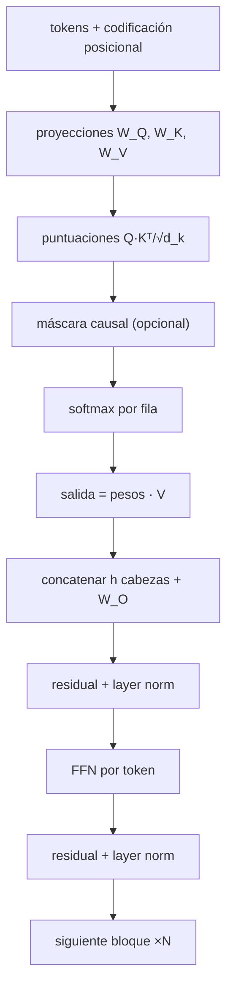

# 055 — Atención y arquitectura Transformer

> [← Clase anterior](../../../classes/part-04-neural-networks-and-deep-learning/054-rnn-lstm-y-secuencias/README.md) · [Índice de la parte](../README.md) · [Clase siguiente →](../../../classes/part-04-neural-networks-and-deep-learning/056-graph-neural-networks/README.md)

**Parte:** 04 — Redes neuronales y deep learning  
**Nivel:** intermedio-avanzado · **Horas estimadas:** 6  
**Laboratorio:** `attention` · **Estado:** `EXECUTABLE_CORE`

## 🎯 Propósito

Comprender **atención y arquitectura transformer** dentro de la evolución de la inteligencia
artificial, implementar un experimento mínimo verificable y distinguir qué parte
constituye evidencia frente a una afirmación todavía no comprobada.

## 📚 Resultados de aprendizaje

Al finalizar podrás:

1. Explicar atención y arquitectura transformer usando los conceptos `self-attention`, `multi-head`, `positional`, `transformer`.
2. Ejecutar el laboratorio con una semilla explícita y revisar su contrato JSON.
3. Identificar al menos un supuesto, una limitación y un riesgo de aplicación.
4. Comparar el enfoque con la etapa anterior de la ruta de aprendizaje.
5. Producir una evidencia reproducible y una conclusión que no exceda los datos.

## 🧩 Conceptos centrales

`self-attention`, `multi-head`, `positional`, `transformer`

## 🗺️ Ubicación en el mapa de la IA

"Attention Is All You Need" (Vaswani et al., 2017) eliminó la recurrencia de la
clase 054: en lugar de comprimir la historia en un estado, cada token consulta
directamente a todos los demás. El Transformer resolvió a la vez las dependencias
largas y la paralelización, y es la arquitectura de BERT, GPT, los LLM actuales, la
visión (ViT) y las proteínas (AlphaFold): probablemente la pieza de ingeniería más
influyente de la IA moderna.

## 📖 Fundamentos

### 🔍 Atención escalada por producto punto

Cada token se proyecta en tres papeles: **query** Q (qué busco), **key** K (qué
ofrezco como índice) y **value** V (qué contenido entrego):

```text
Q = X·W_Q      K = X·W_K      V = X·W_V
Attention(Q, K, V) = softmax(Q·Kᵀ / √d_k) · V
```

Mecanismo paso a paso: (1) Q·Kᵀ mide la afinidad de cada query con cada key
(n×n puntuaciones); (2) se divide por √d_k porque con vectores de dimensión alta los
productos punto crecen con varianza d_k y saturarían el softmax (gradientes ≈ 0);
(3) el softmax por fila convierte afinidades en pesos que suman 1; (4) la salida de
cada token es una media ponderada de los values de *todos* los tokens. Es un
diccionario diferenciable de acceso blando: cualquier par de posiciones se conecta a
distancia 1, sin importar cuán lejos estén en la secuencia.

### 🎭 Multi-head, máscara causal y posición

**Multi-head**: en lugar de una sola atención de dimensión d_model, se ejecutan h
atenciones en paralelo sobre proyecciones de dimensión d_k = d_model/h y se concatenan.
Cada cabeza puede especializarse (sintaxis, correferencia, posición relativa…).

**Máscara causal**: en generación (decoder), la posición i solo puede atender a
posiciones ≤ i; se implementa poniendo −∞ en las puntuaciones futuras antes del
softmax. Esto es lo que permite entrenar la predicción del siguiente token en
paralelo sobre toda la secuencia.

**Codificación posicional**: la atención es invariante al orden (una permutación de
los tokens permuta la salida), así que hay que inyectar posición. El paper original
usa senos y cosenos de frecuencias geométricas:

```text
PE(pos, 2i)   = sin(pos / 10000^(2i/d_model))
PE(pos, 2i+1) = cos(pos / 10000^(2i/d_model))
```

Variantes modernas: embeddings de posición aprendidos, o posiciones relativas/rotatorias.

### 🧱 El bloque Transformer

```text
x ← x + MultiHeadAttention(LayerNorm(x))      (atención + residual)
x ← x + FFN(LayerNorm(x))                     (MLP por token + residual)
```

Cada bloque combina: atención (mezcla información *entre* tokens), una FFN de dos
capas aplicada a cada token por separado (procesa la información mezclada), conexiones
residuales (clase 053) y layer norm (clase 051). El coste de la atención es **O(n²·d)**
en la longitud n de la secuencia — la razón de toda la investigación en contextos largos.

## 🧮 Ejemplo trabajado

Atención QKV con 2 tokens y d_k = 2. Supón que las proyecciones ya dieron:

```text
Q = | 1 0 |     K = | 1 0 |     V = | 1 2 |
    | 0 1 |         | 0 1 |         | 3 4 |
```

**Paso 1 — puntuaciones** Q·Kᵀ/√2:

```text
Q·Kᵀ = | 1 0 |   → escaladas: | 0.7071 0      |
       | 0 1 |                | 0      0.7071 |
```

**Paso 2 — softmax por fila** (fila 1: e^0.7071 = 2.0281, e^0 = 1):

```text
A = | 0.6698 0.3302 |
    | 0.3302 0.6698 |
```

**Paso 3 — salida** A·V:

```text
fila 1: 0.6698·(1,2) + 0.3302·(3,4) = (1.6604, 2.6604)
fila 2: 0.3302·(1,2) + 0.6698·(3,4) = (2.3396, 3.3396)
```

Cada token termina siendo una mezcla de todos los values, dominada por el value del
token con key más afín a su query. Con máscara causal, la fila 1 solo vería el token 1:
su salida sería exactamente (1, 2).

## 📊 Propiedades y comparación

| Aspecto | RNN/LSTM | CNN 1D | Transformer |
|---|---|---|---|
| Camino máx. entre posiciones | O(n) | O(n/K) por capa | O(1) |
| Paralelización en secuencia | no | sí | sí |
| Coste por capa | O(n·d²) | O(n·K·d²) | O(n²·d + n·d²) |
| Sesgo inductivo | orden temporal | localidad | ninguno (posición inyectada) |
| Contexto práctico | corto-medio | local | largo (limitado por n²) |



## ⚠️ Errores conceptuales frecuentes

1. **"La atención tiene en cuenta el orden de los tokens."** Es permutation-invariant;
   sin codificación posicional, "perro muerde hombre" y "hombre muerde perro" serían
   indistinguibles.
2. **"√d_k es un detalle numérico menor."** Sin el escalado, con d_k grande el softmax
   satura y los gradientes se anulan: el entrenamiento se degrada de forma medible.
3. **"Cada cabeza de atención tiene un rol interpretable asignado."** Los roles
   emergen (o no) del entrenamiento; la interpretación por cabezas es un área de
   investigación, no una garantía de diseño.
4. **"El Transformer procesa los tokens de uno en uno al entrenar."** Entrena en
   paralelo sobre toda la secuencia gracias a la máscara causal; es en *inferencia*
   generativa donde produce token a token.
5. **"La FFN del bloque mezcla información entre tokens."** La FFN se aplica a cada
   posición por separado; la única mezcla entre posiciones ocurre en la atención.

## 🚀 Del aprendizaje a la operación

De esta mecánica a un LLM en producción median: tokenización BPE, preentrenamiento
masivo (clase 059 y parte 05), KV-cache para no recomputar keys/values en generación,
atención eficiente (FlashAttention), cuantización para servir con menos memoria, y
alineamiento posterior. La matemática de esta clase —softmax(QKᵀ/√d)V— es literalmente
la que se ejecuta miles de millones de veces por respuesta en un modelo comercial.

## 🧪 Laboratorio

```bash
python lab.py
```

El laboratorio llama a `ai_evolution.labs.run_lab("attention")`. Esta
decisión evita 180 implementaciones divergentes: cada clase tiene un entrypoint
propio, pero los motores didácticos se prueban como una biblioteca común.

### 🔍 Evidencia esperada

- tipo de laboratorio y semilla;
- entradas o decisiones observables;
- resultado estructurado;
- lista `evidence` con hechos que pueden inspeccionarse;
- lista `limitations` que impide presentar la demo como producción.

## 📓 Notebooks

- [📓 `notebook.ipynb`](notebook.ipynb): recorrido guiado con la materia resumida.
- [✍️ `notebook_student.ipynb`](notebook_student.ipynb): ejercicios para resolver.
- [✅ `notebook_solution.ipynb`](notebook_solution.ipynb): solución de referencia explicada.

## 📝 Evaluación

| Criterio | Peso |
|---|---:|
| Comprensión conceptual | 25 % |
| Ejecución reproducible | 25 % |
| Interpretación basada en evidencia | 25 % |
| Riesgos, límites y mejora propuesta | 25 % |

Consulta [assessment.md](assessment.md) para preguntas y criterio de aceptación.

## ⚠️ Errores comunes

| Síntoma | Causa probable | Corrección |
|---|---|---|
| El código corre, pero no hay conclusión | Se confundió ejecución con aprendizaje | Explica qué demuestra y qué no demuestra |
| El resultado cambia sin explicación | No se registró semilla o configuración | Conserva semilla, versión y parámetros |
| Se promete uso real | Se extrapoló desde una demo educativa | Declara entorno, datos, límites y revisión humana |
| Se copia una métrica aislada | No existe baseline ni costo de error | Añade comparación y criterio de decisión |

## ❓ Preguntas frecuentes

**¿Debo usar una API comercial?**  
No. El núcleo funciona localmente. Las extensiones LIVE se documentan por separado.

**¿El laboratorio representa una implementación industrial?**  
No por sí solo. Enseña el contrato y el patrón; producción exige integración,
seguridad, observabilidad, pruebas y operación.

**¿Dónde profundizo?**  
Revisa las especializaciones enlazadas en el README raíz y la ruta siguiente.

## 🔗 Referencias

- Vaswani, A. et al. (2017). *Attention Is All You Need*. [arXiv:1706.03762](https://arxiv.org/abs/1706.03762)
- Bahdanau, D., Cho, K. y Bengio, Y. (2014). *Neural Machine Translation by Jointly Learning to Align and Translate*. [arXiv:1409.0473](https://arxiv.org/abs/1409.0473)
- Devlin, J. et al. (2018). *BERT: Pre-training of Deep Bidirectional Transformers*. [arXiv:1810.04805](https://arxiv.org/abs/1810.04805)
- Rush, A. et al. *The Annotated Transformer* (implementación comentada línea a línea). [nlp.seas.harvard.edu/annotated-transformer](https://nlp.seas.harvard.edu/annotated-transformer/)
- Jurafsky, D. y Martin, J. *Speech and Language Processing* (3.ª ed., borrador), cap. sobre Transformers. [web.stanford.edu/~jurafsky/slp3](https://web.stanford.edu/~jurafsky/slp3/)

---

## ⬅️ Clase anterior

[054 — RNN, LSTM y secuencias](../../part-04-neural-networks-and-deep-learning/054-rnn-lstm-y-secuencias/README.md)

## ➡️ Siguiente clase

[056 — Graph Neural Networks](../../part-04-neural-networks-and-deep-learning/056-graph-neural-networks/README.md)
