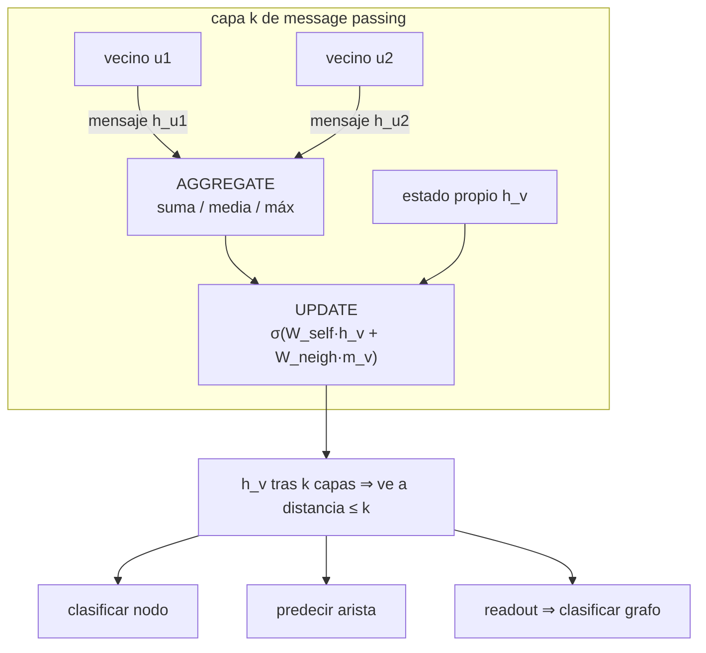

# 056 — Graph Neural Networks

> [← Clase anterior](../../../classes/part-04-neural-networks-and-deep-learning/055-atencion-y-arquitectura-transformer/README.md) · [Índice de la parte](../README.md) · [Clase siguiente →](../../../classes/part-04-neural-networks-and-deep-learning/057-aprendizaje-por-refuerzo-profundo/README.md)

**Parte:** 04 — Redes neuronales y deep learning  
**Nivel:** intermedio-avanzado · **Horas estimadas:** 6  
**Laboratorio:** `neural` · **Estado:** `EXECUTABLE_CORE`

## 🎯 Propósito

Comprender **graph neural networks** dentro de la evolución de la inteligencia
artificial, implementar un experimento mínimo verificable y distinguir qué parte
constituye evidencia frente a una afirmación todavía no comprobada.

## 📚 Resultados de aprendizaje

Al finalizar podrás:

1. Explicar graph neural networks usando los conceptos `grafos`, `mensajes`, `GCN`, `GAT`.
2. Ejecutar el laboratorio con una semilla explícita y revisar su contrato JSON.
3. Identificar al menos un supuesto, una limitación y un riesgo de aplicación.
4. Comparar el enfoque con la etapa anterior de la ruta de aprendizaje.
5. Producir una evidencia reproducible y una conclusión que no exceda los datos.

## 🧩 Conceptos centrales

`grafos`, `mensajes`, `GCN`, `GAT`

## 🗺️ Ubicación en el mapa de la IA

CNN y RNN explotan mallas regulares (píxeles, pasos de tiempo); las GNN generalizan
el deep learning a **grafos arbitrarios**: moléculas, redes sociales, sistemas de
recomendación, mapas de tráfico, grafos de conocimiento. Su primitiva, el paso de
mensajes entre vecinos, conecta el conexionismo con la representación relacional de
la parte simbólica del curso, y la atención sobre vecinos (GAT) tiende el puente con
la clase 055 — de hecho, un Transformer es una GNN sobre el grafo completo.

## 📖 Fundamentos

### 🕸️ Datos como grafos

Un grafo G = (V, E) tiene nodos con features (X ∈ ℝ^{|V|×d}) y aristas (adyacencia A,
opcionalmente con atributos). A diferencia de una imagen, no hay orden canónico de
nodos: cualquier arquitectura debe ser **invariante a permutaciones** (renumerar los
nodos no puede cambiar el resultado). Tareas típicas: clasificación de nodos
(¿fraude?), predicción de aristas (¿recomendar este producto?), clasificación de
grafos completos (¿molécula tóxica?).

### 📬 Paso de mensajes (message passing)

Una capa GNN actualiza cada nodo combinando su estado con un agregado de sus vecinos
(Gilmer et al., 2017):

```text
m_v = AGGREGATE({ h_u : u ∈ N(v) })       # suma, media o máximo — invariante a orden
h_v' = UPDATE(h_v, m_v)                    # p. ej. σ(W_self·h_v + W_neigh·m_v)
```

Tras k capas, cada nodo ha incorporado información de su vecindario a distancia ≤ k
— el análogo del campo receptivo de las CNN. La agregación debe ser invariante a
permutaciones (suma/media/máximo), por eso no se usa concatenación ordenada.

### 🧮 GCN: la convolución sobre grafos

La **Graph Convolutional Network** (Kipf y Welling, 2016) es el caso particular más
usado. Con  = A + I (añadir self-loops) y D̂ su matriz de grados:

```text
H' = σ( D̂^(−1/2) · Â · D̂^(−1/2) · H · W )
```

En palabras: cada nodo toma la **media normalizada** de las features propias y de sus
vecinos (la normalización simétrica por √grado evita que los nodos muy conectados
dominen), la proyecta con una matriz W compartida por todos los nodos y aplica una no
linealidad. Es la compartición de pesos de la CNN llevada a vecindarios irregulares.

**GAT** (Veličković et al., 2017) sustituye la media fija por pesos de atención
aprendidos entre vecinos: α_{vu} = softmax de una puntuación calculada con (h_v, h_u).
Cada nodo decide cuánto escuchar a cada vecino — atención de la clase 055 restringida
al grafo.

### 🫠 Over-smoothing y profundidad

Apilar muchas capas GNN promedia repetidamente sobre vecindarios: las representaciones
de todos los nodos convergen y se vuelven indistinguibles (**over-smoothing**). Por
eso las GNN prácticas suelen tener 2-4 capas — o usan residuales, saltos (jumping
knowledge) y normalización para ir más allá. Contrasta con CNN de 100 capas: la
estructura del grafo mezcla mucho más rápido que una malla.

## 🧮 Ejemplo trabajado

Grafo línea 1—2—3 con features escalares h = (1, 2, 3), agregación = media con
self-loop, sin pesos ni activación (W = identidad):

```text
Capa 1:
  h₁' = media(h₁, h₂)      = media(1, 2)    = 1.5
  h₂' = media(h₁, h₂, h₃)  = media(1, 2, 3) = 2.0
  h₃' = media(h₂, h₃)      = media(2, 3)    = 2.5

Capa 2 (sobre 1.5, 2.0, 2.5):
  h₁'' = media(1.5, 2.0)      = 1.75
  h₂'' = media(1.5, 2.0, 2.5) = 2.0
  h₃'' = media(2.0, 2.5)      = 2.25
```

Dos observaciones medibles: (1) tras la capa 1, el nodo 1 ya "sabe" del nodo 2 pero no
del 3; tras la capa 2, la información del nodo 3 llegó al 1 (a través del 2): k capas
= vecindario a distancia k. (2) El rango de valores se contrajo de [1, 3] a
[1.75, 2.25]: el over-smoothing en acción — cada capa de promediado acerca todos los
nodos entre sí.

## 📊 Propiedades y comparación

| Aspecto | CNN | GCN | GAT | Transformer |
|---|---|---|---|---|
| Estructura | malla regular | grafo dado | grafo dado | grafo completo implícito |
| Pesos por vecino | según posición relativa | iguales (normalizados por grado) | atención aprendida | atención aprendida |
| Invarianza | traslación | permutación de nodos | permutación de nodos | permutación (sin PE) |
| Alcance por capa | kernel K×K | vecinos a 1 salto | vecinos a 1 salto | todos los tokens |
| Riesgo al profundizar | degradación (→ResNet) | over-smoothing | over-smoothing | coste O(n²) |



## ⚠️ Errores conceptuales frecuentes

1. **"Puedo alimentar la matriz de adyacencia a un MLP."** Un MLP sobre A depende de
   la numeración de los nodos: renumerar cambia la predicción. La invarianza a
   permutaciones es el requisito que define a las GNN.
2. **"Más capas GNN = mejor, como en visión."** El over-smoothing degrada rápido;
   2-4 capas es lo habitual y profundizar exige técnicas específicas.
3. **"La GCN aprende un peso distinto para cada vecino."** La GCN pondera por
   normalización de grado (fija); pesos por vecino aprendidos es exactamente lo que
   añade GAT.
4. **"El paso de mensajes puede distinguir cualquier par de grafos."** Su poder está
   acotado por el test de Weisfeiler-Leman: hay grafos distintos que las GNN de
   mensajes estándar no separan.
5. **"Un Transformer y una GNN son cosas no relacionadas."** La auto-atención es paso
   de mensajes sobre el grafo completo con pesos de atención: GAT sin restricción de
   aristas.

## 🚀 Del aprendizaje a la operación

En producción (recomendadores, detección de fraude, química) los grafos tienen
millones de nodos: hace falta muestreo de vecindarios (GraphSAGE) o entrenamiento por
mini-lotes de subgrafos, features heterogéneas por tipo de nodo/arista, y cuidado
extremo con la fuga de información entre train/test cuando las aristas mismas son la
señal. Librerías como PyTorch Geometric empaquetan estas capas y su muestreo.

## 🧪 Laboratorio

```bash
python lab.py
```

El laboratorio llama a `ai_evolution.labs.run_lab("neural")`. Esta
decisión evita 183 implementaciones divergentes: cada clase tiene un entrypoint
propio, pero los motores didácticos se prueban como una biblioteca común.

### 🔍 Evidencia esperada

- tipo de laboratorio y semilla;
- entradas o decisiones observables;
- resultado estructurado;
- lista `evidence` con hechos que pueden inspeccionarse;
- lista `limitations` que impide presentar la demo como producción.

## 📓 Notebooks

- [📓 `notebook.ipynb`](notebook.ipynb): recorrido guiado con la materia resumida.
- [✍️ `notebook_student.ipynb`](notebook_student.ipynb): ejercicios para resolver.
- [✅ `notebook_solution.ipynb`](notebook_solution.ipynb): solución de referencia explicada.

## 📝 Evaluación

| Criterio | Peso |
|---|---:|
| Comprensión conceptual | 25 % |
| Ejecución reproducible | 25 % |
| Interpretación basada en evidencia | 25 % |
| Riesgos, límites y mejora propuesta | 25 % |

Consulta [assessment.md](assessment.md) para preguntas y criterio de aceptación.

## ⚠️ Errores comunes

| Síntoma | Causa probable | Corrección |
|---|---|---|
| El código corre, pero no hay conclusión | Se confundió ejecución con aprendizaje | Explica qué demuestra y qué no demuestra |
| El resultado cambia sin explicación | No se registró semilla o configuración | Conserva semilla, versión y parámetros |
| Se promete uso real | Se extrapoló desde una demo educativa | Declara entorno, datos, límites y revisión humana |
| Se copia una métrica aislada | No existe baseline ni costo de error | Añade comparación y criterio de decisión |

## ❓ Preguntas frecuentes

**¿Debo usar una API comercial?**  
No. El núcleo funciona localmente. Las extensiones LIVE se documentan por separado.

**¿El laboratorio representa una implementación industrial?**  
No por sí solo. Enseña el contrato y el patrón; producción exige integración,
seguridad, observabilidad, pruebas y operación.

**¿Dónde profundizo?**  
Revisa las especializaciones enlazadas en el README raíz y la ruta siguiente.

## 🔗 Referencias

- Kipf, T. y Welling, M. (2016). *Semi-Supervised Classification with Graph Convolutional Networks*. [arXiv:1609.02907](https://arxiv.org/abs/1609.02907)
- Veličković, P. et al. (2017). *Graph Attention Networks*. [arXiv:1710.10903](https://arxiv.org/abs/1710.10903)
- Gilmer, J. et al. (2017). *Neural Message Passing for Quantum Chemistry*. [arXiv:1704.01212](https://arxiv.org/abs/1704.01212)
- Sánchez-Lengeling, B. et al. (2021). *A Gentle Introduction to Graph Neural Networks*. Distill. [distill.pub/2021/gnn-intro](https://distill.pub/2021/gnn-intro/)
- Documentación de PyTorch Geometric. [pytorch-geometric.readthedocs.io](https://pytorch-geometric.readthedocs.io/)

<!-- papers:inicio -->

---

## 📜 Papers que fundamentan esta clase

> Bloque generado por `python scripts/link_papers_to_classes.py`. La fuente es [`papers/catalog/papers.json`](../../../papers/catalog/papers.json).

| Paper | Año | Qué desbloqueó | Miniatura |
|---|---:|---|---|
| [P120 · Clasificación semisupervisada con redes convolucionales de grafo](../../../papers/foundational/P120_gcn/README.md) | 2017 | Reduce la convolución sobre grafos a una regla de propagación de una línea, y con ella clasifica con una fracción mínima de nodos etiquetados. | [notebook](../../../notebooks/papers/P120_gcn.ipynb) |
| [P124 · Redes de atención sobre grafos](../../../papers/foundational/P124_gat/README.md) | 2018 | Sustituye el promedio uniforme sobre los vecinos por pesos aprendidos por pareja, sin necesitar conocer la estructura global del grafo. | [notebook](../../../notebooks/papers/P124_gat.ipynb) |

Cada ficha explica el problema anterior, la matemática mínima, los límites y los errores de atribución más frecuentes. Para leerlas con método: [cómo leer un paper de IA](../../../papers/guides/COMO_LEER_UN_PAPER_DE_IA.md) · [anexos matemáticos](../../../papers/annexes/README.md).
<!-- papers:fin -->
---

## ⬅️ Clase anterior

[055 — Atención y arquitectura Transformer](../../part-04-neural-networks-and-deep-learning/055-atencion-y-arquitectura-transformer/README.md)

## ➡️ Siguiente clase

[057 — Aprendizaje por refuerzo profundo](../../part-04-neural-networks-and-deep-learning/057-aprendizaje-por-refuerzo-profundo/README.md)
