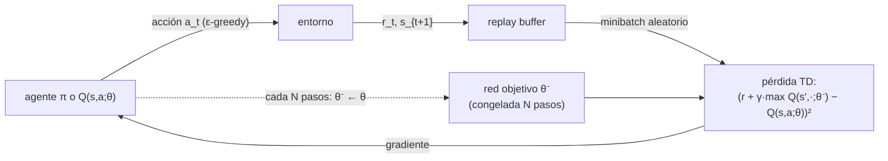

# 057 — Aprendizaje por refuerzo profundo

> [← Clase anterior](../../../classes/part-04-neural-networks-and-deep-learning/056-graph-neural-networks/README.md) · [Índice de la parte](../README.md) · [Clase siguiente →](../../../classes/part-04-neural-networks-and-deep-learning/058-autoencoders-gan-y-difusion/README.md)

**Parte:** 04 — Redes neuronales y deep learning  
**Nivel:** intermedio-avanzado · **Horas estimadas:** 6  
**Laboratorio:** `robotics` · **Estado:** `EXECUTABLE_CORE`

## 🎯 Propósito

Comprender **aprendizaje por refuerzo profundo** dentro de la evolución de la inteligencia
artificial, implementar un experimento mínimo verificable y distinguir qué parte
constituye evidencia frente a una afirmación todavía no comprobada.

## 📚 Resultados de aprendizaje

Al finalizar podrás:

1. Explicar aprendizaje por refuerzo profundo usando los conceptos `DQN`, `policy gradient`, `PPO`, `recompensa`.
2. Ejecutar el laboratorio con una semilla explícita y revisar su contrato JSON.
3. Identificar al menos un supuesto, una limitación y un riesgo de aplicación.
4. Comparar el enfoque con la etapa anterior de la ruta de aprendizaje.
5. Producir una evidencia reproducible y una conclusión que no exceda los datos.

## 🧩 Conceptos centrales

`DQN`, `policy gradient`, `PPO`, `recompensa`

## 🗺️ Ubicación en el mapa de la IA

El aprendizaje por refuerzo formaliza la decisión secuencial (agente, entorno,
recompensa) que el curso trató de forma tabular en la parte 02. El RL *profundo*
sustituye las tablas por redes neuronales como aproximadores: DQN (Mnih et al., 2015)
jugó Atari desde píxeles, y los policy gradients (PPO) están detrás de la robótica
moderna y del RLHF con que se alinean los LLM. Es el punto donde percepción (CNN) y
decisión (MDP) se encuentran.

## 📖 Fundamentos

### 🎰 El problema: MDP y retorno

Un proceso de decisión de Markov (S, A, P, R, γ) define: estados, acciones, dinámica
P(s'|s,a), recompensa r y descuento γ ∈ [0,1). El agente busca una política π(a|s)
que maximice el retorno esperado G_t = Σ_k γᵏ·r_{t+k}. Dos familias de solución:
aprender **valores** (y derivar la política) o aprender la **política** directamente.

### 🎯 Q-learning y DQN

El valor de acción Q(s,a) = retorno esperado tomando a en s y siguiendo la política
óptima después. Q-learning aprende *off-policy* con la actualización:

```text
Q(s,a) ← Q(s,a) + α·[ r + γ·max_{a'} Q(s',a') − Q(s,a) ]
                        └──────── objetivo (TD target) ────────┘
```

Con estados continuos o imágenes, la tabla es inviable: **DQN** aproxima Q(s,a;θ) con
una red (una CNN si la entrada son píxeles) y minimiza el error TD. Aproximar +
bootstrapping + correlación temporal de los datos es una mezcla inestable ("tríada
mortal"); DQN la domó con dos trucos que hoy son estándar:

- **Replay buffer**: guardar transiciones (s, a, r, s') y muestrear minibatches
  aleatorios — rompe la correlación temporal y reutiliza experiencia.
- **Red objetivo (target network)**: calcular el TD target con una copia congelada
  θ⁻ que se sincroniza cada N pasos — evita perseguir un objetivo que se mueve con
  cada actualización.

La exploración se maneja con ε-greedy: con probabilidad ε, acción aleatoria; el resto,
argmax Q.

### 🧭 Policy gradients y actor-critic

En lugar de valores, parametrizar la política π_θ(a|s) y subir por el gradiente del
retorno esperado (REINFORCE, Williams 1992):

```text
∇J(θ) = E[ Σ_t ∇log π_θ(a_t|s_t) · G_t ]
```

Intuición: aumentar la probabilidad de las acciones que precedieron a retornos altos.
El estimador es de alta varianza; restar una **baseline** (el valor V(s), aprendido
por un *crítico*) la reduce sin sesgar: A(s,a) = G − V(s) es la **ventaja** y el
esquema actor-critic la usa como señal. **PPO** (Schulman et al., 2017) añade un
recorte (clip) del ratio π_nueva/π_vieja para impedir pasos de política destructivos,
logrando estabilidad con simplicidad — por eso es el caballo de batalla actual
(robótica, juegos, RLHF).

### ⚖️ Valores vs. política

Q-learning explota mejor los datos (off-policy, replay) pero exige acciones discretas
y puede sobreestimar valores (de ahí Double DQN). Policy gradients trabajan con
acciones continuas y políticas estocásticas, pero son on-policy (datos frescos por
actualización) y de mayor varianza.

## 🧮 Ejemplo trabajado

**Una actualización de Q-learning a mano**: α = 0.1, γ = 0.9. Estado s con
Q(s, derecha) = 0.5. El agente toma "derecha", recibe r = 1 y llega a s' donde
max Q(s', ·) = 0.8:

```text
objetivo = r + γ·max Q(s',·) = 1 + 0.9·0.8 = 1.72
error TD = 1.72 − 0.5 = 1.22
Q(s, derecha) ← 0.5 + 0.1·1.22 = 0.622
```

**Y una de REINFORCE**: política softmax sobre 2 acciones con preferencias
(θ_izq, θ_der) = (0, 0) → π = (0.5, 0.5). El agente toma "der", obtiene retorno
G = +2. Con ∇log π(der) = (−π_izq, 1−π_der) = (−0.5, 0.5) y α = 0.1:

```text
θ ← θ + 0.1·2·(−0.5, 0.5) = (−0.1, +0.1)   →   π ≈ (0.45, 0.55)
```

La acción reforzada gana probabilidad; con retorno negativo la habría perdido.

## 📊 Propiedades y comparación

| Aspecto | Q-learning tabular | DQN | REINFORCE | PPO (actor-critic) |
|---|---|---|---|---|
| Espacio de estados | pequeño y discreto | continuo/imágenes | continuo | continuo |
| Acciones | discretas | discretas | discretas o continuas | discretas o continuas |
| Datos | off-policy | off-policy + replay | on-policy | on-policy (con reuso limitado) |
| Varianza | baja | media | alta | media (ventaja + clip) |
| Riesgo típico | — | sobreestimación, inestabilidad | varianza, colapso | ajuste fino de hiperparámetros |



## ⚠️ Errores conceptuales frecuentes

1. **"La recompensa define lo que yo quiero; el agente lo entenderá."** El agente
   optimiza *literalmente* la recompensa: funciones mal especificadas producen
   trampas (reward hacking) perfectamente racionales.
2. **"Más entrenamiento = curva de recompensa monótona."** El RL profundo es
   inestable por naturaleza; caídas bruscas tras mejorar son comunes y esperables.
3. **"El replay buffer es solo un caché de eficiencia."** Es una condición de
   estabilidad: sin romper la correlación temporal, DQN diverge con facilidad.
4. **"REINFORCE con pocas trayectorias basta si el entorno es simple."** El estimador
   del gradiente tiene varianza enorme; sin baseline ni suficientes muestras, el
   entrenamiento es ruido.
5. **"Una política que funciona en el simulador funcionará en el mundo real."** La
   brecha sim-to-real (dinámica, ruido, latencias) degrada políticas aparentemente
   sólidas; requiere aleatorización de dominio y validación física.

## 🚀 Del aprendizaje a la operación

Del gridworld al mundo real median: diseño y auditoría de la función de recompensa,
simuladores fieles (o datos offline con RL conservador), evaluación con múltiples
semillas (la varianza entre corridas es notoria), límites de seguridad duros fuera
de la política aprendida, y monitoreo continuo — una política desplegada sigue
explorando implícitamente cuando la distribución del entorno cambia.

## 🧪 Laboratorio

```bash
python lab.py
```

El laboratorio llama a `ai_evolution.labs.run_lab("robotics")`. Esta
decisión evita 183 implementaciones divergentes: cada clase tiene un entrypoint
propio, pero los motores didácticos se prueban como una biblioteca común.

### 🔍 Evidencia esperada

- tipo de laboratorio y semilla;
- entradas o decisiones observables;
- resultado estructurado;
- lista `evidence` con hechos que pueden inspeccionarse;
- lista `limitations` que impide presentar la demo como producción.

## 📓 Notebooks

- [📓 `notebook.ipynb`](notebook.ipynb): recorrido guiado con la materia resumida.
- [✍️ `notebook_student.ipynb`](notebook_student.ipynb): ejercicios para resolver.
- [✅ `notebook_solution.ipynb`](notebook_solution.ipynb): solución de referencia explicada.

## 📝 Evaluación

| Criterio | Peso |
|---|---:|
| Comprensión conceptual | 25 % |
| Ejecución reproducible | 25 % |
| Interpretación basada en evidencia | 25 % |
| Riesgos, límites y mejora propuesta | 25 % |

Consulta [assessment.md](assessment.md) para preguntas y criterio de aceptación.

## ⚠️ Errores comunes

| Síntoma | Causa probable | Corrección |
|---|---|---|
| El código corre, pero no hay conclusión | Se confundió ejecución con aprendizaje | Explica qué demuestra y qué no demuestra |
| El resultado cambia sin explicación | No se registró semilla o configuración | Conserva semilla, versión y parámetros |
| Se promete uso real | Se extrapoló desde una demo educativa | Declara entorno, datos, límites y revisión humana |
| Se copia una métrica aislada | No existe baseline ni costo de error | Añade comparación y criterio de decisión |

## ❓ Preguntas frecuentes

**¿Debo usar una API comercial?**  
No. El núcleo funciona localmente. Las extensiones LIVE se documentan por separado.

**¿El laboratorio representa una implementación industrial?**  
No por sí solo. Enseña el contrato y el patrón; producción exige integración,
seguridad, observabilidad, pruebas y operación.

**¿Dónde profundizo?**  
Revisa las especializaciones enlazadas en el README raíz y la ruta siguiente.

## 🔗 Referencias

- Sutton, R. y Barto, A. (2018). *Reinforcement Learning: An Introduction* (2.ª ed., PDF oficial gratuito). [incompleteideas.net/book/the-book-2nd.html](http://incompleteideas.net/book/the-book-2nd.html)
- Mnih, V. et al. (2015). *Human-level control through deep reinforcement learning* (DQN). Nature 518. [doi:10.1038/nature14236](https://doi.org/10.1038/nature14236)
- Mnih, V. et al. (2013). *Playing Atari with Deep Reinforcement Learning*. [arXiv:1312.5602](https://arxiv.org/abs/1312.5602)
- Schulman, J. et al. (2017). *Proximal Policy Optimization Algorithms*. [arXiv:1707.06347](https://arxiv.org/abs/1707.06347)
- Williams, R. (1992). *Simple statistical gradient-following algorithms for connectionist reinforcement learning* (REINFORCE). [doi:10.1007/BF00992696](https://doi.org/10.1007/BF00992696)
- Documentación de Gymnasium (entornos estándar de RL). [gymnasium.farama.org](https://gymnasium.farama.org/)

<!-- papers:inicio -->

---

## 📜 Papers que fundamentan esta clase

> Bloque generado por `python scripts/link_papers_to_classes.py`. La fuente es [`papers/catalog/papers.json`](../../../papers/catalog/papers.json).

| Paper | Año | Qué desbloqueó | Miniatura |
|---|---:|---|---|
| [P26 · Control a nivel humano mediante aprendizaje por refuerzo profundo](../../../papers/foundational/P26_dqn/README.md) | 2015 | El primer agente que aprende a actuar directamente desde píxeles, con la misma arquitectura y los mismos hiperparámetros en decenas de juegos. | [notebook](../../../notebooks/papers/P26_dqn.ipynb) |
| [P27 · Dominar el go con redes neuronales profundas y búsqueda en árbol](../../../papers/foundational/P27_alphago/README.md) | 2016 | Une las dos tradiciones de la IA: la búsqueda simbólica de la parte 01 y el aprendizaje profundo de la parte 04, en un solo sistema. | [notebook](../../../notebooks/papers/P27_alphago.ipynb) |

Cada ficha explica el problema anterior, la matemática mínima, los límites y los errores de atribución más frecuentes. Para leerlas con método: [cómo leer un paper de IA](../../../papers/guides/COMO_LEER_UN_PAPER_DE_IA.md) · [anexos matemáticos](../../../papers/annexes/README.md).
<!-- papers:fin -->
---

## ⬅️ Clase anterior

[056 — Graph Neural Networks](../../part-04-neural-networks-and-deep-learning/056-graph-neural-networks/README.md)

## ➡️ Siguiente clase

[058 — Autoencoders, GAN y difusión](../../part-04-neural-networks-and-deep-learning/058-autoencoders-gan-y-difusion/README.md)
