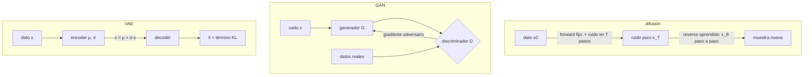

# 058 — Autoencoders, GAN y difusión

> [← Clase anterior](../../../classes/part-04-neural-networks-and-deep-learning/057-aprendizaje-por-refuerzo-profundo/README.md) · [Índice de la parte](../README.md) · [Clase siguiente →](../../../classes/part-04-neural-networks-and-deep-learning/059-transferencia-fine-tuning-y-destilacion/README.md)

**Parte:** 04 — Redes neuronales y deep learning  
**Nivel:** intermedio-avanzado · **Horas estimadas:** 6  
**Laboratorio:** `generation` · **Estado:** `EXECUTABLE_CORE`

## 🎯 Propósito

Comprender **autoencoders, gan y difusión** dentro de la evolución de la inteligencia
artificial, implementar un experimento mínimo verificable y distinguir qué parte
constituye evidencia frente a una afirmación todavía no comprobada.

## 📚 Resultados de aprendizaje

Al finalizar podrás:

1. Explicar autoencoders, gan y difusión usando los conceptos `autoencoder`, `GAN`, `difusión`, `latente`.
2. Ejecutar el laboratorio con una semilla explícita y revisar su contrato JSON.
3. Identificar al menos un supuesto, una limitación y un riesgo de aplicación.
4. Comparar el enfoque con la etapa anterior de la ruta de aprendizaje.
5. Producir una evidencia reproducible y una conclusión que no exceda los datos.

## 🧩 Conceptos centrales

`autoencoder`, `GAN`, `difusión`, `latente`

## 🗺️ Ubicación en el mapa de la IA

Hasta aquí las redes *discriminaban* (clasificar, predecir); los modelos generativos
aprenden la **distribución** de los datos para producir muestras nuevas. Tres familias
marcan la evolución: autoencoders y VAE (2013, espacios latentes probabilísticos),
GAN (2014, el juego adversario que dominó la síntesis de imágenes una década) y
difusión (2020, el estado del arte detrás de Stable Diffusion, DALL·E y la generación
de audio y video actual). Sus espacios latentes conectan con los embeddings de la
parte 05.

## 📖 Fundamentos

### 🗜️ Autoencoders y VAE

Un **autoencoder** comprime y reconstruye: encoder z = f(x) con dim(z) ≪ dim(x),
decoder x̂ = g(z), pérdida ‖x − x̂‖². El cuello de botella obliga a aprender la
estructura esencial de los datos (un autoencoder lineal recupera el subespacio de
PCA). Usos: reducción de dimensión, denoising, detección de anomalías (error de
reconstrucción alto = dato atípico). Pero su espacio latente no es muestreable: puntos
intermedios pueden decodificar basura.

El **autoencoder variacional** (VAE; Kingma y Welling, 2013) lo arregla haciendo el
latente probabilístico: el encoder produce μ(x) y σ(x), se muestrea
z = μ + σ·ε con ε ~ N(0,1) (el **truco de reparametrización**, que deja pasar el
gradiente a través del muestreo) y se optimiza el ELBO:

```text
L = E[log p(x|z)]  −  KL( q(z|x) ‖ N(0, I) )
    reconstrucción     regularización del latente
```

El término KL empaqueta el latente alrededor de una normal estándar: muestrear
z ~ N(0,I) y decodificar produce datos nuevos coherentes.

### ⚔️ GAN: el juego adversario

Una **GAN** (Goodfellow et al., 2014) enfrenta dos redes: el generador G transforma
ruido z en muestras; el discriminador D intenta distinguir muestras reales de
generadas:

```text
min_G max_D  E_x[log D(x)] + E_z[log(1 − D(G(z)))]
```

En el equilibrio teórico, la distribución de G iguala a la de los datos y D no puede
hacer mejor que 50 %. En la práctica el entrenamiento es delicado: **mode collapse**
(G produce poca variedad), oscilaciones y gradientes que se desvanecen si D domina.
Las GAN producen muestras nítidas y rápidas (una pasada), pero sin verosimilitud
explícita ni cobertura garantizada de la distribución.

### 🌫️ Modelos de difusión

La difusión (DDPM; Ho et al., 2020) genera invirtiendo un proceso de ruido. **Forward**
(fijo, sin aprendizaje): se añade ruido gaussiano en T pasos hasta destruir la señal;
en forma cerrada, con ᾱ_t el producto acumulado de (1−β):

```text
x_t = √ᾱ_t · x₀ + √(1−ᾱ_t) · ε,      ε ~ N(0, I)
```

**Reverse** (aprendido): una red ε_θ(x_t, t) predice el ruido añadido; la pérdida es
simplemente ‖ε − ε_θ(x_t, t)‖². Generar = partir de ruido puro x_T y denoisear paso a
paso. Entrenamiento estable (es regresión, no un juego), cobertura excelente de la
distribución y calidad estado del arte; el precio es la generación iterativa (decenas
o cientos de pasadas de red frente a una de la GAN). Los modelos texto-imagen añaden
condicionamiento (el prompt guía cada paso de denoising) y suelen difundir en el
latente de un autoencoder (latent diffusion) para abaratar.

## 🧮 Ejemplo trabajado

**Autoencoder lineal 2→1→2 a mano.** Encoder z = w·x con w = (0.6, 0.8) (norma 1);
decoder x̂ = z·w.

```text
x = (3, 4):   z = 0.6·3 + 0.8·4 = 5.0   →  x̂ = (3.0, 4.0)   error = 0
x = (4, 3):   z = 2.4 + 2.4 = 4.8       →  x̂ = (2.88, 3.84) error² = 1.12²+0.84² = 1.96
```

El punto alineado con la dirección w se reconstruye perfecto; el resto pierde su
componente ortogonal: comprimir a 1D = proyectar sobre la mejor recta (PCA).

**Forward de difusión a mano.** x₀ = 1.0, ε = 0.2:

```text
ᾱ = 0.9:  x_t = √0.9·1 + √0.1·0.2 = 0.9487 + 0.0632 = 1.0119   (casi señal)
ᾱ = 0.5:  x_t = 0.7071 + 0.1414 = 0.8485                        (mitad y mitad)
ᾱ = 0.1:  x_t = 0.3162 + 0.1897 = 0.5060                        (domina el ruido)
```

La red de denoising ve x_t y t, y debe recuperar ε: en ᾱ alto es fácil, en ᾱ bajo casi
todo es ruido — por eso el schedule de ruido es una decisión de diseño central.

## 📊 Propiedades y comparación

| Aspecto | Autoencoder/VAE | GAN | Difusión |
|---|---|---|---|
| Objetivo | reconstrucción (+KL en VAE) | juego minimax | regresión de ruido |
| Estabilidad de entrenamiento | alta | baja (collapse, oscilación) | alta |
| Calidad de muestra | media (VAE borroso) | alta | la más alta |
| Velocidad de generación | 1 pasada | 1 pasada | T pasadas (iterativa) |
| Cobertura de la distribución | buena | riesgo de mode collapse | muy buena |
| Verosimilitud | cota (ELBO) | no disponible | cota estimable |



## ⚠️ Errores conceptuales frecuentes

1. **"Un autoencoder genera datos nuevos muestreando su latente."** Sin el término KL
   del VAE, el latente tiene huecos: decodificar puntos no vistos produce artefactos.
2. **"La pérdida del generador GAN baja = va mejorando."** Las pérdidas adversarias
   son relativas al oponente; la calidad se evalúa con métricas externas (FID) e
   inspección, no con la curva de pérdida.
3. **"La difusión aprende a añadir ruido."** El forward es fijo y sin parámetros; lo
   aprendido es el *reverse* (predecir el ruido para quitarlo).
4. **"El VAE es borroso porque le falta entrenamiento."** Es estructural: la
   reconstrucción en media bajo un decoder gaussiano promedia detalles; por eso las
   variantes perceptuales y los modelos latentes.
5. **"Mode collapse significa que la GAN no aprende nada."** Aprende — pero concentra
   su masa en pocos modos convincentes; las muestras son buenas y la *diversidad* es
   la que está rota.

## 🚀 Del aprendizaje a la operación

Producción generativa implica: métricas de calidad y diversidad (FID, precision/recall
de distribuciones), control del condicionamiento (prompts, clases), filtros de
seguridad sobre lo generado, trazabilidad de datos de entrenamiento (derechos y
sesgos) y costes de inferencia (la difusión multiplica el cómputo por sus pasos;
la destilación de pasos — clase 059 en espíritu — los reduce a 1-4).

## 🧪 Laboratorio

```bash
python lab.py
```

El laboratorio llama a `ai_evolution.labs.run_lab("generation")`. Esta
decisión evita 183 implementaciones divergentes: cada clase tiene un entrypoint
propio, pero los motores didácticos se prueban como una biblioteca común.

### 🔍 Evidencia esperada

- tipo de laboratorio y semilla;
- entradas o decisiones observables;
- resultado estructurado;
- lista `evidence` con hechos que pueden inspeccionarse;
- lista `limitations` que impide presentar la demo como producción.

## 📓 Notebooks

- [📓 `notebook.ipynb`](notebook.ipynb): recorrido guiado con la materia resumida.
- [✍️ `notebook_student.ipynb`](notebook_student.ipynb): ejercicios para resolver.
- [✅ `notebook_solution.ipynb`](notebook_solution.ipynb): solución de referencia explicada.

## 📝 Evaluación

| Criterio | Peso |
|---|---:|
| Comprensión conceptual | 25 % |
| Ejecución reproducible | 25 % |
| Interpretación basada en evidencia | 25 % |
| Riesgos, límites y mejora propuesta | 25 % |

Consulta [assessment.md](assessment.md) para preguntas y criterio de aceptación.

## ⚠️ Errores comunes

| Síntoma | Causa probable | Corrección |
|---|---|---|
| El código corre, pero no hay conclusión | Se confundió ejecución con aprendizaje | Explica qué demuestra y qué no demuestra |
| El resultado cambia sin explicación | No se registró semilla o configuración | Conserva semilla, versión y parámetros |
| Se promete uso real | Se extrapoló desde una demo educativa | Declara entorno, datos, límites y revisión humana |
| Se copia una métrica aislada | No existe baseline ni costo de error | Añade comparación y criterio de decisión |

## ❓ Preguntas frecuentes

**¿Debo usar una API comercial?**  
No. El núcleo funciona localmente. Las extensiones LIVE se documentan por separado.

**¿El laboratorio representa una implementación industrial?**  
No por sí solo. Enseña el contrato y el patrón; producción exige integración,
seguridad, observabilidad, pruebas y operación.

**¿Dónde profundizo?**  
Revisa las especializaciones enlazadas en el README raíz y la ruta siguiente.

## 🔗 Referencias

- Kingma, D. y Welling, M. (2013). *Auto-Encoding Variational Bayes* (VAE). [arXiv:1312.6114](https://arxiv.org/abs/1312.6114)
- Goodfellow, I. et al. (2014). *Generative Adversarial Networks*. [arXiv:1406.2661](https://arxiv.org/abs/1406.2661)
- Ho, J., Jain, A. y Abbeel, P. (2020). *Denoising Diffusion Probabilistic Models*. [arXiv:2006.11239](https://arxiv.org/abs/2006.11239)
- Goodfellow, I., Bengio, Y. y Courville, A. (2016). *Deep Learning*, cap. 14 (Autoencoders). [deeplearningbook.org/contents/autoencoders.html](https://www.deeplearningbook.org/contents/autoencoders.html)
- Goodfellow, I., Bengio, Y. y Courville, A. (2016). *Deep Learning*, cap. 20 (Deep Generative Models). [deeplearningbook.org/contents/generative_models.html](https://www.deeplearningbook.org/contents/generative_models.html)

---

## ⬅️ Clase anterior

[057 — Aprendizaje por refuerzo profundo](../../part-04-neural-networks-and-deep-learning/057-aprendizaje-por-refuerzo-profundo/README.md)

## ➡️ Siguiente clase

[059 — Transferencia, fine-tuning y destilación](../../part-04-neural-networks-and-deep-learning/059-transferencia-fine-tuning-y-destilacion/README.md)
