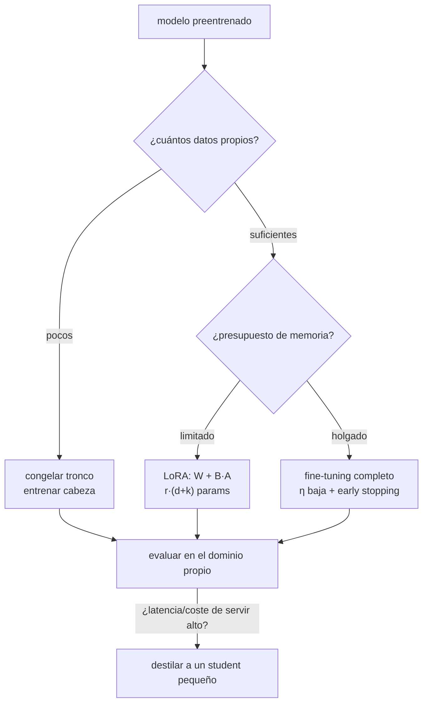

# 059 — Transferencia, fine-tuning y destilación

> [← Clase anterior](../../../classes/part-04-neural-networks-and-deep-learning/058-autoencoders-gan-y-difusion/README.md) · [Índice de la parte](../README.md) · [Clase siguiente →](../../../classes/part-04-neural-networks-and-deep-learning/060-proyecto-modelo-trazable-de-extremo-a-extremo/README.md)

**Parte:** 04 — Redes neuronales y deep learning  
**Nivel:** intermedio-avanzado · **Horas estimadas:** 6  
**Laboratorio:** `neural` · **Estado:** `EXECUTABLE_CORE`

## 🎯 Propósito

Comprender **transferencia, fine-tuning y destilación** dentro de la evolución de la inteligencia
artificial, implementar un experimento mínimo verificable y distinguir qué parte
constituye evidencia frente a una afirmación todavía no comprobada.

## 📚 Resultados de aprendizaje

Al finalizar podrás:

1. Explicar transferencia, fine-tuning y destilación usando los conceptos `transfer`, `fine-tuning`, `distillation`, `PEFT`.
2. Ejecutar el laboratorio con una semilla explícita y revisar su contrato JSON.
3. Identificar al menos un supuesto, una limitación y un riesgo de aplicación.
4. Comparar el enfoque con la etapa anterior de la ruta de aprendizaje.
5. Producir una evidencia reproducible y una conclusión que no exceda los datos.

## 🧩 Conceptos centrales

`transfer`, `fine-tuning`, `distillation`, `PEFT`

## 🗺️ Ubicación en el mapa de la IA

Entrenar desde cero exige datos y cómputo que casi nadie tiene; la transferencia
convirtió el deep learning en tecnología de uso general: un modelo preentrenado
(ImageNet, un LLM) se adapta a cada tarea con una fracción del coste. Fine-tuning,
PEFT/LoRA y destilación son hoy el modo *normal* de construir sistemas — incluida la
especialización de LLM de la parte 05 — y el puente directo entre esta parte y la
IA aplicada del resto del curso.

## 📖 Fundamentos

### 🔁 Transferencia de representaciones

Las primeras capas de una red aprenden features genéricas (bordes y texturas en
visión; morfología y sintaxis en lenguaje) y las últimas, features específicas de la
tarea (Yosinski et al., 2014). Eso habilita dos estrategias sobre un modelo
preentrenado:

- **Feature extraction**: congelar el tronco y entrenar solo una cabeza nueva.
  Barato, robusto con pocos datos, pero no adapta las representaciones.
- **Fine-tuning**: reentrenar todo (o las capas superiores) con tasa de aprendizaje
  baja (típicamente 10-100× menor que la del preentrenamiento). Más potente, pero
  con pocos datos puede sobreajustar y sufrir **olvido catastrófico** (perder lo
  aprendido en preentrenamiento).

Regla práctica: cuanto más pequeño el dataset y más parecido al dominio original,
más congelar; cuanto más grande y distinto, más descongelar.

### 🪶 PEFT y LoRA

El fine-tuning completo de un modelo de miles de millones de parámetros multiplica
memoria (gradientes + estados de Adam por parámetro) y obliga a guardar una copia
entera por tarea. El *parameter-efficient fine-tuning* entrena solo una fracción.
**LoRA** (Hu et al., 2021) congela cada matriz W ∈ ℝ^{d×k} y aprende una corrección
de rango bajo:

```text
W' = W + ΔW = W + B·A        con B ∈ ℝ^{d×r},  A ∈ ℝ^{r×k},  r ≪ min(d, k)
```

Parámetros entrenables: r·(d+k) en lugar de d·k. Con r = 8 sobre una matriz 768×768:
12 288 frente a 589 824 (≈ 2 %). Ventajas operativas: los adaptadores se almacenan por
tarea en megabytes, se intercambian sin tocar el modelo base y ΔW puede fusionarse en
W para inferencia sin sobrecoste.

### 🧪 Destilación de conocimiento

La **destilación** (Hinton et al., 2015) comprime un modelo grande (teacher) en uno
pequeño (student) entrenando al student para imitar las *probabilidades* del teacher,
no solo la etiqueta dura. Con temperatura T en el softmax:

```text
p_i(T) = exp(z_i/T) / Σ_j exp(z_j/T)
L = λ·CE(y, student) + (1−λ)·T²·KL( teacher(T) ‖ student(T) )
```

T > 1 suaviza la distribución y revela el "conocimiento oscuro": qué clases se parecen
según el teacher (un 7 se parece más a un 1 que a un 8). Esa señal por clase es mucho
más rica que la etiqueta y permite al student pequeño acercarse al rendimiento del
teacher (ejemplo canónico: DistilBERT ≈ 97 % de BERT con 40 % menos parámetros).

## 🧮 Ejemplo trabajado

**Conteo LoRA.** Capa de atención con W_Q, W_K, W_V, W_O ∈ ℝ^{768×768} y r = 8:

```text
Full fine-tuning:  4 · 768·768            = 2 359 296 parámetros
LoRA:              4 · 8·(768+768)        =    49 152 parámetros  (2.08 %)
```

**Softmax con temperatura a mano.** Logits del teacher z = (3, 1) para 2 clases:

```text
T = 1:  p = (e³, e¹)/(e³+e¹) = (20.09, 2.72)/22.81 = (0.881, 0.119)
T = 4:  z/T = (0.75, 0.25) → (2.117, 1.284)/3.401 = (0.622, 0.378)
```

Con T = 1 el student casi solo ve "clase 1"; con T = 4 aprende además *cuánto* se
parece la entrada a la clase 2 — la estructura de similitud que la etiqueta dura
descarta. El factor T² de la pérdida compensa que los gradientes se encogen ∝ 1/T².

## 📊 Propiedades y comparación

| Estrategia | Parámetros entrenados | Datos necesarios | Riesgo principal | Artefacto resultante |
|---|---|---|---|---|
| Feature extraction | solo la cabeza (≪1 %) | decenas-miles | features no adaptadas | cabeza pequeña |
| Fine-tuning completo | 100 % | miles-millones | olvido catastrófico, coste | copia entera del modelo |
| LoRA / PEFT | 0.1-2 % | miles | expresividad limitada por r | adaptador de MB |
| Destilación | 100 % del student | sin etiquetar sirve (usa al teacher) | techo = teacher | modelo pequeño independiente |



## ⚠️ Errores conceptuales frecuentes

1. **"Fine-tuning con la misma η del preentrenamiento."** Destroza las
   representaciones en las primeras iteraciones; la η debe ser 1-2 órdenes menor.
2. **"Transferir siempre ayuda."** Con dominios muy lejanos (imágenes naturales →
   señales médicas crudas) la transferencia puede ser neutra o negativa; hay que
   medirla contra un baseline desde cero.
3. **"LoRA aproxima peor porque entrena menos parámetros, así que siempre rinde
   peor."** En adaptación de tareas, los ΔW efectivos suelen tener rango bajo
   intrínseco; LoRA iguala al fine-tuning completo en muchos benchmarks.
4. **"La destilación es solo entrenar con las predicciones top-1 del teacher."** La
   señal útil está en la distribución *completa* suavizada por temperatura; con
   etiquetas duras del teacher se pierde la mayor parte del beneficio.
5. **"Congelar capas evita todo sobreajuste."** Reduce capacidad de sobreajuste del
   tronco, pero la cabeza puede sobreajustar igual; la validación sigue siendo
   obligatoria.

## 🚀 Del aprendizaje a la operación

El flujo industrial típico: elegir modelo base (licencia incluida), fine-tuning con
PEFT sobre datos propios versionados, evaluación contra el modelo base y un baseline
simple, destilación si la latencia o el coste de servir lo exigen, y registro de qué
pesos/adaptadores produjeron qué métricas (la trazabilidad de la clase 060). El riesgo
operativo nuevo: heredar sesgos y vulnerabilidades del modelo base sin haberlos medido.

## 🧪 Laboratorio

```bash
python lab.py
```

El laboratorio llama a `ai_evolution.labs.run_lab("neural")`. Esta
decisión evita 183 implementaciones divergentes: cada clase tiene un entrypoint
propio, pero los motores didácticos se prueban como una biblioteca común.

### 🔍 Evidencia esperada

- tipo de laboratorio y semilla;
- entradas o decisiones observables;
- resultado estructurado;
- lista `evidence` con hechos que pueden inspeccionarse;
- lista `limitations` que impide presentar la demo como producción.

## 📓 Notebooks

- [📓 `notebook.ipynb`](notebook.ipynb): recorrido guiado con la materia resumida.
- [✍️ `notebook_student.ipynb`](notebook_student.ipynb): ejercicios para resolver.
- [✅ `notebook_solution.ipynb`](notebook_solution.ipynb): solución de referencia explicada.

## 📝 Evaluación

| Criterio | Peso |
|---|---:|
| Comprensión conceptual | 25 % |
| Ejecución reproducible | 25 % |
| Interpretación basada en evidencia | 25 % |
| Riesgos, límites y mejora propuesta | 25 % |

Consulta [assessment.md](assessment.md) para preguntas y criterio de aceptación.

## ⚠️ Errores comunes

| Síntoma | Causa probable | Corrección |
|---|---|---|
| El código corre, pero no hay conclusión | Se confundió ejecución con aprendizaje | Explica qué demuestra y qué no demuestra |
| El resultado cambia sin explicación | No se registró semilla o configuración | Conserva semilla, versión y parámetros |
| Se promete uso real | Se extrapoló desde una demo educativa | Declara entorno, datos, límites y revisión humana |
| Se copia una métrica aislada | No existe baseline ni costo de error | Añade comparación y criterio de decisión |

## ❓ Preguntas frecuentes

**¿Debo usar una API comercial?**  
No. El núcleo funciona localmente. Las extensiones LIVE se documentan por separado.

**¿El laboratorio representa una implementación industrial?**  
No por sí solo. Enseña el contrato y el patrón; producción exige integración,
seguridad, observabilidad, pruebas y operación.

**¿Dónde profundizo?**  
Revisa las especializaciones enlazadas en el README raíz y la ruta siguiente.

## 🔗 Referencias

- Hinton, G., Vinyals, O. y Dean, J. (2015). *Distilling the Knowledge in a Neural Network*. [arXiv:1503.02531](https://arxiv.org/abs/1503.02531) — uso: fuente primaria del mecanismo estudiado
- Yosinski, J. et al. (2014). *How transferable are features in deep neural networks?* [arXiv:1411.1792](https://arxiv.org/abs/1411.1792) — uso: fuente primaria del mecanismo estudiado
- Hu, E. et al. (2021). *LoRA: Low-Rank Adaptation of Large Language Models*. [arXiv:2106.09685](https://arxiv.org/abs/2106.09685) — uso: fuente primaria del mecanismo estudiado
- Howard, J. y Ruder, S. (2018). *Universal Language Model Fine-tuning for Text Classification* (ULMFiT). [arXiv:1801.06146](https://arxiv.org/abs/1801.06146) — uso: fuente primaria del mecanismo estudiado
- Tutorial oficial de PyTorch: [Transfer Learning for Computer Vision](https://pytorch.org/tutorials/beginner/transfer_learning_tutorial.html) — uso: referencia consultada en su fuente original
- Documentación de Hugging Face PEFT. [huggingface.co/docs/peft](https://huggingface.co/docs/peft) — uso: referencia consultada en su fuente original

<!-- papers:inicio -->

---

## 📜 Papers que fundamentan esta clase

> Bloque generado por `python scripts/link_papers_to_classes.py`. La fuente es [`papers/catalog/papers.json`](../../../papers/catalog/papers.json).

| Paper | Año | Qué desbloqueó | Miniatura |
|---|---:|---|---|
| [P45 · Destilar el conocimiento de una red neuronal](../../../papers/foundational/P45_distillation/README.md) | 2015 | Las probabilidades del maestro contienen más información que la etiqueta correcta: el modelo pequeño aprende de esa estructura. | [notebook](../../../notebooks/papers/P45_distillation.ipynb) |
| [P48 · LoRA: adaptación de rango bajo de modelos de lenguaje grandes](../../../papers/foundational/P48_lora/README.md) | 2021 | Ajustar un modelo enorme entrenando una fracción diminuta de parámetros, sin coste añadido en inferencia. | [notebook](../../../notebooks/papers/P48_lora.ipynb) |

Cada ficha explica el problema anterior, la matemática mínima, los límites y los errores de atribución más frecuentes. Para leerlas con método: [cómo leer un paper de IA](../../../papers/guides/COMO_LEER_UN_PAPER_DE_IA.md) · [anexos matemáticos](../../../papers/annexes/README.md).
<!-- papers:fin -->
---

## ⬅️ Clase anterior

[058 — Autoencoders, GAN y difusión](../../part-04-neural-networks-and-deep-learning/058-autoencoders-gan-y-difusion/README.md)

## ➡️ Siguiente clase

[060 — Proyecto: modelo trazable de extremo a extremo](../../part-04-neural-networks-and-deep-learning/060-proyecto-modelo-trazable-de-extremo-a-extremo/README.md)
