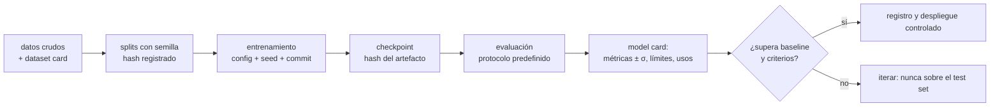

# 060 — Proyecto: modelo trazable de extremo a extremo

> [← Clase anterior](../../../classes/part-04-neural-networks-and-deep-learning/059-transferencia-fine-tuning-y-destilacion/README.md) · [Índice de la parte](../README.md) · [Clase siguiente →](../../../classes/part-05-language-vision-audio-and-multimodal-ai/061-clasificacion-y-representacion-visual/README.md)

**Parte:** 04 — Redes neuronales y deep learning  
**Nivel:** intermedio-avanzado · **Horas estimadas:** 10  
**Laboratorio:** `capstone` · **Estado:** `EXECUTABLE_CORE`

## 🎯 Propósito

Comprender **proyecto: modelo trazable de extremo a extremo** dentro de la evolución de la inteligencia
artificial, implementar un experimento mínimo verificable y distinguir qué parte
constituye evidencia frente a una afirmación todavía no comprobada.

## 📚 Resultados de aprendizaje

Al finalizar podrás:

1. Explicar proyecto: modelo trazable de extremo a extremo usando los conceptos `dataset card`, `model card`, `registro`, `despliegue`.
2. Ejecutar el laboratorio con una semilla explícita y revisar su contrato JSON.
3. Identificar al menos un supuesto, una limitación y un riesgo de aplicación.
4. Comparar el enfoque con la etapa anterior de la ruta de aprendizaje.
5. Producir una evidencia reproducible y una conclusión que no exceda los datos.

## 🧩 Conceptos centrales

`dataset card`, `model card`, `registro`, `despliegue`

## 🗺️ Ubicación en el mapa de la IA

Cierre de la parte 04: todo lo anterior (arquitecturas, optimización, transferencia)
solo tiene valor si el resultado es **verificable por terceros**. La crisis de
reproducibilidad en ML (resultados que no se replican por semillas, datos o código no
declarados) produjo un estándar emergente — dataset cards, model cards, registro de
experimentos — que este proyecto practica de extremo a extremo y que la parte 05
asumirá como requisito al trabajar con LLM.

## 📖 Fundamentos

### 🧾 Trazabilidad: la cadena completa

Un modelo es trazable cuando cada afirmación sobre él puede seguirse hasta su origen:

```text
datos crudos → transformaciones → splits → entrenamiento → checkpoint → métricas → decisión
     │               │              │           │              │           │
  versión         código         semilla     config        hash        protocolo
```

Si un eslabón no está registrado, la cadena se rompe: una métrica sin split declarado,
o un checkpoint sin configuración, no son evidencia sino anécdota.

### 📇 Dataset cards y model cards

**Datasheets for Datasets** (Gebru et al., 2018): documento que responde, para un
dataset: motivación, composición, proceso de recolección, preprocesamiento, usos
recomendados y desaconsejados, sesgos conocidos. **Model Cards** (Mitchell et al.,
2019): lo análogo para modelos — uso previsto, datos de entrenamiento, métricas
**desagregadas por subgrupos relevantes**, condiciones de fallo conocidas y
consideraciones éticas. Ambos son hoy práctica estándar (los hubs de modelos los
integran) y la base de la documentación exigida por marcos regulatorios.

### 🔁 Reproducibilidad técnica

Fuentes de no determinismo y su control:

- **Semillas**: fijar las de *todas* las librerías (random, NumPy, framework) y
  registrarlas como parte del experimento.
- **No determinismo de GPU**: algunas operaciones CUDA son no deterministas por
  rendimiento; los frameworks ofrecen modos deterministas (más lentos) — la
  reproducibilidad bit a bit tiene coste y a veces se sustituye por reproducibilidad
  estadística (misma media ± varianza entre semillas).
- **Entorno**: versiones de librerías y drivers fijadas (lockfiles, contenedores).
- **Datos**: hash del dataset y de cada split; el *data leakage* entre train y test
  invalida silenciosamente todo lo demás.

### 📊 Protocolo de evaluación honesto

Decidir **antes** de mirar el test set: métrica principal (y por qué, dado el costo
de cada tipo de error), baseline contra el que comparar (mayoría, regla simple,
modelo anterior), splits (y si hay grupos —pacientes, usuarios— splits por grupo),
y número de corridas con semillas distintas para reportar media ± desviación. El test
set se toca una vez. Reportar también métricas desagregadas: un accuracy global puede
esconder un fallo grave en un subgrupo.

## 🧮 Ejemplo trabajado

Evaluación trazable de un clasificador binario. Matriz de confusión sobre el test
(tocado una única vez, split con semilla registrada 60):

```text
                predicho +   predicho −
real +             TP=40        FN=20
real −             FP=10        TN=30

precisión = 40/(40+10) = 0.800
recall    = 40/(40+20) = 0.667
F1        = 2·(0.8·0.667)/(0.8+0.667) = 0.727
accuracy  = 70/100 = 0.700
baseline mayoritario (predecir siempre +): accuracy = 60/100 = 0.600
```

Lectura honesta: el modelo supera al baseline en accuracy (0.70 vs 0.60), pero deja
escapar un tercio de los positivos (recall 0.667). Si el costo de un falso negativo es
alto (p. ej. detección de fallos), esa cifra —no el accuracy— es la que decide, y así
debe constar en la model card junto con: semilla, hash de los splits, configuración
de entrenamiento y desviación entre corridas (p. ej. accuracy 0.70 ± 0.02 sobre 5
semillas). Con eso, un tercero puede reproducir y auditar la afirmación.

## 📊 Propiedades y comparación

| Nivel de trazabilidad | Qué registra | Qué permite | Qué falla sin él |
|---|---|---|---|
| Código versionado | commit del entrenamiento | re-ejecutar | "funcionaba en mi máquina" |
| Config + semillas | hiperparámetros, seeds | reproducir la corrida | métricas irrepetibles |
| Datos versionados | hash de dataset y splits | auditar leakage | evidencia contaminada |
| Registro de experimentos | corridas, métricas, artefactos | comparar honestamente | cherry-picking involuntario |
| Cards (datos + modelo) | usos, límites, sesgos | decisión informada de terceros | despliegue a ciegas |



## ⚠️ Errores conceptuales frecuentes

1. **"Fijé la semilla, luego es reproducible."** La semilla es un eslabón; sin
   versiones de entorno, hash de datos y config registrada, la cadena sigue rota.
2. **"Elegí la mejor corrida de 20 para el informe."** Eso es selección post-hoc: la
   estimación honesta es media ± desviación de todas, o una corrida nueva con
   protocolo prefijado.
3. **"El accuracy global resume el modelo."** Puede ocultar fallos por subgrupo y es
   engañoso con clases desbalanceadas (el baseline mayoritario ya da el 60 % aquí).
4. **"Validar varias veces contra el test set está bien si no entreno con él."** Cada
   mirada al test para tomar decisiones filtra información: es sobreajuste de
   selección, más lento pero igual de real.
5. **"Las cards son burocracia."** Son el contrato que permite a un tercero decidir si
   el modelo sirve para *su* caso; sin ellas, cada reutilización es un experimento a
   ciegas.

## 🚀 Del aprendizaje a la operación

En producción se añaden: registro de modelos con promoción por etapas
(staging → producción), monitoreo de deriva de datos y de rendimiento en vivo,
rollback automático ante degradación, auditoría de acceso a datos sensibles y
revalidación periódica. La disciplina es la misma de esta clase; solo cambia la
escala y que el "tercero que audita" puede ser un regulador.

## 🧪 Laboratorio

```bash
python lab.py
```

El laboratorio llama a `ai_evolution.labs.run_lab("capstone")`. Esta
decisión evita 183 implementaciones divergentes: cada clase tiene un entrypoint
propio, pero los motores didácticos se prueban como una biblioteca común.

### 🔍 Evidencia esperada

- tipo de laboratorio y semilla;
- entradas o decisiones observables;
- resultado estructurado;
- lista `evidence` con hechos que pueden inspeccionarse;
- lista `limitations` que impide presentar la demo como producción.

## 📓 Notebooks

- [📓 `notebook.ipynb`](notebook.ipynb): recorrido guiado con la materia resumida.
- [✍️ `notebook_student.ipynb`](notebook_student.ipynb): ejercicios para resolver.
- [✅ `notebook_solution.ipynb`](notebook_solution.ipynb): solución de referencia explicada.

## 📝 Evaluación

| Criterio | Peso |
|---|---:|
| Comprensión conceptual | 25 % |
| Ejecución reproducible | 25 % |
| Interpretación basada en evidencia | 25 % |
| Riesgos, límites y mejora propuesta | 25 % |

Consulta [assessment.md](assessment.md) para preguntas y criterio de aceptación.

## ⚠️ Errores comunes

| Síntoma | Causa probable | Corrección |
|---|---|---|
| El código corre, pero no hay conclusión | Se confundió ejecución con aprendizaje | Explica qué demuestra y qué no demuestra |
| El resultado cambia sin explicación | No se registró semilla o configuración | Conserva semilla, versión y parámetros |
| Se promete uso real | Se extrapoló desde una demo educativa | Declara entorno, datos, límites y revisión humana |
| Se copia una métrica aislada | No existe baseline ni costo de error | Añade comparación y criterio de decisión |

## ❓ Preguntas frecuentes

**¿Debo usar una API comercial?**  
No. El núcleo funciona localmente. Las extensiones LIVE se documentan por separado.

**¿El laboratorio representa una implementación industrial?**  
No por sí solo. Enseña el contrato y el patrón; producción exige integración,
seguridad, observabilidad, pruebas y operación.

**¿Dónde profundizo?**  
Revisa las especializaciones enlazadas en el README raíz y la ruta siguiente.

## 🔗 Referencias

- Mitchell, M. et al. (2019). *Model Cards for Model Reporting*. [arXiv:1810.03993](https://arxiv.org/abs/1810.03993)
- Gebru, T. et al. (2018). *Datasheets for Datasets*. [arXiv:1803.09010](https://arxiv.org/abs/1803.09010)
- Pineau, J. et al. (2020). *Improving Reproducibility in Machine Learning Research*. [arXiv:2003.12206](https://arxiv.org/abs/2003.12206)
- Notas oficiales de PyTorch sobre reproducibilidad y determinismo. [pytorch.org/docs/stable/notes/randomness.html](https://pytorch.org/docs/stable/notes/randomness.html)
- Documentación de MLflow (registro de experimentos y modelos). [mlflow.org/docs/latest](https://mlflow.org/docs/latest/)

---

## ⬅️ Clase anterior

[059 — Transferencia, fine-tuning y destilación](../../part-04-neural-networks-and-deep-learning/059-transferencia-fine-tuning-y-destilacion/README.md)

## ➡️ Siguiente clase

[061 — Clasificación y representación visual](../../part-05-language-vision-audio-and-multimodal-ai/061-clasificacion-y-representacion-visual/README.md)
