# 🧠 Parte 04 — Redes neuronales y deep learning

**Nivel:** intermedio-avanzado · **Duración sugerida:** 6–8 semanas ·
**Clases:** 12

Explica la transición desde el perceptrón a arquitecturas profundas. La especialización práctica completa vive en neural-network-training-labs.

## 🧭 Secuencia de la parte

```mermaid
flowchart LR
    L049["049<br/>Perceptrón y límites<br/>de separabilidad"]
    L050["050<br/>MLP y backpropagation"]
    L051["051<br/>Activaciones, inicialización y<br/>normalización"]
    L052["052<br/>Optimizadores, regularización y<br/>schedulers"]
    L053["053<br/>CNN y aprendizaje<br/>espacial"]
    L054["054<br/>RNN, LSTM y<br/>secuencias"]
    L055["055<br/>Atención y arquitectura<br/>Transformer"]
    L056["056<br/>Graph Neural Networks"]
    L057["057<br/>Aprendizaje por refuerzo<br/>profundo"]
    L058["058<br/>Autoencoders, GAN y<br/>difusión"]
    L059["059<br/>Transferencia, fine-tuning y<br/>destilación"]
    L060["060<br/>Proyecto: modelo trazable<br/>de extremo a<br/>extremo"]
    L049 --> L050
    L050 --> L051
    L051 --> L052
    L052 --> L053
    L053 --> L054
    L054 --> L055
    L055 --> L056
    L056 --> L057
    L057 --> L058
    L058 --> L059
    L059 --> L060
```

## 📚 Clases

| ID | Tema | Laboratorio | Horas |
|---:|---|---|---:|
| 049 | [Perceptrón y límites de separabilidad](049-perceptron-y-limites-de-separabilidad/README.md) | `neural` | 6 |
| 050 | [MLP y backpropagation](050-mlp-y-backpropagation/README.md) | `neural` | 6 |
| 051 | [Activaciones, inicialización y normalización](051-activaciones-inicializacion-y-normalizacion/README.md) | `neural` | 6 |
| 052 | [Optimizadores, regularización y schedulers](052-optimizadores-regularizacion-y-schedulers/README.md) | `optimization` | 6 |
| 053 | [CNN y aprendizaje espacial](053-cnn-y-aprendizaje-espacial/README.md) | `perception` | 6 |
| 054 | [RNN, LSTM y secuencias](054-rnn-lstm-y-secuencias/README.md) | `neural` | 6 |
| 055 | [Atención y arquitectura Transformer](055-atencion-y-arquitectura-transformer/README.md) | `attention` | 6 |
| 056 | [Graph Neural Networks](056-graph-neural-networks/README.md) | `neural` | 6 |
| 057 | [Aprendizaje por refuerzo profundo](057-aprendizaje-por-refuerzo-profundo/README.md) | `robotics` | 6 |
| 058 | [Autoencoders, GAN y difusión](058-autoencoders-gan-y-difusion/README.md) | `generation` | 6 |
| 059 | [Transferencia, fine-tuning y destilación](059-transferencia-fine-tuning-y-destilacion/README.md) | `neural` | 6 |
| 060 | [Proyecto: modelo trazable de extremo a extremo](060-proyecto-modelo-trazable-de-extremo-a-extremo/README.md) | `capstone` | 10 |

## 📝 Evaluación de la parte

- 40 % laboratorios y notebooks.
- 25 % explicaciones y comparación de enfoques.
- 20 % evaluación de riesgos y limitaciones.
- 15 % mini-proyecto o integración.

[⬅️ Parte 03 — Machine learning clásico](../part-03-classical-machine-learning/README.md) · [🏠 Volver al programa](../../README.md) · [➡️ Parte 05 — Lenguaje, visión, audio e IA multimodal](../part-05-language-vision-audio-and-multimodal-ai/README.md)
