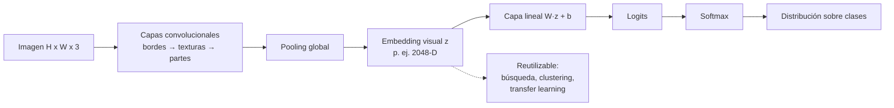

# 061 — Clasificación y representación visual

> [← Clase anterior](../../../classes/part-04-neural-networks-and-deep-learning/060-proyecto-modelo-trazable-de-extremo-a-extremo/README.md) · [Índice de la parte](../README.md) · [Clase siguiente →](../../../classes/part-05-language-vision-audio-and-multimodal-ai/062-deteccion-segmentacion-y-pose/README.md)

**Parte:** 05 — Lenguaje, visión, audio e IA multimodal  
**Nivel:** avanzado · **Horas estimadas:** 6  
**Laboratorio:** `perception` · **Estado:** `EXECUTABLE_CORE`

## 🎯 Propósito

Comprender **clasificación y representación visual** dentro de la evolución de la inteligencia
artificial, implementar un experimento mínimo verificable y distinguir qué parte
constituye evidencia frente a una afirmación todavía no comprobada.

## 📚 Resultados de aprendizaje

Al finalizar podrás:

1. Explicar clasificación y representación visual usando los conceptos `visión`, `features`, `clasificación`, `augmentación`.
2. Ejecutar el laboratorio con una semilla explícita y revisar su contrato JSON.
3. Identificar al menos un supuesto, una limitación y un riesgo de aplicación.
4. Comparar el enfoque con la etapa anterior de la ruta de aprendizaje.
5. Producir una evidencia reproducible y una conclusión que no exceda los datos.

## 🧩 Conceptos centrales

`visión`, `features`, `clasificación`, `augmentación`

## 🗺️ Ubicación en el mapa de la IA

La visión por computador fue el dominio donde el aprendizaje profundo demostró su superioridad
empírica: AlexNet (2012) redujo el error top-5 de ImageNet del 26 % al 16 % y desencadenó la
era moderna del deep learning que estudiaste en la parte 04. Esta clase conecta esa historia
con la práctica: cómo una imagen se convierte en números, cómo esos números se transforman en
**representaciones** útiles y cómo un clasificador decide sobre ellas. Todo lo que sigue en
esta parte —detección (062), OCR (063), modelos visión-lenguaje (069)— se construye sobre la
idea de representación visual que se formaliza aquí.

## 📖 Fundamentos

### 🖼️ La imagen como tensor

Una imagen digital es un tensor de forma `alto × ancho × canales`. Una foto RGB de 224×224
píxeles son 150 528 números enteros en `[0, 255]` (o flotantes normalizados). El problema
central de la visión es que ese espacio crudo es **semánticamente inútil**: dos fotos del
mismo gato con distinta iluminación distan más, píxel a píxel, que un gato y una lavadora
del mismo color medio. Clasificar exige transformar píxeles en una representación donde la
semántica sea geometría: imágenes de la misma clase deben quedar cerca.

### 🧰 Features diseñadas a mano (era pre-deep)

Antes de 2012 las representaciones se diseñaban manualmente:

- **Bordes y gradientes:** filtros como Sobel responden a cambios bruscos de intensidad.
- **HOG (Histogram of Oriented Gradients):** histograma local de orientaciones de gradiente;
  base del detector de peatones de Dalal y Triggs (2005).
- **SIFT:** puntos clave invariantes a escala y rotación, con descriptores de 128 dimensiones.

El pipeline clásico era `imagen → detector de features → descriptor → SVM/k-NN`. Funcionaba,
pero cada dominio nuevo exigía reingeniería manual de features.

### 🧠 Features aprendidas: la convolución

Una capa convolucional aprende bancos de filtros pequeños (p. ej. 3×3) que se deslizan sobre
la imagen. La operación en cada posición es un producto punto entre el filtro y el parche:

```text
salida[i,j] = Σ_u Σ_v  filtro[u,v] · imagen[i+u, j+v]  + sesgo
```

Tres propiedades hacen a la convolución adecuada para imágenes:

1. **Compartición de pesos:** el mismo filtro se aplica en toda la imagen (un detector de
   bordes sirve en cualquier posición) → muchos menos parámetros que una capa densa.
2. **Localidad:** cada salida depende solo de un vecindario, como los campos receptivos
   de la corteza visual.
3. **Jerarquía:** apilar capas compone detectores: bordes → texturas → partes → objetos.

La activación de la penúltima capa de una CNN entrenada (p. ej. el vector de 2048 dimensiones
de ResNet-50 tras el pooling global) es el **embedding visual**: una representación compacta
donde la distancia refleja similitud semántica. Los Vision Transformers (ViT) llegan a
representaciones análogas troceando la imagen en parches de 16×16 y aplicando atención.

### 🎯 Clasificación: de logits a probabilidades

Sobre el embedding `z` se aplica una capa lineal que produce **logits** `s = W·z + b`
(un número por clase) y la función softmax los convierte en una distribución:

```text
softmax(s)_k = exp(s_k) / Σ_j exp(s_j)
```

La pérdida de entrenamiento es la entropía cruzada `−log p(clase correcta)`. Las métricas de
evaluación son accuracy, matriz de confusión y top-k accuracy (la clase correcta está entre
las k más probables); con clases desbalanceadas, precisión/recall por clase.

### 🔄 Augmentación y transferencia

- **Augmentación de datos:** transformar cada imagen de entrenamiento (recortes aleatorios,
  espejado horizontal, jitter de color) multiplica la diversidad efectiva del dataset y
  codifica invariancias deseadas ("un gato espejado sigue siendo un gato"). Debe aplicarse
  solo en entrenamiento, nunca en evaluación, y respetar la semántica (espejar un dígito
  `6` produce algo que ya no es un `6`).
- **Transfer learning:** una CNN preentrenada en ImageNet ya aprendió features genéricas;
  para un problema nuevo con pocos datos basta congelar el tronco y reentrenar la cabeza
  lineal (*linear probing*) o ajustar todo con tasa de aprendizaje baja (*fine-tuning*).

## 🧮 Ejemplo trabajado

**Paso 1 — una convolución a mano.** Parche de imagen 3×3 (intensidades) y filtro de borde
vertical tipo Sobel:

```text
parche:            filtro:
 10  10  90        -1  0  +1
 10  10  90        -2  0  +2
 10  10  90        -1  0  +1

salida = (10·-1)+(10·0)+(90·1)
       + (10·-2)+(10·0)+(90·2)
       + (10·-1)+(10·0)+(90·1)
       = (-10+90) + (-20+180) + (-10+90) = 320
```

El valor alto (320) señala un borde vertical fuerte: a la izquierda oscuro (10), a la
derecha claro (90). Sobre una zona uniforme (todo 10) la salida sería 0.

**Paso 2 — de logits a decisión.** Supón que la cabeza lineal produce logits
`s = [2.0, 1.0, 0.1]` para las clases `[gato, perro, coche]`:

```text
exp(s) = [7.389, 2.718, 1.105]      suma = 11.212
softmax = [0.659, 0.242, 0.099]
```

Predicción: `gato` con probabilidad 0.659. Nota que softmax **siempre** produce una
distribución, incluso ante una imagen de una tostadora: la confianza no es evidencia de
que la entrada pertenezca a alguna de las clases conocidas.

## 📊 Propiedades y comparación

| Representación | Origen | Dimensión típica | Datos necesarios | Fortaleza | Límite |
|---|---|---|---|---|---|
| HOG / SIFT | Diseño manual | 100–3 000 | Ninguno (sin entrenamiento) | Interpretable, barata | Tope de precisión bajo |
| CNN entrenada desde cero | Aprendida | 512–2 048 | 10⁵–10⁶ imágenes | Estado del arte clásico | Cara de entrenar |
| CNN preentrenada + linear probe | Transferida | 512–2 048 | 10²–10⁴ imágenes | Muy eficiente en datos | Hereda sesgos del preentrenamiento |
| ViT preentrenado | Transferida (atención) | 768–1 024 | 10²–10⁴ (fine-tune) | Escala mejor con datos masivos | Débil con poco preentrenamiento |



## ⚠️ Errores conceptuales frecuentes

1. **"La CNN ve como un humano."** Falso: las CNN son muy sensibles a texturas y a
   perturbaciones adversariales imperceptibles; los humanos priorizan formas. Son sistemas
   estadísticos, no réplicas de la percepción biológica.
2. **"Softmax alto = el modelo está seguro y tiene razón."** Softmax normaliza logits, no
   calibra incertidumbre: un modelo puede dar 0.99 a una clase equivocada o a una entrada
   fuera de distribución que no pertenece a ninguna clase conocida.
3. **"Más augmentación siempre ayuda."** Una augmentación que rompe la semántica de la clase
   (espejar caracteres, rotar 180° señales de tráfico) enseña invariancias falsas y degrada
   el desempeño.
4. **"El embedding es objetivo."** El embedding hereda la distribución del preentrenamiento:
   si ImageNet subrepresenta ciertos contextos culturales, las distancias en el embedding
   también lo harán.
5. **"Accuracy global basta."** Con 95 % de una clase mayoritaria, un clasificador que
   siempre predice esa clase logra 95 % de accuracy sin haber aprendido nada útil: hay que
   mirar la matriz de confusión por clase.

## 🚀 Del aprendizaje a la operación

Entre este núcleo educativo y un clasificador visual en producción faltan: un pipeline de
datos con control de deriva (las cámaras y condiciones cambian con el tiempo), calibración
de confianza y umbral de rechazo para entradas fuera de distribución, evaluación por
subgrupos para detectar sesgos de desempeño, optimización de inferencia (cuantización,
batching) y un circuito de revisión humana para los casos de baja confianza o alto costo
de error.

## 🧪 Laboratorio

```bash
python lab.py
```

El laboratorio llama a `ai_evolution.labs.run_lab("perception")`. Esta
decisión evita 183 implementaciones divergentes: cada clase tiene un entrypoint
propio, pero los motores didácticos se prueban como una biblioteca común.

### 🔍 Evidencia esperada

- tipo de laboratorio y semilla;
- entradas o decisiones observables;
- resultado estructurado;
- lista `evidence` con hechos que pueden inspeccionarse;
- lista `limitations` que impide presentar la demo como producción.

## 📓 Notebooks

- [📓 `notebook.ipynb`](notebook.ipynb): recorrido guiado con la materia resumida.
- [✍️ `notebook_student.ipynb`](notebook_student.ipynb): ejercicios para resolver.
- [✅ `notebook_solution.ipynb`](notebook_solution.ipynb): solución de referencia explicada.

## 📝 Evaluación

| Criterio | Peso |
|---|---:|
| Comprensión conceptual | 25 % |
| Ejecución reproducible | 25 % |
| Interpretación basada en evidencia | 25 % |
| Riesgos, límites y mejora propuesta | 25 % |

Consulta [assessment.md](assessment.md) para preguntas y criterio de aceptación.

## ⚠️ Errores comunes

| Síntoma | Causa probable | Corrección |
|---|---|---|
| El código corre, pero no hay conclusión | Se confundió ejecución con aprendizaje | Explica qué demuestra y qué no demuestra |
| El resultado cambia sin explicación | No se registró semilla o configuración | Conserva semilla, versión y parámetros |
| Se promete uso real | Se extrapoló desde una demo educativa | Declara entorno, datos, límites y revisión humana |
| Se copia una métrica aislada | No existe baseline ni costo de error | Añade comparación y criterio de decisión |

## ❓ Preguntas frecuentes

**¿Debo usar una API comercial?**  
No. El núcleo funciona localmente. Las extensiones LIVE se documentan por separado.

**¿El laboratorio representa una implementación industrial?**  
No por sí solo. Enseña el contrato y el patrón; producción exige integración,
seguridad, observabilidad, pruebas y operación.

**¿Dónde profundizo?**  
Revisa las especializaciones enlazadas en el README raíz y la ruta siguiente.

## 🔗 Referencias

- Szeliski, R. *Computer Vision: Algorithms and Applications* (2e), caps. de reconocimiento — [szeliski.org/Book](http://szeliski.org/Book/) — uso: desarrollo extendido del tema
- Goodfellow, I., Bengio, Y. y Courville, A. *Deep Learning*, cap. 9 (redes convolucionales) — [deeplearningbook.org](https://www.deeplearningbook.org/) — uso: desarrollo extendido del tema
- Krizhevsky, A., Sutskever, I. y Hinton, G. (2012). "ImageNet Classification with Deep Convolutional Neural Networks" (AlexNet) — [NeurIPS 2012](https://papers.nips.cc/paper_files/paper/2012/hash/c399862d3b9d6b76c8436e924a68c45b-Abstract.html) — uso: referencia consultada en su fuente original
- He, K. et al. (2015). "Deep Residual Learning for Image Recognition" (ResNet) — [arXiv:1512.03385](https://arxiv.org/abs/1512.03385) — uso: fuente primaria del mecanismo estudiado
- Dosovitskiy, A. et al. (2020). "An Image is Worth 16x16 Words" (ViT) — [arXiv:2010.11929](https://arxiv.org/abs/2010.11929) — uso: fuente primaria del mecanismo estudiado
- Documentación oficial de torchvision (modelos y transformaciones) — [pytorch.org/vision](https://pytorch.org/vision/stable/index.html) — uso: referencia consultada en su fuente original

<!-- papers:inicio -->

---

## 📜 Papers que fundamentan esta clase

> Bloque generado por `python scripts/link_papers_to_classes.py`. La fuente es [`papers/catalog/papers.json`](../../../papers/catalog/papers.json).

| Paper | Año | Qué desbloqueó | Miniatura |
|---|---:|---|---|
| [P04 · Clasificación de ImageNet con redes neuronales convolucionales profundas](../../../papers/foundational/P04_alexnet/README.md) | 2012 | El resultado que convirtió el deep learning en la corriente principal: margen amplio sobre los métodos de visión hechos a mano. | [notebook](../../../notebooks/papers/P04_alexnet.ipynb) |
| [P44 · Aprendizaje residual profundo para reconocimiento de imágenes](../../../papers/foundational/P44_resnet/README.md) | 2015 | El atajo identidad hace apilables cientos de capas. Es la misma idea aditiva de la LSTM, aplicada a la profundidad. | [notebook](../../../notebooks/papers/P44_resnet.ipynb) |
| [P46 · Una imagen vale 16x16 palabras: Transformers para reconocimiento de imágenes a escala](../../../papers/foundational/P46_vit/README.md) | 2020 | Trata la imagen como una secuencia de parches y aplica un Transformer puro: la convolución deja de ser imprescindible en visión. | [notebook](../../../notebooks/papers/P46_vit.ipynb) |

Cada ficha explica el problema anterior, la matemática mínima, los límites y los errores de atribución más frecuentes. Para leerlas con método: [cómo leer un paper de IA](../../../papers/guides/COMO_LEER_UN_PAPER_DE_IA.md) · [anexos matemáticos](../../../papers/annexes/README.md).
<!-- papers:fin -->
---

## ⬅️ Clase anterior

[060 — Proyecto: modelo trazable de extremo a extremo](../../part-04-neural-networks-and-deep-learning/060-proyecto-modelo-trazable-de-extremo-a-extremo/README.md)

## ➡️ Siguiente clase

[062 — Detección, segmentación y pose](../../part-05-language-vision-audio-and-multimodal-ai/062-deteccion-segmentacion-y-pose/README.md)
