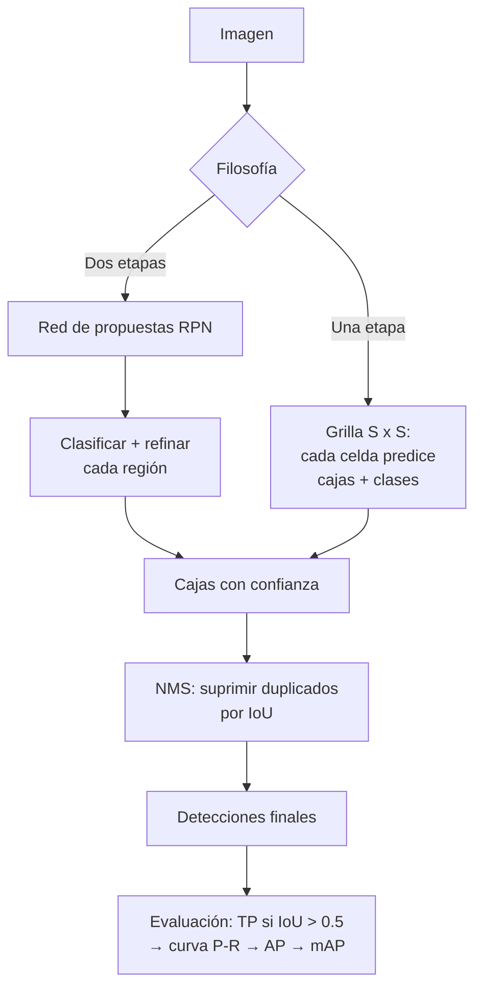

# 062 — Detección, segmentación y pose

> [← Clase anterior](../../../classes/part-05-language-vision-audio-and-multimodal-ai/061-clasificacion-y-representacion-visual/README.md) · [Índice de la parte](../README.md) · [Clase siguiente →](../../../classes/part-05-language-vision-audio-and-multimodal-ai/063-ocr-y-comprension-de-documentos/README.md)

**Parte:** 05 — Lenguaje, visión, audio e IA multimodal  
**Nivel:** avanzado · **Horas estimadas:** 6  
**Laboratorio:** `perception` · **Estado:** `EXECUTABLE_CORE`

## 🎯 Propósito

Comprender **detección, segmentación y pose** dentro de la evolución de la inteligencia
artificial, implementar un experimento mínimo verificable y distinguir qué parte
constituye evidencia frente a una afirmación todavía no comprobada.

## 📚 Resultados de aprendizaje

Al finalizar podrás:

1. Explicar detección, segmentación y pose usando los conceptos `detección`, `segmentación`, `pose`, `tracking`.
2. Ejecutar el laboratorio con una semilla explícita y revisar su contrato JSON.
3. Identificar al menos un supuesto, una limitación y un riesgo de aplicación.
4. Comparar el enfoque con la etapa anterior de la ruta de aprendizaje.
5. Producir una evidencia reproducible y una conclusión que no exceda los datos.

## 🧩 Conceptos centrales

`detección`, `segmentación`, `pose`, `tracking`

## 🗺️ Ubicación en el mapa de la IA

Clasificar (clase 061) responde "¿qué hay en la imagen?"; esta clase responde "¿qué hay,
**dónde** está y **qué forma** tiene?". La detección de objetos fue el segundo gran dominio
conquistado por las CNN (R-CNN, 2014) y su evolución hacia detectores de una sola pasada
(YOLO, 2016) habilitó la percepción en tiempo real que exigen la conducción autónoma, la
robótica (parte 11) y el análisis de documentos (clase 063). La estimación de pose extiende
la misma maquinaria a la localización de articulaciones humanas.

## 📖 Fundamentos

### 📦 Tres tareas, tres salidas

| Tarea | Salida por objeto | Pregunta |
|---|---|---|
| **Detección** | Caja `(x1, y1, x2, y2)` + clase + confianza | ¿Qué y dónde? |
| **Segmentación semántica** | Etiqueta de clase por píxel (sin distinguir instancias) | ¿Qué clase es cada píxel? |
| **Segmentación de instancias** | Máscara binaria por objeto individual | ¿Qué píxeles son *este* objeto? |
| **Estimación de pose** | Coordenadas de K keypoints (codo, muñeca, …) | ¿Dónde están las articulaciones? |

En segmentación semántica dos personas contiguas forman una sola mancha "persona"; en
segmentación de instancias cada una recibe su propia máscara.

### 📐 IoU: la métrica de solapamiento

La **Intersection over Union** mide cuánto coincide una caja predicha con la real:

```text
IoU(A, B) = área(A ∩ B) / área(A ∪ B)      ∈ [0, 1]
```

Una detección se considera correcta (true positive) si su IoU con una caja real supera un
umbral, típicamente 0.5. IoU es invariante a la escala de la imagen y penaliza tanto cajas
demasiado pequeñas como demasiado grandes.

### 🧹 NMS: suprimir duplicados

Los detectores proponen muchas cajas superpuestas para el mismo objeto. La **Non-Maximum
Suppression** las depura:

```text
1. Ordena las cajas por confianza descendente.
2. Toma la de mayor confianza y muévela a la salida.
3. Elimina toda caja restante con IoU > umbral (p. ej. 0.5) respecto a la elegida.
4. Repite hasta agotar las cajas.
```

Un umbral de NMS demasiado bajo fusiona objetos cercanos distintos; demasiado alto deja
duplicados.

### 🏆 mAP: la métrica de benchmark

Para cada clase se ordenan las detecciones por confianza, se marca cada una como TP o FP
(según IoU con las cajas reales, sin reutilizar cajas ya emparejadas), se traza la curva
precisión-recall y se calcula el área bajo ella (**AP**). El **mAP** es la media de AP sobre
las clases; COCO además promedia sobre umbrales de IoU de 0.5 a 0.95 (`mAP@[.5:.95]`),
premiando la localización fina.

### 🔄 De R-CNN a YOLO: dos filosofías

- **Dos etapas (R-CNN → Fast → Faster R-CNN):** una red propone regiones candidatas y otra
  las clasifica y refina. Máxima precisión, más latencia. Mask R-CNN añade una rama que
  predice la máscara de cada región, unificando detección y segmentación de instancias.
- **Una etapa (YOLO, SSD):** la imagen se divide en una grilla y cada celda predice
  directamente cajas, confianzas y clases en **una sola pasada** de la red. YOLO v1
  formuló la detección como regresión: menos precisa en objetos pequeños, pero en tiempo
  real (45+ fps en 2016).

La estimación de pose moderna predice un **mapa de calor** por keypoint (la posición es el
máximo del mapa) y se evalúa con métricas tipo OKS (Object Keypoint Similarity), el análogo
de IoU para puntos.

## 🧮 Ejemplo trabajado

**IoU de dos cajas a mano.** Caja real `A = (2, 2, 6, 6)` y predicción `B = (4, 4, 8, 8)`
(formato `x1, y1, x2, y2`):

```text
Intersección: x ∈ [max(2,4), min(6,8)] = [4, 6] → ancho 2
              y ∈ [max(2,4), min(6,8)] = [4, 6] → alto  2
área(A∩B) = 2 · 2 = 4
área(A) = 4·4 = 16      área(B) = 4·4 = 16
área(A∪B) = 16 + 16 − 4 = 28
IoU = 4 / 28 ≈ 0.143
```

Con umbral 0.5, esta predicción sería un **falso positivo** pese a tocar el objeto.

**NMS a mano.** Tres detecciones de "perro": `d1` conf 0.9, `d2` conf 0.8 con IoU(d1,d2)=0.7,
`d3` conf 0.6 con IoU(d1,d3)=0.1. Con umbral NMS 0.5: se acepta `d1`; `d2` se elimina
(0.7 > 0.5, duplicado de d1); `d3` se acepta (0.1 ≤ 0.5, es otro perro). Salida: `{d1, d3}`.

## 📊 Propiedades y comparación

| Detector | Etapas | Velocidad relativa | Precisión relativa | Uso típico |
|---|---|---|---|---|
| R-CNN (2014) | 2 (propuestas externas + CNN por región) | Muy lenta (~47 s/imagen) | Hito histórico | Superada |
| Faster R-CNN (2015) | 2 (RPN aprendida) | Media (~5 fps) | Alta | Precisión primero |
| Mask R-CNN (2017) | 2 + rama de máscara | Media | Alta + máscaras | Segmentación de instancias |
| YOLO (2016→) | 1 (regresión en grilla) | Tiempo real (45+ fps) | Media-alta (mejora por versión) | Latencia primero |
| DETR (2020) | 1 (transformer, sin NMS) | Media | Alta | Elimina heurísticas |



## ⚠️ Errores conceptuales frecuentes

1. **"IoU 0.5 significa que la mitad de la caja está bien."** No: IoU 0.5 exige un
   solapamiento bastante ajustado — dos cajas iguales desplazadas la mitad de su lado
   tienen IoU ≈ 0.33, no 0.5.
2. **"Segmentación semántica = segmentación de instancias."** La semántica etiqueta píxeles
   por clase; dos objetos contiguos de la misma clase se funden. Instancias los separa.
3. **"Más confianza del detector = mejor localización."** La confianza estima la
   probabilidad de que haya un objeto, no la calidad geométrica de la caja; por eso mAP
   evalúa ambas cosas por separado (confianza ordena, IoU valida).
4. **"El mAP es comparable entre papers sin mirar el protocolo."** mAP@0.5 (PASCAL) y
   mAP@[.5:.95] (COCO) difieren en varios puntos; comparar números de protocolos distintos
   es un error clásico de lectura de benchmarks.
5. **"NMS es inofensivo."** En escenas densas (multitudes, estanterías) NMS elimina
   detecciones correctas de objetos muy próximos; es una heurística con costo real, y
   arquitecturas como DETR existen en parte para eliminarla.

## 🚀 Del aprendizaje a la operación

Un detector operativo exige más que un buen mAP de benchmark: datos anotados del dominio
real (las cajas de COCO no cubren tu almacén ni tu quirófano), evaluación por tamaño de
objeto y condición de iluminación, calibración del umbral de confianza según el costo de
falsos positivos vs falsos negativos, seguimiento (tracking) si hay video, y monitoreo de
deriva cuando cambian cámaras, ángulos o estaciones del año.

## 🧪 Laboratorio

```bash
python lab.py
```

El laboratorio llama a `ai_evolution.labs.run_lab("perception")`. Esta
decisión evita 183 implementaciones divergentes: cada clase tiene un entrypoint
propio, pero los motores didácticos se prueban como una biblioteca común.

### 🔍 Evidencia esperada

- tipo de laboratorio y semilla;
- entradas o decisiones observables;
- resultado estructurado;
- lista `evidence` con hechos que pueden inspeccionarse;
- lista `limitations` que impide presentar la demo como producción.

## 📓 Notebooks

- [📓 `notebook.ipynb`](notebook.ipynb): recorrido guiado con la materia resumida.
- [✍️ `notebook_student.ipynb`](notebook_student.ipynb): ejercicios para resolver.
- [✅ `notebook_solution.ipynb`](notebook_solution.ipynb): solución de referencia explicada.

## 📝 Evaluación

| Criterio | Peso |
|---|---:|
| Comprensión conceptual | 25 % |
| Ejecución reproducible | 25 % |
| Interpretación basada en evidencia | 25 % |
| Riesgos, límites y mejora propuesta | 25 % |

Consulta [assessment.md](assessment.md) para preguntas y criterio de aceptación.

## ⚠️ Errores comunes

| Síntoma | Causa probable | Corrección |
|---|---|---|
| El código corre, pero no hay conclusión | Se confundió ejecución con aprendizaje | Explica qué demuestra y qué no demuestra |
| El resultado cambia sin explicación | No se registró semilla o configuración | Conserva semilla, versión y parámetros |
| Se promete uso real | Se extrapoló desde una demo educativa | Declara entorno, datos, límites y revisión humana |
| Se copia una métrica aislada | No existe baseline ni costo de error | Añade comparación y criterio de decisión |

## ❓ Preguntas frecuentes

**¿Debo usar una API comercial?**  
No. El núcleo funciona localmente. Las extensiones LIVE se documentan por separado.

**¿El laboratorio representa una implementación industrial?**  
No por sí solo. Enseña el contrato y el patrón; producción exige integración,
seguridad, observabilidad, pruebas y operación.

**¿Dónde profundizo?**  
Revisa las especializaciones enlazadas en el README raíz y la ruta siguiente.

## 🔗 Referencias

- Szeliski, R. *Computer Vision: Algorithms and Applications* (2e), cap. de reconocimiento y detección — [szeliski.org/Book](http://szeliski.org/Book/)
- Girshick, R. et al. (2013). "Rich feature hierarchies for accurate object detection" (R-CNN) — [arXiv:1311.2524](https://arxiv.org/abs/1311.2524)
- Ren, S. et al. (2015). "Faster R-CNN: Towards Real-Time Object Detection with Region Proposal Networks" — [arXiv:1506.01497](https://arxiv.org/abs/1506.01497)
- Redmon, J. et al. (2015). "You Only Look Once: Unified, Real-Time Object Detection" — [arXiv:1506.02640](https://arxiv.org/abs/1506.02640)
- He, K. et al. (2017). "Mask R-CNN" — [arXiv:1703.06870](https://arxiv.org/abs/1703.06870)
- Dataset y protocolo de evaluación COCO — [cocodataset.org](https://cocodataset.org/)

<!-- papers:inicio -->

---

## 📜 Papers que fundamentan esta clase

> Bloque generado por `python scripts/link_papers_to_classes.py`. La fuente es [`papers/catalog/papers.json`](../../../papers/catalog/papers.json).

| Paper | Año | Qué desbloqueó | Miniatura |
|---|---:|---|---|
| [P04 · Clasificación de ImageNet con redes neuronales convolucionales profundas](../../../papers/foundational/P04_alexnet/README.md) | 2012 | El resultado que convirtió el deep learning en la corriente principal: margen amplio sobre los métodos de visión hechos a mano. | [notebook](../../../notebooks/papers/P04_alexnet.ipynb) |
| [P18 · Aprender modelos visuales transferibles con supervisión de lenguaje natural](../../../papers/foundational/P18_clip/README.md) | 2021 | El texto se convierte en la etiqueta: un solo modelo clasifica categorías que nadie anotó, describiéndolas con palabras. | [notebook](../../../notebooks/papers/P18_clip.ipynb) |
| [P44 · Aprendizaje residual profundo para reconocimiento de imágenes](../../../papers/foundational/P44_resnet/README.md) | 2015 | El atajo identidad hace apilables cientos de capas. Es la misma idea aditiva de la LSTM, aplicada a la profundidad. | [notebook](../../../notebooks/papers/P44_resnet.ipynb) |

Cada ficha explica el problema anterior, la matemática mínima, los límites y los errores de atribución más frecuentes. Para leerlas con método: [cómo leer un paper de IA](../../../papers/guides/COMO_LEER_UN_PAPER_DE_IA.md) · [anexos matemáticos](../../../papers/annexes/README.md).
<!-- papers:fin -->
---

## ⬅️ Clase anterior

[061 — Clasificación y representación visual](../../part-05-language-vision-audio-and-multimodal-ai/061-clasificacion-y-representacion-visual/README.md)

## ➡️ Siguiente clase

[063 — OCR y comprensión de documentos](../../part-05-language-vision-audio-and-multimodal-ai/063-ocr-y-comprension-de-documentos/README.md)
