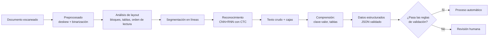

# 063 — OCR y comprensión de documentos

> [← Clase anterior](../../../classes/part-05-language-vision-audio-and-multimodal-ai/062-deteccion-segmentacion-y-pose/README.md) · [Índice de la parte](../README.md) · [Clase siguiente →](../../../classes/part-05-language-vision-audio-and-multimodal-ai/064-tokenizacion-y-representacion-del-lenguaje/README.md)

**Parte:** 05 — Lenguaje, visión, audio e IA multimodal  
**Nivel:** avanzado · **Horas estimadas:** 6  
**Laboratorio:** `perception` · **Estado:** `EXECUTABLE_CORE`

## 🎯 Propósito

Comprender **ocr y comprensión de documentos** dentro de la evolución de la inteligencia
artificial, implementar un experimento mínimo verificable y distinguir qué parte
constituye evidencia frente a una afirmación todavía no comprobada.

## 📚 Resultados de aprendizaje

Al finalizar podrás:

1. Explicar ocr y comprensión de documentos usando los conceptos `OCR`, `layout`, `tablas`, `documentos`.
2. Ejecutar el laboratorio con una semilla explícita y revisar su contrato JSON.
3. Identificar al menos un supuesto, una limitación y un riesgo de aplicación.
4. Comparar el enfoque con la etapa anterior de la ruta de aprendizaje.
5. Producir una evidencia reproducible y una conclusión que no exceda los datos.

## 🧩 Conceptos centrales

`OCR`, `layout`, `tablas`, `documentos`

## 🗺️ Ubicación en el mapa de la IA

El OCR es una de las aplicaciones más antiguas y económicamente relevantes de la visión por
computador: convierte imágenes de texto en texto manipulable. Hereda la detección y
segmentación de la clase 062 (localizar líneas y palabras es detectar) y anticipa dos ideas
clave del programa: la pérdida CTC que reaparece en reconocimiento del habla (clase 067) y
los modelos que fusionan texto + layout + imagen (LayoutLM), precursores directos de los
modelos visión-lenguaje (clase 069). La comprensión de documentos es hoy la puerta de
entrada de la IA a procesos administrativos reales: facturas, formularios, contratos.

## 📖 Fundamentos

### 🔤 El pipeline clásico de OCR

```text
imagen → preprocesado → análisis de layout → segmentación → reconocimiento → postproceso
```

1. **Preprocesado:** corrección de inclinación (deskew), binarización (Otsu), eliminación
   de ruido. Un documento escaneado torcido 3° degrada todo lo demás.
2. **Análisis de layout:** separar bloques de texto, tablas, imágenes y encabezados, y
   determinar el **orden de lectura** (¿dos columnas? ¿tabla?).
3. **Segmentación:** dividir bloques en líneas y, según el motor, en palabras/caracteres.
4. **Reconocimiento:** un modelo secuencial (hoy CNN + RNN/transformer) convierte la imagen
   de cada línea en una cadena de caracteres.
5. **Postproceso:** diccionarios, modelos de lenguaje y reglas (p. ej. validar formato de
   fechas o RUT/NIF) corrigen confusiones típicas (`O`↔`0`, `l`↔`1`, `rn`↔`m`).

### 🧵 Reconocimiento sin segmentar caracteres: CTC

Los motores modernos no cortan la línea en caracteres: la red emite una predicción por
columna de píxeles y la pérdida **CTC (Connectionist Temporal Classification)** alinea esa
secuencia larga con la etiqueta corta. CTC añade un símbolo blanco `∅` y colapsa
repeticiones:

```text
salida por frames:  c c ∅ a a s ∅ ∅ a
colapso:            c ∅ a s ∅ a  →  "casa"
```

Así la red aprende "qué dice la línea" sin saber dónde empieza cada letra. La misma idea
se reutiliza en ASR (clase 067).

### 📏 Métricas: CER y WER

La calidad se mide con la distancia de edición (Levenshtein) entre la transcripción y la
referencia:

```text
CER = (S + D + I) / N        S: sustituciones, D: borrados, I: inserciones
                             N: caracteres de la referencia
```

WER es lo mismo a nivel de palabra. Un CER de 1 % suena excelente, pero en un IBAN de 24
caracteres implica ~1 de cada 4 documentos con un dígito erróneo: la métrica debe leerse
contra el costo del error por campo.

### 📄 De OCR a comprensión de documentos

Leer los caracteres no es entender el documento. La **comprensión de documentos** (Document
AI) extrae estructura y significado:

- **Extracción clave-valor:** encontrar `total_factura = 1.250,00 €` aunque el importe esté
  en cualquier posición.
- **Reconocimiento de tablas:** reconstruir filas y columnas con celdas fusionadas.
- **Clasificación de documentos:** ¿factura, contrato, recibo?

Modelos como **LayoutLM** extienden BERT con dos señales extra por token: la **posición 2D**
de su caja en la página y (en versiones posteriores) la imagen del recorte. Con ello, la
pregunta "¿cuál es el total?" puede resolverse combinando el texto ("Total"), la geometría
(el número alineado a su derecha) y el estilo visual (negrita). El preentrenamiento es
análogo al de BERT (enmascarar tokens) pero sobre millones de páginas escaneadas.

## 🧮 Ejemplo trabajado

Referencia: `FACTURA 2024` (12 caracteres, contando el espacio).
Salida del OCR: `F4CTURA 224`.

```text
Alineación óptima (Levenshtein):
F A C T U R A ␣ 2 0 2 4
F 4 C T U R A ␣ 2 - 2 4
  ^                -
S = 1 (A→4)   D = 1 (falta el 0)   I = 0

CER = (1 + 1 + 0) / 12 ≈ 0.167  → 16.7 %
```

A nivel de palabra: referencia `[FACTURA, 2024]`, hipótesis `[F4CTURA, 224]`: ambas
palabras están mal → `WER = 2/2 = 100 %`. Mismo error, dos lecturas: CER moderado, WER
catastrófico. Si el campo es el número de factura, el postproceso con la regla
`^\d{4}$` detectaría `224` como inválido y enviaría el documento a revisión humana.

## 📊 Propiedades y comparación

| Enfoque | Entrada que usa | Fortaleza | Límite |
|---|---|---|---|
| OCR clásico (Tesseract) | Píxeles binarizados | Local, gratuito, 100+ idiomas | Frágil ante fotos torcidas, manuscritos y layouts complejos |
| OCR neuronal fin-a-fin (CRNN + CTC) | Imagen de línea | Robusto a fuentes y ruido | Necesita layout externo; sin semántica |
| LayoutLM y familia | Texto + posición 2D + imagen | Extracción clave-valor y tablas | Requiere fine-tuning anotado por tipo de documento |
| VLM generalista (clase 069) | Página completa + prompt | Cero configuración inicial | Alucina valores; difícil de auditar campo a campo |



## ⚠️ Errores conceptuales frecuentes

1. **"OCR = comprensión del documento."** OCR produce caracteres; saber cuál de los siete
   números de la factura es el total es un problema distinto (extracción) que requiere
   layout y semántica.
2. **"Un CER bajo garantiza datos fiables."** El error no se distribuye uniformemente: se
   concentra en dígitos, sellos y campos críticos. Hay que medir **exactitud por campo**,
   no solo CER global.
3. **"El OCR lee en el orden correcto."** El orden de lectura es una decisión del análisis
   de layout; en documentos a dos columnas o con tablas, un orden equivocado produce texto
   perfectamente reconocido pero semánticamente revuelto.
4. **"CTC predice dónde está cada carácter."** CTC precisamente evita comprometerse con la
   posición exacta: alinea secuencias colapsando blancos; las coordenadas por carácter son
   un subproducto aproximado, no una garantía.
5. **"Con un VLM ya no hace falta OCR."** Los VLM leen texto en imágenes, pero pueden
   alucinar valores plausibles (un total inventado con formato correcto), algo que un
   pipeline OCR + validación de reglas no hace silenciosamente.

## 🚀 Del aprendizaje a la operación

Un sistema de documentos en producción necesita: un conjunto de evaluación por **tipo de
documento y por campo** (no un CER global), reglas de validación y umbrales de confianza
que deriven a revisión humana los casos dudosos, manejo de versiones de plantillas (los
proveedores cambian sus facturas), trazabilidad campo→píxel para auditoría, y cumplimiento
de protección de datos cuando los documentos contienen información personal.

## 🧪 Laboratorio

```bash
python lab.py
```

El laboratorio llama a `ai_evolution.labs.run_lab("perception")`. Esta
decisión evita 183 implementaciones divergentes: cada clase tiene un entrypoint
propio, pero los motores didácticos se prueban como una biblioteca común.

### 🔍 Evidencia esperada

- tipo de laboratorio y semilla;
- entradas o decisiones observables;
- resultado estructurado;
- lista `evidence` con hechos que pueden inspeccionarse;
- lista `limitations` que impide presentar la demo como producción.

## 📓 Notebooks

- [📓 `notebook.ipynb`](notebook.ipynb): recorrido guiado con la materia resumida.
- [✍️ `notebook_student.ipynb`](notebook_student.ipynb): ejercicios para resolver.
- [✅ `notebook_solution.ipynb`](notebook_solution.ipynb): solución de referencia explicada.

## 📝 Evaluación

| Criterio | Peso |
|---|---:|
| Comprensión conceptual | 25 % |
| Ejecución reproducible | 25 % |
| Interpretación basada en evidencia | 25 % |
| Riesgos, límites y mejora propuesta | 25 % |

Consulta [assessment.md](assessment.md) para preguntas y criterio de aceptación.

## ⚠️ Errores comunes

| Síntoma | Causa probable | Corrección |
|---|---|---|
| El código corre, pero no hay conclusión | Se confundió ejecución con aprendizaje | Explica qué demuestra y qué no demuestra |
| El resultado cambia sin explicación | No se registró semilla o configuración | Conserva semilla, versión y parámetros |
| Se promete uso real | Se extrapoló desde una demo educativa | Declara entorno, datos, límites y revisión humana |
| Se copia una métrica aislada | No existe baseline ni costo de error | Añade comparación y criterio de decisión |

## ❓ Preguntas frecuentes

**¿Debo usar una API comercial?**  
No. El núcleo funciona localmente. Las extensiones LIVE se documentan por separado.

**¿El laboratorio representa una implementación industrial?**  
No por sí solo. Enseña el contrato y el patrón; producción exige integración,
seguridad, observabilidad, pruebas y operación.

**¿Dónde profundizo?**  
Revisa las especializaciones enlazadas en el README raíz y la ruta siguiente.

## 🔗 Referencias

- Documentación oficial de Tesseract OCR — [tesseract-ocr.github.io](https://tesseract-ocr.github.io/)
- Graves, A. et al. (2006). "Connectionist Temporal Classification: Labelling Unsegmented Sequence Data with Recurrent Neural Networks" (ICML 2006) — [cs.toronto.edu/~graves/icml_2006.pdf](https://www.cs.toronto.edu/~graves/icml_2006.pdf)
- Shi, B. et al. (2015). "An End-to-End Trainable Neural Network for Image-based Sequence Recognition" (CRNN) — [arXiv:1507.05717](https://arxiv.org/abs/1507.05717)
- Xu, Y. et al. (2019). "LayoutLM: Pre-training of Text and Layout for Document Image Understanding" — [arXiv:1912.13318](https://arxiv.org/abs/1912.13318)
- Szeliski, R. *Computer Vision: Algorithms and Applications* (2e) — [szeliski.org/Book](http://szeliski.org/Book/)
- Hugging Face Tasks: Document Question Answering — [huggingface.co/tasks/document-question-answering](https://huggingface.co/tasks/document-question-answering)

---

## ⬅️ Clase anterior

[062 — Detección, segmentación y pose](../../part-05-language-vision-audio-and-multimodal-ai/062-deteccion-segmentacion-y-pose/README.md)

## ➡️ Siguiente clase

[064 — Tokenización y representación del lenguaje](../../part-05-language-vision-audio-and-multimodal-ai/064-tokenizacion-y-representacion-del-lenguaje/README.md)
