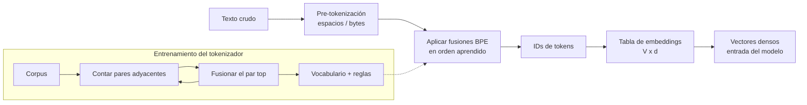

# 064 — Tokenización y representación del lenguaje

> [← Clase anterior](../../../classes/part-05-language-vision-audio-and-multimodal-ai/063-ocr-y-comprension-de-documentos/README.md) · [Índice de la parte](../README.md) · [Clase siguiente →](../../../classes/part-05-language-vision-audio-and-multimodal-ai/065-clasificacion-extraccion-y-generacion-de-texto/README.md)

**Parte:** 05 — Lenguaje, visión, audio e IA multimodal  
**Nivel:** avanzado · **Horas estimadas:** 6  
**Laboratorio:** `llm` · **Estado:** `EXECUTABLE_CORE`

## 🎯 Propósito

Comprender **tokenización y representación del lenguaje** dentro de la evolución de la inteligencia
artificial, implementar un experimento mínimo verificable y distinguir qué parte
constituye evidencia frente a una afirmación todavía no comprobada.

## 📚 Resultados de aprendizaje

Al finalizar podrás:

1. Explicar tokenización y representación del lenguaje usando los conceptos `tokens`, `vocabulario`, `subwords`, `embeddings`.
2. Ejecutar el laboratorio con una semilla explícita y revisar su contrato JSON.
3. Identificar al menos un supuesto, una limitación y un riesgo de aplicación.
4. Comparar el enfoque con la etapa anterior de la ruta de aprendizaje.
5. Producir una evidencia reproducible y una conclusión que no exceda los datos.

## 🧩 Conceptos centrales

`tokens`, `vocabulario`, `subwords`, `embeddings`

## 🗺️ Ubicación en el mapa de la IA

Todo sistema de PLN —del clasificador de spam al LLM de frontera— empieza por la misma
decisión: cómo convertir texto en unidades discretas que un modelo pueda procesar. La
tokenización por subpalabras (BPE, WordPiece) resolvió hacia 2016 el dilema entre
vocabularios inmanejables y pérdida de palabras desconocidas, y es la puerta de entrada de
GPT, BERT y todos los modelos de la parte 06. Esta clase también recorre la evolución de la
**representación**: de la bolsa de palabras dispersa a los embeddings densos que se
profundizan en la clase 066.

## 📖 Fundamentos

### ✂️ El problema de la tokenización

Un modelo opera sobre un **vocabulario finito** de símbolos. Las opciones extremas fallan:

- **Por palabras:** vocabulario enorme (el español tiene millones de formas flexionadas),
  y toda palabra no vista se convierte en un token desconocido `<UNK>` que destruye
  información (`"fotosíntesis" → <UNK>`).
- **Por caracteres:** vocabulario mínimo (~100 símbolos) y sin `<UNK>`, pero secuencias
  larguísimas y cada símbolo casi sin significado.

Las **subpalabras** son el punto medio: palabras frecuentes quedan enteras
(`"casa"` → 1 token) y las raras se descomponen en fragmentos reutilizables
(`"fotosíntesis"` → `foto + síntesis`). Nunca hay `<UNK>`: en el peor caso se cae a
caracteres.

### 🔁 BPE: Byte-Pair Encoding

BPE (Sennrich et al., 2016) aprende el vocabulario por fusiones sucesivas:

```text
1. Vocabulario inicial: todos los caracteres del corpus.
2. Cuenta la frecuencia de cada PAR de símbolos adyacentes.
3. Fusiona el par más frecuente en un símbolo nuevo y regístralo como regla.
4. Repite hasta alcanzar el tamaño de vocabulario deseado (p. ej. 50 000).
```

Para tokenizar texto nuevo se aplican las reglas de fusión **en el orden aprendido**.
GPT-2 y sucesores usan BPE a nivel de **bytes**: el vocabulario base son los 256 bytes,
así cualquier texto (emojis, chino, código) es tokenizable sin excepciones.

**WordPiece** (BERT) es similar pero elige la fusión que maximiza la verosimilitud del
corpus, no la más frecuente, y marca los fragmentos no iniciales con `##`
(`jugando → ju + ##gando`). **SentencePiece** trata el espacio como un símbolo más (`▁`),
eliminando la dependencia de un pre-tokenizador por idioma.

### 🧮 De tokens a números: representaciones

- **One-hot:** cada token es un vector de tamaño |V| con un único 1. Sin noción de
  similitud: `perro` y `can` son ortogonales.
- **Bolsa de palabras (BoW):** un documento es la suma de sus one-hots (conteos por
  término). Ignora el orden: "el perro muerde al niño" ≡ "el niño muerde al perro".
- **TF-IDF:** pondera cada conteo por lo raro que es el término en el corpus, restando
  peso a palabras omnipresentes ("el", "de") — se calcula en detalle en la clase 065.
- **Embeddings densos:** cada token del vocabulario tiene un vector aprendido de d
  dimensiones (d ≈ 100–4096). La capa de embedding es una tabla `|V| × d` que se entrena
  con el resto del modelo; tokens que aparecen en contextos similares acaban cerca
  (clase 066 profundiza).

### 📏 Consecuencias prácticas de la tokenización

- El **costo** de una API de LLM y su **ventana de contexto** se miden en tokens, no en
  palabras: en español ~1.4–1.8 tokens por palabra en tokenizadores entrenados con sesgo
  hacia el inglés.
- La aritmética con dígitos sufre porque `12345` puede partirse en `123 + 45`.
- Idiomas subrepresentados en el corpus de entrenamiento del tokenizador se fragmentan
  más → más tokens → más costo y peor rendimiento: la tokenización codifica una
  desigualdad silenciosa entre idiomas.

## 🧮 Ejemplo trabajado

Corpus de juguete (con frecuencias): `low ×5, lower ×2, newest ×6, widest ×3`.
Cada palabra termina en el marcador `_`. Aprendamos las primeras fusiones BPE:

```text
Símbolos iniciales: l o w _ e r n s t w i d

Conteo de pares (ponderado por frecuencia de palabra):
  (e,s): newest 6 + widest 3 = 9   ← máximo
  (s,t): 9    (t,_): 9   (l,o): 7   (o,w): 7 ...

Fusión 1: e+s → es      newest = n e w es t _
Fusión 2: es+t → est    newest = n e w est _   widest = w i d est _
Fusión 3: est+_ → est_  (frecuencia 9)
Fusión 4: l+o → lo      (5+2 = 7)
Fusión 5: lo+w → low    low_ = low _
```

Con solo 5 fusiones, el sufijo superlativo `est_` ya es un token propio: BPE descubrió
morfología sin reglas lingüísticas. Una palabra nueva como `lowest` se tokenizaría
`low + est_` — dos unidades con significado, ninguna `<UNK>`.

## 📊 Propiedades y comparación

| Estrategia | Tamaño de vocabulario | `<UNK>` | Longitud de secuencia | Usada por |
|---|---|---|---|---|
| Palabras | 10⁵–10⁷ | Sí, frecuente | Corta | PLN clásico |
| Caracteres | ~10² | No | Muy larga | Modelos char-level |
| BPE (bytes) | 3·10⁴–10⁵ | Nunca | Media | GPT-2/3/4, Llama |
| WordPiece | ~3·10⁴ | Raro (`[UNK]` existe) | Media | BERT |
| SentencePiece/Unigram | 3·10⁴–2.5·10⁵ | No | Media | T5, Gemma, multilingües |



## ⚠️ Errores conceptuales frecuentes

1. **"Un token = una palabra."** Solo las palabras frecuentes son un token; `fotosíntesis`
   pueden ser 3–5 tokens y un emoji hasta 3. Presupuestar contexto o costo contando
   palabras subestima sistemáticamente.
2. **"El tokenizador entiende morfología."** BPE solo optimiza frecuencia: a menudo corta
   `est` como sufijo, pero también produce cortes sin sentido lingüístico
   (`desagradable → desa + grad + able`). La coincidencia con la morfología es estadística,
   no diseñada.
3. **"El tokenizador es intercambiable."** Los IDs solo tienen sentido para el modelo
   entrenado con ese tokenizador exacto: pasar IDs de BERT a GPT produce basura. Modelo y
   tokenizador forman una pareja indivisible.
4. **"BoW y embeddings son intercambiables."** BoW pierde el orden y no captura sinonimia;
   los embeddings capturan similitud pero pierden interpretabilidad por término. La
   elección depende de la tarea (clase 065).
5. **"Los embeddings de la tabla inicial ya son semánticos."** Al inicio del entrenamiento
   son aleatorios; la semántica emerge del objetivo de entrenamiento. Un embedding sin
   entrenar no acerca `perro` a `can`.

## 🚀 Del aprendizaje a la operación

En producción la tokenización aparece en los presupuestos: estimar costos de API exige
contar tokens con el tokenizador real del modelo (no palabras), la ventana de contexto se
gestiona en tokens, y los sistemas multilingües deben medir la "tasa de fertilidad"
(tokens/palabra) por idioma para detectar usuarios penalizados. Además, versionar el
tokenizador es crítico: cambiar una regla de fusión invalida embeddings cacheados e
índices construidos con la versión anterior.

## 🧪 Laboratorio

```bash
python lab.py
```

El laboratorio llama a `ai_evolution.labs.run_lab("llm")`. Esta
decisión evita 183 implementaciones divergentes: cada clase tiene un entrypoint
propio, pero los motores didácticos se prueban como una biblioteca común.

### 🔍 Evidencia esperada

- tipo de laboratorio y semilla;
- entradas o decisiones observables;
- resultado estructurado;
- lista `evidence` con hechos que pueden inspeccionarse;
- lista `limitations` que impide presentar la demo como producción.

## 📓 Notebooks

- [📓 `notebook.ipynb`](notebook.ipynb): recorrido guiado con la materia resumida.
- [✍️ `notebook_student.ipynb`](notebook_student.ipynb): ejercicios para resolver.
- [✅ `notebook_solution.ipynb`](notebook_solution.ipynb): solución de referencia explicada.

## 📝 Evaluación

| Criterio | Peso |
|---|---:|
| Comprensión conceptual | 25 % |
| Ejecución reproducible | 25 % |
| Interpretación basada en evidencia | 25 % |
| Riesgos, límites y mejora propuesta | 25 % |

Consulta [assessment.md](assessment.md) para preguntas y criterio de aceptación.

## ⚠️ Errores comunes

| Síntoma | Causa probable | Corrección |
|---|---|---|
| El código corre, pero no hay conclusión | Se confundió ejecución con aprendizaje | Explica qué demuestra y qué no demuestra |
| El resultado cambia sin explicación | No se registró semilla o configuración | Conserva semilla, versión y parámetros |
| Se promete uso real | Se extrapoló desde una demo educativa | Declara entorno, datos, límites y revisión humana |
| Se copia una métrica aislada | No existe baseline ni costo de error | Añade comparación y criterio de decisión |

## ❓ Preguntas frecuentes

**¿Debo usar una API comercial?**  
No. El núcleo funciona localmente. Las extensiones LIVE se documentan por separado.

**¿El laboratorio representa una implementación industrial?**  
No por sí solo. Enseña el contrato y el patrón; producción exige integración,
seguridad, observabilidad, pruebas y operación.

**¿Dónde profundizo?**  
Revisa las especializaciones enlazadas en el README raíz y la ruta siguiente.

## 🔗 Referencias

- Jurafsky, D. y Martin, J. H. *Speech and Language Processing* (3e), cap. 2 (texto, tokenización y BPE) — [web.stanford.edu/~jurafsky/slp3](https://web.stanford.edu/~jurafsky/slp3/) — uso: desarrollo extendido del tema
- Sennrich, R., Haddow, B. y Birch, A. (2015). "Neural Machine Translation of Rare Words with Subword Units" (BPE) — [arXiv:1508.07909](https://arxiv.org/abs/1508.07909) — uso: fuente primaria del mecanismo estudiado
- Wu, Y. et al. (2016). "Google's Neural Machine Translation System" (WordPiece en producción) — [arXiv:1609.08144](https://arxiv.org/abs/1609.08144) — uso: fuente primaria del mecanismo estudiado
- Kudo, T. y Richardson, J. (2018). "SentencePiece: A simple and language independent subword tokenizer" — [arXiv:1808.06226](https://arxiv.org/abs/1808.06226) — uso: fuente primaria del mecanismo estudiado
- Documentación oficial de Hugging Face Tokenizers — [huggingface.co/docs/tokenizers](https://huggingface.co/docs/tokenizers) — uso: referencia consultada en su fuente original

<!-- papers:inicio -->

---

## 📜 Papers que fundamentan esta clase

> Bloque generado por `python scripts/link_papers_to_classes.py`. La fuente es [`papers/catalog/papers.json`](../../../papers/catalog/papers.json).

| Paper | Año | Qué desbloqueó | Miniatura |
|---|---:|---|---|
| [P05 · Estimación eficiente de representaciones de palabras en un espacio vectorial](../../../papers/foundational/P05_word2vec/README.md) | 2013 | El significado distribucional se vuelve barato: vectores densos entrenables sobre miles de millones de palabras. | [notebook](../../../notebooks/papers/P05_word2vec.ipynb) |
| [P23 · GloVe: vectores globales para representación de palabras](../../../papers/foundational/P23_glove/README.md) | 2014 | Unifica las dos familias de embeddings: factorizar estadísticas globales de co-ocurrencia con la ventaja de los métodos predictivos. | [notebook](../../../notebooks/papers/P23_glove.ipynb) |

Cada ficha explica el problema anterior, la matemática mínima, los límites y los errores de atribución más frecuentes. Para leerlas con método: [cómo leer un paper de IA](../../../papers/guides/COMO_LEER_UN_PAPER_DE_IA.md) · [anexos matemáticos](../../../papers/annexes/README.md).
<!-- papers:fin -->
---

## ⬅️ Clase anterior

[063 — OCR y comprensión de documentos](../../part-05-language-vision-audio-and-multimodal-ai/063-ocr-y-comprension-de-documentos/README.md)

## ➡️ Siguiente clase

[065 — Clasificación, extracción y generación de texto](../../part-05-language-vision-audio-and-multimodal-ai/065-clasificacion-extraccion-y-generacion-de-texto/README.md)
