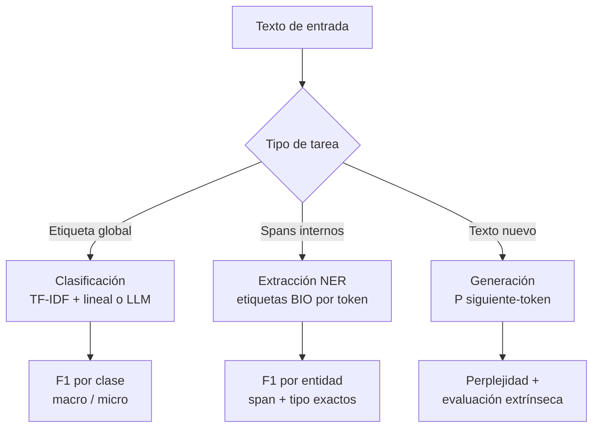

# 065 — Clasificación, extracción y generación de texto

> [← Clase anterior](../../../classes/part-05-language-vision-audio-and-multimodal-ai/064-tokenizacion-y-representacion-del-lenguaje/README.md) · [Índice de la parte](../README.md) · [Clase siguiente →](../../../classes/part-05-language-vision-audio-and-multimodal-ai/066-embeddings-semanticos-y-similitud/README.md)

**Parte:** 05 — Lenguaje, visión, audio e IA multimodal  
**Nivel:** avanzado · **Horas estimadas:** 6  
**Laboratorio:** `llm` · **Estado:** `EXECUTABLE_CORE`

## 🎯 Propósito

Comprender **clasificación, extracción y generación de texto** dentro de la evolución de la inteligencia
artificial, implementar un experimento mínimo verificable y distinguir qué parte
constituye evidencia frente a una afirmación todavía no comprobada.

## 📚 Resultados de aprendizaje

Al finalizar podrás:

1. Explicar clasificación, extracción y generación de texto usando los conceptos `NLP`, `NER`, `clasificación`, `generación`.
2. Ejecutar el laboratorio con una semilla explícita y revisar su contrato JSON.
3. Identificar al menos un supuesto, una limitación y un riesgo de aplicación.
4. Comparar el enfoque con la etapa anterior de la ruta de aprendizaje.
5. Producir una evidencia reproducible y una conclusión que no exceda los datos.

## 🧩 Conceptos centrales

`NLP`, `NER`, `clasificación`, `generación`

## 🗺️ Ubicación en el mapa de la IA

Con el texto ya tokenizado (clase 064), esta clase recorre las tres familias de tareas que
estructuran el PLN aplicado: **clasificar** (asignar una etiqueta al texto), **extraer**
(localizar entidades y relaciones dentro del texto) y **generar** (producir texto nuevo).
Son las tareas que el PLN estadístico resolvía con TF-IDF, HMM y n-gramas, y que los LLM de
la parte 06 resuelven hoy con un solo modelo. Entender las versiones clásicas —y sus
métricas: F1 por entidad, perplejidad— es lo que permite evaluar con rigor a los modelos
modernos.

## 📖 Fundamentos

### 🏷️ Clasificación de texto

Asignar una etiqueta a un documento: spam/no-spam, sentimiento, tema, idioma. El pipeline
clásico sigue siendo un baseline serio:

```text
texto → tokens → vector TF-IDF → clasificador lineal (regresión logística / SVM)
```

**TF-IDF** pondera cada término t en el documento d:

```text
tf(t, d)  = conteo de t en d (o su versión logarítmica)
idf(t)    = log(N / df(t))     N: nº de documentos, df: nº que contienen t
tfidf     = tf · idf
```

Un término frecuente en el documento pero raro en el corpus (alto tf, alto idf) es
distintivo; "el" aparece en todos los documentos → idf ≈ 0 → peso nulo. La evaluación usa
precisión, recall y F1 **por clase** (con clases desbalanceadas, la accuracy engaña) y la
media macro (todas las clases pesan igual) o micro (todos los ejemplos pesan igual).

### 🔍 Extracción: NER y etiquetado de secuencias

El **reconocimiento de entidades nombradas** (NER) localiza spans con tipo: persona,
organización, lugar, fecha, importe. Se modela como etiquetado token a token con el esquema
**BIO**: `B-TIPO` abre una entidad, `I-TIPO` la continúa, `O` es "fuera":

```text
Gabriela  Mistral  ganó   el  Nobel   en  1945
B-PER     I-PER    O      O   B-MISC  O   B-DATE
```

Los modelos clásicos (HMM, CRF) explotan que las etiquetas vecinas se restringen entre sí
(`I-PER` no puede seguir a `O`); los modernos ponen un clasificador por token sobre un
encoder tipo BERT. La métrica es **F1 a nivel de entidad**: una entidad cuenta como
acierto solo si el span completo y el tipo coinciden — `Gabriela` sola, con `Mistral`
fuera, es un error, no medio acierto.

### ✍️ Generación: modelos de lenguaje y perplejidad

Un **modelo de lenguaje** asigna probabilidad a secuencias, factorizada token a token:

```text
P(w1 … wn) = Π_i P(wi | w1 … w(i-1))
```

Los n-gramas truncan el contexto a n−1 palabras; los transformers lo extienden a miles de
tokens. Generar = muestrear iterativamente de `P(siguiente | contexto)` (con temperatura,
top-k o top-p controlando la aleatoriedad). La métrica intrínseca es la **perplejidad**:

```text
PP = P(w1 … wn) ^ (-1/n)
```

Es el "factor de ramificación efectivo": PP = 20 significa que, en promedio, el modelo
duda entre ~20 opciones equiprobables por token. Menor es mejor, pero solo es comparable
entre modelos con el **mismo tokenizador y el mismo corpus de prueba**. La calidad de la
generación para humanos exige además métricas extrínsecas (evaluación humana, tasas de
error factual), porque una perplejidad baja no garantiza texto veraz ni útil.

### ⚖️ Clásico vs LLM

Para clasificación con miles de ejemplos etiquetados, TF-IDF + regresión logística sigue
siendo rápido, barato, interpretable (pesos por término) y difícil de batir por poco
margen. El LLM gana cuando hay pocos o cero ejemplos, cuando la tarea exige comprensión
profunda, o cuando el espacio de salida es abierto (generación, resumen). La decisión es
de ingeniería: costo por inferencia, latencia, auditabilidad y deriva.

## 🧮 Ejemplo trabajado

**TF-IDF de un corpus de 3 documentos** (tf = conteo crudo, idf = log natural):

```text
d1: "el gato duerme"
d2: "el perro ladra"
d3: "el gato juega con el perro"

df: el=3, gato=2, perro=2, duerme=1, ladra=1, juega=1, con=1
idf: el    = ln(3/3) = 0
     gato  = ln(3/2) ≈ 0.405
     perro = ln(3/2) ≈ 0.405
     duerme = ladra = juega = con = ln(3/1) ≈ 1.099

TF-IDF de d3 (conteos: el=2, gato=1, juega=1, con=1, perro=1):
  el    → 2 · 0     = 0
  gato  → 1 · 0.405 = 0.405
  perro → 1 · 0.405 = 0.405
  juega → 1 · 1.099 = 1.099
  con   → 1 · 1.099 = 1.099
```

`el` desaparece pese a aparecer dos veces; `juega` y `con` dominan por raros. Un
clasificador lineal sobre estos vectores aprendería que `duerme`/`juega` discriminan
actividades y que `el` no aporta nada.

**Perplejidad mínima.** Si un modelo asigna a la frase de 4 tokens probabilidades
`0.5 · 0.25 · 0.5 · 0.125 = 0.00390625`, entonces
`PP = 0.00390625^(-1/4) = (2^-8)^(-1/4) = 2^2 = 4`: el modelo duda en promedio entre 4
opciones por token.

## 📊 Propiedades y comparación

| Tarea | Enfoque clásico | Enfoque neuronal/LLM | Métrica | Cuándo basta lo clásico |
|---|---|---|---|---|
| Clasificación | TF-IDF + lineal | Fine-tune BERT / prompt LLM | F1 macro | Miles de etiquetas, dominio estable |
| NER | CRF con features | Encoder + clasificador por token | F1 por entidad | Tipos estándar, texto formal |
| Generación | n-gramas | Transformer autoregresivo | Perplejidad + eval. humana | Prácticamente nunca (n-gramas solo como baseline) |



## ⚠️ Errores conceptuales frecuentes

1. **"Accuracy alta = buen clasificador."** Con 95 % de correos legítimos, predecir
   siempre "no spam" da 95 % de accuracy y 0 % de recall de spam. Con desbalance, mirar
   F1 por clase.
2. **"En NER, acertar la mayoría de los tokens es acertar."** La métrica estándar es por
   entidad completa: etiquetar `B-PER` en `Gabriela` pero `O` en `Mistral` cuenta como
   fallo total del span. El F1 por token infla el resultado.
3. **"Menor perplejidad = mejor texto."** La perplejidad mide ajuste distribucional al
   corpus de prueba, no veracidad, coherencia global ni utilidad; y no es comparable entre
   tokenizadores distintos.
4. **"La generación del modelo es una consulta a una base de datos."** Muestrear de
   `P(siguiente | contexto)` produce texto plausible, no hechos verificados: la fluidez es
   exactamente lo que hace peligrosa la alucinación.
5. **"El LLM siempre supera al baseline."** Sin medir, no: en clasificación con datos
   abundantes y dominio cerrado, un TF-IDF + lineal bien ajustado empata o gana con una
   fracción del costo y con pesos auditables.

## 🚀 Del aprendizaje a la operación

Operar estas tareas exige: un conjunto de prueba congelado y versionado por tarea, F1 por
clase/entidad con umbrales de alarma, monitoreo de deriva de vocabulario (el spam de hoy no
usa las palabras de 2020), un baseline clásico permanente como control de costo-beneficio
frente al LLM, y para generación, evaluación humana muestreada y detección de contenido
inventado antes de exponer el texto a usuarios.

## 🧪 Laboratorio

```bash
python lab.py
```

El laboratorio llama a `ai_evolution.labs.run_lab("llm")`. Esta
decisión evita 183 implementaciones divergentes: cada clase tiene un entrypoint
propio, pero los motores didácticos se prueban como una biblioteca común.

### 🔍 Evidencia esperada

- tipo de laboratorio y semilla;
- entradas o decisiones observables;
- resultado estructurado;
- lista `evidence` con hechos que pueden inspeccionarse;
- lista `limitations` que impide presentar la demo como producción.

## 📓 Notebooks

- [📓 `notebook.ipynb`](notebook.ipynb): recorrido guiado con la materia resumida.
- [✍️ `notebook_student.ipynb`](notebook_student.ipynb): ejercicios para resolver.
- [✅ `notebook_solution.ipynb`](notebook_solution.ipynb): solución de referencia explicada.

## 📝 Evaluación

| Criterio | Peso |
|---|---:|
| Comprensión conceptual | 25 % |
| Ejecución reproducible | 25 % |
| Interpretación basada en evidencia | 25 % |
| Riesgos, límites y mejora propuesta | 25 % |

Consulta [assessment.md](assessment.md) para preguntas y criterio de aceptación.

## ⚠️ Errores comunes

| Síntoma | Causa probable | Corrección |
|---|---|---|
| El código corre, pero no hay conclusión | Se confundió ejecución con aprendizaje | Explica qué demuestra y qué no demuestra |
| El resultado cambia sin explicación | No se registró semilla o configuración | Conserva semilla, versión y parámetros |
| Se promete uso real | Se extrapoló desde una demo educativa | Declara entorno, datos, límites y revisión humana |
| Se copia una métrica aislada | No existe baseline ni costo de error | Añade comparación y criterio de decisión |

## ❓ Preguntas frecuentes

**¿Debo usar una API comercial?**  
No. El núcleo funciona localmente. Las extensiones LIVE se documentan por separado.

**¿El laboratorio representa una implementación industrial?**  
No por sí solo. Enseña el contrato y el patrón; producción exige integración,
seguridad, observabilidad, pruebas y operación.

**¿Dónde profundizo?**  
Revisa las especializaciones enlazadas en el README raíz y la ruta siguiente.

## 🔗 Referencias

- Jurafsky, D. y Martin, J. H. *Speech and Language Processing* (3e): caps. de n-gramas, clasificación con Naive Bayes/regresión logística y etiquetado de secuencias — [web.stanford.edu/~jurafsky/slp3](https://web.stanford.edu/~jurafsky/slp3/)
- Manning, C., Raghavan, P. y Schütze, H. *Introduction to Information Retrieval*, cap. 6 (TF-IDF y modelo vectorial) — [nlp.stanford.edu/IR-book](https://nlp.stanford.edu/IR-book/)
- Devlin, J. et al. (2018). "BERT: Pre-training of Deep Bidirectional Transformers for Language Understanding" — [arXiv:1810.04805](https://arxiv.org/abs/1810.04805)
- Documentación de scikit-learn: Working with text data — [scikit-learn.org](https://scikit-learn.org/stable/modules/feature_extraction.html)
- Documentación de spaCy: Linguistic features (NER) — [spacy.io/usage/linguistic-features](https://spacy.io/usage/linguistic-features)

---

## ⬅️ Clase anterior

[064 — Tokenización y representación del lenguaje](../../part-05-language-vision-audio-and-multimodal-ai/064-tokenizacion-y-representacion-del-lenguaje/README.md)

## ➡️ Siguiente clase

[066 — Embeddings semánticos y similitud](../../part-05-language-vision-audio-and-multimodal-ai/066-embeddings-semanticos-y-similitud/README.md)
