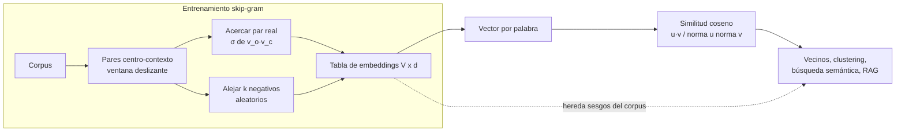

# 066 — Embeddings semánticos y similitud

> [← Clase anterior](../../../classes/part-05-language-vision-audio-and-multimodal-ai/065-clasificacion-extraccion-y-generacion-de-texto/README.md) · [Índice de la parte](../README.md) · [Clase siguiente →](../../../classes/part-05-language-vision-audio-and-multimodal-ai/067-reconocimiento-automatico-del-habla/README.md)

**Parte:** 05 — Lenguaje, visión, audio e IA multimodal  
**Nivel:** avanzado · **Horas estimadas:** 6  
**Laboratorio:** `retrieval` · **Estado:** `EXECUTABLE_CORE`

## 🎯 Propósito

Comprender **embeddings semánticos y similitud** dentro de la evolución de la inteligencia
artificial, implementar un experimento mínimo verificable y distinguir qué parte
constituye evidencia frente a una afirmación todavía no comprobada.

## 📚 Resultados de aprendizaje

Al finalizar podrás:

1. Explicar embeddings semánticos y similitud usando los conceptos `embeddings`, `similitud`, `clustering`, `búsqueda`.
2. Ejecutar el laboratorio con una semilla explícita y revisar su contrato JSON.
3. Identificar al menos un supuesto, una limitación y un riesgo de aplicación.
4. Comparar el enfoque con la etapa anterior de la ruta de aprendizaje.
5. Producir una evidencia reproducible y una conclusión que no exceda los datos.

## 🧩 Conceptos centrales

`embeddings`, `similitud`, `clustering`, `búsqueda`

## 🗺️ Ubicación en el mapa de la IA

word2vec (Mikolov et al., 2013) demostró que un objetivo simple —predecir palabras vecinas—
produce vectores donde la semántica es geometría: sinónimos cerca, analogías como
aritmética. Esa idea es hoy la infraestructura invisible de la IA moderna: los embeddings
alimentan la búsqueda semántica y el RAG (parte 08), los sistemas de recomendación, la
detección de duplicados y el espacio compartido de CLIP (clase 069). Esta clase formaliza
qué es un embedding, cómo se entrena, cómo se mide la similitud y qué sesgos hereda.

## 📖 Fundamentos

### 🧭 La hipótesis distribucional

"Conocerás una palabra por la compañía que mantiene" (Firth, 1957): palabras que aparecen
en contextos similares tienen significados similares. Un **embedding semántico** materializa
esta hipótesis: una función que asigna a cada texto (palabra, frase, documento) un vector
denso en `R^d` tal que la proximidad geométrica aproxime la similitud de significado.

### ⚙️ word2vec: skip-gram con muestreo negativo

Skip-gram entrena cada palabra para predecir sus vecinas dentro de una ventana. Con
**muestreo negativo**, el problema se vuelve una clasificación binaria barata:

```text
Para cada par observado (centro c, contexto o):
  maximizar  log σ(v_o · v_c)                          # par real → similitud alta
  y para k palabras aleatorias n_i (negativos):
  maximizar  Σ log σ(−v_{n_i} · v_c)                   # pares falsos → similitud baja
```

Cada actualización acerca el vector de la palabra central al de su contexto real y lo
aleja de contextos aleatorios. Tras ver miles de millones de pares, "perro" y "can"
acaban cerca porque comparten vecinos ("ladra", "correa", "veterinario"). CBOW es la
variante inversa (contexto → centro). El resultado famoso:
`v(rey) − v(hombre) + v(mujer) ≈ v(reina)` — las direcciones del espacio capturan
relaciones (género, capital-de, tiempo verbal) de forma aproximada.

### 📐 Similitud coseno

La métrica estándar compara direcciones, no magnitudes:

```text
cos(u, v) = (u · v) / (‖u‖ ‖v‖)     ∈ [−1, 1]
```

1 = misma dirección, 0 = ortogonales, −1 = opuestos. Se prefiere sobre la distancia
euclídea porque la norma de un embedding suele correlacionar con la frecuencia del término,
no con su significado. Sobre vectores **normalizados** (‖v‖ = 1), el coseno equivale al
producto punto y la búsqueda del vecino más cercano se acelera con índices aproximados
(ANN: HNSW, IVF — parte 08).

### 🧱 De palabras a frases: embeddings contextuales

word2vec asigna **un** vector por palabra: "banco" (asiento) y "banco" (entidad
financiera) colapsan en el mismo punto. Los encoders tipo BERT producen embeddings
**contextuales** (un vector por token *en su frase*), y modelos como Sentence-BERT se
afinan con pares de frases para que el coseno entre vectores de frase mida directamente
similitud semántica — la base de la búsqueda semántica y del RAG.

### ⚖️ Sesgo en embeddings

Los embeddings destilan las regularidades de su corpus, incluidas las indeseables.
Bolukbasi et al. (2016) mostraron en word2vec entrenado sobre noticias:
`v(programador) − v(hombre) + v(mujer) ≈ v(ama de casa)`. El sesgo no es un bug del
algoritmo sino un reflejo del texto de entrenamiento, y se propaga silenciosamente a
cualquier sistema construido encima (búsqueda de CV, moderación, recomendación). Las
mitigaciones (proyección fuera del subespacio de género, contrapesos de datos) reducen
métricas de sesgo específicas pero no lo eliminan: hay que **medirlo** en la tarea final.

## 🧮 Ejemplo trabajado

Tres embeddings 3D de juguete:

```text
gato  = (1, 2, 2)      perro = (2, 1, 2)      coche = (2, 0, −1)

cos(gato, perro) = (1·2 + 2·1 + 2·2) / (‖gato‖ ‖perro‖)
                 = 8 / (3 · 3) = 0.889
  con ‖gato‖ = √(1+4+4) = 3,  ‖perro‖ = √(4+1+4) = 3

cos(gato, coche) = (1·2 + 2·0 + 2·(−1)) / (3 · 3) = 0 / 9 = 0.000
cos(perro, coche) = (4 + 0 − 2) / (3 · 3) = 2 / 9 = 0.222
```

`gato` y `perro` comparten dirección (0.889); `gato` y `coche` son ortogonales (0.0).
Nota que `coche` tiene norma 3 igual que los otros: la magnitud no distingue nada aquí,
todo el significado está en la **dirección**. Un buscador semántico que indexara estos
tres vectores devolvería `perro` como vecino más cercano de `gato`.

## 📊 Propiedades y comparación

| Método | Vector por | Contexto | Entrenamiento | Límite principal |
|---|---|---|---|---|
| TF-IDF (clase 065) | documento | No (bolsa de palabras) | Ninguno (conteos) | Sin sinonimia: "auto" ≠ "coche" |
| word2vec / GloVe | palabra (estático) | Ventana local / global | Auto-supervisado, barato | Polisemia colapsada |
| BERT (token) | token en su frase | Bidireccional completo | Preentrenamiento masivo | No optimizado para similitud de frases |
| Sentence-BERT / E5 | frase o pasaje | Completo + fine-tune contrastivo | Pares de similitud | Dominio del fine-tune manda |



## ⚠️ Errores conceptuales frecuentes

1. **"Coseno alto = mismo significado."** El coseno mide co-ocurrencia aprendida:
   antónimos ("subir"/"bajar") comparten contextos y suelen tener similitud alta. Cerca en
   el espacio ≠ intercambiables.
2. **"La aritmética de analogías es una propiedad exacta."** `rey − hombre + mujer` cae
   *cerca* de `reina` solo si se excluyen los términos de la consulta y en analogías
   frecuentes; es una regularidad aproximada, no un álgebra garantizada.
3. **"Los embeddings son neutrales porque son matemáticos."** Codifican los estereotipos
   estadísticos de su corpus (Bolukbasi 2016); usarlos en decisiones sobre personas sin
   auditoría es importar ese sesgo.
4. **"Un vector por palabra basta."** La polisemia rompe los embeddings estáticos:
   "banco" financiero y "banco" de plaza comparten vector. Para frases y documentos se
   necesitan embeddings contextuales afinados para similitud.
5. **"Embeddings de modelos distintos son comparables."** Cada modelo define su propio
   espacio: el coseno entre un vector de word2vec y uno de E5 no significa nada; en un
   índice vectorial no se pueden mezclar versiones de modelo.

## 🚀 Del aprendizaje a la operación

Un sistema de búsqueda semántica real añade: elección y **versionado** del modelo de
embedding (cambiarlo obliga a reindexar todo), índices aproximados (HNSW) con su trade-off
recall/latencia, evaluación de recuperación con consultas reales anotadas (recall@k, MRR),
auditoría de sesgo cuando los resultados afectan a personas, y monitoreo de deriva de
dominio: un embedding entrenado en texto general degrada en jerga médica o legal sin que
ningún error explícito lo delate.

## 🧪 Laboratorio

```bash
python lab.py
```

El laboratorio llama a `ai_evolution.labs.run_lab("retrieval")`. Esta
decisión evita 183 implementaciones divergentes: cada clase tiene un entrypoint
propio, pero los motores didácticos se prueban como una biblioteca común.

### 🔍 Evidencia esperada

- tipo de laboratorio y semilla;
- entradas o decisiones observables;
- resultado estructurado;
- lista `evidence` con hechos que pueden inspeccionarse;
- lista `limitations` que impide presentar la demo como producción.

## 📓 Notebooks

- [📓 `notebook.ipynb`](notebook.ipynb): recorrido guiado con la materia resumida.
- [✍️ `notebook_student.ipynb`](notebook_student.ipynb): ejercicios para resolver.
- [✅ `notebook_solution.ipynb`](notebook_solution.ipynb): solución de referencia explicada.

## 📝 Evaluación

| Criterio | Peso |
|---|---:|
| Comprensión conceptual | 25 % |
| Ejecución reproducible | 25 % |
| Interpretación basada en evidencia | 25 % |
| Riesgos, límites y mejora propuesta | 25 % |

Consulta [assessment.md](assessment.md) para preguntas y criterio de aceptación.

## ⚠️ Errores comunes

| Síntoma | Causa probable | Corrección |
|---|---|---|
| El código corre, pero no hay conclusión | Se confundió ejecución con aprendizaje | Explica qué demuestra y qué no demuestra |
| El resultado cambia sin explicación | No se registró semilla o configuración | Conserva semilla, versión y parámetros |
| Se promete uso real | Se extrapoló desde una demo educativa | Declara entorno, datos, límites y revisión humana |
| Se copia una métrica aislada | No existe baseline ni costo de error | Añade comparación y criterio de decisión |

## ❓ Preguntas frecuentes

**¿Debo usar una API comercial?**  
No. El núcleo funciona localmente. Las extensiones LIVE se documentan por separado.

**¿El laboratorio representa una implementación industrial?**  
No por sí solo. Enseña el contrato y el patrón; producción exige integración,
seguridad, observabilidad, pruebas y operación.

**¿Dónde profundizo?**  
Revisa las especializaciones enlazadas en el README raíz y la ruta siguiente.

## 🔗 Referencias

- Jurafsky, D. y Martin, J. H. *Speech and Language Processing* (3e), cap. 6 (Vector Semantics and Embeddings) — [web.stanford.edu/~jurafsky/slp3](https://web.stanford.edu/~jurafsky/slp3/) — uso: desarrollo extendido del tema
- Mikolov, T. et al. (2013). "Efficient Estimation of Word Representations in Vector Space" (word2vec) — [arXiv:1301.3781](https://arxiv.org/abs/1301.3781) — uso: fuente primaria del mecanismo estudiado
- Pennington, J., Socher, R. y Manning, C. (2014). "GloVe: Global Vectors for Word Representation" — [nlp.stanford.edu/projects/glove](https://nlp.stanford.edu/projects/glove/) — uso: referencia consultada en su fuente original
- Bolukbasi, T. et al. (2016). "Man is to Computer Programmer as Woman is to Homemaker? Debiasing Word Embeddings" — [arXiv:1607.06520](https://arxiv.org/abs/1607.06520) — uso: fuente primaria del mecanismo estudiado
- Reimers, N. y Gurevych, I. (2019). "Sentence-BERT: Sentence Embeddings using Siamese BERT-Networks" — [arXiv:1908.10084](https://arxiv.org/abs/1908.10084) — uso: fuente primaria del mecanismo estudiado
- Documentación oficial de Sentence-Transformers — [sbert.net](https://www.sbert.net/) — uso: referencia consultada en su fuente original

<!-- papers:inicio -->

---

## 📜 Papers que fundamentan esta clase

> Bloque generado por `python scripts/link_papers_to_classes.py`. La fuente es [`papers/catalog/papers.json`](../../../papers/catalog/papers.json).

| Paper | Año | Qué desbloqueó | Miniatura |
|---|---:|---|---|
| [P05 · Estimación eficiente de representaciones de palabras en un espacio vectorial](../../../papers/foundational/P05_word2vec/README.md) | 2013 | El significado distribucional se vuelve barato: vectores densos entrenables sobre miles de millones de palabras. | [notebook](../../../notebooks/papers/P05_word2vec.ipynb) |
| [P23 · GloVe: vectores globales para representación de palabras](../../../papers/foundational/P23_glove/README.md) | 2014 | Unifica las dos familias de embeddings: factorizar estadísticas globales de co-ocurrencia con la ventaja de los métodos predictivos. | [notebook](../../../notebooks/papers/P23_glove.ipynb) |
| [P24 · Representaciones profundas de palabras dependientes del contexto](../../../papers/foundational/P24_elmo/README.md) | 2018 | Un vector por APARICIÓN y no por palabra: la polisemia deja de colapsar en un único punto del espacio. | [notebook](../../../notebooks/papers/P24_elmo.ipynb) |

Cada ficha explica el problema anterior, la matemática mínima, los límites y los errores de atribución más frecuentes. Para leerlas con método: [cómo leer un paper de IA](../../../papers/guides/COMO_LEER_UN_PAPER_DE_IA.md) · [anexos matemáticos](../../../papers/annexes/README.md).
<!-- papers:fin -->
---

## ⬅️ Clase anterior

[065 — Clasificación, extracción y generación de texto](../../part-05-language-vision-audio-and-multimodal-ai/065-clasificacion-extraccion-y-generacion-de-texto/README.md)

## ➡️ Siguiente clase

[067 — Reconocimiento automático del habla](../../part-05-language-vision-audio-and-multimodal-ai/067-reconocimiento-automatico-del-habla/README.md)
