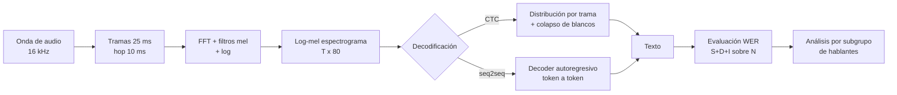

# 067 — Reconocimiento automático del habla

> [← Clase anterior](../../../classes/part-05-language-vision-audio-and-multimodal-ai/066-embeddings-semanticos-y-similitud/README.md) · [Índice de la parte](../README.md) · [Clase siguiente →](../../../classes/part-05-language-vision-audio-and-multimodal-ai/068-sintesis-de-voz-y-clonacion-responsable/README.md)

**Parte:** 05 — Lenguaje, visión, audio e IA multimodal  
**Nivel:** avanzado · **Horas estimadas:** 6  
**Laboratorio:** `perception` · **Estado:** `EXECUTABLE_CORE`

## 🎯 Propósito

Comprender **reconocimiento automático del habla** dentro de la evolución de la inteligencia
artificial, implementar un experimento mínimo verificable y distinguir qué parte
constituye evidencia frente a una afirmación todavía no comprobada.

## 📚 Resultados de aprendizaje

Al finalizar podrás:

1. Explicar reconocimiento automático del habla usando los conceptos `ASR`, `espectrograma`, `transcripción`, `WER`.
2. Ejecutar el laboratorio con una semilla explícita y revisar su contrato JSON.
3. Identificar al menos un supuesto, una limitación y un riesgo de aplicación.
4. Comparar el enfoque con la etapa anterior de la ruta de aprendizaje.
5. Producir una evidencia reproducible y una conclusión que no exceda los datos.

## 🧩 Conceptos centrales

`ASR`, `espectrograma`, `transcripción`, `WER`

## 🗺️ Ubicación en el mapa de la IA

El reconocimiento automático del habla (ASR) fue durante décadas el banco de pruebas del
modelado secuencial probabilístico (HMM + modelos de mezclas), luego de las redes
recurrentes con CTC (que ya viste en OCR, clase 063) y hoy de los transformers
encoder-decoder entrenados a escala masiva (Whisper, 2022). El ASR convierte la modalidad
audio en texto y con ello conecta todo lo anterior de esta parte con la voz: es la entrada
de los asistentes conversacionales, del subtitulado accesible (clase 072) y el complemento
exacto de la síntesis de voz (clase 068).

## 📖 Fundamentos

### 🎙️ Del aire a los números

El micrófono convierte presión sonora en una señal continua que se **muestrea** (16 000
muestras/s es el estándar en ASR) y **cuantiza** (16 bits). Un segundo de voz son 16 000
números: demasiado crudo y redundante para modelar directamente. El primer paso es
extraer una representación tiempo-frecuencia.

### 📊 Espectrogramas y MFCC

1. **Ventanas:** la señal se corta en tramas de ~25 ms con salto (hop) de 10 ms — la voz
   es aproximadamente estacionaria a esa escala.
2. **FFT por trama:** energía en cada frecuencia → **espectrograma** (matriz
   tiempo × frecuencia).
3. **Escala mel:** los filtros se espacian según la percepción humana (más resolución en
   graves); con log de la energía → **log-mel espectrograma**, la entrada estándar de los
   modelos neuronales actuales (Whisper usa 80 bandas mel).
4. **MFCC:** una transformada coseno discreta sobre el log-mel decorrelaciona los
   coeficientes; los primeros 12–13 describen la envolvente espectral (el "timbre" de
   cada fonema). Eran la entrada estándar de la era HMM-GMM.

### 🔗 El problema de alineación y CTC

Un audio de 3 s son ~300 tramas, pero la transcripción tiene ~10 palabras: no se sabe qué
trama corresponde a qué letra. **CTC** (Graves et al., 2006) resuelve la alineación igual
que en OCR: la red emite una distribución por trama sobre el alfabeto más el blanco `∅`,
y la pérdida suma la probabilidad de **todas** las alineaciones que colapsan a la
transcripción correcta (algoritmo forward-backward, programación dinámica). CTC asume
independencia condicional entre tramas, por eso suele combinarse con un modelo de lenguaje
externo durante la decodificación (beam search).

### 🌐 Whisper: ASR como seq2seq a escala

Whisper (Radford et al., 2022) abandona CTC: un transformer encoder-decoder recibe el
log-mel y **genera** el texto token a token, como una traducción audio→texto. Sus claves:

- Entrenado con **680 000 horas** de audio-texto recolectadas de la web (supervisión débil),
  multilingüe y multitarea (transcribir, traducir, detectar idioma) con tokens especiales
  de control.
- Robusto a acentos, ruido y dominios sin fine-tuning — la escala y diversidad del corpus
  sustituyen la adaptación manual.
- Costo: decodificación autoregresiva (más lenta que CTC) y **alucinaciones**: en
  silencios o música puede generar texto plausible que nadie dijo.

### 📏 WER: la métrica del ASR

```text
WER = (S + D + I) / N
```

con S sustituciones, D borrados, I inserciones (alineación de Levenshtein a nivel de
palabra) y N las palabras de la referencia. Ojo: WER puede superar el 100 % (inserciones
en exceso). Un WER global esconde estructura: los sistemas comerciales muestran WER
significativamente peor para acentos regionales, hablantes no nativos y voces infantiles
— la equidad se mide **por subgrupo de hablantes**, no en promedio.

## 🧮 Ejemplo trabajado

Referencia (N = 6): `el modelo transcribe la voz humana`
Hipótesis del ASR: `el modelos transcribe voz humana ya`

```text
Alineación óptima:
el      modelo   transcribe  la  voz  humana  —
el      modelos  transcribe  —   voz  humana  ya
OK      S        OK          D   OK   OK      I

S = 1 (modelo→modelos), D = 1 (falta "la"), I = 1 (sobra "ya")
WER = (1 + 1 + 1) / 6 = 0.5  →  50 %
```

Nota cómo un error morfológico mínimo ("modelos") cuenta igual que inventar una palabra:
WER es ciego a la gravedad semántica. Por eso en dominios críticos (medicina, justicia) se
complementa con revisión de términos clave.

**Tramas de un audio.** Un clip de 2 s a 16 kHz con ventana de 25 ms y hop de 10 ms
produce `1 + (2000 − 25)/10 ≈ 198` tramas; con 80 bandas mel, la entrada del modelo es
una matriz de `198 × 80`.

## 📊 Propiedades y comparación

| Era / sistema | Modelo acústico | Alineación | Datos típicos | Límite |
|---|---|---|---|---|
| HMM-GMM (1990s–2010s) | Mezclas gaussianas sobre MFCC | Estados HMM | 100–1 000 h transcritas | Pipeline complejo, frágil |
| RNN + CTC (2013–) | Red recurrente fin-a-fin | CTC (todas las alineaciones) | 1 000–10 000 h | Independencia condicional; necesita LM |
| Transformer seq2seq (Whisper, 2022) | Encoder-decoder sobre log-mel | Atención (implícita) | 680 000 h (supervisión débil) | Lento (autoregresivo); alucina en silencio |



## ⚠️ Errores conceptuales frecuentes

1. **"El ASR oye palabras."** El modelo ve energía tiempo-frecuencia; "oír" la palabra
   correcta depende tanto del modelo de lenguaje implícito como de la acústica — por eso
   inventa palabras plausibles ante audio degradado.
2. **"WER 5 % significa que el 95 % de las transcripciones son correctas."** WER es una
   tasa de error por palabra, no por transcripción: con frases de 20 palabras y errores
   independientes, casi dos tercios de las frases tendrían algún error.
3. **"Un buen WER promedio implica un sistema justo."** Los errores se concentran en
   acentos y voces subrepresentadas en el entrenamiento; sin desglose por subgrupo, el
   promedio oculta a quién falla.
4. **"Whisper no puede equivocarse si el audio está en silencio."** Al contrario: la
   decodificación autoregresiva sobre silencio o música es el caso típico de alucinación
   — texto fluido que nadie pronunció.
5. **"Más horas de audio siempre arreglan el dominio."** Si tu dominio (jerga médica,
   radio de aviación) no está en el corpus, la escala general no lo cubre: hace falta
   adaptación con datos del dominio y léxico específico.

## 🚀 Del aprendizaje a la operación

Un ASR en producción añade: detección de actividad de voz (VAD) para no transcribir
silencio, streaming con latencia parcial (transcripción incremental), diarización (¿quién
habla?), puntuación y normalización inversa de números/fechas, métricas por subgrupo de
hablantes y por término crítico, y un umbral de confianza que derive a transcripción
humana cuando el costo del error lo exija (actas legales, indicaciones médicas).

## 🧪 Laboratorio

```bash
python lab.py
```

El laboratorio llama a `ai_evolution.labs.run_lab("perception")`. Esta
decisión evita 180 implementaciones divergentes: cada clase tiene un entrypoint
propio, pero los motores didácticos se prueban como una biblioteca común.

### 🔍 Evidencia esperada

- tipo de laboratorio y semilla;
- entradas o decisiones observables;
- resultado estructurado;
- lista `evidence` con hechos que pueden inspeccionarse;
- lista `limitations` que impide presentar la demo como producción.

## 📓 Notebooks

- [📓 `notebook.ipynb`](notebook.ipynb): recorrido guiado con la materia resumida.
- [✍️ `notebook_student.ipynb`](notebook_student.ipynb): ejercicios para resolver.
- [✅ `notebook_solution.ipynb`](notebook_solution.ipynb): solución de referencia explicada.

## 📝 Evaluación

| Criterio | Peso |
|---|---:|
| Comprensión conceptual | 25 % |
| Ejecución reproducible | 25 % |
| Interpretación basada en evidencia | 25 % |
| Riesgos, límites y mejora propuesta | 25 % |

Consulta [assessment.md](assessment.md) para preguntas y criterio de aceptación.

## ⚠️ Errores comunes

| Síntoma | Causa probable | Corrección |
|---|---|---|
| El código corre, pero no hay conclusión | Se confundió ejecución con aprendizaje | Explica qué demuestra y qué no demuestra |
| El resultado cambia sin explicación | No se registró semilla o configuración | Conserva semilla, versión y parámetros |
| Se promete uso real | Se extrapoló desde una demo educativa | Declara entorno, datos, límites y revisión humana |
| Se copia una métrica aislada | No existe baseline ni costo de error | Añade comparación y criterio de decisión |

## ❓ Preguntas frecuentes

**¿Debo usar una API comercial?**  
No. El núcleo funciona localmente. Las extensiones LIVE se documentan por separado.

**¿El laboratorio representa una implementación industrial?**  
No por sí solo. Enseña el contrato y el patrón; producción exige integración,
seguridad, observabilidad, pruebas y operación.

**¿Dónde profundizo?**  
Revisa las especializaciones enlazadas en el README raíz y la ruta siguiente.

## 🔗 Referencias

- Jurafsky, D. y Martin, J. H. *Speech and Language Processing* (3e), cap. de Automatic Speech Recognition — [web.stanford.edu/~jurafsky/slp3](https://web.stanford.edu/~jurafsky/slp3/)
- Graves, A. et al. (2006). "Connectionist Temporal Classification: Labelling Unsegmented Sequence Data with Recurrent Neural Networks" (ICML 2006) — [cs.toronto.edu/~graves/icml_2006.pdf](https://www.cs.toronto.edu/~graves/icml_2006.pdf)
- Radford, A. et al. (2022). "Robust Speech Recognition via Large-Scale Weak Supervision" (Whisper) — [arXiv:2212.04356](https://arxiv.org/abs/2212.04356)
- Repositorio oficial de Whisper (OpenAI) — [github.com/openai/whisper](https://github.com/openai/whisper)
- Documentación de librosa (análisis de audio: espectrogramas, MFCC) — [librosa.org/doc](https://librosa.org/doc/)
- Mozilla Common Voice (corpus abierto multilingüe de voz) — [commonvoice.mozilla.org](https://commonvoice.mozilla.org/en/datasets)

---

## ⬅️ Clase anterior

[066 — Embeddings semánticos y similitud](../../part-05-language-vision-audio-and-multimodal-ai/066-embeddings-semanticos-y-similitud/README.md)

## ➡️ Siguiente clase

[068 — Síntesis de voz y clonación responsable](../../part-05-language-vision-audio-and-multimodal-ai/068-sintesis-de-voz-y-clonacion-responsable/README.md)
