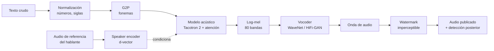

# 068 — Síntesis de voz y clonación responsable

> [← Clase anterior](../../../classes/part-05-language-vision-audio-and-multimodal-ai/067-reconocimiento-automatico-del-habla/README.md) · [Índice de la parte](../README.md) · [Clase siguiente →](../../../classes/part-05-language-vision-audio-and-multimodal-ai/069-modelos-vision-lenguaje/README.md)

**Parte:** 05 — Lenguaje, visión, audio e IA multimodal  
**Nivel:** avanzado · **Horas estimadas:** 6  
**Laboratorio:** `generation` · **Estado:** `EXECUTABLE_CORE`

## 🎯 Propósito

Comprender **síntesis de voz y clonación responsable** dentro de la evolución de la inteligencia
artificial, implementar un experimento mínimo verificable y distinguir qué parte
constituye evidencia frente a una afirmación todavía no comprobada.

## 📚 Resultados de aprendizaje

Al finalizar podrás:

1. Explicar síntesis de voz y clonación responsable usando los conceptos `TTS`, `voz`, `consentimiento`, `watermark`.
2. Ejecutar el laboratorio con una semilla explícita y revisar su contrato JSON.
3. Identificar al menos un supuesto, una limitación y un riesgo de aplicación.
4. Comparar el enfoque con la etapa anterior de la ruta de aprendizaje.
5. Producir una evidencia reproducible y una conclusión que no exceda los datos.

## 🧩 Conceptos centrales

`TTS`, `voz`, `consentimiento`, `watermark`

## 🗺️ Ubicación en el mapa de la IA

La síntesis de voz (TTS, *text-to-speech*) es la operación inversa del ASR de la clase
anterior: convierte texto en audio. Pasó de la concatenación de fragmentos grabados a la
generación neuronal directa de la onda con WaveNet (2016), que demostró que un modelo
autoregresivo podía producir voz casi indistinguible de la humana. Esa capacidad habilita
asistentes conversacionales y tecnología accesible (clase 072), pero también la **clonación
de voz** con segundos de audio, lo que convierte el consentimiento, el marcado (watermark)
y la detección de audio sintético en parte inseparable de la técnica.

## 📖 Fundamentos

### 🔤 Frontend de texto: normalización y G2P

El texto crudo no se pronuncia tal cual. El frontend aplica:

1. **Normalización:** expandir números, fechas, siglas y abreviaturas
   (`"Dr. Ruiz, 3/5/2026"` → `"doctor Ruiz, tres de mayo de dos mil veintiséis"`). Es
   dependiente del idioma y una fuente clásica de errores audibles.
2. **G2P (grapheme-to-phoneme):** convertir letras en fonemas. En español la relación es
   bastante regular; en inglés no (`though`, `tough`, `through`). Los sistemas modernos
   pueden operar sobre caracteres, pero el fonema sigue dando control fino de pronunciación.

### 🎼 Modelo acústico: texto → espectrograma (Tacotron 2)

Un seq2seq con atención (Tacotron 2, 2018) recibe la secuencia de fonemas/caracteres y
**predice el log-mel espectrograma** trama a trama (80 bandas, hop ~12,5 ms), más un *stop
token* que indica cuándo terminar. La atención aprende el alineamiento texto↔tiempo: cada
trama de audio "mira" a los fonemas que está pronunciando. La prosodia (entonación, pausas,
ritmo) emerge del corpus de entrenamiento: un solo hablante profesional con ~24 h de audio
limpio en el caso clásico.

### 🔊 Vocoder: espectrograma → onda

El mel descarta la fase: no se puede invertir directamente a audio. El **vocoder** genera
la onda condicionada en el mel:

- **WaveNet** (van den Oord et al., 2016) modela la onda muestra a muestra:

```text
p(x) = ∏ₜ p(xₜ | x₁ … xₜ₋₁)
```

  con **convoluciones causales dilatadas** (dilación 1, 2, 4, …, 512) que duplican el campo
  receptivo por capa. Calidad excelente, pero generación secuencial: un segundo de audio a
  16 kHz exige 16 000 pasos uno tras otro.
- **Vocoders paralelos** (HiFi-GAN y familia): redes generativas adversarias que producen
  toda la onda de una pasada — cientos de veces más rápidos, calidad comparable, y son el
  estándar práctico actual.

### 🗣️ Clonación de voz

La clonación desacopla **qué se dice** de **quién lo dice**. Un *speaker encoder*
(entrenado para verificación de hablante) comprime unos segundos de voz en un vector de
identidad (*d-vector* / *speaker embedding*); el modelo acústico se condiciona en ese
vector (SV2TTS, 2018). Consecuencia técnica y ética a la vez: **bastan segundos de audio
público para clonar una voz**, sin que el hablante participe ni lo sepa.

### 🛡️ Consentimiento, watermarking y detección

- **Consentimiento:** explícito, informado, documentado y con alcance definido (qué frases,
  en qué contextos, por cuánto tiempo, con derecho a revocación). Clonar la voz de alguien
  sin él es suplantación, no "una demo".
- **Watermarking de audio:** incrustar en la señal sintética un patrón imperceptible al
  oído pero detectable por un algoritmo, para poder responder después "¿este audio lo
  generó mi sistema?". No es infalible: recompresión, re-grabación con micrófono y filtrado
  pueden degradar la marca.
- **Detección de audio sintético:** clasificadores que buscan artefactos del vocoder. Es
  una carrera armamentista: cada generación de modelos borra los artefactos que detectaba
  la anterior; la defensa no puede descansar solo en el detector.

### 📏 Evaluación: MOS e inteligibilidad

- **MOS (Mean Opinion Score):** oyentes puntúan naturalidad de 1 a 5; se reporta la media
  (y debería reportarse el intervalo). Es subjetivo, caro y sensible al panel de oyentes.
- **Inteligibilidad objetiva (proxy):** pasar el audio sintético por un ASR y medir el WER
  contra el texto original — barato y automatizable, pero mide otra cosa que la naturalidad.

## 🧮 Ejemplo trabajado

**Campo receptivo de WaveNet.** Una pila de 10 convoluciones causales con kernel 2 y
dilaciones 1, 2, 4, …, 512:

```text
campo receptivo = 1 + Σ dilaciones = 1 + (1+2+4+…+512) = 1 + 1023 = 1024 muestras
a 16 kHz → 1024 / 16000 = 64 ms de contexto
con 3 pilas apiladas: 1 + 3·1023 = 3070 muestras ≈ 192 ms
```

**Costo autoregresivo.** Generar 2 s de audio a 16 kHz = 32 000 pasos secuenciales (cada
muestra espera a la anterior). Un vocoder paralelo produce las 32 000 muestras en una
pasada: esa es la diferencia entre demo de laboratorio y asistente en tiempo real.

**MOS con los mismos promedios.** Sistema A: [4, 4, 5, 3, 4] → media 4,0, desvío 0,63.
Sistema B: [5, 5, 5, 1, 4] → media 4,0, desvío 1,55. Igual MOS medio, experiencias muy
distintas: B suena excelente casi siempre y falla feo a veces. La media sola no decide.

## 📊 Propiedades y comparación

| Enfoque | Cómo genera | Calidad típica | Velocidad | Límite principal |
|---|---|---|---|---|
| Concatenativo (1990s–2000s) | Pega fragmentos grabados | Media, con "costuras" | Rápida | Rígido: solo lo grabado |
| Paramétrico HMM (2000s) | Estadísticas de vocoder clásico | Inteligible pero "robótica" | Rápida | Voz apagada, sobre-suavizada |
| Neuronal autoregresivo (WaveNet, 2016) | Muestra a muestra | Casi humana | Muy lenta | 16 000 pasos/segundo de audio |
| Neuronal paralelo (HiFi-GAN, 2020) | Onda completa en una pasada | Casi humana | Tiempo real | Entrenamiento adversario delicado |



## ⚠️ Errores conceptuales frecuentes

1. **"El TTS lee letras."** Lee texto normalizado y fonemas: sin frontend, "2026" o "Dr."
   se pronuncian mal. Gran parte de los errores audibles nacen antes de la red neuronal.
2. **"El espectrograma ya es el audio."** El mel descarta la fase; sin vocoder no hay onda.
   Modelo acústico y vocoder son dos problemas distintos con fallos distintos.
3. **"Clonar una voz exige horas de grabación."** Con speaker embeddings bastan segundos de
   audio público. Subestimar esto es subestimar el riesgo de suplantación.
4. **"El watermark resuelve el problema de los deepfakes."** Es una capa útil pero
   degradable (re-grabación, compresión) y solo cubre a los generadores que lo implementan.
   La defensa real combina marca, detección, procedencia y norma.
5. **"MOS 4,5 significa sistema terminado."** El MOS es subjetivo, depende del panel y del
   texto evaluado, y no mide robustez ante texto fuera de dominio ni errores de
   normalización.

## 🚀 Del aprendizaje a la operación

Un TTS operativo añade: síntesis en *streaming* con latencia de primeras muestras < 300 ms,
control de prosodia y pronunciación (SSML, léxicos por dominio), registro auditable de
consentimientos con alcance y revocación, watermarking activado por defecto más un canal de
verificación, y monitoreo de abuso (volumen anómalo de clonaciones, frases sensibles). Nada
de eso está en esta demo educativa.

## 🧪 Laboratorio

```bash
python lab.py
```

El laboratorio llama a `ai_evolution.labs.run_lab("generation")`. Esta
decisión evita 183 implementaciones divergentes: cada clase tiene un entrypoint
propio, pero los motores didácticos se prueban como una biblioteca común.

### 🔍 Evidencia esperada

- tipo de laboratorio y semilla;
- entradas o decisiones observables;
- resultado estructurado;
- lista `evidence` con hechos que pueden inspeccionarse;
- lista `limitations` que impide presentar la demo como producción.

## 📓 Notebooks

- [📓 `notebook.ipynb`](notebook.ipynb): recorrido guiado con la materia resumida.
- [✍️ `notebook_student.ipynb`](notebook_student.ipynb): ejercicios para resolver.
- [✅ `notebook_solution.ipynb`](notebook_solution.ipynb): solución de referencia explicada.

## 📝 Evaluación

| Criterio | Peso |
|---|---:|
| Comprensión conceptual | 25 % |
| Ejecución reproducible | 25 % |
| Interpretación basada en evidencia | 25 % |
| Riesgos, límites y mejora propuesta | 25 % |

Consulta [assessment.md](assessment.md) para preguntas y criterio de aceptación.

## ⚠️ Errores comunes

| Síntoma | Causa probable | Corrección |
|---|---|---|
| El código corre, pero no hay conclusión | Se confundió ejecución con aprendizaje | Explica qué demuestra y qué no demuestra |
| El resultado cambia sin explicación | No se registró semilla o configuración | Conserva semilla, versión y parámetros |
| Se promete uso real | Se extrapoló desde una demo educativa | Declara entorno, datos, límites y revisión humana |
| Se copia una métrica aislada | No existe baseline ni costo de error | Añade comparación y criterio de decisión |

## ❓ Preguntas frecuentes

**¿Debo usar una API comercial?**  
No. El núcleo funciona localmente. Las extensiones LIVE se documentan por separado.

**¿El laboratorio representa una implementación industrial?**  
No por sí solo. Enseña el contrato y el patrón; producción exige integración,
seguridad, observabilidad, pruebas y operación.

**¿Dónde profundizo?**  
Revisa las especializaciones enlazadas en el README raíz y la ruta siguiente.

## 🔗 Referencias

- van den Oord, A. et al. (2016). "WaveNet: A Generative Model for Raw Audio" — [arXiv:1609.03499](https://arxiv.org/abs/1609.03499)
- Shen, J. et al. (2018). "Natural TTS Synthesis by Conditioning WaveNet on Mel Spectrogram Predictions" (Tacotron 2) — [arXiv:1712.05884](https://arxiv.org/abs/1712.05884)
- Jia, Y. et al. (2018). "Transfer Learning from Speaker Verification to Multispeaker Text-To-Speech Synthesis" (SV2TTS) — [arXiv:1806.04558](https://arxiv.org/abs/1806.04558)
- Jurafsky, D. y Martin, J. H. *Speech and Language Processing* (3e), cap. de síntesis de voz — [web.stanford.edu/~jurafsky/slp3](https://web.stanford.edu/~jurafsky/slp3/)
- W3C. *Speech Synthesis Markup Language (SSML) 1.1* — [w3.org/TR/speech-synthesis11](https://www.w3.org/TR/speech-synthesis11/)
- Mozilla Common Voice (corpus abierto de voz con licencia y consentimiento explícitos) — [commonvoice.mozilla.org](https://commonvoice.mozilla.org/en/datasets)

<!-- papers:inicio -->

---

## 📜 Papers que fundamentan esta clase

> Bloque generado por `python scripts/link_papers_to_classes.py`. La fuente es [`papers/catalog/papers.json`](../../../papers/catalog/papers.json).

| Paper | Año | Qué desbloqueó | Miniatura |
|---|---:|---|---|
| [P119 · WaveNet: un modelo generativo de audio en crudo](../../../papers/foundational/P119_wavenet/README.md) | 2016 | Genera la forma de onda muestra a muestra con convoluciones causales dilatadas, y cierra la brecha de naturalidad que arrastraba la síntesis de voz. | [notebook](../../../notebooks/papers/P119_wavenet.ipynb) |
| [P122 · Síntesis de voz natural condicionando WaveNet con espectrogramas mel predichos](../../../papers/foundational/P122_tacotron/README.md) | 2018 | Parte la síntesis en dos etapas con el espectrograma mel como interfaz, y alcanza naturalidad indistinguible de una grabación en la escala de opinión media. | [notebook](../../../notebooks/papers/P122_tacotron.ipynb) |

Cada ficha explica el problema anterior, la matemática mínima, los límites y los errores de atribución más frecuentes. Para leerlas con método: [cómo leer un paper de IA](../../../papers/guides/COMO_LEER_UN_PAPER_DE_IA.md) · [anexos matemáticos](../../../papers/annexes/README.md).
<!-- papers:fin -->
---

## ⬅️ Clase anterior

[067 — Reconocimiento automático del habla](../../part-05-language-vision-audio-and-multimodal-ai/067-reconocimiento-automatico-del-habla/README.md)

## ➡️ Siguiente clase

[069 — Modelos visión-lenguaje](../../part-05-language-vision-audio-and-multimodal-ai/069-modelos-vision-lenguaje/README.md)
