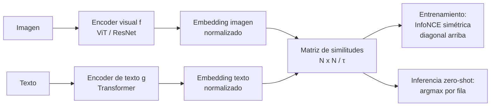

# 069 — Modelos visión-lenguaje

> [← Clase anterior](../../../classes/part-05-language-vision-audio-and-multimodal-ai/068-sintesis-de-voz-y-clonacion-responsable/README.md) · [Índice de la parte](../README.md) · [Clase siguiente →](../../../classes/part-05-language-vision-audio-and-multimodal-ai/070-fusion-multimodal-y-representacion-conjunta/README.md)

**Parte:** 05 — Lenguaje, visión, audio e IA multimodal  
**Nivel:** avanzado · **Horas estimadas:** 6  
**Laboratorio:** `attention` · **Estado:** `EXECUTABLE_CORE`

## 🎯 Propósito

Comprender **modelos visión-lenguaje** dentro de la evolución de la inteligencia
artificial, implementar un experimento mínimo verificable y distinguir qué parte
constituye evidencia frente a una afirmación todavía no comprobada.

## 📚 Resultados de aprendizaje

Al finalizar podrás:

1. Explicar modelos visión-lenguaje usando los conceptos `CLIP`, `VLM`, `alineamiento`, `grounding`.
2. Ejecutar el laboratorio con una semilla explícita y revisar su contrato JSON.
3. Identificar al menos un supuesto, una limitación y un riesgo de aplicación.
4. Comparar el enfoque con la etapa anterior de la ruta de aprendizaje.
5. Producir una evidencia reproducible y una conclusión que no exceda los datos.

## 🧩 Conceptos centrales

`CLIP`, `VLM`, `alineamiento`, `grounding`

## 🗺️ Ubicación en el mapa de la IA

Hasta aquí visión (clases 061-063) y lenguaje (064-066) vivían en espacios separados. CLIP
(2021) los unió: entrenó un codificador de imágenes y uno de texto para que imagen y
descripción correcta caigan **cerca en el mismo espacio vectorial**, usando 400 millones de
pares imagen-texto de la web. Ese alineamiento habilita clasificación *zero-shot* sin
reentrenar, y sus codificadores se volvieron piezas estándar de los generadores de imágenes
y de los LLM multimodales. Es el puente directo hacia la fusión multimodal (clase 070).

## 📖 Fundamentos

### 🧲 Doble codificador y aprendizaje contrastivo

CLIP entrena dos redes en paralelo: un codificador de imágenes `f(imagen)` (ResNet o ViT) y
un codificador de texto `g(texto)` (transformer). Ambos proyectan a un espacio común y se
normalizan a longitud 1, de modo que la **similitud coseno** es un producto punto.

Con un lote de N pares (imagen, texto), se calcula la matriz N×N de similitudes. El
objetivo contrastivo (InfoNCE) empuja la diagonal (pares verdaderos) hacia arriba y el
resto hacia abajo, en ambas direcciones:

```text
s_ij = f(img_i) · g(txt_j) / τ          (τ = temperatura, aprendida)

L = ½ [ CE por filas (imagen → texto correcto)
      + CE por columnas (texto → imagen correcta) ]
```

La **temperatura τ** escala las similitudes antes del softmax: τ pequeña produce
distribuciones afiladas (castiga fuerte al segundo mejor), τ grande las suaviza. No hay
etiquetas de clase: la supervisión es "este texto acompañaba a esta imagen en la web".

### 🎯 Clasificación zero-shot

Para clasificar sin entrenar nada nuevo:

1. Convertir cada clase en una frase-plantilla: `"una foto de un {perro}"`.
2. Codificar las frases con `g` → un embedding por clase.
3. Codificar la imagen con `f` y elegir la clase de mayor similitud coseno.

El *prompt* importa: "a photo of a dog" rinde mejor que "dog" porque se parece más a los
pies de foto vistos en el entrenamiento; promediar varias plantillas (*prompt ensembling*)
mejora aún más. Zero-shot no significa "sin datos": significa que los 400 M de pares del
preentrenamiento ya cubrieron el concepto.

### ❓ VQA y grounding

- **VQA (Visual Question Answering):** responder preguntas en lenguaje natural sobre una
  imagen ("¿cuántas tazas hay?"). Exige combinar percepción, lenguaje y a veces conteo o
  razonamiento espacial — más que similitud global.
- **Grounding:** anclar palabras a regiones concretas de la imagen ("la taza *roja*" → esa
  caja). CLIP produce un embedding **global** por imagen: sabe *qué* hay, no *dónde*; el
  grounding fino requiere arquitecturas con atención espacial o detección (clase 062).
- Los VLM generativos (Flamingo, LLaVA) conectan un codificador visual con un LLM que
  **genera** texto condicionado en la imagen: eso permite VQA y descripción libres, con el
  costo de heredar las alucinaciones del LLM.

### 🌍 Datos, sesgos y fallos característicos

El par imagen-texto de la web trae sus sesgos: asociaciones culturales, estereotipos y
desbalance de idiomas quedan impresos en el espacio compartido. Fallos conocidos de CLIP:
comportamiento de "bolsa de palabras" (ordena mal relaciones como agente/paciente),
debilidad en conteo y en relaciones espaciales, y **ataques tipográficos**: un papel con la
palabra "iPod" pegado a una manzana desplaza el embedding hacia "iPod".

## 🧮 Ejemplo trabajado

Espacio compartido de dimensión 3, todo ya normalizado. Una imagen y tres textos:

```text
img          = (0.8, 0.6, 0.0)
t_perro      = (1, 0, 0)     t_gato = (0, 1, 0)     t_avión = (0, 0, 1)

Similitudes coseno (producto punto):
s(img, t_perro) = 0.8      s(img, t_gato) = 0.6      s(img, t_avión) = 0.0

Softmax con temperatura τ = 0.5 → logits (1.6, 1.2, 0.0):
exp: (4.95, 3.32, 1.00)  suma = 9.27
p = (0.53, 0.36, 0.11)   → predicción zero-shot: "perro"

Con τ = 0.1 → logits (8, 6, 0): p ≈ (0.88, 0.12, 0.00) — misma decisión, mucha más
confianza aparente. La temperatura no cambia el ranking, cambia la calibración.
```

## 📊 Propiedades y comparación

| Enfoque | Supervisión | ¿Clases nuevas sin reentrenar? | ¿Localiza? | Límite principal |
|---|---|---|---|---|
| Clasificador supervisado (061) | Etiquetas por clase | No | No | Congelado en sus clases |
| Detector (062) | Cajas etiquetadas | No | Sí | Anotación costosa |
| CLIP zero-shot (2021) | 400 M pares web | Sí (vía prompt) | No | Bolsa de palabras, conteo |
| VLM generativo (Flamingo/LLaVA) | Pares + instrucciones | Sí (pregunta libre) | Parcial | Alucina detalles |



## ⚠️ Errores conceptuales frecuentes

1. **"CLIP entiende la frase."** Se comporta en gran medida como bolsa de palabras: "un
   perro persigue a un gato" y "un gato persigue a un perro" caen casi en el mismo punto
   del espacio. El alineamiento es de conceptos, no de sintaxis.
2. **"Zero-shot = aprender sin datos."** Hubo 400 millones de pares de entrenamiento; lo
   que no hay es *fine-tuning* por tarea. Si tu dominio (radiografías, microscopía) no
   estaba en la web, el zero-shot se degrada fuerte.
3. **"Mayor similitud = verdad."** La similitud es relativa al conjunto de prompts que tú
   escribiste; si la clase verdadera no está entre las opciones, el argmax elige igual un
   ganador equivocado con confianza.
4. **"CLIP sabe dónde está el objeto."** El embedding es global; para cajas o máscaras
   hacen falta arquitecturas de detección/segmentación o grounding explícito.
5. **"El espacio compartido es neutral."** Hereda los sesgos y estereotipos del texto web
   que lo entrenó, y es vulnerable a texto adversario dentro de la propia imagen.

## 🚀 Del aprendizaje a la operación

Un VLM en producción exige: evaluación con un conjunto propio del dominio (no confiar en el
zero-shot reportado en benchmarks), diseño y versionado de prompts de clase, calibración de
umbrales de similitud para poder decir "ninguna de las anteriores", pruebas de robustez
ante texto adversario en imagen, y auditoría de sesgos sobre subgrupos representativos
antes de exponer decisiones a usuarios.

## 🧪 Laboratorio

```bash
python lab.py
```

El laboratorio llama a `ai_evolution.labs.run_lab("attention")`. Esta
decisión evita 183 implementaciones divergentes: cada clase tiene un entrypoint
propio, pero los motores didácticos se prueban como una biblioteca común.

### 🔍 Evidencia esperada

- tipo de laboratorio y semilla;
- entradas o decisiones observables;
- resultado estructurado;
- lista `evidence` con hechos que pueden inspeccionarse;
- lista `limitations` que impide presentar la demo como producción.

## 📓 Notebooks

- [📓 `notebook.ipynb`](notebook.ipynb): recorrido guiado con la materia resumida.
- [✍️ `notebook_student.ipynb`](notebook_student.ipynb): ejercicios para resolver.
- [✅ `notebook_solution.ipynb`](notebook_solution.ipynb): solución de referencia explicada.

## 📝 Evaluación

| Criterio | Peso |
|---|---:|
| Comprensión conceptual | 25 % |
| Ejecución reproducible | 25 % |
| Interpretación basada en evidencia | 25 % |
| Riesgos, límites y mejora propuesta | 25 % |

Consulta [assessment.md](assessment.md) para preguntas y criterio de aceptación.

## ⚠️ Errores comunes

| Síntoma | Causa probable | Corrección |
|---|---|---|
| El código corre, pero no hay conclusión | Se confundió ejecución con aprendizaje | Explica qué demuestra y qué no demuestra |
| El resultado cambia sin explicación | No se registró semilla o configuración | Conserva semilla, versión y parámetros |
| Se promete uso real | Se extrapoló desde una demo educativa | Declara entorno, datos, límites y revisión humana |
| Se copia una métrica aislada | No existe baseline ni costo de error | Añade comparación y criterio de decisión |

## ❓ Preguntas frecuentes

**¿Debo usar una API comercial?**  
No. El núcleo funciona localmente. Las extensiones LIVE se documentan por separado.

**¿El laboratorio representa una implementación industrial?**  
No por sí solo. Enseña el contrato y el patrón; producción exige integración,
seguridad, observabilidad, pruebas y operación.

**¿Dónde profundizo?**  
Revisa las especializaciones enlazadas en el README raíz y la ruta siguiente.

## 🔗 Referencias

- Radford, A. et al. (2021). "Learning Transferable Visual Models From Natural Language Supervision" (CLIP) — [arXiv:2103.00020](https://arxiv.org/abs/2103.00020)
- van den Oord, A. et al. (2018). "Representation Learning with Contrastive Predictive Coding" (InfoNCE) — [arXiv:1807.03748](https://arxiv.org/abs/1807.03748)
- Antol, S. et al. (2015). "VQA: Visual Question Answering" — [arXiv:1505.00468](https://arxiv.org/abs/1505.00468)
- Alayrac, J.-B. et al. (2022). "Flamingo: a Visual Language Model for Few-Shot Learning" — [arXiv:2204.14198](https://arxiv.org/abs/2204.14198)
- Repositorio oficial de CLIP (OpenAI) — [github.com/openai/CLIP](https://github.com/openai/CLIP)
- Szeliski, R. *Computer Vision: Algorithms and Applications* (2e) — [szeliski.org/Book](http://szeliski.org/Book/)

---

## ⬅️ Clase anterior

[068 — Síntesis de voz y clonación responsable](../../part-05-language-vision-audio-and-multimodal-ai/068-sintesis-de-voz-y-clonacion-responsable/README.md)

## ➡️ Siguiente clase

[070 — Fusión multimodal y representación conjunta](../../part-05-language-vision-audio-and-multimodal-ai/070-fusion-multimodal-y-representacion-conjunta/README.md)
