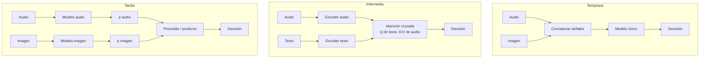

# 070 — Fusión multimodal y representación conjunta

> [← Clase anterior](../../../classes/part-05-language-vision-audio-and-multimodal-ai/069-modelos-vision-lenguaje/README.md) · [Índice de la parte](../README.md) · [Clase siguiente →](../../../classes/part-05-language-vision-audio-and-multimodal-ai/071-sensores-series-y-percepcion-en-el-borde/README.md)

**Parte:** 05 — Lenguaje, visión, audio e IA multimodal  
**Nivel:** avanzado · **Horas estimadas:** 6  
**Laboratorio:** `attention` · **Estado:** `EXECUTABLE_CORE`

## 🎯 Propósito

Comprender **fusión multimodal y representación conjunta** dentro de la evolución de la inteligencia
artificial, implementar un experimento mínimo verificable y distinguir qué parte
constituye evidencia frente a una afirmación todavía no comprobada.

## 📚 Resultados de aprendizaje

Al finalizar podrás:

1. Explicar fusión multimodal y representación conjunta usando los conceptos `fusión`, `cross-attention`, `modalidades`, `alineamiento`.
2. Ejecutar el laboratorio con una semilla explícita y revisar su contrato JSON.
3. Identificar al menos un supuesto, una limitación y un riesgo de aplicación.
4. Comparar el enfoque con la etapa anterior de la ruta de aprendizaje.
5. Producir una evidencia reproducible y una conclusión que no exceda los datos.

## 🧩 Conceptos centrales

`fusión`, `cross-attention`, `modalidades`, `alineamiento`

## 🗺️ Ubicación en el mapa de la IA

Las clases anteriores produjeron representaciones por modalidad (visión, texto, audio) y
CLIP mostró cómo **alinear** dos de ellas en un espacio común. La fusión multimodal es el
paso siguiente: decidir *dónde y cómo* combinar las modalidades dentro de un modelo para
que se informen mutuamente. La atención cruzada — el mecanismo del transformer aplicado
entre modalidades — es hoy el pegamento de los LLM multimodales (Flamingo, LLaVA, GPT-4V) y
prepara el terreno para percepción con sensores (071) y el proyecto integrador (072).

## 📖 Fundamentos

### 🧱 Tres estrategias de fusión

- **Fusión temprana (early):** concatenar las características crudas o de bajo nivel de
  ambas modalidades y entrenar un único modelo sobre el vector conjunto. Máxima capacidad
  de capturar interacciones finas, pero exige modalidades sincronizadas, sufre con
  dimensiones muy dispares y se rompe si falta una modalidad.
- **Fusión tardía (late):** cada modalidad tiene su propio modelo hasta la decisión; se
  combinan las **salidas** (promedio, producto de probabilidades, votación, meta-modelo).
  Modular y robusta a modalidades faltantes, pero ciega a interacciones — no puede aprender
  que "este sonido + esta imagen juntos significan otra cosa".
- **Fusión intermedia:** cada modalidad se codifica por separado y las representaciones
  intermedias se comunican dentro de la red — típicamente con **atención cruzada**. Es el
  compromiso dominante: interacción rica sin mezclar señales crudas.

### 🔀 Atención cruzada, paso a paso

En la autoatención, consultas (Q), claves (K) y valores (V) salen de la misma secuencia. En
la **atención cruzada**, Q sale de la modalidad A y K, V de la modalidad B:

```text
Q = X_A · W_Q        K = X_B · W_K        V = X_B · W_V

Atención(Q, K, V) = softmax( Q · Kᵀ / √d ) · V
```

Lectura: cada elemento de A (p. ej., un token de texto) pregunta "¿qué partes de B (p. ej.,
parches de la imagen) me son relevantes?" y recibe un resumen ponderado de B. La dirección
importa: texto→imagen y imagen→texto son operaciones distintas con parámetros distintos. En
Flamingo, capas de atención cruzada insertadas en un LLM congelado dejan que el texto
"consulte" las características visuales sin reentrenar el LLM.

### 📐 Alineación de espacios de representación

Fusionar exige que las representaciones sean comparables:

- **Alineación contrastiva (CLIP, clase 069):** entrenar los codificadores para que pares
  correspondientes queden cerca. Requiere grandes volúmenes de pares.
- **Proyección aprendida (LLaVA):** una capa lineal o un MLP pequeño proyecta los embeddings
  visuales al espacio de tokens de un LLM ya entrenado — la imagen entra "disfrazada" de
  palabras.
- **Precursor clásico:** CCA (análisis de correlación canónica) buscaba proyecciones
  lineales maximalmente correlacionadas entre dos vistas; útil como referencia histórica y
  baseline.

También hay que alinear en el **tiempo** (video↔audio: misma escala temporal) y en la
**granularidad** (palabra↔parche, frase↔imagen completa).

### 🧩 Modalidades faltantes y dominancia

Dos problemas prácticos definen el diseño: (1) **ausencia** — en despliegue el micrófono
falla o el usuario no envía imagen; la fusión tardía degrada con gracia, la temprana
necesita entrenamiento con *dropout de modalidades* para tolerarlo; (2) **dominancia** — si
una modalidad es más predictiva o tiene más señal, el modelo puede ignorar la otra por
completo y aparentar ser multimodal sin serlo (se diagnostica evaluando con cada modalidad
anulada).

## 🧮 Ejemplo trabajado

Atención cruzada mínima (d = 2). Un token de texto consulta dos parches de imagen:

```text
Q = (2, 0)
K₁ = (1, 0)   V₁ = (1, 0)      ← parche 1
K₂ = (0, 1)   V₂ = (0, 1)      ← parche 2

Puntajes:  Q·K₁/√2 = 2/1.414 = 1.414      Q·K₂/√2 = 0

Softmax:   exp(1.414) = 4.11,  exp(0) = 1.00  → pesos (0.80, 0.20)

Salida:    0.80·V₁ + 0.20·V₂ = (0.80, 0.20)
```

El token de texto se lleva un resumen de la imagen dominado por el parche 1 (el que
"apunta" en su misma dirección), sin descartar del todo el parche 2. Con temperatura
implícita √d mayor (d = 64 real), los mismos productos punto darían pesos más suaves.

**Fusión tardía con desacuerdo.** El clasificador de audio dice (0.6, 0.4) y el de visión
(0.2, 0.8). Promedio: (0.4, 0.6) → clase 2; producto renormalizado: (0.12, 0.32) →
(0.27, 0.73) → clase 2 con más margen. El producto castiga más el desacuerdo; el promedio
es más conservador. Ninguno aprendió *por qué* discrepan — eso solo lo puede una fusión
con interacción.

## 📊 Propiedades y comparación

| Estrategia | Interacciones entre modalidades | ¿Tolera modalidad faltante? | Sincronización requerida | Costo |
|---|---|---|---|---|
| Temprana | Ricas (a nivel de señal) | Mal (requiere dropout de modalidades) | Alta | Un modelo grande |
| Tardía | Ninguna (solo decisiones) | Bien | Baja | N modelos + combinador |
| Intermedia (cross-attention) | Ricas (a nivel de representación) | Regular-bien | Media | Capas de atención extra |



## ⚠️ Errores conceptuales frecuentes

1. **"Concatenar vectores ya es fusionar."** Concatenar solo yuxtapone; si el modelo
   posterior es poco expresivo, nunca modela interacciones entre modalidades. Fusionar es
   permitir que una modalidad *modifique la lectura* de la otra.
2. **"La fusión tardía capta interacciones si los modelos son buenos."** No puede: combina
   decisiones ya tomadas. El sarcasmo (texto positivo + tono negativo) es invisible para
   una fusión tardía por diseño.
3. **"La atención cruzada es simétrica."** texto→imagen e imagen→texto usan Q, K, V
   distintos y producen resultados distintos; elegir la dirección es una decisión de
   arquitectura.
4. **"Más modalidades siempre mejoran."** Una modalidad ruidosa o dominante puede degradar
   el conjunto; hay que medir la contribución de cada una con ablaciones (anular una
   modalidad y comparar).
5. **"Los espacios se alinean solos."** Sin pares de entrenamiento o proyección aprendida,
   los embeddings de dos codificadores independientes no son comparables: la similitud
   entre espacios no alineados no significa nada.

## 🚀 Del aprendizaje a la operación

Un sistema multimodal real añade: manejo explícito de modalidades faltantes o corruptas
(timeouts del micrófono, imágenes ilegibles) con degradación controlada, ablaciones
periódicas para detectar dominancia de una modalidad, sincronización temporal medida (no
supuesta) entre flujos, presupuesto de cómputo por modalidad, y monitoreo de deriva por
canal — la cámara y el micrófono envejecen a ritmos distintos.

## 🧪 Laboratorio

```bash
python lab.py
```

El laboratorio llama a `ai_evolution.labs.run_lab("attention")`. Esta
decisión evita 183 implementaciones divergentes: cada clase tiene un entrypoint
propio, pero los motores didácticos se prueban como una biblioteca común.

### 🔍 Evidencia esperada

- tipo de laboratorio y semilla;
- entradas o decisiones observables;
- resultado estructurado;
- lista `evidence` con hechos que pueden inspeccionarse;
- lista `limitations` que impide presentar la demo como producción.

## 📓 Notebooks

- [📓 `notebook.ipynb`](notebook.ipynb): recorrido guiado con la materia resumida.
- [✍️ `notebook_student.ipynb`](notebook_student.ipynb): ejercicios para resolver.
- [✅ `notebook_solution.ipynb`](notebook_solution.ipynb): solución de referencia explicada.

## 📝 Evaluación

| Criterio | Peso |
|---|---:|
| Comprensión conceptual | 25 % |
| Ejecución reproducible | 25 % |
| Interpretación basada en evidencia | 25 % |
| Riesgos, límites y mejora propuesta | 25 % |

Consulta [assessment.md](assessment.md) para preguntas y criterio de aceptación.

## ⚠️ Errores comunes

| Síntoma | Causa probable | Corrección |
|---|---|---|
| El código corre, pero no hay conclusión | Se confundió ejecución con aprendizaje | Explica qué demuestra y qué no demuestra |
| El resultado cambia sin explicación | No se registró semilla o configuración | Conserva semilla, versión y parámetros |
| Se promete uso real | Se extrapoló desde una demo educativa | Declara entorno, datos, límites y revisión humana |
| Se copia una métrica aislada | No existe baseline ni costo de error | Añade comparación y criterio de decisión |

## ❓ Preguntas frecuentes

**¿Debo usar una API comercial?**  
No. El núcleo funciona localmente. Las extensiones LIVE se documentan por separado.

**¿El laboratorio representa una implementación industrial?**  
No por sí solo. Enseña el contrato y el patrón; producción exige integración,
seguridad, observabilidad, pruebas y operación.

**¿Dónde profundizo?**  
Revisa las especializaciones enlazadas en el README raíz y la ruta siguiente.

## 🔗 Referencias

- Baltrušaitis, T., Ahuja, C. y Morency, L.-P. (2017). "Multimodal Machine Learning: A Survey and Taxonomy" — [arXiv:1705.09406](https://arxiv.org/abs/1705.09406) — uso: fuente primaria del mecanismo estudiado
- Vaswani, A. et al. (2017). "Attention Is All You Need" — [arXiv:1706.03762](https://arxiv.org/abs/1706.03762) — uso: fuente primaria del mecanismo estudiado
- Alayrac, J.-B. et al. (2022). "Flamingo: a Visual Language Model for Few-Shot Learning" — [arXiv:2204.14198](https://arxiv.org/abs/2204.14198) — uso: fuente primaria del mecanismo estudiado
- Liu, H. et al. (2023). "Visual Instruction Tuning" (LLaVA) — [arXiv:2304.08485](https://arxiv.org/abs/2304.08485) — uso: fuente primaria del mecanismo estudiado
- Radford, A. et al. (2021). "Learning Transferable Visual Models From Natural Language Supervision" (CLIP) — [arXiv:2103.00020](https://arxiv.org/abs/2103.00020) — uso: fuente primaria del mecanismo estudiado

<!-- papers:inicio -->

---

## 📜 Papers que fundamentan esta clase

> Bloque generado por `python scripts/link_papers_to_classes.py`. La fuente es [`papers/catalog/papers.json`](../../../papers/catalog/papers.json).

| Paper | Año | Qué desbloqueó | Miniatura |
|---|---:|---|---|
| [P18 · Aprender modelos visuales transferibles con supervisión de lenguaje natural](../../../papers/foundational/P18_clip/README.md) | 2021 | El texto se convierte en la etiqueta: un solo modelo clasifica categorías que nadie anotó, describiéndolas con palabras. | [notebook](../../../notebooks/papers/P18_clip.ipynb) |

Cada ficha explica el problema anterior, la matemática mínima, los límites y los errores de atribución más frecuentes. Para leerlas con método: [cómo leer un paper de IA](../../../papers/guides/COMO_LEER_UN_PAPER_DE_IA.md) · [anexos matemáticos](../../../papers/annexes/README.md).
<!-- papers:fin -->
---

## ⬅️ Clase anterior

[069 — Modelos visión-lenguaje](../../part-05-language-vision-audio-and-multimodal-ai/069-modelos-vision-lenguaje/README.md)

## ➡️ Siguiente clase

[071 — Sensores, series y percepción en el borde](../../part-05-language-vision-audio-and-multimodal-ai/071-sensores-series-y-percepcion-en-el-borde/README.md)
