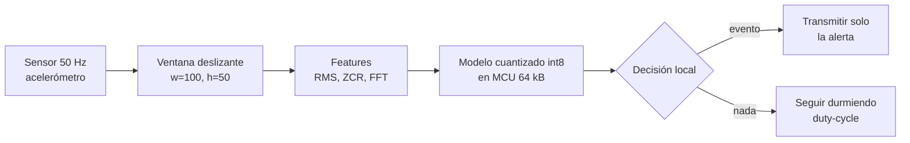

# 071 — Sensores, series y percepción en el borde

> [← Clase anterior](../../../classes/part-05-language-vision-audio-and-multimodal-ai/070-fusion-multimodal-y-representacion-conjunta/README.md) · [Índice de la parte](../README.md) · [Clase siguiente →](../../../classes/part-05-language-vision-audio-and-multimodal-ai/072-proyecto-asistente-multimodal-accesible/README.md)

**Parte:** 05 — Lenguaje, visión, audio e IA multimodal  
**Nivel:** avanzado · **Horas estimadas:** 6  
**Laboratorio:** `robotics` · **Estado:** `EXECUTABLE_CORE`

## 🎯 Propósito

Comprender **sensores, series y percepción en el borde** dentro de la evolución de la inteligencia
artificial, implementar un experimento mínimo verificable y distinguir qué parte
constituye evidencia frente a una afirmación todavía no comprobada.

## 📚 Resultados de aprendizaje

Al finalizar podrás:

1. Explicar sensores, series y percepción en el borde usando los conceptos `sensores`, `edge`, `latencia`, `fusión`.
2. Ejecutar el laboratorio con una semilla explícita y revisar su contrato JSON.
3. Identificar al menos un supuesto, una limitación y un riesgo de aplicación.
4. Comparar el enfoque con la etapa anterior de la ruta de aprendizaje.
5. Producir una evidencia reproducible y una conclusión que no exceda los datos.

## 🧩 Conceptos centrales

`sensores`, `edge`, `latencia`, `fusión`

## 🗺️ Ubicación en el mapa de la IA

La percepción no termina en cámaras y micrófonos: acelerómetros, giroscopios, sensores de
temperatura, presión o corriente producen **series temporales** que también se clasifican y
se fusionan. La novedad de esta clase es *dónde* ocurre la inferencia: en el **borde**
(edge) — el propio dispositivo — por latencia, energía, costo y privacidad. El TinyML lleva
redes neuronales a microcontroladores con kilobytes de RAM, y conecta esta parte con la
robótica (parte 06) y con el asistente del proyecto final (072).

## 📖 Fundamentos

### ⏱️ Ventanas deslizantes

Un flujo continuo de sensor no se clasifica entero: se corta en **ventanas** de tamaño fijo
`w` que avanzan con un salto `h` (hop). Con solapamiento (`h < w`) se generan más ejemplos
y no se pierden eventos que caen en el borde de una ventana.

```text
n_ventanas = 1 + ⌊(T − w) / h⌋        (T, w, h en muestras)
```

Cada ventana recibe una etiqueta (la actividad dominante) y se convierte en un ejemplo de
entrenamiento. Decisiones críticas: `w` debe cubrir el fenómeno (un paso al caminar ~1 s;
una caída ~2 s) y `h` fija la latencia de decisión — con hop de 1 s, la respuesta llega
como pronto 1 s después.

### 📈 Features temporales clásicas

Antes (o en lugar) de una red profunda, cada ventana se resume con estadísticos baratos de
calcular en un microcontrolador:

- **Dominio del tiempo:** media, desviación estándar, RMS (`√(Σx²/n)`), mínimo/máximo,
  cruces por cero (ZCR), correlación entre ejes del acelerómetro.
- **Dominio de la frecuencia:** energía por banda de la FFT, frecuencia dominante — caminar
  concentra energía cerca de 1–2 Hz, correr más arriba.

Un clasificador clásico (árbol, SVM) sobre estas features sigue siendo un baseline duro de
batir en reconocimiento de actividad humana (HAR), con una fracción mínima del cómputo.

### 🔢 Cuantización para el borde

La cuantización mapea pesos y activaciones de `float32` a enteros de 8 bits:

```text
x ≈ s · (q − z)      q = clamp( round(x/s) + z , −128, 127 )
```

con `s` (escala) y `z` (punto cero) elegidos por tensor o por canal. En el esquema
simétrico, `z = 0` y `s = max|x| / 127`. Beneficios: 4× menos memoria, aritmética entera
(más rápida y eficiente en energía, disponible en MCU sin FPU). Costo típico: ~1 punto de
exactitud con **cuantización post-entrenamiento**; el **entrenamiento consciente de
cuantización (QAT)** simula el redondeo durante el entrenamiento y recupera casi todo.

### 🤏 TinyML: inferencia en microcontroladores

Un MCU típico (Cortex-M4) ofrece ~64–256 kB de RAM, ~1 MB de flash y consumo de miliwatts:
el modelo completo (pesos + activaciones + buffers) debe caber ahí. Runtimes como
TensorFlow Lite Micro / LiteRT interpretan el modelo cuantizado sin sistema operativo.
Técnicas complementarias: *pruning* (podar pesos), *distillation* (entrenar un modelo chico
imitando a uno grande) y *duty-cycling* (dormir el sensor y despertar ante un umbral —
p. ej., un detector de palabra clave de 20 kB que despierta al modelo grande). A cambio:
sin reentrenamiento local, deriva de sensores con el tiempo, y depurar en el dispositivo es
difícil.

### 🔒 Por qué en el borde y no en la nube

Latencia (sin ida y vuelta de red: milisegundos en vez de cientos), energía (radio apagada:
transmitir suele costar más que computar), autonomía (funciona sin conectividad) y
**privacidad**: el audio o el movimiento crudos nunca salen del dispositivo, solo la
decisión ("cayó / no cayó").

## 🧮 Ejemplo trabajado

**Ventanas.** Acelerómetro a 50 Hz durante 10 s → T = 500 muestras. Ventana de 2 s
(w = 100) con hop de 1 s (h = 50):

```text
n = 1 + ⌊(500 − 100) / 50⌋ = 1 + 8 = 9 ventanas
```

**Features de una ventana corta.** Serie `[2, −2, 2, −2, 2, −2]`:

```text
media = 0        RMS = √(Σx²/6) = √(24/6) = 2        cruces por cero = 5
```

Media nula pero RMS alta y ZCR alta: firma de vibración, no de reposo — por eso la media
sola no discrimina.

**Cuantización int8 simétrica.** Pesos en [−2, 2] → s = 2/127 ≈ 0.01575.
Para x = 0.9: q = round(0.9/0.01575) = round(57.14) = 57; dequantizado: 57·0.01575 ≈ 0.898;
error ≈ 0.002. **Memoria:** un modelo de 40 000 parámetros pasa de 160 kB (float32) a
40 kB (int8): entra en un MCU de 64 kB de RAM que antes no podía alojarlo.

## 📊 Propiedades y comparación

| Dónde infiere | Latencia típica | Energía | Privacidad | Tamaño de modelo viable |
|---|---|---|---|---|
| Nube (GPU) | 100–1000 ms (red incluida) | Alta (transmisión + datacenter) | Datos crudos salen del dispositivo | Sin límite práctico |
| Edge local (móvil/Jetson) | 10–100 ms | Media | Datos quedan cerca | Cientos de MB |
| Microcontrolador (TinyML) | 1–50 ms | mW (batería de meses) | Datos nunca salen | 10 kB – 1 MB |



## ⚠️ Errores conceptuales frecuentes

1. **"Más frecuencia de muestreo siempre ayuda."** Duplica memoria, cómputo y energía; si
   el fenómeno vive bajo 10 Hz (movimiento humano), muestrear a 500 Hz solo añade ruido y
   gasto. La frecuencia se elige por el contenido espectral del fenómeno (Nyquist).
2. **"La cuantización arruina el modelo."** La caída típica post-entrenamiento es ~1 punto,
   y QAT la reduce más. El error conceptual inverso también existe: hay capas sensibles
   (primeras/últimas) que a veces conviene dejar en mayor precisión.
3. **"Evalúo separando ventanas al azar."** Con solapamiento, ventanas casi idénticas del
   mismo gesto caen en train y test: exactitud inflada. La partición correcta es **por
   sujeto o por sesión**, nunca por ventana.
4. **"La exactitud del paper se traslada al dispositivo."** Cambian el sensor, su posición
   en el cuerpo, la calibración y la deriva térmica; sin datos del despliegue real, el
   número del benchmark es una cota optimista.
5. **"TinyML es el mismo modelo pero más chico."** Es otro régimen de diseño: memoria de
   activaciones, aritmética entera, sin SO, sin reentrenamiento local; la arquitectura se
   elige por huella de memoria pico, no solo por FLOPs.

## 🚀 Del aprendizaje a la operación

Un sistema de percepción en el borde añade: calibración por unidad fabricada y
compensación de deriva, actualización de modelos por lotes (OTA) con rollback, telemetría
agregada que respete la privacidad (contadores, no señal cruda), pruebas de batería en
condiciones reales de duty-cycle, y un plan para el caso "el modelo se equivoca y no hay
nube que lo corrija": umbrales conservadores y confirmación multi-ventana antes de alertar.

## 🧪 Laboratorio

```bash
python lab.py
```

El laboratorio llama a `ai_evolution.labs.run_lab("robotics")`. Esta
decisión evita 183 implementaciones divergentes: cada clase tiene un entrypoint
propio, pero los motores didácticos se prueban como una biblioteca común.

### 🔍 Evidencia esperada

- tipo de laboratorio y semilla;
- entradas o decisiones observables;
- resultado estructurado;
- lista `evidence` con hechos que pueden inspeccionarse;
- lista `limitations` que impide presentar la demo como producción.

## 📓 Notebooks

- [📓 `notebook.ipynb`](notebook.ipynb): recorrido guiado con la materia resumida.
- [✍️ `notebook_student.ipynb`](notebook_student.ipynb): ejercicios para resolver.
- [✅ `notebook_solution.ipynb`](notebook_solution.ipynb): solución de referencia explicada.

## 📝 Evaluación

| Criterio | Peso |
|---|---:|
| Comprensión conceptual | 25 % |
| Ejecución reproducible | 25 % |
| Interpretación basada en evidencia | 25 % |
| Riesgos, límites y mejora propuesta | 25 % |

Consulta [assessment.md](assessment.md) para preguntas y criterio de aceptación.

## ⚠️ Errores comunes

| Síntoma | Causa probable | Corrección |
|---|---|---|
| El código corre, pero no hay conclusión | Se confundió ejecución con aprendizaje | Explica qué demuestra y qué no demuestra |
| El resultado cambia sin explicación | No se registró semilla o configuración | Conserva semilla, versión y parámetros |
| Se promete uso real | Se extrapoló desde una demo educativa | Declara entorno, datos, límites y revisión humana |
| Se copia una métrica aislada | No existe baseline ni costo de error | Añade comparación y criterio de decisión |

## ❓ Preguntas frecuentes

**¿Debo usar una API comercial?**  
No. El núcleo funciona localmente. Las extensiones LIVE se documentan por separado.

**¿El laboratorio representa una implementación industrial?**  
No por sí solo. Enseña el contrato y el patrón; producción exige integración,
seguridad, observabilidad, pruebas y operación.

**¿Dónde profundizo?**  
Revisa las especializaciones enlazadas en el README raíz y la ruta siguiente.

## 🔗 Referencias

- Jacob, B. et al. (2017). "Quantization and Training of Neural Networks for Efficient Integer-Arithmetic-Only Inference" — [arXiv:1712.05877](https://arxiv.org/abs/1712.05877)
- Banbury, C. et al. (2021). "MLPerf Tiny Benchmark" — [arXiv:2106.07597](https://arxiv.org/abs/2106.07597)
- Warden, P. y Situnayake, D. (2019). *TinyML: Machine Learning with TensorFlow Lite on Arduino and Ultra-Low-Power Microcontrollers*. O'Reilly.
- Documentación de LiteRT / TensorFlow Lite (cuantización e inferencia en dispositivo) — [ai.google.dev/edge/litert](https://ai.google.dev/edge/litert)
- UCI Machine Learning Repository. *Human Activity Recognition Using Smartphones* — [archive.ics.uci.edu/dataset/240](https://archive.ics.uci.edu/dataset/240/human+activity+recognition+using+smartphones)

<!-- papers:inicio -->

---

## 📜 Papers que fundamentan esta clase

> Bloque generado por `python scripts/link_papers_to_classes.py`. La fuente es [`papers/catalog/papers.json`](../../../papers/catalog/papers.json).

| Paper | Año | Qué desbloqueó | Miniatura |
|---|---:|---|---|
| [P121 · MobileNets: redes convolucionales eficientes para visión en dispositivos móviles](../../../papers/foundational/P121_mobilenets/README.md) | 2017 | Descompone la convolución en dos pasos y convierte el compromiso entre precisión y coste en dos perillas explícitas que el ingeniero elige. | [notebook](../../../notebooks/papers/P121_mobilenets.ipynb) |

Cada ficha explica el problema anterior, la matemática mínima, los límites y los errores de atribución más frecuentes. Para leerlas con método: [cómo leer un paper de IA](../../../papers/guides/COMO_LEER_UN_PAPER_DE_IA.md) · [anexos matemáticos](../../../papers/annexes/README.md).
<!-- papers:fin -->
---

## ⬅️ Clase anterior

[070 — Fusión multimodal y representación conjunta](../../part-05-language-vision-audio-and-multimodal-ai/070-fusion-multimodal-y-representacion-conjunta/README.md)

## ➡️ Siguiente clase

[072 — Proyecto: asistente multimodal accesible](../../part-05-language-vision-audio-and-multimodal-ai/072-proyecto-asistente-multimodal-accesible/README.md)
