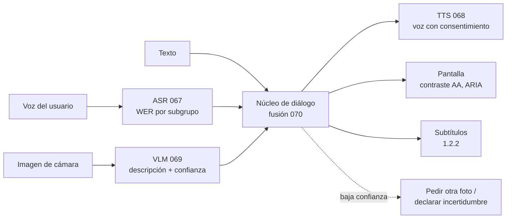

# 072 — Proyecto: asistente multimodal accesible

> [← Clase anterior](../../../classes/part-05-language-vision-audio-and-multimodal-ai/071-sensores-series-y-percepcion-en-el-borde/README.md) · [Índice de la parte](../README.md) · [Clase siguiente →](../../../classes/part-06-foundation-models-and-llm-engineering/073-tokenizacion-moderna-y-vocabularios/README.md)

**Parte:** 05 — Lenguaje, visión, audio e IA multimodal  
**Nivel:** avanzado · **Horas estimadas:** 10  
**Laboratorio:** `capstone` · **Estado:** `EXECUTABLE_CORE`

## 🎯 Propósito

Comprender **proyecto: asistente multimodal accesible** dentro de la evolución de la inteligencia
artificial, implementar un experimento mínimo verificable y distinguir qué parte
constituye evidencia frente a una afirmación todavía no comprobada.

## 📚 Resultados de aprendizaje

Al finalizar podrás:

1. Explicar proyecto: asistente multimodal accesible usando los conceptos `texto`, `imagen`, `audio`, `accesibilidad`.
2. Ejecutar el laboratorio con una semilla explícita y revisar su contrato JSON.
3. Identificar al menos un supuesto, una limitación y un riesgo de aplicación.
4. Comparar el enfoque con la etapa anterior de la ruta de aprendizaje.
5. Producir una evidencia reproducible y una conclusión que no exceda los datos.

## 🧩 Conceptos centrales

`texto`, `imagen`, `audio`, `accesibilidad`

## 🗺️ Ubicación en el mapa de la IA

Esta clase integra toda la parte 05: visión (061-063), lenguaje (064-066), voz (067-068),
alineamiento visión-lenguaje (069) y fusión (070) se ensamblan en un asistente que
sustituye modalidades — describe imágenes a quien no ve, subtitula audio a quien no oye,
lee en voz alta a quien no puede leer. La tecnología asistiva es además un caso ejemplar
del "efecto bordillo" (*curb-cut effect*): lo diseñado para discapacidad termina sirviendo
a todos, como los subtítulos o el dictado por voz.

## 📖 Fundamentos

### ♿ Accesibilidad y WCAG

Las **WCAG** (Web Content Accessibility Guidelines, W3C) son el estándar de referencia. Se
organizan en cuatro principios (**POUR**):

- **Perceptible:** la información debe poder percibirse por al menos un sentido disponible
  — texto alternativo para imágenes (criterio 1.1.1), subtítulos para audio (1.2.2),
  contraste de texto ≥ 4.5:1 (1.4.3).
- **Operable:** la interfaz debe poder manejarse — todo disponible por teclado (2.1.1), sin
  límites de tiempo rígidos, sin destellos que provoquen convulsiones.
- **Comprensible:** lenguaje claro, comportamiento predecible, ayuda ante errores.
- **Robusto:** compatible con tecnologías asistivas (lectores de pantalla, ARIA).

Cada criterio tiene nivel **A** (mínimo), **AA** (objetivo legal habitual) o **AAA**
(exigente). El **contraste** se calcula sobre la luminancia relativa L de cada color:

```text
ratio = (L_claro + 0.05) / (L_oscuro + 0.05)      AA: ≥ 4.5   AAA: ≥ 7
```

### 🔧 Arquitectura del asistente multimodal

El asistente encadena piezas que ya conoces, cada una con su latencia y su modo de fallo:

```text
entrada:  audio → ASR (067)          imagen → VLM descripción (069)      texto directo
núcleo:   fusión + diálogo (070)     con contexto del usuario
salida:   TTS (068)                  texto en pantalla (contraste AA)    subtítulos
```

El **presupuesto de latencia** se reparte: para una interacción conversacional aceptable
(~1.5 s extremo a extremo), cada etapa tiene un tope y la más lenta domina. Y cada etapa
falla distinto: el ASR degrada con acentos (WER por subgrupo, clase 067), el VLM **alucina
detalles** que no están en la imagen, el TTS pronuncia mal lo no normalizado.

### 🧪 Evaluación con usuarios reales

Las métricas automáticas (WER, similitud) no miden si una persona ciega puede confiar en la
descripción. La evaluación asistiva exige:

1. **Métricas por subgrupo:** WER por acento/edad, calidad de descripción por tipo de
   escena — el promedio esconde a quién falla.
2. **Pruebas con usuarios de tecnología asistiva** en tareas reales, con su propio lector
   de pantalla y su propio ritmo — el principio "nada sobre nosotros sin nosotros": las
   personas con discapacidad participan en el diseño, no solo en el test final.
3. **Consentimiento y privacidad:** la cámara y el micrófono de un asistente capturan
   terceros que no consintieron; procesar en el borde (071) y retener lo mínimo es una
   decisión de diseño, no un detalle.

### ⚖️ El riesgo específico: confianza en salidas alucinadas

Para un usuario que **no puede verificar** la salida por otro canal, una descripción
inventada no es un error menor: es información falsa entregada con voz segura ("el
medicamento vence en 2027" cuando la etiqueta dice 2025). Mitigaciones: expresar
incertidumbre en la interfaz, negarse ante baja confianza, ofrecer verificación alternativa
(acercar la cámara, pedir segunda foto) y no usar la demo en decisiones médicas, legales o
financieras sin revisión humana.

## 🧮 Ejemplo trabajado

**Contraste WCAG.** Texto gris sobre fondo blanco: L_blanco = 1.0, L_gris = 0.35.

```text
ratio = (1.0 + 0.05) / (0.35 + 0.05) = 1.05 / 0.40 = 2.63   → falla AA (< 4.5)

Con gris más oscuro (L = 0.15): 1.05 / 0.20 = 5.25          → pasa AA, falla AAA
Con casi negro (L = 0.05):      1.05 / 0.10 = 10.5          → pasa AAA
```

**Presupuesto de latencia.** Objetivo: ≤ 1.5 s de la pregunta hablada a la respuesta
hablada.

```text
ASR (streaming)            300 ms
Descripción VLM            700 ms
Composición de respuesta   150 ms
TTS (primeras muestras)    250 ms
Red / colas                150 ms
                         ─────────
Total                    1 550 ms   → 50 ms sobre presupuesto: la VLM es el cuello;
                                      recortar ahí (modelo menor, imagen reducida)
                                      rinde más que optimizar el resto.
```

## 📊 Propiedades y comparación

| Método de evaluación | Qué detecta | Qué NO detecta | Costo |
|---|---|---|---|
| Métricas automáticas (WER, similitud) | Regresiones, comparación de modelos | Utilidad real, confianza, contexto | Bajo, continuo |
| Auditoría WCAG (checklist) | Incumplimientos objetivos (contraste, alt) | Fricción de uso real | Medio, puntual |
| Pruebas con usuarios asistivos | Barreras reales, confianza, flujo | Cobertura estadística amplia | Alto, imprescindible |



## ⚠️ Errores conceptuales frecuentes

1. **"La accesibilidad se agrega al final."** Ajustar contraste y alt-text sobre un diseño
   cerrado produce parches; los criterios WCAG condicionan arquitectura (streaming para
   subtítulos en vivo, estados operables por teclado) y se diseñan desde el inicio.
2. **"Cumplir el checklist = ser usable."** La conformidad AA es necesaria pero no
   suficiente: un flujo puede pasar la auditoría y seguir siendo inutilizable con un lector
   de pantalla real. Solo las pruebas con usuarios lo revelan.
3. **"La descripción automática siempre ayuda."** Una alucinación entregada a quien no
   puede verificarla es peor que un honesto "no puedo leer la etiqueta". La utilidad
   depende de la calibración de confianza, no solo de la exactitud media.
4. **"Un usuario con discapacidad representa a todos."** Ceguera, baja visión, sordera,
   movilidad reducida y discapacidad cognitiva imponen requisitos distintos y a veces en
   tensión; el muestreo de evaluación debe cubrir la diversidad de usuarios objetivo.
5. **"Esto solo beneficia a una minoría."** Efecto bordillo: subtítulos en el metro, manos
   libres al conducir, dictado por voz — la sustitución de modalidades sirve a cualquiera
   en situación de discapacidad temporal o contextual.

## 🚀 Del aprendizaje a la operación

Convertir este proyecto en producto exige: conformidad WCAG AA auditada por terceros,
pruebas continuas con usuarios de tecnología asistiva remunerados, calibración y umbrales
de rechazo por componente (ASR, VLM, TTS) con métricas por subgrupo, procesamiento local o
minimización de datos para cámara/micrófono, y un límite de uso declarado: sin revisión
humana no se responde sobre medicación, dinero ni seguridad personal.

## 🧪 Laboratorio

```bash
python lab.py
```

El laboratorio llama a `ai_evolution.labs.run_lab("capstone")`. Esta
decisión evita 183 implementaciones divergentes: cada clase tiene un entrypoint
propio, pero los motores didácticos se prueban como una biblioteca común.

### 🔍 Evidencia esperada

- tipo de laboratorio y semilla;
- entradas o decisiones observables;
- resultado estructurado;
- lista `evidence` con hechos que pueden inspeccionarse;
- lista `limitations` que impide presentar la demo como producción.

## 📓 Notebooks

- [📓 `notebook.ipynb`](notebook.ipynb): recorrido guiado con la materia resumida.
- [✍️ `notebook_student.ipynb`](notebook_student.ipynb): ejercicios para resolver.
- [✅ `notebook_solution.ipynb`](notebook_solution.ipynb): solución de referencia explicada.

## 📝 Evaluación

| Criterio | Peso |
|---|---:|
| Comprensión conceptual | 25 % |
| Ejecución reproducible | 25 % |
| Interpretación basada en evidencia | 25 % |
| Riesgos, límites y mejora propuesta | 25 % |

Consulta [assessment.md](assessment.md) para preguntas y criterio de aceptación.

## ⚠️ Errores comunes

| Síntoma | Causa probable | Corrección |
|---|---|---|
| El código corre, pero no hay conclusión | Se confundió ejecución con aprendizaje | Explica qué demuestra y qué no demuestra |
| El resultado cambia sin explicación | No se registró semilla o configuración | Conserva semilla, versión y parámetros |
| Se promete uso real | Se extrapoló desde una demo educativa | Declara entorno, datos, límites y revisión humana |
| Se copia una métrica aislada | No existe baseline ni costo de error | Añade comparación y criterio de decisión |

## ❓ Preguntas frecuentes

**¿Debo usar una API comercial?**  
No. El núcleo funciona localmente. Las extensiones LIVE se documentan por separado.

**¿El laboratorio representa una implementación industrial?**  
No por sí solo. Enseña el contrato y el patrón; producción exige integración,
seguridad, observabilidad, pruebas y operación.

**¿Dónde profundizo?**  
Revisa las especializaciones enlazadas en el README raíz y la ruta siguiente.

## 🔗 Referencias

- W3C. *Web Content Accessibility Guidelines (WCAG) 2.2* — [w3.org/TR/WCAG22](https://www.w3.org/TR/WCAG22/) — uso: marco normativo de referencia
- W3C WAI. *Introduction to Web Accessibility* — [w3.org/WAI/fundamentals/accessibility-intro](https://www.w3.org/WAI/fundamentals/accessibility-intro/) — uso: marco normativo de referencia
- WebAIM. *Contrast Checker* (cálculo de luminancia y ratio WCAG) — [webaim.org/resources/contrastchecker](https://webaim.org/resources/contrastchecker/) — uso: referencia consultada en su fuente original
- Radford, A. et al. (2022). "Robust Speech Recognition via Large-Scale Weak Supervision" (Whisper) — [arXiv:2212.04356](https://arxiv.org/abs/2212.04356) — uso: fuente primaria del mecanismo estudiado
- Radford, A. et al. (2021). "Learning Transferable Visual Models From Natural Language Supervision" (CLIP) — [arXiv:2103.00020](https://arxiv.org/abs/2103.00020) — uso: fuente primaria del mecanismo estudiado
- Jurafsky, D. y Martin, J. H. *Speech and Language Processing* (3e) — [web.stanford.edu/~jurafsky/slp3](https://web.stanford.edu/~jurafsky/slp3/) — uso: desarrollo extendido del tema

<!-- bibliografia:inicio -->

---

## 📚 Bibliografía de apoyo

> Bloque generado por `python scripts/link_sources_to_classes.py`. Cada obra lleva su localizador verificado en [`sources/bibliography.json`](../../../sources/bibliography.json).

Los papers dicen **de dónde salió** el mecanismo. Estas obras lo **desarrollan** con el espacio que una clase no tiene: teoría completa, demostraciones y ejercicios.

| Obra | Edición | Localizador | Papel en esta clase |
|---|---|---|---|
| Jurafsky, Daniel y Martin, James H. — *Speech and Language Processing* | 2.ª (la 3.ª circula como borrador abierto sin ISBN) · 2009 | [ISBN 9780131873216](https://openlibrary.org/isbn/9780131873216) · [web de la obra](https://web.stanford.edu/~jurafsky/slp3/) | citada en las referencias de esta clase · obra de referencia de la parte 05 |

**Normas y documentación oficial que aplica esta clase:** [w3.org/TR/WCAG22](https://www.w3.org/TR/WCAG22/) · [w3.org/WAI/fundamentals/accessibility-intro](https://www.w3.org/WAI/fundamentals/accessibility-intro/)
<!-- bibliografia:fin -->

---

## ⬅️ Clase anterior

[071 — Sensores, series y percepción en el borde](../../part-05-language-vision-audio-and-multimodal-ai/071-sensores-series-y-percepcion-en-el-borde/README.md)

## ➡️ Siguiente clase

[073 — Tokenización moderna y vocabularios](../../part-06-foundation-models-and-llm-engineering/073-tokenizacion-moderna-y-vocabularios/README.md)
