# 👁️ Parte 05 — Lenguaje, visión, audio e IA multimodal

**Nivel:** avanzado · **Duración sugerida:** 5–6 semanas ·
**Clases:** 12

Estudia cómo los sistemas perciben y combinan texto, imágenes, documentos, voz, audio y señales temporales.

## 🧭 Secuencia de la parte

```mermaid
flowchart LR
    L061["061<br/>Clasificación y representación<br/>visual"]
    L062["062<br/>Detección, segmentación y<br/>pose"]
    L063["063<br/>OCR y comprensión<br/>de documentos"]
    L064["064<br/>Tokenización y representación<br/>del lenguaje"]
    L065["065<br/>Clasificación, extracción y<br/>generación de texto"]
    L066["066<br/>Embeddings semánticos y<br/>similitud"]
    L067["067<br/>Reconocimiento automático del<br/>habla"]
    L068["068<br/>Síntesis de voz<br/>y clonación responsable"]
    L069["069<br/>Modelos visión-lenguaje"]
    L070["070<br/>Fusión multimodal y<br/>representación conjunta"]
    L071["071<br/>Sensores, series y<br/>percepción en el<br/>borde"]
    L072["072<br/>Proyecto: asistente multimodal<br/>accesible"]
    L061 --> L062
    L062 --> L063
    L063 --> L064
    L064 --> L065
    L065 --> L066
    L066 --> L067
    L067 --> L068
    L068 --> L069
    L069 --> L070
    L070 --> L071
    L071 --> L072
```

## 📚 Clases

| ID | Tema | Laboratorio | Horas |
|---:|---|---|---:|
| 061 | [Clasificación y representación visual](061-clasificacion-y-representacion-visual/README.md) | `perception` | 6 |
| 062 | [Detección, segmentación y pose](062-deteccion-segmentacion-y-pose/README.md) | `perception` | 6 |
| 063 | [OCR y comprensión de documentos](063-ocr-y-comprension-de-documentos/README.md) | `perception` | 6 |
| 064 | [Tokenización y representación del lenguaje](064-tokenizacion-y-representacion-del-lenguaje/README.md) | `llm` | 6 |
| 065 | [Clasificación, extracción y generación de texto](065-clasificacion-extraccion-y-generacion-de-texto/README.md) | `llm` | 6 |
| 066 | [Embeddings semánticos y similitud](066-embeddings-semanticos-y-similitud/README.md) | `retrieval` | 6 |
| 067 | [Reconocimiento automático del habla](067-reconocimiento-automatico-del-habla/README.md) | `perception` | 6 |
| 068 | [Síntesis de voz y clonación responsable](068-sintesis-de-voz-y-clonacion-responsable/README.md) | `generation` | 6 |
| 069 | [Modelos visión-lenguaje](069-modelos-vision-lenguaje/README.md) | `attention` | 6 |
| 070 | [Fusión multimodal y representación conjunta](070-fusion-multimodal-y-representacion-conjunta/README.md) | `attention` | 6 |
| 071 | [Sensores, series y percepción en el borde](071-sensores-series-y-percepcion-en-el-borde/README.md) | `robotics` | 6 |
| 072 | [Proyecto: asistente multimodal accesible](072-proyecto-asistente-multimodal-accesible/README.md) | `capstone` | 10 |

## 📝 Evaluación de la parte

- 40 % laboratorios y notebooks.
- 25 % explicaciones y comparación de enfoques.
- 20 % evaluación de riesgos y limitaciones.
- 15 % mini-proyecto o integración.

[⬅️ Parte 04 — Redes neuronales y deep learning](../part-04-neural-networks-and-deep-learning/README.md) · [🏠 Volver al programa](../../README.md) · [➡️ Parte 06 — Modelos fundacionales e ingeniería de LLM](../part-06-foundation-models-and-llm-engineering/README.md)
