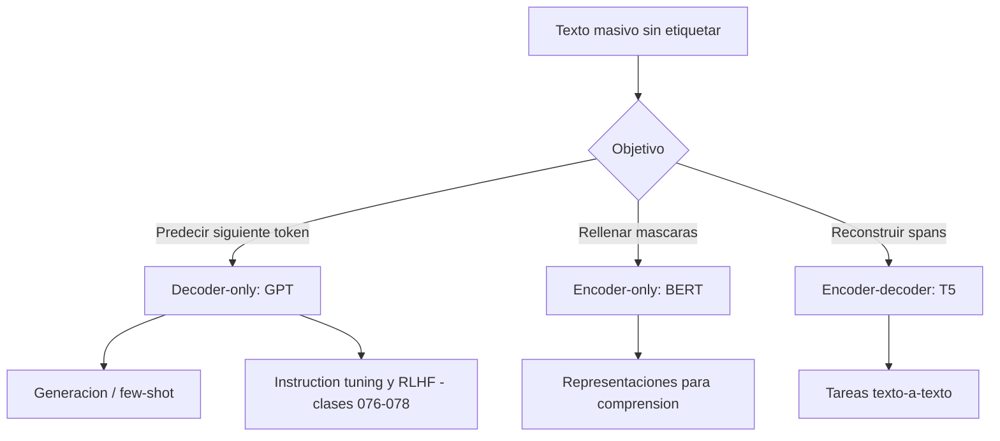

# 074 — Objetivos de preentrenamiento

> [← Clase anterior](../../../classes/part-06-foundation-models-and-llm-engineering/073-tokenizacion-moderna-y-vocabularios/README.md) · [Índice de la parte](../README.md) · [Clase siguiente →](../../../classes/part-06-foundation-models-and-llm-engineering/075-escalamiento-computo-y-leyes-empiricas/README.md)

**Parte:** 06 — Modelos fundacionales e ingeniería de LLM  
**Nivel:** avanzado · **Horas estimadas:** 6  
**Laboratorio:** `llm` · **Estado:** `EXECUTABLE_CORE`

## 🎯 Propósito

Comprender **objetivos de preentrenamiento** dentro de la evolución de la inteligencia
artificial, implementar un experimento mínimo verificable y distinguir qué parte
constituye evidencia frente a una afirmación todavía no comprobada.

## 📚 Resultados de aprendizaje

Al finalizar podrás:

1. Explicar objetivos de preentrenamiento usando los conceptos `causal LM`, `masked LM`, `next-token`, `datos`.
2. Ejecutar el laboratorio con una semilla explícita y revisar su contrato JSON.
3. Identificar al menos un supuesto, una limitación y un riesgo de aplicación.
4. Comparar el enfoque con la etapa anterior de la ruta de aprendizaje.
5. Producir una evidencia reproducible y una conclusión que no exceda los datos.

## 🧩 Conceptos centrales

`causal LM`, `masked LM`, `next-token`, `datos`

## 🗺️ Ubicación en el mapa de la IA

El preentrenamiento es la idea que convirtió al Transformer (clase anterior de la
ruta: tokenización; parte 05: atención) en modelos fundacionales: en lugar de
entrenar un modelo por tarea con datos etiquetados, se entrena UNA vez sobre texto
masivo con un objetivo auto-supervisado y luego se adapta. La elección del objetivo
—predecir el siguiente token, rellenar huecos o reconstruir spans— define tres
familias (GPT, BERT, T5) y habilita todo lo que sigue: escalamiento, instruction
tuning y alineamiento.

## 📖 Fundamentos

### 🔁 Auto-supervisión: la etiqueta es el propio texto

Un objetivo de preentrenamiento transforma texto crudo en pares (entrada, objetivo)
sin anotación humana. El modelo se entrena minimizando entropía cruzada sobre
billones de tokens; lo que "aprende" es una distribución P(texto) de la que emergen
sintaxis, hechos y cierta capacidad de razonamiento superficial.

### ➡️ Modelado causal de lenguaje (next-token, GPT)

Factoriza la probabilidad de la secuencia de izquierda a derecha:

```text
P(x₁,…,xₙ) = Πᵢ P(xᵢ | x₁,…,xᵢ₋₁)
L = −Σᵢ log P(xᵢ | x<ᵢ)        (pérdida en cada posición)
```

Arquitectura: **decoder-only** con máscara causal (cada posición solo atiende hacia
atrás). Ventajas: cada token del corpus genera señal de entrenamiento y el modelo
resultante **genera** texto de forma nativa; por eso es el objetivo de los LLM
conversacionales actuales.

### 🎭 Modelado enmascarado (MLM, BERT)

BERT enmascara ~15 % de los tokens y predice solo esos, con atención **bidireccional**
(encoder-only):

```text
Entrada:  El [MASK] ladra en el [MASK] .
Objetivo:      perro              patio
```

Del 15 % elegido: 80 % se sustituye por `[MASK]`, 10 % por un token aleatorio, 10 %
se deja igual (para que el modelo no dependa de ver `[MASK]` en inferencia).
Ventaja: representaciones contextuales ricas para **comprensión** (clasificación,
NER, extracción). Costo: no genera texto y solo el 15 % de posiciones da señal.

### 🧩 Denoising por spans (T5)

T5 corrompe spans contiguos (~15 % del texto, longitud media 3) y los reemplaza por
centinelas; un modelo **encoder-decoder** reconstruye solo lo eliminado:

```text
Entrada:  El perro <X> en el <Y> .
Objetivo: <X> ladra <Y> patio <Z>
```

T5 además reformula toda tarea como texto-a-texto ("translate English to German: …",
"summarize: …"), unificando clasificación, traducción y resumen bajo el mismo
objetivo de generación condicionada.

### 📚 Los datos importan tanto como el objetivo

Los corpus de preentrenamiento (C4, The Pile, mezclas web + código + libros)
requieren deduplicación, filtrado de calidad y de contenido, y balance de dominios.
Un mismo objetivo con datos distintos produce modelos muy distintos; la
"contaminación" (tener el test set dentro del corpus) invalida evaluaciones.

## 🧮 Ejemplo trabajado

Secuencia tokenizada: `[el, gato, come, pescado]`. Supón un modelo que asigna estas
probabilidades al token correcto en cada posición (dado su contexto):

```text
P(gato | el) = 0,20     P(come | el gato) = 0,25     P(pescado | el gato come) = 0,10

Pérdida causal (ignorando el primer token):
L = −[ln 0,20 + ln 0,25 + ln 0,10] = −[−1,609 − 1,386 − 2,303] = 5,298
L media por token = 5,298 / 3 ≈ 1,766
Perplejidad = e^1,766 ≈ 5,85
```

Interpretación: "en promedio, el modelo duda entre ~6 alternativas plausibles por
token". Si tras más entrenamiento P(pescado|…) sube a 0,30, la pérdida media baja a
≈1,40 y la perplejidad a ≈4,1: la métrica de preentrenamiento es esta, no "accuracy".

## 📊 Propiedades y comparación

| Propiedad | GPT (causal) | BERT (MLM) | T5 (span denoising) |
|---|---|---|---|
| Arquitectura | Decoder-only | Encoder-only | Encoder-decoder |
| Atención | Causal (unidireccional) | Bidireccional | Bidireccional + causal en decoder |
| Señal por secuencia | 100 % de posiciones | ~15 % de posiciones | ~15 % (spans) |
| Genera texto | Sí, nativo | No | Sí (condicionado) |
| Uso típico | Chat, generación, few-shot | Clasificación, NER, embeddings | Traducción, resumen, texto-a-texto |
| Ejemplos | GPT-2/3/4, Llama, Claude | BERT, RoBERTa | T5, FLAN-T5, mT5 |



## ⚠️ Errores conceptuales frecuentes

1. **"El modelo se entrena para responder preguntas."** No: se entrena para
   continuar texto. Que responda bien es un comportamiento inducido después (SFT,
   RLHF, clases 076–078).
2. **"MLM y causal son intercambiables."** No: BERT no puede generar texto coherente
   y GPT no da representaciones bidireccionales; el objetivo fija las capacidades.
3. **"Más épocas sobre el mismo corpus = mejor."** Los LLM suelen entrenar ~1 época;
   repetir datos degrada rápido frente a añadir datos nuevos.
4. **"La pérdida baja implica que el modelo 'sabe'."** Mide compresión estadística
   del corpus; hechos raros o contrafactuales pueden seguir mal representados.
5. **"El decoder-only es superior en todo."** Domina en generación y escala, pero
   para clasificación barata con pocos datos un encoder BERT sigue siendo
   competitivo y mucho más económico.

## 🚀 Del aprendizaje a la operación

Entre este cálculo de perplejidad y un preentrenamiento real median: un pipeline de
datos de billones de tokens (deduplicación, filtrado, mezcla de dominios),
entrenamiento distribuido en miles de aceleradores con paralelismo de datos/tensor/
pipeline, checkpointing y tolerancia a fallos, y una evaluación continua contra
benchmarks no contaminados. Casi ninguna organización preentrena desde cero: la
decisión operativa real es qué modelo fundacional adaptar (clases 076–077).

## 🧪 Laboratorio

```bash
python lab.py
```

El laboratorio llama a `ai_evolution.labs.run_lab("llm")`. Esta
decisión evita 183 implementaciones divergentes: cada clase tiene un entrypoint
propio, pero los motores didácticos se prueban como una biblioteca común.

### 🔍 Evidencia esperada

- tipo de laboratorio y semilla;
- entradas o decisiones observables;
- resultado estructurado;
- lista `evidence` con hechos que pueden inspeccionarse;
- lista `limitations` que impide presentar la demo como producción.

## 📓 Notebooks

- [📓 `notebook.ipynb`](notebook.ipynb): recorrido guiado con la materia resumida.
- [✍️ `notebook_student.ipynb`](notebook_student.ipynb): ejercicios para resolver.
- [✅ `notebook_solution.ipynb`](notebook_solution.ipynb): solución de referencia explicada.

## 📝 Evaluación

| Criterio | Peso |
|---|---:|
| Comprensión conceptual | 25 % |
| Ejecución reproducible | 25 % |
| Interpretación basada en evidencia | 25 % |
| Riesgos, límites y mejora propuesta | 25 % |

Consulta [assessment.md](assessment.md) para preguntas y criterio de aceptación.

## ⚠️ Errores comunes

| Síntoma | Causa probable | Corrección |
|---|---|---|
| El código corre, pero no hay conclusión | Se confundió ejecución con aprendizaje | Explica qué demuestra y qué no demuestra |
| El resultado cambia sin explicación | No se registró semilla o configuración | Conserva semilla, versión y parámetros |
| Se promete uso real | Se extrapoló desde una demo educativa | Declara entorno, datos, límites y revisión humana |
| Se copia una métrica aislada | No existe baseline ni costo de error | Añade comparación y criterio de decisión |

## ❓ Preguntas frecuentes

**¿Debo usar una API comercial?**  
No. El núcleo funciona localmente. Las extensiones LIVE se documentan por separado.

**¿El laboratorio representa una implementación industrial?**  
No por sí solo. Enseña el contrato y el patrón; producción exige integración,
seguridad, observabilidad, pruebas y operación.

**¿Dónde profundizo?**  
Revisa las especializaciones enlazadas en el README raíz y la ruta siguiente.

## 🔗 Referencias

- Vaswani et al. (2017), *Attention Is All You Need*: <https://arxiv.org/abs/1706.03762>
- Devlin et al. (2018), *BERT: Pre-training of Deep Bidirectional Transformers*: <https://arxiv.org/abs/1810.04805>
- Raffel et al. (2019), *Exploring the Limits of Transfer Learning with a Unified Text-to-Text Transformer* (T5): <https://arxiv.org/abs/1910.10683>
- Brown et al. (2020), *Language Models are Few-Shot Learners* (GPT-3): <https://arxiv.org/abs/2005.14165>
- Jurafsky y Martin, *Speech and Language Processing* (3.ª ed., borrador): <https://web.stanford.edu/~jurafsky/slp3/>

<!-- papers:inicio -->

---

## 📜 Papers que fundamentan esta clase

> Bloque generado por `python scripts/link_papers_to_classes.py`. La fuente es [`papers/catalog/papers.json`](../../../papers/catalog/papers.json).

| Paper | Año | Qué desbloqueó | Miniatura |
|---|---:|---|---|
| [P08 · La atención es todo lo que necesitas](../../../papers/foundational/P08_transformer/README.md) | 2017 | Elimina la recurrencia y la convolución del modelado de secuencias: todo el cómputo de una capa se paraleliza. | [notebook](../../../notebooks/papers/P08_transformer.ipynb) |
| [P09 · BERT: preentrenamiento de Transformers bidireccionales profundos para comprensión del lenguaje](../../../papers/foundational/P09_bert/README.md) | 2018 | Consolida el patrón preentrenar-y-ajustar: un mismo modelo base sirve para muchas tareas con un ajuste pequeño. | [notebook](../../../notebooks/papers/P09_bert.ipynb) |
| [P10 · Los modelos de lenguaje son aprendices con pocos ejemplos](../../../papers/foundational/P10_gpt3/README.md) | 2020 | El aprendizaje en contexto: la tarea se especifica en el prompt y el modelo se adapta sin actualizar ningún peso. | [notebook](../../../notebooks/papers/P10_gpt3.ipynb) |
| [P19 · Entrenar modelos de lenguaje grandes con cómputo óptimo](../../../papers/foundational/P19_scaling_laws/README.md) | 2022 | Corrige la carrera por el tamaño: a cómputo fijo, los modelos de la época estaban infraentrenados en datos. | [notebook](../../../notebooks/papers/P19_scaling_laws.ipynb) |

Cada ficha explica el problema anterior, la matemática mínima, los límites y los errores de atribución más frecuentes. Para leerlas con método: [cómo leer un paper de IA](../../../papers/guides/COMO_LEER_UN_PAPER_DE_IA.md) · [anexos matemáticos](../../../papers/annexes/README.md).
<!-- papers:fin -->
---

## ⬅️ Clase anterior

[073 — Tokenización moderna y vocabularios](../../part-06-foundation-models-and-llm-engineering/073-tokenizacion-moderna-y-vocabularios/README.md)

## ➡️ Siguiente clase

[075 — Escalamiento, cómputo y leyes empíricas](../../part-06-foundation-models-and-llm-engineering/075-escalamiento-computo-y-leyes-empiricas/README.md)
