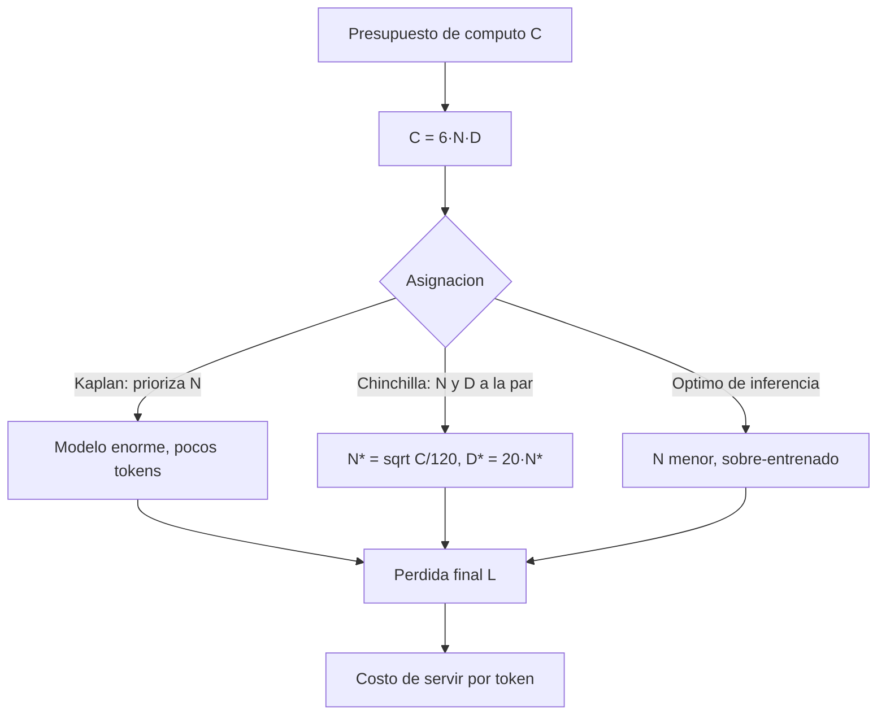

# 075 — Escalamiento, cómputo y leyes empíricas

> [← Clase anterior](../../../classes/part-06-foundation-models-and-llm-engineering/074-objetivos-de-preentrenamiento/README.md) · [Índice de la parte](../README.md) · [Clase siguiente →](../../../classes/part-06-foundation-models-and-llm-engineering/076-instruction-tuning-y-datos-de-instrucciones/README.md)

**Parte:** 06 — Modelos fundacionales e ingeniería de LLM  
**Nivel:** avanzado · **Horas estimadas:** 6  
**Laboratorio:** `evaluation` · **Estado:** `EXECUTABLE_CORE`

## 🎯 Propósito

Comprender **escalamiento, cómputo y leyes empíricas** dentro de la evolución de la inteligencia
artificial, implementar un experimento mínimo verificable y distinguir qué parte
constituye evidencia frente a una afirmación todavía no comprobada.

## 📚 Resultados de aprendizaje

Al finalizar podrás:

1. Explicar escalamiento, cómputo y leyes empíricas usando los conceptos `scaling laws`, `compute`, `datos`, `parámetros`.
2. Ejecutar el laboratorio con una semilla explícita y revisar su contrato JSON.
3. Identificar al menos un supuesto, una limitación y un riesgo de aplicación.
4. Comparar el enfoque con la etapa anterior de la ruta de aprendizaje.
5. Producir una evidencia reproducible y una conclusión que no exceda los datos.

## 🧩 Conceptos centrales

`scaling laws`, `compute`, `datos`, `parámetros`

## 🗺️ Ubicación en el mapa de la IA

Las leyes de escalamiento transformaron el entrenamiento de LLM de artesanía en
ingeniería predecible: la pérdida de preentrenamiento (clase 074) sigue leyes de
potencia suaves respecto a parámetros, datos y cómputo, lo que permite decidir *antes
de gastar millones* qué modelo entrenar. Kaplan et al. (2020) justificó la era de los
modelos gigantes; Chinchilla (2022) corrigió el rumbo hacia más datos por parámetro,
y esa corrección explica el diseño de casi todos los modelos abiertos posteriores.

## 📖 Fundamentos

### 📉 Leyes de potencia empíricas (Kaplan et al., 2020)

Con las otras variables sin ser cuello de botella, la pérdida de test L sigue:

```text
L(N) ≈ (Nc / N)^αN    con αN ≈ 0,076   (N = parámetros, sin embeddings)
L(D) ≈ (Dc / D)^αD    con αD ≈ 0,095   (D = tokens de entrenamiento)
L(C) ≈ (Cc / C)^αC    con αC ≈ 0,050   (C = cómputo de entrenamiento)
```

Lecturas clave: (1) las curvas son suaves a lo largo de **7 órdenes de magnitud**;
(2) la forma del modelo (profundidad vs anchura) importa poco frente al tamaño;
(3) los modelos grandes son más eficientes en muestras. La recomendación de Kaplan
—dado más cómputo, crece N mucho más rápido que D— produjo modelos como GPT-3
(175B con 300B tokens).

### ⚖️ La corrección de Chinchilla (Hoffmann et al., 2022)

El presupuesto de cómputo se aproxima por `C ≈ 6·N·D` FLOPs (forward + backward).
Chinchilla ajustó una pérdida paramétrica:

```text
L(N, D) = E + A/N^α + B/D^β
          E ≈ 1,69 (entropía irreducible), α ≈ 0,34, β ≈ 0,28
```

Minimizar L sujeto a C = 6·N·D da el óptimo **N* ∝ C^0,5 y D* ∝ C^0,5**: parámetros
y datos deben crecer *a la par*, con una regla práctica de **~20 tokens por
parámetro**. Verificación empírica: Chinchilla (70B, 1,4T tokens) supera a Gopher
(280B, 300B tokens) con el mismo cómputo, siendo 4× más barato de servir.

### 🏭 Óptimo de entrenamiento ≠ óptimo de inferencia

Chinchilla optimiza solo el costo de entrenar. Si el modelo se va a servir a
millones de usuarios, conviene "sobre-entrenar" un modelo más pequeño mucho más allá
de 20 tokens/parámetro (Llama 3 8B: >1 800 tokens/parámetro): se paga más
entrenamiento una vez a cambio de inferencia más barata para siempre.

### 🌊 Capacidades emergentes y sus límites

Al escalar, algunas capacidades (aritmética multi-paso, ciertos benchmarks) parecen
aparecer de golpe. Parte de esa "emergencia" es un artefacto de métricas
discontinuas (exact-match): con métricas suaves el progreso subyacente es gradual.
Conclusión honesta: la pérdida es predecible; qué capacidades concretas aparecen a
qué escala, mucho menos.

## 🧮 Ejemplo trabajado

Presupuesto: C = 10²³ FLOPs. ¿Qué modelo entrenar según Chinchilla?

```text
Regla: D ≈ 20·N  y  C = 6·N·D  →  C = 120·N²
N* = sqrt(C / 120) = sqrt(10²³ / 120) ≈ sqrt(8,33·10²⁰) ≈ 2,9·10¹⁰ ≈ 29B parámetros
D* = 20 · 2,9·10¹⁰ ≈ 5,8·10¹¹ ≈ 580B tokens
Comprobación: 6 · 2,9·10¹⁰ · 5,8·10¹¹ ≈ 1,0·10²³ ✓
```

Alternativa "estilo GPT-3" con el mismo cómputo: N = 100B fuerza D = C/(6N) ≈ 167B
tokens, es decir 1,7 tokens/parámetro: modelo grande y "hambriento de datos" que,
según las curvas de Chinchilla, quedará con pérdida peor que el de 29B bien
alimentado — y además costará ~3,4× más por token en inferencia.

## 📊 Propiedades y comparación

| Aspecto | Kaplan et al. (2020) | Chinchilla (2022) |
|---|---|---|
| Asignación óptima | N crece mucho más rápido que D | N y D crecen a la par (∝ C^0,5) |
| Regla práctica | Pocos tokens por parámetro (~1,7 en GPT-3) | ~20 tokens por parámetro |
| Causa de la discrepancia | LR schedule no ajustado por corrida | Cosine schedule ajustado a cada D |
| Modelo emblemático | GPT-3 175B / 300B tokens | Chinchilla 70B / 1,4T tokens |
| Límite que ignora | Datos disponibles, costo de inferencia | Costo de inferencia (sobre-entrenar puede convenir) |



## ⚠️ Errores conceptuales frecuentes

1. **"Más parámetros siempre gana."** Con cómputo fijo, un modelo demasiado grande
   queda sub-entrenado: Gopher (280B) pierde contra Chinchilla (70B).
2. **"Las leyes predicen capacidades."** Predicen la *pérdida*; el rendimiento en
   tareas concretas puede ser discontinuo o depender de la métrica.
3. **"20 tokens/parámetro es una ley universal."** Es el óptimo de *entrenamiento*
   bajo esos supuestos; para servir a escala conviene sobre-entrenar modelos chicos.
4. **"Escalar es solo cuestión de dinero."** Los datos de calidad son finitos;
   deduplicación, mezcla y epochs repetidos cambian las curvas.
5. **"C = 6·N·D es exacto."** Es una aproximación (ignora atención, embeddings y
   detalles de arquitectura); útil para órdenes de magnitud, no para contabilidad fina.

## 🚀 Del aprendizaje a la operación

Aplicar esto de verdad exige: medir las curvas con corridas pequeñas propias (las
constantes dependen del corpus y la arquitectura), decidir el punto en la frontera
entrenamiento-vs-inferencia según el tráfico esperado, presupuestar en horas-GPU
reales (con utilización efectiva del 30–50 %, no FLOPs teóricos) y validar con evals
propios, porque una pérdida menor no garantiza mejor comportamiento en tu tarea.

## 🧪 Laboratorio

```bash
python lab.py
```

El laboratorio llama a `ai_evolution.labs.run_lab("evaluation")`. Esta
decisión evita 180 implementaciones divergentes: cada clase tiene un entrypoint
propio, pero los motores didácticos se prueban como una biblioteca común.

### 🔍 Evidencia esperada

- tipo de laboratorio y semilla;
- entradas o decisiones observables;
- resultado estructurado;
- lista `evidence` con hechos que pueden inspeccionarse;
- lista `limitations` que impide presentar la demo como producción.

## 📓 Notebooks

- [📓 `notebook.ipynb`](notebook.ipynb): recorrido guiado con la materia resumida.
- [✍️ `notebook_student.ipynb`](notebook_student.ipynb): ejercicios para resolver.
- [✅ `notebook_solution.ipynb`](notebook_solution.ipynb): solución de referencia explicada.

## 📝 Evaluación

| Criterio | Peso |
|---|---:|
| Comprensión conceptual | 25 % |
| Ejecución reproducible | 25 % |
| Interpretación basada en evidencia | 25 % |
| Riesgos, límites y mejora propuesta | 25 % |

Consulta [assessment.md](assessment.md) para preguntas y criterio de aceptación.

## ⚠️ Errores comunes

| Síntoma | Causa probable | Corrección |
|---|---|---|
| El código corre, pero no hay conclusión | Se confundió ejecución con aprendizaje | Explica qué demuestra y qué no demuestra |
| El resultado cambia sin explicación | No se registró semilla o configuración | Conserva semilla, versión y parámetros |
| Se promete uso real | Se extrapoló desde una demo educativa | Declara entorno, datos, límites y revisión humana |
| Se copia una métrica aislada | No existe baseline ni costo de error | Añade comparación y criterio de decisión |

## ❓ Preguntas frecuentes

**¿Debo usar una API comercial?**  
No. El núcleo funciona localmente. Las extensiones LIVE se documentan por separado.

**¿El laboratorio representa una implementación industrial?**  
No por sí solo. Enseña el contrato y el patrón; producción exige integración,
seguridad, observabilidad, pruebas y operación.

**¿Dónde profundizo?**  
Revisa las especializaciones enlazadas en el README raíz y la ruta siguiente.

## 🔗 Referencias

- Kaplan et al. (2020), *Scaling Laws for Neural Language Models*: <https://arxiv.org/abs/2001.08361>
- Hoffmann et al. (2022), *Training Compute-Optimal Large Language Models* (Chinchilla): <https://arxiv.org/abs/2203.15556>
- Brown et al. (2020), *Language Models are Few-Shot Learners* (GPT-3): <https://arxiv.org/abs/2005.14165>
- Wei et al. (2022), *Emergent Abilities of Large Language Models*: <https://arxiv.org/abs/2206.07682>
- Schaeffer et al. (2023), *Are Emergent Abilities of Large Language Models a Mirage?*: <https://arxiv.org/abs/2304.15004>

---

## ⬅️ Clase anterior

[074 — Objetivos de preentrenamiento](../../part-06-foundation-models-and-llm-engineering/074-objetivos-de-preentrenamiento/README.md)

## ➡️ Siguiente clase

[076 — Instruction tuning y datos de instrucciones](../../part-06-foundation-models-and-llm-engineering/076-instruction-tuning-y-datos-de-instrucciones/README.md)
