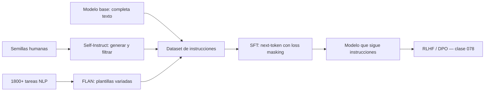

# 076 — Instruction tuning y datos de instrucciones

> [← Clase anterior](../../../classes/part-06-foundation-models-and-llm-engineering/075-escalamiento-computo-y-leyes-empiricas/README.md) · [Índice de la parte](../README.md) · [Clase siguiente →](../../../classes/part-06-foundation-models-and-llm-engineering/077-lora-qlora-y-adaptacion-eficiente/README.md)

**Parte:** 06 — Modelos fundacionales e ingeniería de LLM  
**Nivel:** avanzado · **Horas estimadas:** 6  
**Laboratorio:** `llm` · **Estado:** `EXECUTABLE_CORE`

## 🎯 Propósito

Comprender **instruction tuning y datos de instrucciones** dentro de la evolución de la inteligencia
artificial, implementar un experimento mínimo verificable y distinguir qué parte
constituye evidencia frente a una afirmación todavía no comprobada.

## 📚 Resultados de aprendizaje

Al finalizar podrás:

1. Explicar instruction tuning y datos de instrucciones usando los conceptos `instruction tuning`, `SFT`, `datasets`, `calidad`.
2. Ejecutar el laboratorio con una semilla explícita y revisar su contrato JSON.
3. Identificar al menos un supuesto, una limitación y un riesgo de aplicación.
4. Comparar el enfoque con la etapa anterior de la ruta de aprendizaje.
5. Producir una evidencia reproducible y una conclusión que no exceda los datos.

## 🧩 Conceptos centrales

`instruction tuning`, `SFT`, `datasets`, `calidad`

## 🗺️ Ubicación en el mapa de la IA

Un modelo preentrenado (clase 074) es un completador de texto, no un asistente: ante
"¿Cómo hago pan?" puede responder con más preguntas, porque en la web las preguntas
suelen ir en listas. El instruction tuning cierra esa brecha: un fine-tuning
supervisado sobre pares (instrucción → respuesta) que convierte P(texto) en
"comportamiento de seguir órdenes". Es el puente entre el preentrenamiento y el
alineamiento por preferencias (clase 078), y la primera palanca de adaptación que
cualquier equipo puede ejecutar con LoRA (clase 077).

## 📖 Fundamentos

### 🎓 SFT: fine-tuning supervisado de instrucciones

SFT continúa el entrenamiento del modelo base con el mismo objetivo next-token, pero
sobre un dataset curado de demostraciones:

```text
Ejemplo de dato SFT (formato chat):
  system:    "Eres un asistente útil y conciso."
  user:      "Resume en una frase qué es BPE."
  assistant: "BPE construye un vocabulario subpalabra fusionando iterativamente
              los pares de símbolos más frecuentes del corpus."

Pérdida: entropía cruzada SOLO sobre los tokens de la respuesta (loss masking):
  L = −Σ_{i ∈ respuesta} log P(xᵢ | x<ᵢ)
```

El *loss masking* importa: sin él, el modelo gasta capacidad aprendiendo a imitar
las preguntas del usuario en lugar de las respuestas. El formato se fija con una
plantilla de chat (tokens especiales que delimitan roles) que debe ser **idéntica**
en entrenamiento e inferencia.

### 🌸 FLAN: generalización entre tareas

FLAN (Wei et al., 2021; Chung et al., 2022) demostró el hallazgo central: entrenar
con instrucciones de **muchas tareas** (1 800+ en FLAN 2022) mejora el rendimiento
zero-shot en tareas **nunca vistas**. El modelo no memoriza tareas: aprende el
meta-patrón "leer una instrucción y ejecutarla". Ingredientes que más aportan según
las ablaciones: número y diversidad de tareas, plantillas variadas por tarea y
mezclar ejemplos con y sin cadena de razonamiento.

### 🤖 Self-Instruct: datos sintéticos de instrucciones

Anotar demostraciones humanas es caro. Self-Instruct (Wang et al., 2022) arranca con
~175 instrucciones semilla escritas a mano y usa el propio LLM para ampliar:

```text
1. Muestrear semillas → pedir al modelo instrucciones NUEVAS.
2. Generar entrada y respuesta para cada instrucción.
3. Filtrar: deduplicar (similitud ROUGE-L < umbral), descartar respuestas
   inválidas o degeneradas.
4. Añadir lo filtrado al pool y repetir.
```

Así se construyeron Alpaca y decenas de datasets abiertos. Riesgos reales: hereda
sesgos y errores del modelo generador, y entrenar recursivamente sobre salidas
propias degrada la diversidad (colapso).

### 🧪 Calidad > cantidad

LIMA (Zhou et al., 2023) alcanzó calidad conversacional competitiva con **solo
1 000** ejemplos excepcionalmente curados. La lección operativa: el conocimiento ya
está en el modelo base; SFT enseña *formato y comportamiento*. Mil ejemplos
excelentes superan a cien mil mediocres, y los datos ruidosos enseñan ruido.

## 🧮 Ejemplo trabajado

Construyamos el tensor de entrenamiento de UN ejemplo SFT con loss masking.
Plantilla simplificada con tokens especiales `<u>` `</u>` `<a>` `</a>`:

```text
Texto:    <u> Traduce 'cat' al español </u> <a> gato </a>
Token:     1    40   41    42  43        2    3   77    4
Posición:  0    1    2     3   4         5    6   7     8

labels (lo que se aprende a predecir en cada posición, desplazado 1):
Posición:   0    1    2    3    4    5    6    7
Predice:    40   41   42   43   2    3    77   4
máscara:    ✗    ✗    ✗    ✗    ✗    ✓    ✓    ✓   (solo respuesta y cierre)

L = −[log P(77 | …<a>) + log P(4 | …gato) + log P(3 | …</u> …)]  → solo 3 términos
```

Si P(gato) = 0,6, P(`</a>`) = 0,9 y P(`<a>`) = 0,95:
L = −(ln 0,95 + ln 0,6 + ln 0,9) ≈ 0,051 + 0,511 + 0,105 = **0,667**.
Con 10 000 ejemplos así, 2–3 épocas y learning rate ~1–2·10⁻⁵, eso ES el SFT.

## 📊 Propiedades y comparación

| Estrategia | Fuente de datos | Costo | Fortaleza | Riesgo principal |
|---|---|---|---|---|
| SFT con demos humanas | Anotadores expertos | Alto | Máxima calidad y control | Escala limitada, caro |
| FLAN (multitarea) | Datasets NLP reformateados | Medio | Generalización zero-shot | Plantillas artificiales |
| Self-Instruct | El propio LLM | Bajo | Escala barata | Hereda errores; colapso |
| LIMA (curación extrema) | 1k ejemplos selectos | Medio | Formato impecable | No añade conocimiento |



## ⚠️ Errores conceptuales frecuentes

1. **"SFT enseña conocimiento nuevo."** Principalmente enseña *comportamiento*;
   inyectar hechos por SFT es frágil y fomenta alucinación cuando el hecho no
   estaba bien representado en el preentrenamiento.
2. **"Más datos de SFT siempre mejoran."** LIMA muestra lo contrario: calidad y
   diversidad dominan; el volumen mediocre degrada.
3. **"La plantilla de chat es un detalle cosmético."** Desalinear plantilla de
   entrenamiento e inferencia rompe el modelo de forma silenciosa.
4. **"Sin loss masking da igual."** Entrenar sobre los tokens del usuario desplaza
   capacidad hacia imitar preguntas y contamina el gradiente.
5. **"Un modelo instruido ya está alineado."** SFT imita demostraciones; no sabe
   *preferir* una respuesta mejor que otra ni rechazar peticiones dañinas de forma
   robusta — eso llega con RLHF/DPO.

## 🚀 Del aprendizaje a la operación

En producción faltan: pipeline de datos con deduplicación, filtrado por calidad y
descontaminación frente a los evals; decisión LoRA vs full fine-tuning (clase 077);
evaluación del modelo resultante contra un conjunto de instrucciones retenido
(no visto) con jueces humanos o LLM-judge; y vigilancia del "impuesto de
alineamiento": cada ronda de SFT puede degradar capacidades del modelo base que
nadie estaba midiendo.

## 🧪 Laboratorio

```bash
python lab.py
```

El laboratorio llama a `ai_evolution.labs.run_lab("llm")`. Esta
decisión evita 183 implementaciones divergentes: cada clase tiene un entrypoint
propio, pero los motores didácticos se prueban como una biblioteca común.

### 🔍 Evidencia esperada

- tipo de laboratorio y semilla;
- entradas o decisiones observables;
- resultado estructurado;
- lista `evidence` con hechos que pueden inspeccionarse;
- lista `limitations` que impide presentar la demo como producción.

## 📓 Notebooks

- [📓 `notebook.ipynb`](notebook.ipynb): recorrido guiado con la materia resumida.
- [✍️ `notebook_student.ipynb`](notebook_student.ipynb): ejercicios para resolver.
- [✅ `notebook_solution.ipynb`](notebook_solution.ipynb): solución de referencia explicada.

## 📝 Evaluación

| Criterio | Peso |
|---|---:|
| Comprensión conceptual | 25 % |
| Ejecución reproducible | 25 % |
| Interpretación basada en evidencia | 25 % |
| Riesgos, límites y mejora propuesta | 25 % |

Consulta [assessment.md](assessment.md) para preguntas y criterio de aceptación.

## ⚠️ Errores comunes

| Síntoma | Causa probable | Corrección |
|---|---|---|
| El código corre, pero no hay conclusión | Se confundió ejecución con aprendizaje | Explica qué demuestra y qué no demuestra |
| El resultado cambia sin explicación | No se registró semilla o configuración | Conserva semilla, versión y parámetros |
| Se promete uso real | Se extrapoló desde una demo educativa | Declara entorno, datos, límites y revisión humana |
| Se copia una métrica aislada | No existe baseline ni costo de error | Añade comparación y criterio de decisión |

## ❓ Preguntas frecuentes

**¿Debo usar una API comercial?**  
No. El núcleo funciona localmente. Las extensiones LIVE se documentan por separado.

**¿El laboratorio representa una implementación industrial?**  
No por sí solo. Enseña el contrato y el patrón; producción exige integración,
seguridad, observabilidad, pruebas y operación.

**¿Dónde profundizo?**  
Revisa las especializaciones enlazadas en el README raíz y la ruta siguiente.

## 🔗 Referencias

- Wei et al. (2021), *Finetuned Language Models Are Zero-Shot Learners* (FLAN): <https://arxiv.org/abs/2109.01652>
- Chung et al. (2022), *Scaling Instruction-Finetuned Language Models* (FLAN-T5/PaLM): <https://arxiv.org/abs/2210.11416>
- Wang et al. (2022), *Self-Instruct: Aligning Language Models with Self-Generated Instructions*: <https://arxiv.org/abs/2212.10560>
- Ouyang et al. (2022), *Training language models to follow instructions with human feedback* (InstructGPT): <https://arxiv.org/abs/2203.02155>
- Zhou et al. (2023), *LIMA: Less Is More for Alignment*: <https://arxiv.org/abs/2305.11206>
- Documentación oficial de Hugging Face TRL (SFTTrainer): <https://huggingface.co/docs/trl>

---

## ⬅️ Clase anterior

[075 — Escalamiento, cómputo y leyes empíricas](../../part-06-foundation-models-and-llm-engineering/075-escalamiento-computo-y-leyes-empiricas/README.md)

## ➡️ Siguiente clase

[077 — LoRA, QLoRA y adaptación eficiente](../../part-06-foundation-models-and-llm-engineering/077-lora-qlora-y-adaptacion-eficiente/README.md)
