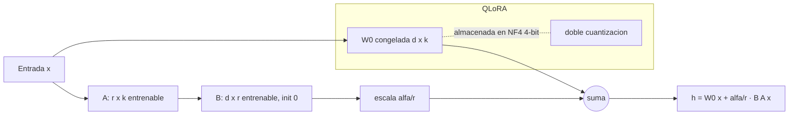

# 077 — LoRA, QLoRA y adaptación eficiente

> [← Clase anterior](../../../classes/part-06-foundation-models-and-llm-engineering/076-instruction-tuning-y-datos-de-instrucciones/README.md) · [Índice de la parte](../README.md) · [Clase siguiente →](../../../classes/part-06-foundation-models-and-llm-engineering/078-rlhf-rlaif-y-dpo/README.md)

**Parte:** 06 — Modelos fundacionales e ingeniería de LLM  
**Nivel:** avanzado · **Horas estimadas:** 6  
**Laboratorio:** `neural` · **Estado:** `EXECUTABLE_CORE`

## 🎯 Propósito

Comprender **lora, qlora y adaptación eficiente** dentro de la evolución de la inteligencia
artificial, implementar un experimento mínimo verificable y distinguir qué parte
constituye evidencia frente a una afirmación todavía no comprobada.

## 📚 Resultados de aprendizaje

Al finalizar podrás:

1. Explicar lora, qlora y adaptación eficiente usando los conceptos `LoRA`, `QLoRA`, `PEFT`, `cuantización`.
2. Ejecutar el laboratorio con una semilla explícita y revisar su contrato JSON.
3. Identificar al menos un supuesto, una limitación y un riesgo de aplicación.
4. Comparar el enfoque con la etapa anterior de la ruta de aprendizaje.
5. Producir una evidencia reproducible y una conclusión que no exceda los datos.

## 🧩 Conceptos centrales

`LoRA`, `QLoRA`, `PEFT`, `cuantización`

## 🗺️ Ubicación en el mapa de la IA

El fine-tuning completo de un modelo de 70B exige cientos de GB de memoria solo en
optimizador: inviable fuera de grandes laboratorios. PEFT (parameter-efficient
fine-tuning) democratizó la adaptación: LoRA (2021) entrena <1 % de parámetros con
calidad comparable, y QLoRA (2023) lo combina con cuantización de 4 bits para
ajustar un 65B en una sola GPU de 48 GB. Es la técnica que hace ejecutable en la
práctica el instruction tuning de la clase anterior y conecta con la cuantización de
inferencia de la clase 085.

## 📖 Fundamentos

### 🧊 El problema: memoria del fine-tuning completo

Entrenar con Adam en FP16/BF16 requiere por cada parámetro: 2 bytes (peso) + 2
(gradiente) + 4+4 (momentos m y v en FP32) + 4 (copia maestra FP32) ≈ **16
bytes/parámetro**. Un 7B → ~112 GB sin contar activaciones. Además, cada tarea
ajustada produce una copia completa del modelo.

### 🔩 LoRA: adaptación de bajo rango

Hipótesis (Hu et al., 2021): la actualización ΔW que necesita el fine-tuning tiene
**rango intrínseco bajo**. En lugar de aprender ΔW ∈ ℝ^{d×k} completa, se aprende su
factorización:

```text
h = W₀·x + ΔW·x = W₀·x + (α/r)·B·A·x

W₀ ∈ ℝ^{d×k}  congelada (no recibe gradientes)
A  ∈ ℝ^{r×k}  inicializada gaussiana
B  ∈ ℝ^{d×r}  inicializada en cero  →  ΔW = B·A = 0 al inicio (parte del modelo base)
r  ≪ min(d,k) rango (típico 4–64);  α escala la contribución
```

Parámetros entrenables: r·(d+k) frente a d·k. Se aplica típicamente a las
proyecciones de atención (W_q, W_v; a veces todas las lineales). En inferencia, B·A
puede **fusionarse** con W₀ (W = W₀ + (α/r)·B·A): latencia extra cero. Los
adaptadores pesan MB, no GB: se pueden servir decenas de tareas sobre un mismo base.

### 🧮 QLoRA: base cuantizado a 4 bits + adaptadores en BF16

QLoRA (Dettmers et al., 2023) añade tres piezas:

1. **NF4 (NormalFloat4)**: tipo de dato de 4 bits con niveles ubicados en los
   cuantiles de una normal — óptimo teórico-informativo para pesos ~N(0, σ).
2. **Doble cuantización**: las constantes de escala de cada bloque se cuantizan a
   su vez (ahorra ~0,37 bits/parámetro extra).
3. **Optimizadores paginados**: los estados de Adam se paginan a RAM de CPU ante
   picos, evitando OOM.

El base congelado vive en NF4 (~0,5 byte/parámetro); los gradientes atraviesan la
descuantización hacia los adaptadores LoRA en BF16. Resultado del paper: Guanaco
65B ajustado en una GPU de 48 GB con calidad comparable al fine-tuning en 16 bits.

### 🎛️ Hiperparámetros que importan

- **r**: 8–16 basta para la mayoría de tareas de estilo/formato; tareas muy nuevas
  piden r mayor o más matrices objetivo.
- **α**: suele fijarse α = r o α = 2r (escala efectiva α/r constante).
- **Dropout de LoRA** (~0,05) y learning rate mayor que en full FT (~1·10⁻⁴).
- Aplicar LoRA a **todas** las capas lineales suele rendir más que solo W_q/W_v
  (hallazgo de QLoRA).

## 🧮 Ejemplo trabajado

Capa de atención con W ∈ ℝ^{768×768} (d = k = 768), LoRA con r = 8:

```text
Full fine-tuning de esa capa:  768 × 768            = 589 824 parámetros
LoRA:  A (8×768) + B (768×8)  = 6 144 + 6 144      = 12 288 parámetros
Fracción entrenable: 12 288 / 589 824 ≈ 2,08 %  (≈ 48× menos)

Memoria de optimizador Adam (12 bytes por parámetro entrenable en m, v y copia FP32):
  Full: 589 824 × 12 ≈ 7,1 MB por capa   LoRA: 12 288 × 12 ≈ 0,15 MB por capa

En un Transformer con 12 bloques, adaptando W_q y W_v de cada bloque:
  24 matrices × 12 288 = 294 912 parámetros entrenables (~0,3 M)
  frente a ~124 M del modelo completo (estilo GPT-2 small): ~0,24 %.
```

Regla general: parámetros LoRA = r·(d+k) crece **linealmente** con d, mientras la
matriz completa crece cuadráticamente — cuanto más grande el modelo, mayor el ahorro.

## 📊 Propiedades y comparación

| Método | Parámetros entrenables | Memoria GPU (7B aprox.) | Calidad | Latencia inferencia |
|---|---|---|---|---|
| Full fine-tuning | 100 % | ~112 GB | Referencia | Base |
| Adapters (serie) | ~1–4 % | ~30 GB | ≈ full | +capas extra (más lenta) |
| Prompt/prefix tuning | <0,1 % | ~20 GB | Inferior en tareas duras | Contexto ocupado |
| LoRA (r=8–16) | ~0,1–1 % | ~20 GB | ≈ full en la mayoría | Cero si se fusiona |
| QLoRA (NF4) | ~0,1–1 % | ~6–10 GB | ≈ LoRA 16-bit | Descuantización al vuelo |



## ⚠️ Errores conceptuales frecuentes

1. **"LoRA cuantiza el modelo."** No: LoRA reduce parámetros *entrenables*. La
   cuantización a 4 bits es la aportación de QLoRA, y solo sobre el base congelado.
2. **"Con r pequeño se pierde el conocimiento del base."** W₀ está congelada; el
   riesgo de olvido catastrófico es menor que en full FT, no mayor.
3. **"Los adaptadores añaden latencia en producción."** Fusionados (W₀ + BA) la
   latencia extra es exactamente cero; solo el serving multi-adaptador la paga.
4. **"QLoRA entrena en 4 bits."** Los gradientes y adaptadores están en BF16; NF4
   solo almacena el base congelado.
5. **"PEFT sirve para inyectar conocimiento masivo."** Igual que el SFT: adapta
   comportamiento y estilo; para conocimiento fresco, RAG o preentrenamiento
   continuado suelen ser mejores herramientas.

## 🚀 Del aprendizaje a la operación

Para operar esto de verdad: elegir módulos objetivo y r con una búsqueda pequeña
sobre evals propios; versionar adaptadores junto al hash exacto del modelo base
(un adaptador es inválido sobre otro checkpoint); decidir entre fusionar (una tarea,
latencia mínima) o servir multi-adaptador (muchas tareas, un solo base en memoria);
y medir regresiones sobre capacidades generales, porque "entrena barato" no exime
de evaluar caro.

## 🧪 Laboratorio

```bash
python lab.py
```

El laboratorio llama a `ai_evolution.labs.run_lab("neural")`. Esta
decisión evita 183 implementaciones divergentes: cada clase tiene un entrypoint
propio, pero los motores didácticos se prueban como una biblioteca común.

### 🔍 Evidencia esperada

- tipo de laboratorio y semilla;
- entradas o decisiones observables;
- resultado estructurado;
- lista `evidence` con hechos que pueden inspeccionarse;
- lista `limitations` que impide presentar la demo como producción.

## 📓 Notebooks

- [📓 `notebook.ipynb`](notebook.ipynb): recorrido guiado con la materia resumida.
- [✍️ `notebook_student.ipynb`](notebook_student.ipynb): ejercicios para resolver.
- [✅ `notebook_solution.ipynb`](notebook_solution.ipynb): solución de referencia explicada.

## 📝 Evaluación

| Criterio | Peso |
|---|---:|
| Comprensión conceptual | 25 % |
| Ejecución reproducible | 25 % |
| Interpretación basada en evidencia | 25 % |
| Riesgos, límites y mejora propuesta | 25 % |

Consulta [assessment.md](assessment.md) para preguntas y criterio de aceptación.

## ⚠️ Errores comunes

| Síntoma | Causa probable | Corrección |
|---|---|---|
| El código corre, pero no hay conclusión | Se confundió ejecución con aprendizaje | Explica qué demuestra y qué no demuestra |
| El resultado cambia sin explicación | No se registró semilla o configuración | Conserva semilla, versión y parámetros |
| Se promete uso real | Se extrapoló desde una demo educativa | Declara entorno, datos, límites y revisión humana |
| Se copia una métrica aislada | No existe baseline ni costo de error | Añade comparación y criterio de decisión |

## ❓ Preguntas frecuentes

**¿Debo usar una API comercial?**  
No. El núcleo funciona localmente. Las extensiones LIVE se documentan por separado.

**¿El laboratorio representa una implementación industrial?**  
No por sí solo. Enseña el contrato y el patrón; producción exige integración,
seguridad, observabilidad, pruebas y operación.

**¿Dónde profundizo?**  
Revisa las especializaciones enlazadas en el README raíz y la ruta siguiente.

## 🔗 Referencias

- Hu et al. (2021), *LoRA: Low-Rank Adaptation of Large Language Models*: <https://arxiv.org/abs/2106.09685> — uso: fuente primaria del mecanismo estudiado
- Dettmers et al. (2023), *QLoRA: Efficient Finetuning of Quantized LLMs*: <https://arxiv.org/abs/2305.14314> — uso: fuente primaria del mecanismo estudiado
- Aghajanyan et al. (2020), *Intrinsic Dimensionality Explains the Effectiveness of Language Model Fine-Tuning*: <https://arxiv.org/abs/2012.13255> — uso: fuente primaria del mecanismo estudiado
- Documentación oficial de Hugging Face PEFT: <https://huggingface.co/docs/peft> — uso: referencia consultada en su fuente original
- Documentación oficial de bitsandbytes (NF4, 4-bit): <https://huggingface.co/docs/bitsandbytes> — uso: referencia consultada en su fuente original

<!-- papers:inicio -->

---

## 📜 Papers que fundamentan esta clase

> Bloque generado por `python scripts/link_papers_to_classes.py`. La fuente es [`papers/catalog/papers.json`](../../../papers/catalog/papers.json).

| Paper | Año | Qué desbloqueó | Miniatura |
|---|---:|---|---|
| [P48 · LoRA: adaptación de rango bajo de modelos de lenguaje grandes](../../../papers/foundational/P48_lora/README.md) | 2021 | Ajustar un modelo enorme entrenando una fracción diminuta de parámetros, sin coste añadido en inferencia. | [notebook](../../../notebooks/papers/P48_lora.ipynb) |
| [P49 · QLoRA: ajuste fino eficiente de modelos cuantizados](../../../papers/foundational/P49_qlora/README.md) | 2023 | Pone el ajuste fino de un modelo muy grande al alcance de una sola GPU de consumo. | [notebook](../../../notebooks/papers/P49_qlora.ipynb) |

Cada ficha explica el problema anterior, la matemática mínima, los límites y los errores de atribución más frecuentes. Para leerlas con método: [cómo leer un paper de IA](../../../papers/guides/COMO_LEER_UN_PAPER_DE_IA.md) · [anexos matemáticos](../../../papers/annexes/README.md).
<!-- papers:fin -->
---

## ⬅️ Clase anterior

[076 — Instruction tuning y datos de instrucciones](../../part-06-foundation-models-and-llm-engineering/076-instruction-tuning-y-datos-de-instrucciones/README.md)

## ➡️ Siguiente clase

[078 — RLHF, RLAIF y DPO](../../part-06-foundation-models-and-llm-engineering/078-rlhf-rlaif-y-dpo/README.md)
