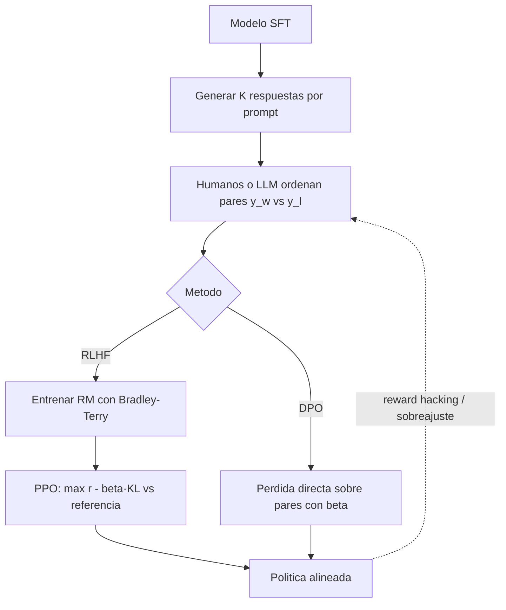

# 078 — RLHF, RLAIF y DPO

> [← Clase anterior](../../../classes/part-06-foundation-models-and-llm-engineering/077-lora-qlora-y-adaptacion-eficiente/README.md) · [Índice de la parte](../README.md) · [Clase siguiente →](../../../classes/part-06-foundation-models-and-llm-engineering/079-prompting-contexto-y-resultados-estructurados/README.md)

**Parte:** 06 — Modelos fundacionales e ingeniería de LLM  
**Nivel:** avanzado · **Horas estimadas:** 6  
**Laboratorio:** `probability` · **Estado:** `EXECUTABLE_CORE`

## 🎯 Propósito

Comprender **rlhf, rlaif y dpo** dentro de la evolución de la inteligencia
artificial, implementar un experimento mínimo verificable y distinguir qué parte
constituye evidencia frente a una afirmación todavía no comprobada.

## 📚 Resultados de aprendizaje

Al finalizar podrás:

1. Explicar rlhf, rlaif y dpo usando los conceptos `preferencias`, `reward model`, `RLHF`, `DPO`.
2. Ejecutar el laboratorio con una semilla explícita y revisar su contrato JSON.
3. Identificar al menos un supuesto, una limitación y un riesgo de aplicación.
4. Comparar el enfoque con la etapa anterior de la ruta de aprendizaje.
5. Producir una evidencia reproducible y una conclusión que no exceda los datos.

## 🧩 Conceptos centrales

`preferencias`, `reward model`, `RLHF`, `DPO`

## 🗺️ Ubicación en el mapa de la IA

El SFT (clase 076) enseña a imitar demostraciones, pero no a *preferir*: entre dos
respuestas plausibles no sabe cuál es más útil, honesta o inocua. El aprendizaje por
preferencias cierra el ciclo de alineamiento: RLHF (InstructGPT, 2022) lo hizo con
un modelo de recompensa y PPO — la receta detrás de ChatGPT — y DPO (2023) demostró
que el mismo objetivo se optimiza con una pérdida supervisada simple, sin RL
explícito. Aquí se conectan el aprendizaje por refuerzo (parte 07 de la ruta usa
estas bases) y la ingeniería práctica de LLM.

## 📖 Fundamentos

### 🔁 El pipeline RLHF (InstructGPT)

```text
Etapa 1 — SFT: fine-tuning sobre demostraciones humanas → política π_SFT.
Etapa 2 — Modelo de recompensa (RM): humanos ORDENAN K respuestas por prompt;
          se entrena r_φ(x, y) para predecir la preferencia.
Etapa 3 — RL (PPO): optimizar la política π_θ para maximizar la recompensa,
          penalizando alejarse de π_SFT.
```

### 🏆 Modelo de recompensa y Bradley–Terry

La probabilidad de que la respuesta y_w ("winner") sea preferida a y_l ("loser") se
modela con Bradley–Terry:

```text
P(y_w ≻ y_l | x) = σ(r_φ(x, y_w) − r_φ(x, y_l))       σ = sigmoide
L_RM = −E[log σ(r_φ(x, y_w) − r_φ(x, y_l))]
```

Solo importan las **diferencias** de recompensa: r_φ está definida salvo una
constante. Comparar es más fiable que puntuar: los anotadores discrepan menos en
"¿cuál es mejor?" que en "¿cuánto vale esta del 1 al 10?".

### 🎯 Objetivo RL con penalización KL

Maximizar r_φ a secas invita al *reward hacking* (respuestas largas, aduladoras o
degeneradas que engañan al RM). Por eso el objetivo real es:

```text
max_θ  E_{y~π_θ} [ r_φ(x, y) ]  −  β · KL( π_θ(·|x) ‖ π_ref(·|x) )
```

La penalización KL ancla la política a la referencia π_ref (el modelo SFT): β
pequeño permite explorar más (y hackear más); β grande congela el modelo. En la
práctica se añade como término por token a la recompensa y se optimiza con PPO,
manteniendo 3–4 copias del modelo en memoria (política, referencia, RM, crítico).

### 📐 DPO: optimización directa de preferencias

DPO (Rafailov et al., 2023) parte de que el óptimo del objetivo anterior tiene forma
cerrada π*(y|x) ∝ π_ref(y|x)·exp(r(x,y)/β). Despejando r y sustituyendo en
Bradley–Terry, la recompensa desaparece y queda una pérdida supervisada sobre los
propios pares de preferencia:

```text
L_DPO = −E[ log σ( β·( log π_θ(y_w|x)/π_ref(y_w|x) − log π_θ(y_l|x)/π_ref(y_l|x) ) ) ]
```

Intuición: sube la probabilidad relativa (vs. referencia) de la respuesta preferida
y baja la de la rechazada, con β controlando la fuerza. Sin RM separado, sin
muestreo online, sin PPO: entrena como un fine-tuning normal con dos forwards por
ejemplo (θ y ref). **RLAIF** sustituye anotadores humanos por un LLM que juzga con
una constitución/criterios — misma matemática, otra fuente de preferencias.

## 🧮 Ejemplo trabajado

Modelo de recompensa sobre un par: r(x, y_w) = 2,0 y r(x, y_l) = 0,5.

```text
P(y_w ≻ y_l) = σ(2,0 − 0,5) = σ(1,5) = 1/(1+e^−1,5) ≈ 0,817
L_RM = −ln 0,817 ≈ 0,202

Si el RM se equivocara (r_w = 0,5, r_l = 2,0): P = σ(−1,5) ≈ 0,182 → L ≈ 1,703.
```

Paso DPO con β = 0,1 (log-probs totales de cada respuesta):

```text
log π_θ(y_w) = −12,0   log π_ref(y_w) = −12,5   → ventaja_w = +0,5
log π_θ(y_l) = −10,0   log π_ref(y_l) = −9,0    → ventaja_l = −1,0
margen = β·(0,5 − (−1,0)) = 0,1·1,5 = 0,15
L_DPO = −ln σ(0,15) ≈ −ln 0,537 ≈ 0,621
```

El gradiente empuja a aumentar π_θ(y_w) y reducir π_θ(y_l), con más fuerza cuanto
más "sorprendido" está el modelo (margen pequeño o negativo).

## 📊 Propiedades y comparación

| Aspecto | RLHF (PPO) | DPO | RLAIF |
|---|---|---|---|
| Modelo de recompensa | Explícito, entrenado aparte | Implícito en la pérdida | Explícito o implícito |
| Fuente de preferencias | Humanos | Humanos | LLM juez con criterios |
| Muestreo durante el entrenamiento | Online (genera y evalúa) | Offline (dataset fijo) | Según variante |
| Modelos en memoria | 3–4 (π, ref, RM, crítico) | 2 (π, ref) | Según variante |
| Estabilidad / complejidad | Frágil, muchos hiperparámetros | Estable, tipo SFT | Hereda del método base |
| Riesgo característico | Reward hacking del RM | Sobreajuste al dataset de pares | Sesgos del juez amplificados |



## ⚠️ Errores conceptuales frecuentes

1. **"El RM mide la calidad verdadera."** Mide *preferencias de anotadores* bajo
   incentivos y guías concretas; optimizarlo demasiado produce adulación y
   verbosidad (reward hacking), no calidad.
2. **"La KL es un tecnicismo opcional."** Sin ella, PPO destruye el modelo en pocos
   pasos (texto degenerado con recompensa alta). β es el hiperparámetro central.
3. **"DPO no tiene modelo de recompensa."** Lo tiene *implícito*:
   r̂ = β·log(π_θ/π_ref); DPO evita entrenarlo por separado, no lo elimina.
4. **"RLHF enseña hechos nuevos."** Ajusta comportamiento y estilo sobre las
   capacidades ya existentes; no añade conocimiento.
5. **"Preferencias = verdad."** Los anotadores prefieren respuestas seguras,
   largas y confiadas; el modelo aprende también esos sesgos (p. ej., confianza
   injustificada).

## 🚀 Del aprendizaje a la operación

Un pipeline real necesita: miles-millones de comparaciones con control de calidad
inter-anotador; evaluación del RM en pares retenidos (accuracy ~65–75 % es lo
normal — los humanos también discrepan); vigilancia de reward hacking con evals
adversariales; decisión RLHF vs DPO según infraestructura (DPO domina en equipos
pequeños); y monitoreo del "impuesto de alineamiento" sobre capacidades base tras
cada ronda.

## 🧪 Laboratorio

```bash
python lab.py
```

El laboratorio llama a `ai_evolution.labs.run_lab("probability")`. Esta
decisión evita 183 implementaciones divergentes: cada clase tiene un entrypoint
propio, pero los motores didácticos se prueban como una biblioteca común.

### 🔍 Evidencia esperada

- tipo de laboratorio y semilla;
- entradas o decisiones observables;
- resultado estructurado;
- lista `evidence` con hechos que pueden inspeccionarse;
- lista `limitations` que impide presentar la demo como producción.

## 📓 Notebooks

- [📓 `notebook.ipynb`](notebook.ipynb): recorrido guiado con la materia resumida.
- [✍️ `notebook_student.ipynb`](notebook_student.ipynb): ejercicios para resolver.
- [✅ `notebook_solution.ipynb`](notebook_solution.ipynb): solución de referencia explicada.

## 📝 Evaluación

| Criterio | Peso |
|---|---:|
| Comprensión conceptual | 25 % |
| Ejecución reproducible | 25 % |
| Interpretación basada en evidencia | 25 % |
| Riesgos, límites y mejora propuesta | 25 % |

Consulta [assessment.md](assessment.md) para preguntas y criterio de aceptación.

## ⚠️ Errores comunes

| Síntoma | Causa probable | Corrección |
|---|---|---|
| El código corre, pero no hay conclusión | Se confundió ejecución con aprendizaje | Explica qué demuestra y qué no demuestra |
| El resultado cambia sin explicación | No se registró semilla o configuración | Conserva semilla, versión y parámetros |
| Se promete uso real | Se extrapoló desde una demo educativa | Declara entorno, datos, límites y revisión humana |
| Se copia una métrica aislada | No existe baseline ni costo de error | Añade comparación y criterio de decisión |

## ❓ Preguntas frecuentes

**¿Debo usar una API comercial?**  
No. El núcleo funciona localmente. Las extensiones LIVE se documentan por separado.

**¿El laboratorio representa una implementación industrial?**  
No por sí solo. Enseña el contrato y el patrón; producción exige integración,
seguridad, observabilidad, pruebas y operación.

**¿Dónde profundizo?**  
Revisa las especializaciones enlazadas en el README raíz y la ruta siguiente.

## 🔗 Referencias

- Ouyang et al. (2022), *Training language models to follow instructions with human feedback* (InstructGPT/RLHF): <https://arxiv.org/abs/2203.02155>
- Rafailov et al. (2023), *Direct Preference Optimization: Your Language Model is Secretly a Reward Model*: <https://arxiv.org/abs/2305.18290>
- Christiano et al. (2017), *Deep Reinforcement Learning from Human Preferences*: <https://arxiv.org/abs/1706.03741>
- Bai et al. (2022), *Constitutional AI: Harmlessness from AI Feedback* (RLAIF): <https://arxiv.org/abs/2212.08073>
- Schulman et al. (2017), *Proximal Policy Optimization Algorithms* (PPO): <https://arxiv.org/abs/1707.06347>
- Sutton y Barto, *Reinforcement Learning: An Introduction* (2.ª ed.): <http://incompleteideas.net/book/the-book-2nd.html>

---

## ⬅️ Clase anterior

[077 — LoRA, QLoRA y adaptación eficiente](../../part-06-foundation-models-and-llm-engineering/077-lora-qlora-y-adaptacion-eficiente/README.md)

## ➡️ Siguiente clase

[079 — Prompting, contexto y resultados estructurados](../../part-06-foundation-models-and-llm-engineering/079-prompting-contexto-y-resultados-estructurados/README.md)
