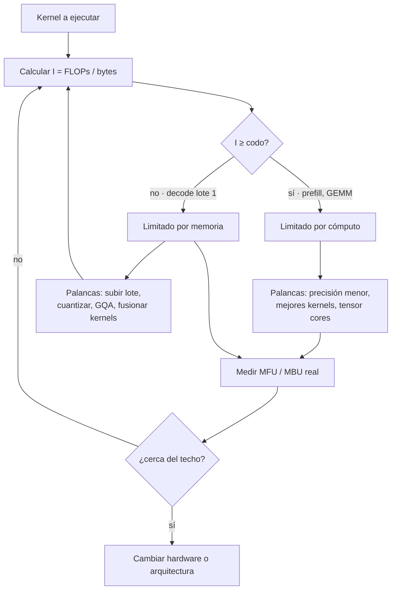

# 081 — Aceleradores, memoria y el límite real del cómputo

> [← Clase anterior](../../../classes/part-06-foundation-models-and-llm-engineering/080-tool-calling-y-ejecucion-controlada/README.md) · [Índice de la parte](../README.md) · [Clase siguiente →](../../../classes/part-06-foundation-models-and-llm-engineering/082-dimensionar-hardware-de-la-laptop-al-cluster/README.md)

**Parte:** 06 — Modelos fundacionales e ingeniería de LLM  
**Nivel:** avanzado · **Horas estimadas:** 6  
**Laboratorio:** `observability` · **Estado:** `EXECUTABLE_CORE`

## 🎯 Propósito

Comprender **aceleradores, memoria y el límite real del cómputo** dentro de la
evolución de la inteligencia artificial, implementar un experimento mínimo
verificable y distinguir qué parte constituye evidencia frente a una afirmación
todavía no comprobada.

## 📚 Resultados de aprendizaje

Al finalizar podrás:

1. Explicar aceleradores, memoria y el límite real del cómputo usando los conceptos `intensidad aritmética`, `ancho de banda`, `roofline`, `HBM`.
2. Ejecutar el laboratorio con una semilla explícita y revisar su contrato JSON.
3. Identificar al menos un supuesto, una limitación y un riesgo de aplicación.
4. Comparar el enfoque con la etapa anterior de la ruta de aprendizaje.
5. Producir una evidencia reproducible y una conclusión que no exceda los datos.

## 🧩 Conceptos centrales

`intensidad aritmética`, `ancho de banda`, `roofline`, `HBM`

## 🗺️ Ubicación en el mapa de la IA

La clase 075 midió el entrenamiento en FLOPs, como si el cómputo fuera un fluido
homogéneo que se compra por litros. No lo es. Un acelerador tiene dos recursos
distintos —operaciones por segundo y bytes por segundo— que crecen a ritmos
distintos, y casi todo lo que duele en la práctica ocurre cuando el segundo se
agota antes que el primero. Esta clase da el modelo cuantitativo (**roofline**)
que explica por qué el decode de un LLM usa menos del 1 % de los FLOPs de una
GPU, por qué el batching (084) y la cuantización (085) funcionan, y por qué la
factura de inferencia se parece más a una cuenta de memoria que a una de cálculo.

## 📖 Fundamentos

### 🧱 Anatomía de un acelerador

Una GPU de centro de datos no es "un procesador rápido": es un enjambre de
unidades de ejecución alimentadas por una jerarquía de memoria muy desigual.
Tomando la H100 SXM como referencia (132 SM, 16 896 núcleos CUDA):

```text
                    capacidad         ancho de banda     distancia
registros           ~33 MB total      ~decenas de TB/s   dentro del SM
SRAM (shared/L1)    228 KB por SM     ~decenas de TB/s   dentro del SM
L2                  50 MB             ~varios TB/s       en el chip
HBM3 ("la VRAM")    80 GB             3,35 TB/s          en el paquete
NVLink 4            —                 900 GB/s           GPU ↔ GPU
PCIe 5.0 ×16        —                 64 GB/s            GPU ↔ CPU
red 400 Gb/s        —                 ~50 GB/s           nodo ↔ nodo
```

Cada escalón hacia abajo cuesta entre 3× y 100× más por byte movido. Los
**tensor cores** son unidades dedicadas a multiplicar matrices pequeñas en baja
precisión: son la razón de que el pico teórico sea enorme, y también de que ese
pico sea casi inalcanzable si los datos no llegan a tiempo.

### 📐 Intensidad aritmética y el modelo roofline

Toda operación tiene una **intensidad aritmética** `I`: cuántas operaciones
realiza por cada byte que mueve desde HBM.

```text
I = FLOPs ejecutados / bytes leídos desde memoria      [FLOP/byte]

Rendimiento alcanzable = min( pico_FLOPS , I × ancho_de_banda )
```

El cruce de las dos rectas es el **punto de codo** (*ridge point*): la
intensidad mínima para poder aspirar al pico de cómputo.

```text
H100 SXM, BF16 denso:
  codo = 989,5 TFLOP/s ÷ 3,35 TB/s ≈ 295 FLOP/byte
```

Por debajo de 295 FLOP/byte la GPU está **limitada por memoria** y los TFLOPS del
folleto son irrelevantes; por encima, está **limitada por cómputo**.

### 🔁 Por qué el decode vive en el suelo del roofline

Generar un token con lote `B` exige leer **todos** los pesos una vez y hacer dos
operaciones por parámetro y secuencia:

```text
FLOPs  ≈ 2 · N · B          bytes ≈ N · b     (b = bytes por parámetro)

I = 2·N·B / (N·b) = 2B / b       →  en FP16 (b = 2):  I ≈ B FLOP/byte
```

Con lote 1 la intensidad es **1 FLOP/byte** frente a un codo de 295: el decode
usa ≈ 0,34 % del pico de cómputo de una H100. No es un defecto del software; es
aritmética. Sólo el lote sube `I`, y por eso el continuous batching de la clase
084 es la palanca principal, mientras el prefill —que procesa todo el prompt de
una vez y sí hace GEMM densos— vive del otro lado del codo.

### 💾 El muro de memoria

El desajuste no es coyuntural. Wulf y McKee lo nombraron en 1995 y sigue
ampliándose: el cómputo pico por acelerador ha crecido mucho más rápido que el
ancho de banda que lo alimenta. Gholami et al. lo cuantifican para la era de los
transformers: la memoria, no los FLOPs, es la restricción que fija el techo. De
ahí que las tres respuestas efectivas sean **mover menos bytes** (cuantización,
085), **reutilizar los que ya se movieron** (KV cache y batching, 084) o
**mantenerlos más cerca** (FlashAttention mantiene los bloques de atención en
SRAM en vez de ir y volver a HBM).

### 🔗 Cuando el modelo no cabe en un chip

Si los pesos exceden la HBM disponible hay que repartirlos, y el reparto se paga
en comunicación:

- **Paralelismo de tensor:** cada capa se parte entre GPUs; exige un all-reduce
  por capa, así que sólo es viable sobre NVLink (900 GB/s), no sobre PCIe.
- **Paralelismo de pipeline:** cada GPU recibe capas distintas; comunica poco,
  pero introduce burbujas si no hay microlotes.
- **Paralelismo de datos:** réplicas completas; no reduce la memoria por GPU,
  sólo aumenta el throughput agregado.

La regla práctica: el paralelismo de tensor se queda dentro del nodo; entre nodos
se usa pipeline o datos.

## 🧮 Ejemplo trabajado

Modelo de 8 B parámetros cuantizado a ~4,5 bits (GGUF Q4_K_M, ≈ 0,57 B/parámetro
→ **4,6 GB**), lote 1, en una H100 SXM.

```text
1) Techo por ancho de banda (cada token relee todos los pesos):
   tokens/s ≤ 3 350 GB/s ÷ 4,6 GB ≈ 728 tokens/s

2) Punto en el roofline:
   I = 2·B/b con B=1, b≈0,57 → I ≈ 3,5 FLOP/byte   (codo: 295)
   → limitado por memoria por un factor ~84×

3) Cómputo realmente aprovechado:
   3,5 FLOP/byte × 3,35 TB/s ≈ 11,7 TFLOP/s  de 989,5 disponibles = 1,2 %

4) Realidad medida: el MBU (model bandwidth utilization) típico es 60–80 %.
   728 × 0,7 ≈ 510 tokens/s  → si mides 480, estás cerca del límite físico
   y ninguna optimización de kernel te dará 2×; sólo cambiar lote, precisión
   o hardware mueve ese número.
```

La conclusión operativa es la que casi nunca se enuncia: **antes de optimizar,
calcula el techo**. Si tu medición está al 70 % del techo teórico, el problema
ya no es tu código.

## 📊 Propiedades y comparación

Techo teórico de generación con lote 1 (ancho de banda ÷ tamaño del modelo);
"8B Q4" = 4,6 GB, "70B Q4" = 40 GB.

| Acelerador | Memoria | Ancho de banda | 8B Q4 | 70B Q4 |
|---|---:|---:|---:|---:|
| NVIDIA B200 | 192 GB HBM3e | ~8 TB/s | ~1 740 tok/s | ~200 tok/s |
| NVIDIA H100 SXM | 80 GB HBM3 | 3,35 TB/s | ~728 tok/s | ~84 tok/s |
| NVIDIA A100 80 GB | 80 GB HBM2e | 2,04 TB/s | ~443 tok/s | ~51 tok/s |
| RTX 5090 | 32 GB GDDR7 | 1,79 TB/s | ~390 tok/s | no cabe |
| RTX 4090 | 24 GB GDDR6X | 1,01 TB/s | ~219 tok/s | no cabe |
| Apple M3 Ultra | unificada (hasta 512 GB) | 819 GB/s | ~178 tok/s | ~20 tok/s |
| Apple M4 Max | unificada (hasta 128 GB) | 546 GB/s | ~119 tok/s | ~14 tok/s |
| CPU DDR5 doble canal | RAM del sistema | ~90 GB/s | ~20 tok/s | ~2 tok/s |

Ninguna columna de TFLOPS aparece en la tabla: para lote 1 **no cambia el
resultado**. Ese es el punto de la clase.



## ⚠️ Errores conceptuales frecuentes

1. **"La H100 hace 1 979 TFLOPS en BF16."** Esa cifra del folleto es *con
   dispersión estructurada 2:4*; densa son 989,5. Comparar el número disperso de
   un fabricante con el denso de otro es el error de lectura más común de todo
   el mercado.
2. **"Más TFLOPS = más tokens por segundo."** Con lote 1 el throughput sólo
   depende del ancho de banda y del tamaño del modelo. Dos aceleradores con
   idéntico pico de cómputo y distinta HBM rinden distinto.
3. **"`nvidia-smi` marca 100 % de utilización, así que está al máximo."** Ese
   contador mide *si hay algún kernel activo*, no cuánta capacidad se usa. La
   métrica honesta es MFU (fracción del pico de FLOPS) o MBU (fracción del ancho
   de banda); en decode la primera suele estar por debajo del 5 %.
4. **"La VRAM la ocupan los pesos."** Pesos + KV cache + activaciones + arena
   del runtime. En contextos largos el KV cache puede superar a los pesos
   (clase 084).
5. **"Con PCIe basta para repartir el modelo entre dos GPUs."** El paralelismo de
   tensor comunica por cada capa; sobre 64 GB/s de PCIe la comunicación domina y
   dos GPUs pueden rendir menos que una.

## 🚀 Del aprendizaje a la operación

En producción esto se convierte en instrumentación: exportar MFU y MBU junto a
TTFT/TPOT (clase 153); fijar el techo teórico como línea base en los tableros
para que una regresión se vea como caída de eficiencia y no como "está lento";
perfilar con contadores de hardware —`nvidia-smi dmon`, DCGM, Nsight Compute—
antes de reescribir kernels; comprobar la topología real (`nvidia-smi topo -m`)
porque un nodo mal cableado degrada el tensor parallel sin dar ningún error; y
declarar en cada informe de rendimiento la precisión, el lote y si la cifra es
densa o dispersa.

## 🧪 Laboratorio

```bash
python lab.py
```

El laboratorio llama a `ai_evolution.labs.run_lab("observability")`. Esta
decisión evita 183 implementaciones divergentes: cada clase tiene un entrypoint
propio, pero los motores didácticos se prueban como una biblioteca común.

### 🔍 Evidencia esperada

- tipo de laboratorio y semilla;
- entradas o decisiones observables;
- resultado estructurado;
- lista `evidence` con hechos que pueden inspeccionarse;
- lista `limitations` que impide presentar la demo como producción.

## 📓 Notebooks

- [📓 `notebook.ipynb`](notebook.ipynb): recorrido guiado con la materia resumida.
- [✍️ `notebook_student.ipynb`](notebook_student.ipynb): ejercicios para resolver.
- [✅ `notebook_solution.ipynb`](notebook_solution.ipynb): solución de referencia explicada.

## 📝 Evaluación

| Criterio | Peso |
|---|---:|
| Comprensión conceptual | 25 % |
| Ejecución reproducible | 25 % |
| Interpretación basada en evidencia | 25 % |
| Riesgos, límites y mejora propuesta | 25 % |

Consulta [assessment.md](assessment.md) para preguntas y criterio de aceptación.

## ⚠️ Errores comunes

| Síntoma | Causa probable | Corrección |
|---|---|---|
| El código corre, pero no hay conclusión | Se confundió ejecución con aprendizaje | Explica qué demuestra y qué no demuestra |
| El resultado cambia sin explicación | No se registró semilla o configuración | Conserva semilla, versión y parámetros |
| Se promete uso real | Se extrapoló desde una demo educativa | Declara entorno, datos, límites y revisión humana |
| Se copia una métrica aislada | No existe baseline ni costo de error | Añade comparación y criterio de decisión |

## ❓ Preguntas frecuentes

**¿Debo usar una API comercial?**  
No. El núcleo funciona localmente. Las extensiones LIVE se documentan por separado.

**¿El laboratorio representa una implementación industrial?**  
No por sí solo. Enseña el contrato y el patrón; producción exige integración,
seguridad, observabilidad, pruebas y operación.

**¿Dónde profundizo?**  
Revisa las especializaciones enlazadas en el README raíz y la ruta siguiente.

## 🔗 Referencias

- Williams, Waterman & Patterson (2009), *Roofline: An Insightful Visual Performance Model for Multicore Architectures*, CACM 52(4). [doi:10.1145/1498765.1498785](https://doi.org/10.1145/1498765.1498785) · [PDF](https://people.eecs.berkeley.edu/~kubitron/cs252/handouts/papers/RooflineVyNoYellow.pdf) — uso: fuente primaria del mecanismo estudiado
- Wulf & McKee (1995), *Hitting the Memory Wall: Implications of the Obvious*: [doi:10.1145/216585.216588](https://doi.org/10.1145/216585.216588) — uso: fuente primaria del mecanismo estudiado
- Gholami et al. (2024), *AI and Memory Wall*, IEEE Micro: <https://arxiv.org/abs/2403.14123> — uso: fuente primaria del mecanismo estudiado
- Pope et al. (2022), *Efficiently Scaling Transformer Inference* (aritmética del decode y del paralelismo): <https://arxiv.org/abs/2211.05102> — uso: fuente primaria del mecanismo estudiado
- Dao et al. (2022), *FlashAttention: Fast and Memory-Efficient Exact Attention with IO-Awareness*: <https://arxiv.org/abs/2205.14135> — uso: fuente primaria del mecanismo estudiado
- NVIDIA, *H100 Tensor Core GPU Datasheet* (cifras densas y con dispersión): <https://resources.nvidia.com/en-us-tensor-core/nvidia-tensor-core-gpu-datasheet> — uso: referencia consultada en su fuente original
- NVIDIA, *Blackwell Architecture*: <https://www.nvidia.com/en-us/data-center/technologies/blackwell-architecture/> — uso: referencia consultada en su fuente original
- Jouppi et al. (2017), *In-Datacenter Performance Analysis of a Tensor Processing Unit* (roofline aplicado a un acelerador real): <https://arxiv.org/abs/1704.04760> — uso: fuente primaria del mecanismo estudiado

<!-- papers:inicio -->

---

## 📜 Papers que fundamentan esta clase

> Bloque generado por `python scripts/link_papers_to_classes.py`. La fuente es [`papers/catalog/papers.json`](../../../papers/catalog/papers.json).

| Paper | Año | Qué desbloqueó | Miniatura |
|---|---:|---|---|
| [P35 · FlashAttention: atención exacta, rápida y eficiente en memoria, consciente de la E/S](../../../papers/foundational/P35_flashattention/README.md) | 2022 | El cuello de botella de la atención no eran los FLOPs sino las lecturas y escrituras a memoria. Y la solución es EXACTA, no aproximada. | [notebook](../../../notebooks/papers/P35_flashattention.ipynb) |

Cada ficha explica el problema anterior, la matemática mínima, los límites y los errores de atribución más frecuentes. Para leerlas con método: [cómo leer un paper de IA](../../../papers/guides/COMO_LEER_UN_PAPER_DE_IA.md) · [anexos matemáticos](../../../papers/annexes/README.md).
<!-- papers:fin -->
---

## ⬅️ Clase anterior

[080 — Tool calling y ejecución controlada](../../part-06-foundation-models-and-llm-engineering/080-tool-calling-y-ejecucion-controlada/README.md)

## ➡️ Siguiente clase

[082 — Dimensionar hardware: de la laptop al clúster](../../part-06-foundation-models-and-llm-engineering/082-dimensionar-hardware-de-la-laptop-al-cluster/README.md)
