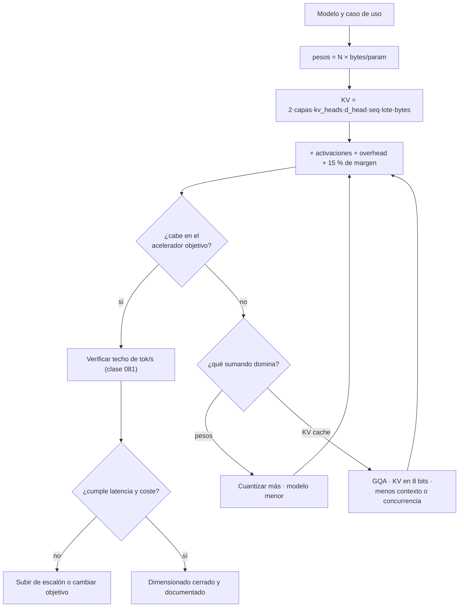

# 082 — Dimensionar hardware: de la laptop al clúster

> [← Clase anterior](../../../classes/part-06-foundation-models-and-llm-engineering/081-aceleradores-memoria-y-el-limite-real-del-computo/README.md) · [Índice de la parte](../README.md) · [Clase siguiente →](../../../classes/part-06-foundation-models-and-llm-engineering/083-ecosistema-del-computo-fabricantes-nubes-y-laboratorios/README.md)

**Parte:** 06 — Modelos fundacionales e ingeniería de LLM  
**Nivel:** avanzado · **Horas estimadas:** 6  
**Laboratorio:** `evaluation` · **Estado:** `EXECUTABLE_CORE`

## 🎯 Propósito

Comprender **dimensionar hardware: de la laptop al clúster** dentro de la
evolución de la inteligencia artificial, implementar un experimento mínimo
verificable y distinguir qué parte constituye evidencia frente a una afirmación
todavía no comprobada.

## 📚 Resultados de aprendizaje

Al finalizar podrás:

1. Explicar dimensionar hardware: de la laptop al clúster usando los conceptos `presupuesto de memoria`, `VRAM`, `memoria unificada`, `dimensionamiento`.
2. Ejecutar el laboratorio con una semilla explícita y revisar su contrato JSON.
3. Identificar al menos un supuesto, una limitación y un riesgo de aplicación.
4. Comparar el enfoque con la etapa anterior de la ruta de aprendizaje.
5. Producir una evidencia reproducible y una conclusión que no exceda los datos.

## 🧩 Conceptos centrales

`presupuesto de memoria`, `VRAM`, `memoria unificada`, `dimensionamiento`

## 🗺️ Ubicación en el mapa de la IA

La clase 081 dio el techo de velocidad; ésta da el de capacidad. Es la clase que
convierte "quiero correr este modelo" en una cuenta cerrada: cuántos gigabytes
hacen falta, en qué máquina caben y qué deja de ser posible cuando no caben.
Es también la clase que hace ejecutable la IA local —la opción de no enviar
datos a ningún tercero— y el prerequisito honesto de la cuantización (085) y de
la decisión de comprar, alquilar o llamar a una API (086).

## 📖 Fundamentos

### 🧮 La ecuación de memoria de inferencia

Cuatro sumandos, y sólo el primero es el que la gente calcula:

```text
M_total = pesos + KV cache + activaciones + overhead del runtime

pesos      = N_parámetros × bytes_por_parámetro
KV cache   = 2 × capas × kv_heads × d_head × long_secuencia × lote × bytes
activaciones ≈ cientos de MB (depende del lote y del kernel)
overhead   ≈ 1–2 GB (contexto CUDA, buffers, fragmentación)
```

Regla operativa: calcula los cuatro y **reserva un 15–20 % de margen**. Un
despliegue que entra al 98 % de la VRAM se cae con el primer prompt largo.

### 📏 Bytes por parámetro

| Formato | Bytes/parámetro | Un 8B ocupa | Pérdida típica de calidad |
|---|---:|---:|---|
| FP32 | 4 | 32 GB | referencia |
| BF16 / FP16 | 2 | 16 GB | ≈ 0 |
| FP8 / INT8 | 1 | 8 GB | pequeña, medible |
| GGUF Q5_K_M | ~0,71 | 5,7 GB | pequeña |
| GGUF Q4_K_M | ~0,57 | 4,6 GB | baja, aceptable en la mayoría de tareas |
| GGUF Q3_K_M | ~0,43 | 3,4 GB | visible; verifica con tus evals |

Los detalles de cada esquema —y por qué la degradación no es lineal— son
materia de la clase 085; aquí sólo se usan como multiplicadores del presupuesto.

### 🏋️ Entrenar no cuesta lo mismo que inferir

El estado del optimizador domina el presupuesto de fine-tuning completo:

```text
Fine-tuning completo con Adam (mixed precision), por parámetro:
  pesos 2 B + gradientes 2 B + momentos m,v 8 B + copia maestra FP32 4 B ≈ 16 B

  8B  → ~128 GB  (no cabe en una H100; exige varias GPUs)
  LoRA (base congelada BF16 + adaptadores)  →  ~18–20 GB
  QLoRA (base en NF4 de 4 bits + adaptadores) → ~6–8 GB → cabe en una RTX 4090
```

Ése es el resultado que hizo famoso a QLoRA: no aceleró el entrenamiento, cambió
quién puede hacerlo.

### 💻 Los tres escalones

**1 · Portátil o escritorio único** — 8–32 GB de VRAM, o memoria unificada en
Apple Silicon. Corre modelos de 3B–14B en 4 bits con `llama.cpp`, Ollama o LM
Studio. La memoria unificada gana en capacidad (todo el RAM es utilizable) y
pierde en ancho de banda frente a una GPU discreta con HBM.

**2 · Estación de trabajo o servidor pequeño** — 1–2 GPUs de 24–96 GB. Corre
30B–70B en 4 bits, sirve con vLLM a decenas de usuarios y permite fine-tuning
con QLoRA. Es el escalón donde vive la mayoría de los despliegues privados
reales.

**3 · Nodo o clúster** — 8 aceleradores con NVLink dentro del nodo e InfiniBand
entre nodos. Es el único escalón que sostiene modelos grandes en BF16,
entrenamiento serio y throughput alto con contextos largos.

### 🔀 Cuando el problema no es la memoria

Tres casos en los que dimensionar por capacidad da la respuesta equivocada:
**concurrencia** (con muchas sesiones el KV cache, no los pesos, fija el
tamaño), **latencia p99** (un modelo que cabe puede seguir siendo demasiado
lento) y **requisitos duros de privacidad o soberanía**, que a veces obligan al
escalón 2 aunque la nube sea más barata (clase 086).

## 🧮 Ejemplo trabajado

Servir un 70B cuantizado a 4 bits para **32 sesiones concurrentes** con contexto
de **8 192 tokens**. Arquitectura tipo Llama-70B: 80 capas, GQA con 8 cabezas KV,
`d_head` = 128, KV en FP16.

```text
1) Pesos:      70e9 × 0,57 B  ≈ 40 GB

2) KV por token:
   2 × 80 capas × 8 kv_heads × 128 × 2 B = 327 680 B ≈ 0,33 MB/token

3) KV total:   0,33 MB × 8 192 tokens × 32 sesiones ≈ 86 GB   ← más del doble
                                                                que los pesos

4) Activaciones + overhead ≈ 6 GB

   TOTAL ≈ 132 GB  →  no cabe en 1×H100 (80 GB)
                      cabe en 2×H100 con NVLink (160 GB) o 1×B200 (192 GB)

5) Palanca: cuantizar el KV cache a 8 bits → 43 GB
   TOTAL ≈ 89 GB  →  sigue sin caber en una H100.
   Bajar a 16 sesiones (o a 4 096 tokens de contexto) → ≈ 68 GB → cabe.
```

El resultado importante no es el número final, sino **cuál es la variable
dominante**: en este despliegue no es el modelo, es el contexto multiplicado por
la concurrencia. Comprar una GPU más grande para "que quepa el modelo" habría
resuelto el sumando equivocado.

## 📊 Propiedades y comparación

| Escenario | Hardware típico | Qué corre bien | Qué no |
|---|---|---|---|
| Aprendizaje / privacidad personal | portátil, 16–24 GB unificados | 3B–8B en Q4, RAG local | contexto largo, concurrencia |
| Desarrollo con GPU de consumo | RTX 4090 / 5090 (24–32 GB) | 8B–14B en Q4 o BF16, QLoRA de 8B | 70B, servir a muchos usuarios |
| Mac de memoria grande | M3 Ultra, 128–512 GB unificados | 70B+ en Q4 con lote 1 | throughput alto (ancho de banda) |
| Servidor privado | 2×H100 / 2×L40S (48–160 GB) | 70B en Q4 sirviendo a decenas | entrenamiento desde cero |
| Nodo de entrenamiento | 8×H100 / 8×B200 + NVLink | BF16 completo, fine-tuning grande | presupuesto pequeño |



## ⚠️ Errores conceptuales frecuentes

1. **"Un modelo de 7B ocupa 7 GB."** Depende del formato: 28 GB en FP32, 14 GB
   en FP16, ~4 GB en Q4. El número de parámetros no es una unidad de memoria.
2. **"Con que quepan los pesos, alcanza."** El ejemplo trabajado muestra un caso
   real donde el KV cache duplica a los pesos. Dimensionar sin el KV es el error
   más caro de esta clase.
3. **"Cuantizo más y ya cabe."** Por debajo de ~4 bits la degradación deja de
   ser despreciable y depende de la tarea; hay que medirla con tus evals, no
   asumirla (085, 086).
4. **"Memoria unificada es lo mismo que VRAM."** Iguala la *capacidad* —un Mac
   con 192 GB carga modelos que ninguna GPU de consumo carga— pero su ancho de
   banda está muy por debajo del de la HBM, y el ancho de banda es lo que fija
   los tokens/s (081).
5. **"Dos GPUs van al doble."** Duplican la memoria; la velocidad depende del
   tipo de paralelismo y del enlace. Sin NVLink, el tensor parallel puede
   *restar* rendimiento.
6. **"Alquilar siempre sale más barato."** Depende de la utilización. Una GPU
   propia al 10 % de uso es cara; al 70 % sostenido suele ser lo contrario.

## 🚀 Del aprendizaje a la operación

En operación el dimensionado deja de ser una cuenta y pasa a ser un control:
fijar límites explícitos de contexto y concurrencia por tenant para que el KV
cache no crezca sin techo; alertar sobre memoria de acelerador igual que sobre
CPU o disco; probar con la distribución real de longitudes de prompt y no con
secuencias uniformes; dejar el cálculo de capacidad versionado junto al
despliegue para que una actualización de modelo obligue a rehacerlo; y modelar
el punto de equilibrio entre comprar y alquilar con horas reales de uso, energía
y coste de operación, no sólo con el precio por hora del proveedor (clase 157).

## 🧪 Laboratorio

```bash
python lab.py
```

El laboratorio llama a `ai_evolution.labs.run_lab("evaluation")`. Esta
decisión evita 183 implementaciones divergentes: cada clase tiene un entrypoint
propio, pero los motores didácticos se prueban como una biblioteca común.

### 🔍 Evidencia esperada

- tipo de laboratorio y semilla;
- entradas o decisiones observables;
- resultado estructurado;
- lista `evidence` con hechos que pueden inspeccionarse;
- lista `limitations` que impide presentar la demo como producción.

## 📓 Notebooks

- [📓 `notebook.ipynb`](notebook.ipynb): recorrido guiado con la materia resumida.
- [✍️ `notebook_student.ipynb`](notebook_student.ipynb): ejercicios para resolver.
- [✅ `notebook_solution.ipynb`](notebook_solution.ipynb): solución de referencia explicada.

## 📝 Evaluación

| Criterio | Peso |
|---|---:|
| Comprensión conceptual | 25 % |
| Ejecución reproducible | 25 % |
| Interpretación basada en evidencia | 25 % |
| Riesgos, límites y mejora propuesta | 25 % |

Consulta [assessment.md](assessment.md) para preguntas y criterio de aceptación.

## ⚠️ Errores comunes

| Síntoma | Causa probable | Corrección |
|---|---|---|
| El código corre, pero no hay conclusión | Se confundió ejecución con aprendizaje | Explica qué demuestra y qué no demuestra |
| El resultado cambia sin explicación | No se registró semilla o configuración | Conserva semilla, versión y parámetros |
| Se promete uso real | Se extrapoló desde una demo educativa | Declara entorno, datos, límites y revisión humana |
| Se copia una métrica aislada | No existe baseline ni costo de error | Añade comparación y criterio de decisión |

## ❓ Preguntas frecuentes

**¿Debo usar una API comercial?**  
No. El núcleo funciona localmente. Las extensiones LIVE se documentan por separado.

**¿El laboratorio representa una implementación industrial?**  
No por sí solo. Enseña el contrato y el patrón; producción exige integración,
seguridad, observabilidad, pruebas y operación.

**¿Dónde profundizo?**  
Revisa las especializaciones enlazadas en el README raíz y la ruta siguiente.

## 🔗 Referencias

- Dettmers et al. (2023), *QLoRA: Efficient Finetuning of Quantized LLMs*: <https://arxiv.org/abs/2305.14314>
- Hu et al. (2021), *LoRA: Low-Rank Adaptation of Large Language Models*: <https://arxiv.org/abs/2106.09685>
- Rajbhandari et al. (2019), *ZeRO: Memory Optimizations Toward Training Trillion Parameter Models* (de dónde salen los 16 B/parámetro): <https://arxiv.org/abs/1910.02054>
- Kwon et al. (2023), *Efficient Memory Management for LLM Serving with PagedAttention*: <https://arxiv.org/abs/2309.06180>
- llama.cpp — formatos GGUF y ejecución en CPU/memoria unificada: <https://github.com/ggml-org/llama.cpp>
- Ollama — runtime local de modelos abiertos: <https://ollama.com>
- LM Studio — entorno local con interfaz gráfica: <https://lmstudio.ai>
- MLX — framework de Apple para memoria unificada: <https://github.com/ml-explore/mlx>
- Hugging Face, *GPU inference* (huella de memoria y optimizaciones): <https://huggingface.co/docs/transformers/main/en/perf_infer_gpu_one>
- Documentación oficial de vLLM (`gpu_memory_utilization`, dimensionado del KV cache): <https://docs.vllm.ai>

---

## ⬅️ Clase anterior

[081 — Aceleradores, memoria y el límite real del cómputo](../../part-06-foundation-models-and-llm-engineering/081-aceleradores-memoria-y-el-limite-real-del-computo/README.md)

## ➡️ Siguiente clase

[083 — El ecosistema del cómputo: fabricantes, nubes y laboratorios](../../part-06-foundation-models-and-llm-engineering/083-ecosistema-del-computo-fabricantes-nubes-y-laboratorios/README.md)
