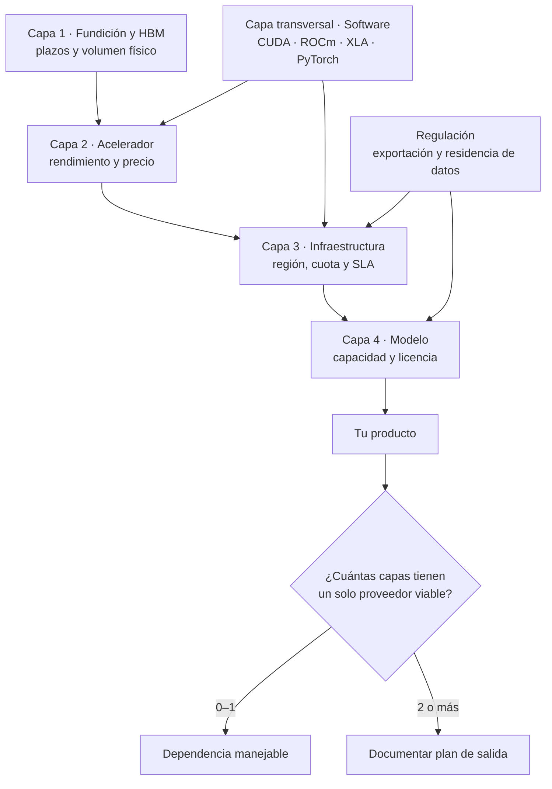

# 083 — El ecosistema del cómputo: fabricantes, nubes y laboratorios

> [← Clase anterior](../../../classes/part-06-foundation-models-and-llm-engineering/082-dimensionar-hardware-de-la-laptop-al-cluster/README.md) · [Índice de la parte](../README.md) · [Clase siguiente →](../../../classes/part-06-foundation-models-and-llm-engineering/084-serving-batching-y-caches/README.md)

**Parte:** 06 — Modelos fundacionales e ingeniería de LLM  
**Nivel:** avanzado · **Horas estimadas:** 6  
**Laboratorio:** `frontier` · **Estado:** `EXECUTABLE_CORE`

## 🎯 Propósito

Comprender **el ecosistema del cómputo: fabricantes, nubes y laboratorios**
dentro de la evolución de la inteligencia artificial, implementar un experimento
mínimo verificable y distinguir qué parte constituye evidencia frente a una
afirmación todavía no comprobada.

## 📚 Resultados de aprendizaje

Al finalizar podrás:

1. Explicar el ecosistema del cómputo: fabricantes, nubes y laboratorios usando los conceptos `cadena de valor`, `CUDA`, `concentración`, `dependencia`.
2. Ejecutar el laboratorio con una semilla explícita y revisar su contrato JSON.
3. Identificar al menos un supuesto, una limitación y un riesgo de aplicación.
4. Comparar el enfoque con la etapa anterior de la ruta de aprendizaje.
5. Producir una evidencia reproducible y una conclusión que no exceda los datos.

## 🧩 Conceptos centrales

`cadena de valor`, `CUDA`, `concentración`, `dependencia`

## 🗺️ Ubicación en el mapa de la IA

Las dos clases anteriores explicaron la máquina. Ésta explica **quién la
fabrica, quién la opera y qué te ata a cada uno** — porque en la práctica esas
son las restricciones que deciden qué modelo puedes usar, a qué precio y bajo
qué jurisdicción. Quien elige modelos sin entender la cadena de valor del cómputo
toma decisiones de arquitectura con una variable oculta. La
clase cierra con el método de lectura de afirmaciones del mercado, que es el
mismo de la clase 010 y que se retoma en la 182.

> ⏱️ **Aviso de caducidad.** Los actores y las cifras de esta clase describen el
> estado a **2026-08**. La parte duradera es la estructura en capas y el método
> para verificar afirmaciones; los nombres concretos deben revisarse por fecha.

## 📖 Fundamentos

### 🏭 Cuatro capas, no una

```text
CAPA 4 · Modelos          laboratorios que entrenan modelos fundacionales
                          ↑ compran cómputo
CAPA 3 · Infraestructura  hiperescalares (AWS, Azure, GCP), nubes especializadas
                          ↑ compran aceleradores
CAPA 2 · Aceleradores     NVIDIA, AMD; silicio propio (TPU, Trainium, MTIA, Maia);
                          especialistas de inferencia (Groq, Cerebras)
                          ↑ compran obleas y encapsulado
CAPA 1 · Fabricación      fundiciones avanzadas (TSMC), memoria HBM
                          (SK hynix, Samsung, Micron), encapsulado CoWoS
```

El cuello de botella real de los últimos años no estuvo casi nunca en el diseño
del chip, sino en la capa 1: capacidad de encapsulado avanzado y suministro de
HBM. Es un dato incómodo para el relato habitual, y explica por qué "hay más
demanda que GPUs" puede ser cierto aunque el diseñador tenga inventario.

### 🔒 El foso no es el silicio, es el software

La ventaja competitiva dominante en la capa 2 es **CUDA**: casi dos décadas de
librerías (cuDNN, cuBLAS, NCCL), kernels afinados, herramientas de perfilado y
—sobre todo— el hecho de que todo framework se prueba primero ahí. Un
competidor con mejor relación FLOPs/dólar sigue perdiendo si el usuario tiene
que portar y revalidar su stack.

Las tres vías de desacoplamiento que sí funcionan hoy:

- **ROCm** (AMD): el camino directo, con paridad creciente en los modelos
  populares y aún desigual fuera de ellos.
- **Capas de compilación** — OpenXLA, Triton, `torch.compile`: escribes el
  kernel una vez y el compilador emite código para varios backends.
- **Frameworks que abstraen el backend** — PyTorch y JAX como interfaz estable.

La conclusión práctica: tu dependencia real no se mide en marcas de GPU, sino en
cuántos kernels y flags específicos de un proveedor hay en tu ruta crítica.

### ⚡ Otras apuestas arquitectónicas

No todos los aceleradores atacan el problema de la clase 081 igual:

- **TPU** (Google): arreglos sistólicos con memoria on-chip grande, diseñados
  desde 2015 para el patrón matriz-por-matriz; el paper de Jouppi et al. es el
  documento fundacional de la idea de acelerador específico.
- **Trainium / Inferentia** (AWS), **MTIA** (Meta), **Maia** (Microsoft):
  silicio propio de los hiperescalares para reducir la dependencia de un único
  proveedor en su mayor partida de gasto.
- **Groq, Cerebras:** apuestan por mantener los pesos en **SRAM** en vez de HBM.
  Eso ataca de raíz el límite de ancho de banda de la clase 081 y produce
  latencias por token muy bajas, a costa de mucha menos capacidad por chip y de
  necesitar repartir el modelo entre muchas unidades.

### 🌍 Geografía y regulación como restricción técnica

Tres hechos estructurales que un diseño de sistema debe tratar como
requisitos, no como noticias: la fabricación en el nodo más avanzado está
concentrada en muy pocas fundiciones y en una región geopolíticamente sensible;
los controles de exportación de EE. UU. (desde octubre de 2022 y con revisiones
posteriores) restringen qué aceleradores pueden venderse a qué países, lo que ha
producido variantes recortadas y mercados con hardware distinto; y las reglas de
residencia de datos determinan en qué región puede ejecutarse un modelo, lo que
a veces obliga a un proveedor peor pero elegible (clases 086 y 170).

### 🔬 Cómo leer una afirmación del mercado

Toda cifra de rendimiento debe responder cinco preguntas antes de entrar en una
decisión:

```text
1. ¿Qué precisión?           FP4/FP8/BF16 no son comparables entre sí.
2. ¿Densa o con dispersión?  Los folletos suelen citar la cifra dispersa.
3. ¿Qué lote y qué contexto? Un throughput a lote 512 no predice tu p99.
4. ¿Qué modelo exacto?       "Un 70B" no es un benchmark.
5. ¿Quién midió?             MLPerf tiene reglas y auditoría; el blog del
                             fabricante, no.
```

Es exactamente el protocolo de la clase 010 aplicado a hardware: sin las cinco
respuestas, la afirmación es publicidad, no evidencia.

## 🧮 Ejemplo trabajado

Afirmación recibida en una evaluación de proveedor: *"nuestro acelerador es 4×
más rápido que una H100 en inferencia de LLM"*. Descomposición:

```text
Pregunta          Respuesta hallada en la letra pequeña      Veredicto
────────────────────────────────────────────────────────────────────────
precisión         FP4 en el suyo vs BF16 en la H100          no comparable
densa/dispersa    cifra con dispersión 2:4                   infla ~2×
lote y contexto   lote 1024, contexto 128 tokens             no es tu perfil
modelo            uno propio de 7B, no el que vas a servir   no transferible
medición          benchmark interno, sin reglas públicas     no auditable

Reformulación honesta: "hasta 4× en throughput agregado, con un modelo de 7B,
en FP4 con dispersión, a lote 1024 y contexto corto, medido por el fabricante".

Decisión: no descartar el proveedor — pedir una corrida MLPerf comparable o
una prueba con TU modelo, TU distribución de longitudes y TU objetivo de p99.
El coste de esa prueba es de días; el de equivocarse, de años de contrato.
```

## 📊 Propiedades y comparación

| Capa | Actores (2026-08) | Qué controla realmente | Riesgo si depende de una sola opción |
|---|---|---|---|
| Fabricación y memoria | fundiciones avanzadas; SK hynix, Samsung, Micron (HBM) | disponibilidad física y plazos | escasez global, exposición geopolítica |
| Aceleradores | NVIDIA, AMD; TPU, Trainium, MTIA, Maia; Groq, Cerebras | rendimiento y precio por token | bloqueo por ecosistema de software |
| Infraestructura | hiperescalares y nubes GPU especializadas | región, cuota, precio, SLA | migración cara, egreso de datos |
| Modelos | laboratorios de modelos cerrados y abiertos | capacidades, licencia, política de uso | deprecación de modelo, cambio de términos |
| Software | CUDA, ROCm, OpenXLA, Triton, PyTorch, vLLM, llama.cpp | portabilidad real | reescritura al cambiar de backend |



## ⚠️ Errores conceptuales frecuentes

1. **"Cuota de mercado = superioridad técnica."** La posición dominante en la
   capa 2 se explica sobre todo por el ecosistema de software y por contratos de
   suministro, no sólo por el silicio.
2. **"Con pesos abiertos no dependo de nadie."** Los pesos abiertos eliminan la
   dependencia de la capa 4, no la de las capas 1–3: sigues necesitando
   aceleradores para ejecutarlos.
3. **"El precio por hora de GPU es estable."** Es de los precios más volátiles
   del sector; cualquier modelo de costo debe traer fecha y escenario de
   sensibilidad.
4. **"Cambiar de proveedor es un cambio de configuración."** Es un cambio de
   kernels, de precisión soportada, de herramientas de perfilado y de
   evaluaciones a rehacer.
5. **"El cuello de botella son los transistores."** Encapsulado avanzado y
   suministro de HBM han sido, repetidamente, la restricción real.
6. **"Esta clase describe un estado permanente."** No: describe 2026-08. La
   estructura en capas dura; los nombres, no.

## 🚀 Del aprendizaje a la operación

Llevado a decisiones: mantener un inventario de dependencias por capa y marcar
cuáles tienen un solo proveedor viable; exigir a cada proveedor una medición
comparable —MLPerf o una prueba con tu carga— antes de firmar; escribir el plan
de salida *antes* de la migración de entrada, incluyendo coste de egreso de
datos y de revalidación de evals; separar en la arquitectura la capa de modelo
detrás de una interfaz estable para que sustituirlo sea una decisión de
producto y no un proyecto (clase 155); registrar la región de ejecución como
metadato auditable (clase 170); y revisar el mapa por fecha con el criterio de
la clase 182 en vez de reaccionar a cada anuncio.

## 🧪 Laboratorio

```bash
python lab.py
```

El laboratorio llama a `ai_evolution.labs.run_lab("frontier")`. Esta
decisión evita 183 implementaciones divergentes: cada clase tiene un entrypoint
propio, pero los motores didácticos se prueban como una biblioteca común.

### 🔍 Evidencia esperada

- tipo de laboratorio y semilla;
- entradas o decisiones observables;
- resultado estructurado;
- lista `evidence` con hechos que pueden inspeccionarse;
- lista `limitations` que impide presentar la demo como producción.

## 📓 Notebooks

- [📓 `notebook.ipynb`](notebook.ipynb): recorrido guiado con la materia resumida.
- [✍️ `notebook_student.ipynb`](notebook_student.ipynb): ejercicios para resolver.
- [✅ `notebook_solution.ipynb`](notebook_solution.ipynb): solución de referencia explicada.

## 📝 Evaluación

| Criterio | Peso |
|---|---:|
| Comprensión conceptual | 25 % |
| Ejecución reproducible | 25 % |
| Interpretación basada en evidencia | 25 % |
| Riesgos, límites y mejora propuesta | 25 % |

Consulta [assessment.md](assessment.md) para preguntas y criterio de aceptación.

## ⚠️ Errores comunes

| Síntoma | Causa probable | Corrección |
|---|---|---|
| El código corre, pero no hay conclusión | Se confundió ejecución con aprendizaje | Explica qué demuestra y qué no demuestra |
| El resultado cambia sin explicación | No se registró semilla o configuración | Conserva semilla, versión y parámetros |
| Se promete uso real | Se extrapoló desde una demo educativa | Declara entorno, datos, límites y revisión humana |
| Se copia una métrica aislada | No existe baseline ni costo de error | Añade comparación y criterio de decisión |

## ❓ Preguntas frecuentes

**¿Debo usar una API comercial?**  
No. El núcleo funciona localmente. Las extensiones LIVE se documentan por separado.

**¿El laboratorio representa una implementación industrial?**  
No por sí solo. Enseña el contrato y el patrón; producción exige integración,
seguridad, observabilidad, pruebas y operación.

**¿Dónde profundizo?**  
Revisa las especializaciones enlazadas en el README raíz y la ruta siguiente.

## 🔗 Referencias

- Jouppi et al. (2017), *In-Datacenter Performance Analysis of a Tensor Processing Unit*: <https://arxiv.org/abs/1704.04760> — uso: fuente primaria del mecanismo estudiado
- Sevilla et al. (2022), *Compute Trends Across Three Eras of Machine Learning*: <https://arxiv.org/abs/2202.05924> — uso: fuente primaria del mecanismo estudiado
- Epoch AI — datos abiertos de cómputo y modelos notables: <https://epoch.ai/data/notable-ai-models>
- Stanford HAI, *AI Index Report* (capítulo de economía e infraestructura): <https://hai.stanford.edu/ai-index> — uso: referencia consultada en su fuente original
- MLCommons, *MLPerf Inference: Datacenter* — reglas y resultados auditados: <https://mlcommons.org/benchmarks/inference-datacenter/>
- NVIDIA, *Blackwell Architecture*: <https://www.nvidia.com/en-us/data-center/technologies/blackwell-architecture/> — uso: referencia consultada en su fuente original
- AMD, *Instinct MI300X*: <https://www.amd.com/en/products/accelerators/instinct/mi300/mi300x.html> — uso: referencia consultada en su fuente original
- AMD ROCm — documentación oficial: <https://rocm.docs.amd.com/en/latest/>
- Google Cloud, *TPU system architecture*: <https://cloud.google.com/tpu/docs/system-architecture-tpu-vm> — uso: referencia consultada en su fuente original
- AWS Neuron (Trainium / Inferentia) — documentación oficial: <https://awsdocs-neuron.readthedocs-hosted.com/en/latest/>
- Groq — arquitectura de inferencia determinista: <https://groq.com/inference>
- Cerebras — motor de escala de oblea: <https://www.cerebras.ai/product-chip>
- OpenXLA — compilador multiplataforma: <https://openxla.org/xla>
- Triton — lenguaje de kernels portable: <https://triton-lang.org>
- U.S. Bureau of Industry and Security — controles de cómputo avanzado y semiconductores: <https://www.bis.doc.gov/index.php/policy-guidance/advanced-computing-and-semiconductor-manufacturing-items>

---

## ⬅️ Clase anterior

[082 — Dimensionar hardware: de la laptop al clúster](../../part-06-foundation-models-and-llm-engineering/082-dimensionar-hardware-de-la-laptop-al-cluster/README.md)

## ➡️ Siguiente clase

[084 — Serving, batching y cachés](../../part-06-foundation-models-and-llm-engineering/084-serving-batching-y-caches/README.md)
