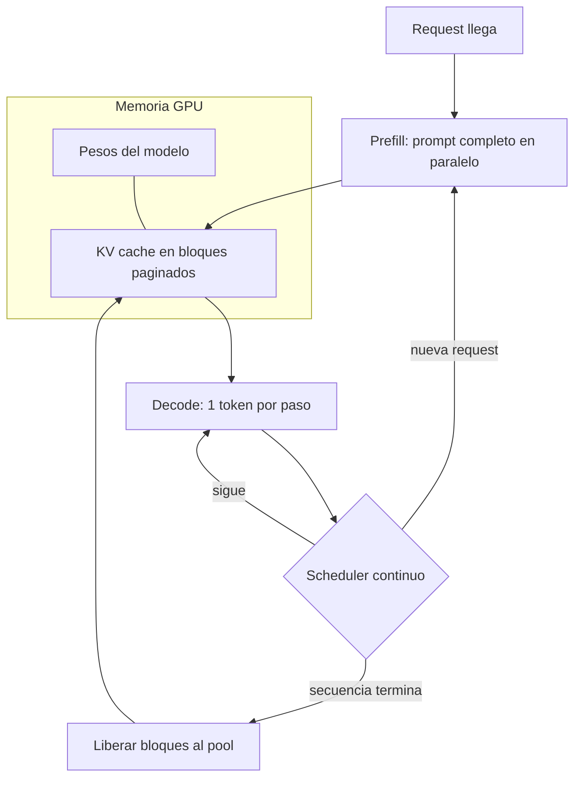

# 084 — Serving, batching y cachés

> [← Clase anterior](../../../classes/part-06-foundation-models-and-llm-engineering/083-ecosistema-del-computo-fabricantes-nubes-y-laboratorios/README.md) · [Índice de la parte](../README.md) · [Clase siguiente →](../../../classes/part-06-foundation-models-and-llm-engineering/085-cuantizacion-e-inferencia-local/README.md)

**Parte:** 06 — Modelos fundacionales e ingeniería de LLM  
**Nivel:** avanzado · **Horas estimadas:** 6  
**Laboratorio:** `observability` · **Estado:** `EXECUTABLE_CORE`

## 🎯 Propósito

Comprender **serving, batching y cachés** dentro de la evolución de la inteligencia
artificial, implementar un experimento mínimo verificable y distinguir qué parte
constituye evidencia frente a una afirmación todavía no comprobada.

## 📚 Resultados de aprendizaje

Al finalizar podrás:

1. Explicar serving, batching y cachés usando los conceptos `serving`, `batching`, `KV cache`, `throughput`.
2. Ejecutar el laboratorio con una semilla explícita y revisar su contrato JSON.
3. Identificar al menos un supuesto, una limitación y un riesgo de aplicación.
4. Comparar el enfoque con la etapa anterior de la ruta de aprendizaje.
5. Producir una evidencia reproducible y una conclusión que no exceda los datos.

## 🧩 Conceptos centrales

`serving`, `batching`, `KV cache`, `throughput`

## 🗺️ Ubicación en el mapa de la IA

Entrenar un LLM es un evento; servirlo es un costo perpetuo. La inferencia de un
Transformer autorregresivo tiene una estructura peculiar — genera un token por
pasada y arrastra un caché gigante — y las tres ideas de esta clase (KV cache,
continuous batching y PagedAttention) son las que convirtieron el serving de LLM de
demo cara en industria: vLLM reportó 2–4× más throughput solo gestionando mejor la
memoria. Esta clase conecta el prompting (079) con la cuantización (085) y las
decisiones de costo (086).

## 📖 Fundamentos

### ⏱️ Dos fases con cuellos de botella distintos

```text
Prefill:  procesa TODO el prompt en paralelo → limitado por CÓMPUTO (GPU ocupada)
Decode:   genera token a token; cada token requiere leer todos los pesos y el
          caché → limitado por ANCHO DE BANDA de memoria (GPU esperando datos)
```

Métricas correspondientes: **TTFT** (time to first token, dominado por prefill) y
**TPOT** (time per output token, dominado por decode). El decode es la razón de que
la generación sea cara: la GPU está infrautilizada salvo que se sirvan muchas
secuencias a la vez.

### 🗃️ KV cache

Sin caché, generar el token n recomputaría atención sobre los n−1 anteriores
(costo cuadrático acumulado O(n²) por token, O(n³) total). El KV cache guarda las
claves K y valores V ya calculados por capa y cabeza; cada paso solo computa el
Q/K/V del token nuevo y atiende contra el caché:

```text
Memoria del KV cache por secuencia:
  bytes = 2 (K y V) × n_capas × n_kv_heads × d_head × long_secuencia × bytes_dtype

Ejemplo Llama-2 7B en FP16 (32 capas, 32 heads, d_head 128, seq 4096):
  2 × 32 × 32 × 128 × 4096 × 2 B = 2,15 GB  ¡por UNA secuencia!
```

Mitigaciones arquitectónicas: **MQA/GQA** (compartir K,V entre grupos de cabezas
reduce n_kv_heads, p. ej. 32→8 = 4× menos caché) y cuantización del caché.

### 🔀 Continuous batching

El batching estático espera a que TODAS las secuencias del lote terminen: una
respuesta de 2 000 tokens retiene la GPU mientras las de 50 ya acabaron
(fragmentación temporal). El *continuous batching* (iteración a iteración,
introducido por Orca) decide en CADA paso de decode qué secuencias avanzan: las
terminadas salen del lote inmediatamente y las nuevas entran sin esperar. Resultado:
utilización alta y TTFT mucho menor bajo carga.

### 📄 PagedAttention (vLLM)

Los servidores pre-vLLM reservaban el KV cache como un bloque contiguo del tamaño
máximo posible → fragmentación interna y externa: 60–80 % de la memoria
desperdiciada. PagedAttention aplica la idea de memoria virtual del sistema
operativo:

```text
- El caché se divide en BLOQUES fijos (p. ej. 16 tokens por bloque).
- Una tabla de bloques por secuencia mapea posiciones lógicas → bloques físicos
  no contiguos.
- Se asigna bajo demanda: desperdicio solo en el último bloque (<4 %).
- Bloques compartibles copy-on-write: N muestras del mismo prompt, o un prompt
  de sistema común, comparten físicamente su prefijo (prefix caching).
```

Con la memoria liberada caben más secuencias simultáneas → lotes mayores → 2–4× el
throughput con la misma GPU y la misma latencia.

## 🧮 Ejemplo trabajado

GPU con 24 GB. Modelo 7B en FP16 → pesos ≈ 14 GB; quedan ~10 GB para KV cache
(ignorando activaciones para simplificar).

```text
KV por token (Llama-2 7B, FP16): 2 × 32 × 32 × 128 × 2 B = 524 288 B ≈ 0,5 MB

Reserva estática a 4 096 tokens por secuencia:
  2,15 GB por slot → caben 4 secuencias concurrentes.
  Si la respuesta típica usa 512 tokens de los 4 096 reservados:
  desperdicio = 87,5 % del caché reservado.

PagedAttention con bloques de 16 tokens (asignación bajo demanda):
  secuencia típica de 512 tokens ocupa 512 × 0,5 MB ≈ 0,27 GB
  10 GB / 0,27 GB ≈ 37 secuencias concurrentes  (~9× más)

Con GQA de 8 kv-heads (32→8): KV por token baja a 0,13 MB → ~148 secuencias.
```

Más concurrencia = más tokens/segundo agregados con el mismo hardware; ese es el
mecanismo exacto por el que "gestionar memoria" se traduce en dinero.

## 📊 Propiedades y comparación

| Técnica | Problema que ataca | Ganancia típica | Costo/límite |
|---|---|---|---|
| KV cache | Recomputación cuadrática | De O(n²) a O(n) por token | Memoria crece con contexto |
| MQA/GQA | Tamaño del KV cache | 4–8× menos caché | Ligera pérdida de calidad; requiere entrenar así |
| Batching estático | GPU infrautilizada | Mejora vs lote=1 | Fragmentación temporal |
| Continuous batching | Espera entre requests | 2–3× throughput | Scheduler más complejo |
| PagedAttention | Fragmentación de memoria | 2–4× throughput extra | Kernel de atención especializado |
| Decodificación especulativa | Decode limitado por memoria | 2–3× TPOT | Necesita modelo borrador compatible |



## ⚠️ Errores conceptuales frecuentes

1. **"La GPU va al máximo durante la generación."** En decode está limitada por
   ancho de banda de memoria; sin lotes grandes, el cómputo está ocioso.
2. **"El KV cache es una optimización opcional."** Sin él, el costo por token
   crece cuadráticamente; ningún serving real funciona sin caché.
3. **"Contexto de 128k es gratis si el prompt es corto."** Con gestión estática se
   reserva por el máximo; justamente eso es lo que PagedAttention corrige.
4. **"Más batch siempre mejora la latencia."** Mejora *throughput*; el TPOT de
   cada usuario puede empeorar. Throughput y latencia se negocian, no se suman.
5. **"TTFT y TPOT se optimizan igual."** TTFT depende del prefill (cómputo) y
   TPOT del decode (memoria); las palancas son distintas y a veces opuestas.

## 🚀 Del aprendizaje a la operación

Operar un servicio de inferencia añade: SLOs separados de TTFT/TPOT p50/p99 con
autoscaling por carga; límites por tenant y colas con prioridad; prefix caching del
prompt de sistema compartido; observabilidad de utilización de bloques KV;
decodificación especulativa si el perfil lo permite; y pruebas de carga con
distribuciones realistas de longitud de prompt/respuesta — el benchmark sintético
de secuencias uniformes miente.

## 🧪 Laboratorio

```bash
python lab.py
```

El laboratorio llama a `ai_evolution.labs.run_lab("observability")`. Esta
decisión evita 183 implementaciones divergentes: cada clase tiene un entrypoint
propio, pero los motores didácticos se prueban como una biblioteca común.

### 🔍 Evidencia esperada

- tipo de laboratorio y semilla;
- entradas o decisiones observables;
- resultado estructurado;
- lista `evidence` con hechos que pueden inspeccionarse;
- lista `limitations` que impide presentar la demo como producción.

## 📓 Notebooks

- [📓 `notebook.ipynb`](notebook.ipynb): recorrido guiado con la materia resumida.
- [✍️ `notebook_student.ipynb`](notebook_student.ipynb): ejercicios para resolver.
- [✅ `notebook_solution.ipynb`](notebook_solution.ipynb): solución de referencia explicada.

## 📝 Evaluación

| Criterio | Peso |
|---|---:|
| Comprensión conceptual | 25 % |
| Ejecución reproducible | 25 % |
| Interpretación basada en evidencia | 25 % |
| Riesgos, límites y mejora propuesta | 25 % |

Consulta [assessment.md](assessment.md) para preguntas y criterio de aceptación.

## ⚠️ Errores comunes

| Síntoma | Causa probable | Corrección |
|---|---|---|
| El código corre, pero no hay conclusión | Se confundió ejecución con aprendizaje | Explica qué demuestra y qué no demuestra |
| El resultado cambia sin explicación | No se registró semilla o configuración | Conserva semilla, versión y parámetros |
| Se promete uso real | Se extrapoló desde una demo educativa | Declara entorno, datos, límites y revisión humana |
| Se copia una métrica aislada | No existe baseline ni costo de error | Añade comparación y criterio de decisión |

## ❓ Preguntas frecuentes

**¿Debo usar una API comercial?**  
No. El núcleo funciona localmente. Las extensiones LIVE se documentan por separado.

**¿El laboratorio representa una implementación industrial?**  
No por sí solo. Enseña el contrato y el patrón; producción exige integración,
seguridad, observabilidad, pruebas y operación.

**¿Dónde profundizo?**  
Revisa las especializaciones enlazadas en el README raíz y la ruta siguiente.

## 🔗 Referencias

- Kwon et al. (2023), *Efficient Memory Management for Large Language Model Serving with PagedAttention* (vLLM): <https://arxiv.org/abs/2309.06180>
- Documentación oficial de vLLM: <https://docs.vllm.ai>
- Vaswani et al. (2017), *Attention Is All You Need*: <https://arxiv.org/abs/1706.03762>
- Ainslie et al. (2023), *GQA: Training Generalized Multi-Query Transformer Models*: <https://arxiv.org/abs/2305.13245>
- Leviathan et al. (2022), *Fast Inference from Transformers via Speculative Decoding*: <https://arxiv.org/abs/2211.17192>

---

## ⬅️ Clase anterior

[083 — El ecosistema del cómputo: fabricantes, nubes y laboratorios](../../part-06-foundation-models-and-llm-engineering/083-ecosistema-del-computo-fabricantes-nubes-y-laboratorios/README.md)

## ➡️ Siguiente clase

[085 — Cuantización e inferencia local](../../part-06-foundation-models-and-llm-engineering/085-cuantizacion-e-inferencia-local/README.md)
