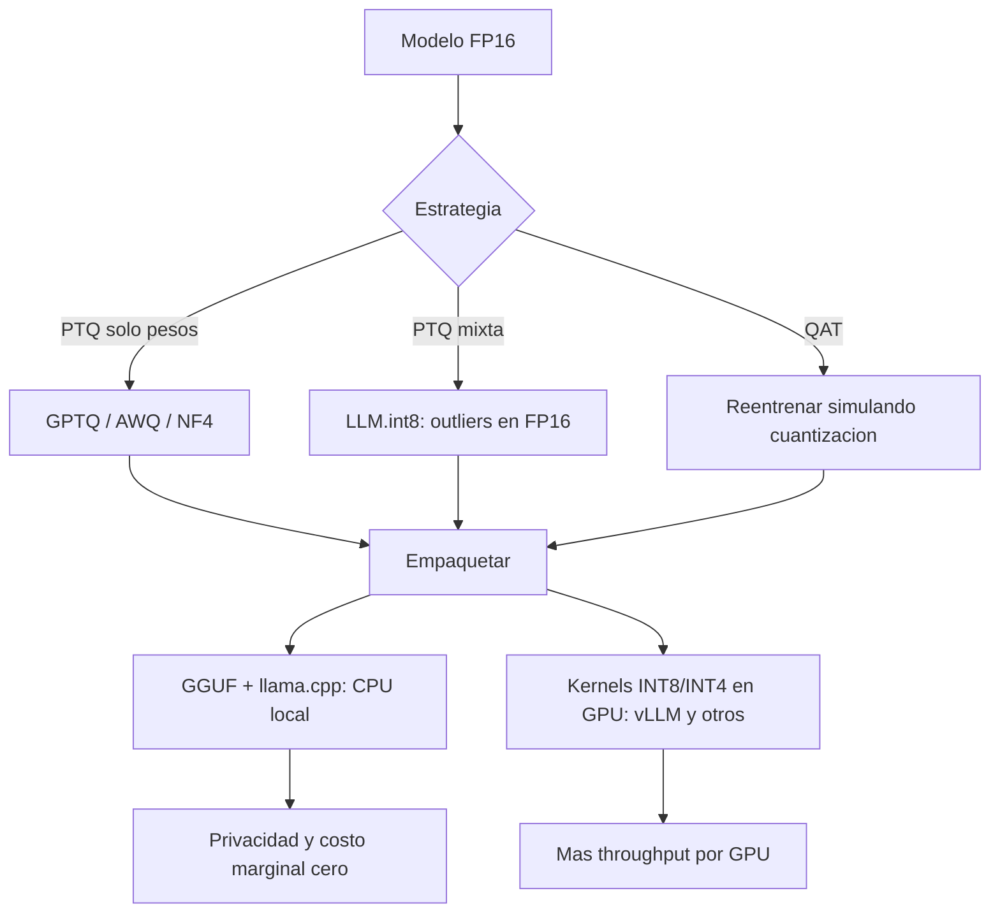

# 085 — Cuantización e inferencia local

> [← Clase anterior](../../../classes/part-06-foundation-models-and-llm-engineering/084-serving-batching-y-caches/README.md) · [Índice de la parte](../README.md) · [Clase siguiente →](../../../classes/part-06-foundation-models-and-llm-engineering/086-seleccion-de-modelo-costo-latencia-y-privacidad/README.md)

**Parte:** 06 — Modelos fundacionales e ingeniería de LLM  
**Nivel:** avanzado · **Horas estimadas:** 6  
**Laboratorio:** `neural` · **Estado:** `EXECUTABLE_CORE`

## 🎯 Propósito

Comprender **cuantización e inferencia local** dentro de la evolución de la inteligencia
artificial, implementar un experimento mínimo verificable y distinguir qué parte
constituye evidencia frente a una afirmación todavía no comprobada.

## 📚 Resultados de aprendizaje

Al finalizar podrás:

1. Explicar cuantización e inferencia local usando los conceptos `cuantización`, `GGUF`, `ONNX`, `local`.
2. Ejecutar el laboratorio con una semilla explícita y revisar su contrato JSON.
3. Identificar al menos un supuesto, una limitación y un riesgo de aplicación.
4. Comparar el enfoque con la etapa anterior de la ruta de aprendizaje.
5. Producir una evidencia reproducible y una conclusión que no exceda los datos.

## 🧩 Conceptos centrales

`cuantización`, `GGUF`, `ONNX`, `local`

## 🗺️ Ubicación en el mapa de la IA

La cuantización es la palanca que baja un LLM del datacenter al portátil: representa
los pesos (FP16, 2 bytes) con enteros de 8 o 4 bits, dividiendo la memoria por 2–4×
y acelerando el decode (limitado por ancho de banda, clase 084). Junto con formatos
como GGUF y runtimes como llama.cpp, habilita la inferencia local — clave cuando la
privacidad manda (clase 086) — y ya apareció en el entrenamiento con QLoRA (077).
Aquí se estudia como técnica de *inferencia*.

## 📖 Fundamentos

### 🔢 Cuantización afín (asimétrica) y simétrica

Mapear reales x ∈ [x_min, x_max] a enteros q de b bits:

```text
Asimétrica (con zero-point):
  escala  s = (x_max − x_min) / (2^b − 1)
  zero    z = round(−x_min / s)
  q = clamp( round(x/s) + z , 0 , 2^b − 1 )
  x̂ = s · (q − z)                       (descuantización)

Simétrica (habitual para pesos, centrados en 0):
  s = max|x| / (2^(b−1) − 1)            (INT8: divisor 127)
  q = clamp( round(x/s) , −127 , 127 )
  x̂ = s · q
```

El error de redondeo por elemento está acotado por s/2: la clave es mantener s
pequeña. Por eso se cuantiza **por grupos** (una escala por fila, por canal o por
bloque de 32–128 pesos) en lugar de una escala global: un solo peso gigante no
arruina a todos los demás.

### 🚨 Outliers: el problema real en LLMs

LLM.int8() (Dettmers et al., 2022) mostró que a partir de ~6,7B parámetros aparecen
dimensiones de activación con valores atípicos sistemáticos (outliers) que
destruyen la cuantización ingenua de activaciones. Solución: descomposición mixta —
las ~0,1 % de dimensiones outlier se computan en FP16 y el resto en INT8.
Los métodos modernos de **solo pesos** esquivan el problema dejando las
activaciones en FP16:

- **GPTQ**: cuantiza capa por capa minimizando el error de salida (aproximación con
  información de segundo orden), compensando cada peso redondeado ajustando los
  restantes.
- **AWQ**: observa qué canales de peso son "salientes" según la magnitud de las
  activaciones y los protege reescalando antes de cuantizar (sin reentrenar).

### 📦 PTQ vs QAT, y la escalera de bits

**PTQ** (post-training quantization) cuantiza un modelo ya entrenado con un pequeño
set de calibración: barato, es lo estándar en LLMs. **QAT** (quantization-aware
training) simula la cuantización durante el entrenamiento: mejor calidad a bits muy
bajos, pero exige reentrenar. Regla empírica en LLMs: INT8 es casi gratis
(perplejidad ≈ igual); 4 bits bien hecho (GPTQ/AWQ/NF4, con grupos) pierde poco;
3 bits duele; 2 bits suele ser inaceptable sin técnicas especiales.

### 🖥️ GGUF y llama.cpp: inferencia local

llama.cpp es un runtime en C/C++ para CPU (y GPU parcial) cuyo formato **GGUF**
empaqueta en un solo archivo pesos cuantizados + tokenizador + metadatos. Sus
esquemas `Q4_K_M`, `Q5_K_M`, `Q8_0`, etc. son cuantizaciones por bloques con
distintas mezclas de bits por tipo de tensor. Lectura práctica de un nombre:
`llama-8B.Q4_K_M.gguf` ≈ 8B parámetros × ~0,57 bytes ≈ 4,9 GB: corre en un portátil
con 8 GB de RAM. La inferencia local ofrece privacidad total, costo marginal cero y
latencia sin red, a cambio de calidad y throughput menores que un modelo grande
servido en GPU.

## 🧮 Ejemplo trabajado

Cuanticemos a INT8 simétrico el vector de pesos w = [0,40, −0,21, 0,95, −0,88]:

```text
s = max|w| / 127 = 0,95 / 127 = 0,00748

q = round(w/s) = [ round(53,5) , round(−28,1) , round(127,0) , round(−117,6) ]
              = [ 53 , −28 , 127 , −118 ]         ← ojo: 53,5 redondea a 53 (par) o 54 según la regla

x̂ = s·q = [0,3965, −0,2094, 0,9500, −0,8826]
error absoluto = [0,0035, 0,0006, 0,0000, 0,0026]   (≤ s/2 = 0,0037) ✓

Ahora añade un outlier: w' = [0,40, −0,21, 0,95, −0,88, 12,0]
s' = 12,0/127 = 0,0945  →  los pesos pequeños caen en q ∈ {4, −2, 10, −9}:
x̂' = [0,378, −0,189, 0,945, −0,850]  error hasta 0,031 (≈ 8× peor).
Con cuantización por grupos (outlier en su propio grupo), los demás conservan
su escala fina: esa es TODA la motivación de escalas por bloque.
```

Memoria de un 8B: FP16 = 16 GB; INT8 = 8 GB; 4 bits (Q4_K_M ≈ 4,55 bpw) ≈ 4,6 GB.

## 📊 Propiedades y comparación

| Método | Bits | Necesita calibración | Pérdida típica | Uso característico |
|---|---|---|---|---|
| LLM.int8() | 8 (mixto FP16) | No | ≈ 0 | Cargar modelos grandes en menos VRAM |
| GPTQ | 4–3 | Sí (pequeño set) | Baja en 4 bits | Serving GPU eficiente |
| AWQ | 4 | Sí (activaciones) | Baja, robusto | Serving GPU/edge |
| NF4 (QLoRA) | 4 | No | Baja | Base congelado para fine-tuning |
| GGUF Q4_K_M / Q8_0 | ~4,5 / 8 | No | Baja / ≈ 0 | Inferencia local llama.cpp |
| QAT | 8–2 | Reentrenar | Mínima al mismo bit | Cuando PTQ no alcanza |



## ⚠️ Errores conceptuales frecuentes

1. **"Cuantizar es solo redondear."** Sin escalas por grupo y manejo de outliers,
   el error explota; el diseño está en *cómo* se reparte la precisión.
2. **"INT4 divide la calidad a la mitad."** La relación bits-calidad no es lineal:
   INT8 ≈ sin pérdida, 4 bits pierde poco, 2 bits colapsa.
3. **"La cuantización acelera siempre."** Acelera el decode porque mueve menos
   bytes (cuello de memoria); si el cuello es cómputo (prefill largo, batch
   grande), la ganancia puede ser pequeña o nula.
4. **"La perplejidad igual garantiza el mismo comportamiento."** Métricas
   agregadas esconden degradación en tareas específicas (código, matemáticas,
   idiomas minoritarios); hay que evaluar por tarea.
5. **"Cuantizar activaciones y pesos da lo mismo."** Las activaciones tienen
   outliers dinámicos y son mucho más difíciles; por eso dominan los métodos
   weight-only en LLMs.

## 🚀 Del aprendizaje a la operación

Para producción u uso local serio faltan: elegir el esquema según hardware real
(kernels disponibles importan más que los bits teóricos), evaluar el modelo
cuantizado con TUS evals y no solo perplejidad, verificar la procedencia de
checkpoints cuantizados de terceros (un GGUF es un binario que ejecutas), y
documentar la cadena modelo base → método → versión de runtime, porque "el mismo
modelo" en Q4 de dos fuentes distintas puede comportarse distinto.

## 🧪 Laboratorio

```bash
python lab.py
```

El laboratorio llama a `ai_evolution.labs.run_lab("neural")`. Esta
decisión evita 183 implementaciones divergentes: cada clase tiene un entrypoint
propio, pero los motores didácticos se prueban como una biblioteca común.

### 🔍 Evidencia esperada

- tipo de laboratorio y semilla;
- entradas o decisiones observables;
- resultado estructurado;
- lista `evidence` con hechos que pueden inspeccionarse;
- lista `limitations` que impide presentar la demo como producción.

## 📓 Notebooks

- [📓 `notebook.ipynb`](notebook.ipynb): recorrido guiado con la materia resumida.
- [✍️ `notebook_student.ipynb`](notebook_student.ipynb): ejercicios para resolver.
- [✅ `notebook_solution.ipynb`](notebook_solution.ipynb): solución de referencia explicada.

## 📝 Evaluación

| Criterio | Peso |
|---|---:|
| Comprensión conceptual | 25 % |
| Ejecución reproducible | 25 % |
| Interpretación basada en evidencia | 25 % |
| Riesgos, límites y mejora propuesta | 25 % |

Consulta [assessment.md](assessment.md) para preguntas y criterio de aceptación.

## ⚠️ Errores comunes

| Síntoma | Causa probable | Corrección |
|---|---|---|
| El código corre, pero no hay conclusión | Se confundió ejecución con aprendizaje | Explica qué demuestra y qué no demuestra |
| El resultado cambia sin explicación | No se registró semilla o configuración | Conserva semilla, versión y parámetros |
| Se promete uso real | Se extrapoló desde una demo educativa | Declara entorno, datos, límites y revisión humana |
| Se copia una métrica aislada | No existe baseline ni costo de error | Añade comparación y criterio de decisión |

## ❓ Preguntas frecuentes

**¿Debo usar una API comercial?**  
No. El núcleo funciona localmente. Las extensiones LIVE se documentan por separado.

**¿El laboratorio representa una implementación industrial?**  
No por sí solo. Enseña el contrato y el patrón; producción exige integración,
seguridad, observabilidad, pruebas y operación.

**¿Dónde profundizo?**  
Revisa las especializaciones enlazadas en el README raíz y la ruta siguiente.

## 🔗 Referencias

- Dettmers et al. (2022), *LLM.int8(): 8-bit Matrix Multiplication for Transformers at Scale*: <https://arxiv.org/abs/2208.07339>
- Frantar et al. (2022), *GPTQ: Accurate Post-Training Quantization for Generative Pre-trained Transformers*: <https://arxiv.org/abs/2210.17323>
- Lin et al. (2023), *AWQ: Activation-aware Weight Quantization for LLM Compression and Acceleration*: <https://arxiv.org/abs/2306.00978>
- Dettmers et al. (2023), *QLoRA: Efficient Finetuning of Quantized LLMs* (NF4): <https://arxiv.org/abs/2305.14314>
- llama.cpp (formato GGUF y runtime local): <https://github.com/ggerganov/llama.cpp>

<!-- papers:inicio -->

---

## 📜 Papers que fundamentan esta clase

> Bloque generado por `python scripts/link_papers_to_classes.py`. La fuente es [`papers/catalog/papers.json`](../../../papers/catalog/papers.json).

| Paper | Año | Qué desbloqueó | Miniatura |
|---|---:|---|---|
| [P35 · FlashAttention: atención exacta, rápida y eficiente en memoria, consciente de la E/S](../../../papers/foundational/P35_flashattention/README.md) | 2022 | El cuello de botella de la atención no eran los FLOPs sino las lecturas y escrituras a memoria. Y la solución es EXACTA, no aproximada. | [notebook](../../../notebooks/papers/P35_flashattention.ipynb) |

Cada ficha explica el problema anterior, la matemática mínima, los límites y los errores de atribución más frecuentes. Para leerlas con método: [cómo leer un paper de IA](../../../papers/guides/COMO_LEER_UN_PAPER_DE_IA.md) · [anexos matemáticos](../../../papers/annexes/README.md).
<!-- papers:fin -->
---

## ⬅️ Clase anterior

[084 — Serving, batching y cachés](../../part-06-foundation-models-and-llm-engineering/084-serving-batching-y-caches/README.md)

## ➡️ Siguiente clase

[086 — Selección de modelo, costo, latencia y privacidad](../../part-06-foundation-models-and-llm-engineering/086-seleccion-de-modelo-costo-latencia-y-privacidad/README.md)
