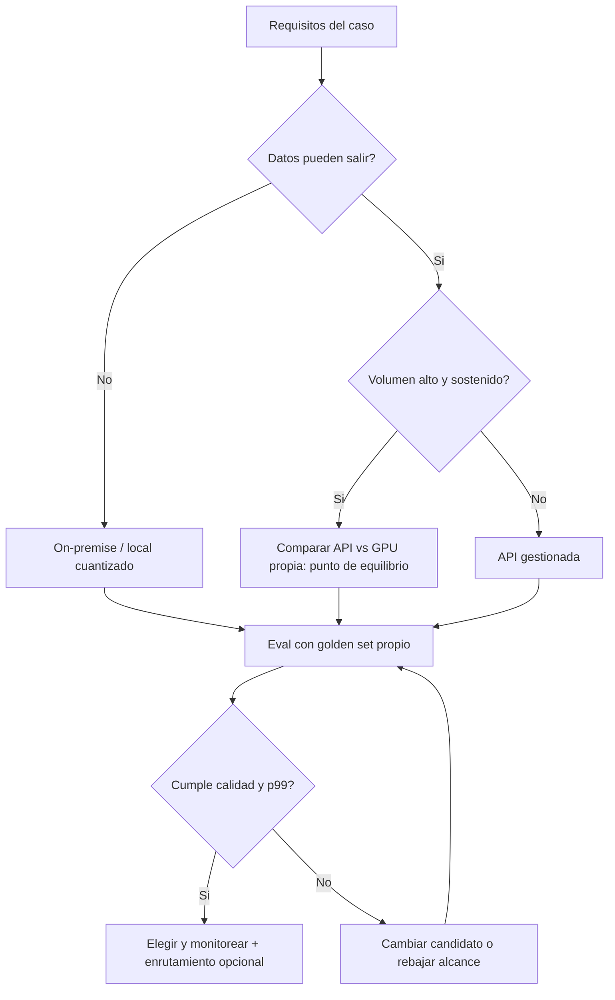

# 086 — Selección de modelo, costo, latencia y privacidad

> [← Clase anterior](../../../classes/part-06-foundation-models-and-llm-engineering/085-cuantizacion-e-inferencia-local/README.md) · [Índice de la parte](../README.md) · [Clase siguiente →](../../../classes/part-06-foundation-models-and-llm-engineering/087-proyecto-servicio-llm-con-contratos-y-evals/README.md)

**Parte:** 06 — Modelos fundacionales e ingeniería de LLM  
**Nivel:** avanzado · **Horas estimadas:** 6  
**Laboratorio:** `evaluation` · **Estado:** `EXECUTABLE_CORE`

## 🎯 Propósito

Comprender **selección de modelo, costo, latencia y privacidad** dentro de la evolución de la inteligencia
artificial, implementar un experimento mínimo verificable y distinguir qué parte
constituye evidencia frente a una afirmación todavía no comprobada.

## 📚 Resultados de aprendizaje

Al finalizar podrás:

1. Explicar selección de modelo, costo, latencia y privacidad usando los conceptos `benchmark`, `costo`, `latencia`, `privacidad`.
2. Ejecutar el laboratorio con una semilla explícita y revisar su contrato JSON.
3. Identificar al menos un supuesto, una limitación y un riesgo de aplicación.
4. Comparar el enfoque con la etapa anterior de la ruta de aprendizaje.
5. Producir una evidencia reproducible y una conclusión que no exceda los datos.

## 🧩 Conceptos centrales

`benchmark`, `costo`, `latencia`, `privacidad`

## 🗺️ Ubicación en el mapa de la IA

Las clases 073–085 explican *cómo funcionan* los LLM; esta explica *cuál usar*. La
selección de modelo es la decisión de ingeniería más frecuente en la práctica: casi
nadie entrena modelos, todos eligen entre APIs frontera, modelos abiertos servidos
en infraestructura propia y modelos locales cuantizados. Es una decisión
multiobjetivo — calidad, costo, latencia, privacidad — que debe tomarse con evals
propios y números, no con rankings ajenos; y prepara directamente el proyecto de la
clase 087.

## 📖 Fundamentos

### 💰 El modelo de costo

Las APIs cobran por token, con entrada y salida a precios distintos (la salida suele
costar 3–5× más). Costo mensual estimado:

```text
costo = R · [ (T_in / 1000) · p_in + (T_out / 1000) · p_out ]
  R = requests/mes;  T_in, T_out = tokens medios;  p = precio por 1k tokens

Palancas de reducción: caché de prompts (prefijos repetidos con descuento),
batch API (lotes asíncronos más baratos), modelos más pequeños para
subtareas fáciles (enrutamiento), y recortar T_in (el prompt de sistema
se paga en CADA request).
```

Para infraestructura propia el costo es de otra naturaleza: GPUs (compradas o por
hora) + ingeniería de serving + operación. Es mayormente **fijo**: conviene con
volumen alto y sostenido; el punto de equilibrio se calcula, no se intuye.

### ⏱️ Latencia: TTFT, TPOT y percentiles

De la clase 084: **TTFT** (tiempo al primer token) domina la experiencia en chat
con streaming; **TPOT** (tiempo por token) domina la duración total de respuestas
largas; latencia total ≈ TTFT + TPOT × tokens_salida. Reglas de decisión:

- UX conversacional: optimizar TTFT (p99, no promedio) y usar streaming.
- Pipelines batch: optimizar throughput y costo; la latencia individual da igual.
- Tiempo real estricto (autocompletado, voz): modelos pequeños, posiblemente
  locales; ningún modelo frontera remoto cumple decenas de ms.

### 🔒 Privacidad y gobernanza

Preguntas que fuerzan la arquitectura: ¿pueden los datos salir de la organización o
del país (residencia de datos)? ¿el proveedor entrena con tus datos (leer el
contrato, no el marketing)? ¿hay datos regulados (salud, financieros, menores)?
Espectro de opciones: API pública < API con acuerdo empresarial (sin retención /
sin entrenamiento) < nube privada/VPC < on-premise < local en el dispositivo. Cada
paso hacia la derecha gana control y pierde comodidad/calidad frontera.

### 📊 Evaluar con TUS datos, no con leaderboards

Los benchmarks públicos (MMLU, arena de preferencias, HELM) sirven para preseleccionar,
pero sufren contaminación (el test estaba en el corpus), saturación y desalineación
con tu tarea. Método honesto:

```text
1. Construir un golden set propio (50–500 casos reales, con respuesta esperada
   o rúbrica).
2. Definir métrica ANTES de mirar salidas (exactitud, adherencia a esquema,
   rúbrica con LLM-judge auditado por humanos).
3. Medir 2–4 candidatos con el MISMO prompt adaptado de buena fe a cada uno.
4. Registrar calidad + costo/1000 requests + TTFT/TPOT p50 y p99.
5. Decidir con la matriz completa; re-evaluar en cada cambio de modelo o prompt.
```

## 🧮 Ejemplo trabajado

Caso: clasificar 300 000 correos/mes en 12 categorías. T_in = 800 tokens,
T_out = 30. Tres candidatos (precios ilustrativos por 1k tokens):

```text
                       calidad(golden)  p_in     p_out    TTFT p50
A: frontera grande         96,1 %       $0,003   $0,015    900 ms
B: modelo medio            94,8 %       $0,0008  $0,004    450 ms
C: 8B local Q4 (GPU propia) 91,2 %      costo fijo ≈ $600/mes  120 ms

Costo mensual API:
A: 300k · (0,8·0,003 + 0,03·0,015) = 300k · 0,00285 = $855/mes
B: 300k · (0,8·0,0008 + 0,03·0,004) = 300k · 0,00076 = $228/mes

Decisión razonada: B pierde 1,3 puntos de calidad y cuesta 3,7× menos que A.
¿Vale 1,3 puntos $627/mes? Depende del costo del error: si un correo mal
clasificado cuesta minutos de una persona, B gana; si dispara acciones legales,
A gana. C solo entra si los correos no pueden salir de la organización: la
privacidad actúa como RESTRICCIÓN dura, no como preferencia.
Híbrido frecuente: enrutar el 80 % fácil a B y escalar el 20 % dudoso
(confianza baja) a A → calidad ≈ A a costo ≈ B.
```

## 📊 Propiedades y comparación

| Criterio | API frontera | API modelo medio | Abierto en GPU propia | Local cuantizado |
|---|---|---|---|---|
| Calidad tope | Máxima | Alta | Alta (según modelo) | Media |
| Costo estructura | Variable puro | Variable puro | Fijo + operación | Fijo (hardware) |
| TTFT típico | Cientos de ms + red | Menor | Controlable | Mínimo (sin red) |
| Privacidad | Contractual | Contractual | Alta | Total |
| Esfuerzo de ingeniería | Mínimo | Mínimo | Alto | Medio |
| Riesgo característico | Cambios de precio/modelo | Igual | Operar GPUs 24/7 | Calidad insuficiente |



## ⚠️ Errores conceptuales frecuentes

1. **"El mejor modelo del leaderboard es el mejor para mí."** Los rankings miden
   otras tareas, con posible contaminación; tu golden set manda.
2. **"Comparar precio por token basta."** Modelos distintos usan tokenizadores
   distintos y generan longitudes distintas: compara **costo por tarea resuelta**.
3. **"La latencia es una sola cifra."** TTFT y TPOT tienen palancas distintas, y
   el p99 — no el promedio — es lo que sufren tus usuarios.
4. **"Local siempre es más barato."** El costo de operar hardware y de la calidad
   perdida puede superar con creces la factura de la API a volúmenes bajos.
5. **"Se decide una vez."** Precios, modelos y tu tráfico cambian en meses; la
   selección es un proceso con re-evaluación periódica, no un evento.

## 🚀 Del aprendizaje a la operación

Falta entre este análisis y producción: automatizar la matriz de decisión como
suite de evals ejecutable (calidad + costo + latencia por release), abstracción
multi-proveedor para poder migrar sin reescribir, monitoreo de deriva de calidad
tras cada cambio de versión del proveedor, contratos revisados por legal en
privacidad y retención, y presupuestos con alertas — el gasto por token es la
factura sorpresa clásica de esta industria.

## 🧪 Laboratorio

```bash
python lab.py
```

El laboratorio llama a `ai_evolution.labs.run_lab("evaluation")`. Esta
decisión evita 183 implementaciones divergentes: cada clase tiene un entrypoint
propio, pero los motores didácticos se prueban como una biblioteca común.

### 🔍 Evidencia esperada

- tipo de laboratorio y semilla;
- entradas o decisiones observables;
- resultado estructurado;
- lista `evidence` con hechos que pueden inspeccionarse;
- lista `limitations` que impide presentar la demo como producción.

## 📓 Notebooks

- [📓 `notebook.ipynb`](notebook.ipynb): recorrido guiado con la materia resumida.
- [✍️ `notebook_student.ipynb`](notebook_student.ipynb): ejercicios para resolver.
- [✅ `notebook_solution.ipynb`](notebook_solution.ipynb): solución de referencia explicada.

## 📝 Evaluación

| Criterio | Peso |
|---|---:|
| Comprensión conceptual | 25 % |
| Ejecución reproducible | 25 % |
| Interpretación basada en evidencia | 25 % |
| Riesgos, límites y mejora propuesta | 25 % |

Consulta [assessment.md](assessment.md) para preguntas y criterio de aceptación.

## ⚠️ Errores comunes

| Síntoma | Causa probable | Corrección |
|---|---|---|
| El código corre, pero no hay conclusión | Se confundió ejecución con aprendizaje | Explica qué demuestra y qué no demuestra |
| El resultado cambia sin explicación | No se registró semilla o configuración | Conserva semilla, versión y parámetros |
| Se promete uso real | Se extrapoló desde una demo educativa | Declara entorno, datos, límites y revisión humana |
| Se copia una métrica aislada | No existe baseline ni costo de error | Añade comparación y criterio de decisión |

## ❓ Preguntas frecuentes

**¿Debo usar una API comercial?**  
No. El núcleo funciona localmente. Las extensiones LIVE se documentan por separado.

**¿El laboratorio representa una implementación industrial?**  
No por sí solo. Enseña el contrato y el patrón; producción exige integración,
seguridad, observabilidad, pruebas y operación.

**¿Dónde profundizo?**  
Revisa las especializaciones enlazadas en el README raíz y la ruta siguiente.

## 🔗 Referencias

- Liang et al. (2022), *Holistic Evaluation of Language Models* (HELM): <https://arxiv.org/abs/2211.09110>
- Hoffmann et al. (2022), *Training Compute-Optimal Large Language Models* (costo entrenamiento vs inferencia): <https://arxiv.org/abs/2203.15556>
- Documentación oficial de Claude (modelos, precios y capacidades): <https://docs.claude.com>
- Documentación oficial de vLLM (serving de modelos abiertos): <https://docs.vllm.ai>
- Zheng et al. (2023), *Judging LLM-as-a-Judge with MT-Bench and Chatbot Arena*: <https://arxiv.org/abs/2306.05685>

<!-- papers:inicio -->

---

## 📜 Papers que fundamentan esta clase

> Bloque generado por `python scripts/link_papers_to_classes.py`. La fuente es [`papers/catalog/papers.json`](../../../papers/catalog/papers.json).

| Paper | Año | Qué desbloqueó | Miniatura |
|---|---:|---|---|
| [P10 · Los modelos de lenguaje son aprendices con pocos ejemplos](../../../papers/foundational/P10_gpt3/README.md) | 2020 | El aprendizaje en contexto: la tarea se especifica en el prompt y el modelo se adapta sin actualizar ningún peso. | [notebook](../../../notebooks/papers/P10_gpt3.ipynb) |
| [P19 · Entrenar modelos de lenguaje grandes con cómputo óptimo](../../../papers/foundational/P19_scaling_laws/README.md) | 2022 | Corrige la carrera por el tamaño: a cómputo fijo, los modelos de la época estaban infraentrenados en datos. | [notebook](../../../notebooks/papers/P19_scaling_laws.ipynb) |
| [P21 · Mixtral: mezcla dispersa de expertos](../../../papers/foundational/P21_moe/README.md) | 2024 | Desacopla capacidad de cómputo: 47 000 millones de parámetros totales, 13 000 millones activos por token. | [notebook](../../../notebooks/papers/P21_moe.ipynb) |
| [P45 · Destilar el conocimiento de una red neuronal](../../../papers/foundational/P45_distillation/README.md) | 2015 | Las probabilidades del maestro contienen más información que la etiqueta correcta: el modelo pequeño aprende de esa estructura. | [notebook](../../../notebooks/papers/P45_distillation.ipynb) |

Cada ficha explica el problema anterior, la matemática mínima, los límites y los errores de atribución más frecuentes. Para leerlas con método: [cómo leer un paper de IA](../../../papers/guides/COMO_LEER_UN_PAPER_DE_IA.md) · [anexos matemáticos](../../../papers/annexes/README.md).
<!-- papers:fin -->
---

## ⬅️ Clase anterior

[085 — Cuantización e inferencia local](../../part-06-foundation-models-and-llm-engineering/085-cuantizacion-e-inferencia-local/README.md)

## ➡️ Siguiente clase

[087 — Proyecto: servicio LLM con contratos y evals](../../part-06-foundation-models-and-llm-engineering/087-proyecto-servicio-llm-con-contratos-y-evals/README.md)
