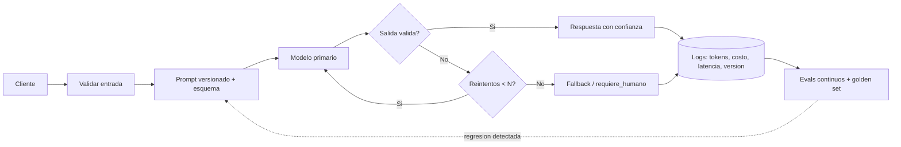

# 087 — Proyecto: servicio LLM con contratos y evals

> [← Clase anterior](../../../classes/part-06-foundation-models-and-llm-engineering/086-seleccion-de-modelo-costo-latencia-y-privacidad/README.md) · [Índice de la parte](../README.md) · [Clase siguiente →](../../../classes/part-07-generative-ai-across-media/088-espacios-latentes-y-autoencoders-variacionales/README.md)

**Parte:** 06 — Modelos fundacionales e ingeniería de LLM  
**Nivel:** avanzado · **Horas estimadas:** 10  
**Laboratorio:** `capstone` · **Estado:** `EXECUTABLE_CORE`

## 🎯 Propósito

Comprender **proyecto: servicio llm con contratos y evals** dentro de la evolución de la inteligencia
artificial, implementar un experimento mínimo verificable y distinguir qué parte
constituye evidencia frente a una afirmación todavía no comprobada.

## 📚 Resultados de aprendizaje

Al finalizar podrás:

1. Explicar proyecto: servicio llm con contratos y evals usando los conceptos `LLM`, `API`, `evals`, `observabilidad`.
2. Ejecutar el laboratorio con una semilla explícita y revisar su contrato JSON.
3. Identificar al menos un supuesto, una limitación y un riesgo de aplicación.
4. Comparar el enfoque con la etapa anterior de la ruta de aprendizaje.
5. Producir una evidencia reproducible y una conclusión que no exceda los datos.

## 🧩 Conceptos centrales

`LLM`, `API`, `evals`, `observabilidad`

## 🗺️ Ubicación en el mapa de la IA

Esta clase integra la parte 06 en un proyecto: un servicio LLM tratado como
*software serio*. La diferencia entre una demo y un servicio no es el modelo — es el
contrato de entrada/salida, la suite de evals que actúa como los "tests" del sistema
no determinista, y la observabilidad que permite depurarlo. Aquí convergen la salida
estructurada (079), el tool calling controlado (080), el serving (084) y la
selección de modelo (086); y el patrón de evals reaparecerá en los agentes de la
parte 08.

## 📖 Fundamentos

### 📜 Contratos: la interfaz del componente no determinista

Un servicio LLM expone una API normal; el LLM queda encapsulado tras un contrato:

```text
Solicitud:  {"ticket": str, "idioma": "es" | "en"}
Respuesta:  {"categoria": enum[12], "prioridad": "alta"|"media"|"baja",
             "confianza": float 0-1, "requiere_humano": bool}

Capas del servicio:
  1. Validación de entrada (tamaño, idioma, sanitización).
  2. Construcción del prompt (plantilla versionada + few-shot + esquema).
  3. Llamada al modelo (timeout, reintentos con backoff, fallback).
  4. Validación de salida (JSON Schema + reglas de negocio).
  5. Política ante fallo: reintento → modelo de respaldo → respuesta
     degradada honesta ("requiere_humano": true) — NUNCA propagar texto crudo.
```

El contrato permite cambiar de modelo, prompt o proveedor sin romper a los
consumidores: es la frontera de estabilidad del sistema.

### 🧪 Evals: los tests de un sistema no determinista

Un `assert respuesta == esperado` no funciona con LLMs. La jerarquía de evaluación:

```text
Nivel 1 — Programática: ¿parsea? ¿cumple el esquema? ¿enum válido?  (barata, 100 %)
Nivel 2 — Exact/fuzzy match: para tareas con respuesta canónica (clasificación,
          extracción): accuracy, F1 por clase.
Nivel 3 — LLM-judge con rúbrica: calidad de texto libre; el juez se AUDITA
          midiendo su acuerdo con etiquetas humanas en una muestra.
Nivel 4 — Humano: muestra periódica y casos escalados; la referencia final.
```

El **golden set** (50–500 casos reales curados, incluidos casos frontera y
adversariales) se versiona junto al código. Regla de regresión: ningún cambio de
prompt/modelo/parámetro se despliega sin correr los evals y comparar contra la
línea base — los prompts también sufren regresiones.

### 🔭 Observabilidad específica de LLM

Además de las métricas de servicio (tasa de error, p50/p99), un servicio LLM
registra por request: versión de prompt y de modelo, tokens de entrada/salida y
costo, TTFT/TPOT, resultado de la validación, confianza y si escaló a humano. Con
eso se responde lo que el negocio preguntará: ¿cuánto cuesta cada respuesta?,
¿qué versión del prompt causó la regresión del martes?, ¿qué fracción del tráfico
requiere humano? Alertas típicas: caída de la tasa de JSON válido, deriva en la
distribución de categorías, salto de costo por request.

### 🧯 Modos de fallo y degradación honesta

Diseño ante fallos: timeout del proveedor → fallback a modelo alternativo o a
heurística; salida inválida tras N reintentos → marcar para humano; sobrecarga →
cola con backpressure; deriva del modelo (el proveedor actualizó) → detección por
evals continuos sobre muestra de tráfico. El principio del curso aplica al
servicio completo: **la respuesta honesta incluye sus limitaciones** — un campo
`confianza` y una ruta a humano valen más que una respuesta siempre segura.

## 🧮 Ejemplo trabajado

Eval de regresión de un clasificador de tickets (golden set de 200 casos) al pasar
del prompt v3 al v4:

```text
                      v3 (base)    v4 (candidato)
JSON válido            99,5 %        100 %
Accuracy global        91,5 %        93,0 %
F1 clase "facturacion" 0,94          0,95
F1 clase "urgente"     0,88          0,71   ← ¡regresión enmascarada!
Costo por request      $0,0031       $0,0028
p99 latencia           2,1 s         2,3 s

McNemar sobre los 200 casos: v4 corrige 11 errores de v3, introduce 8 nuevos
(mejora neta +3; con n tan chico, la mejora global NO es concluyente).
Decisión correcta: NO desplegar v4 pese a "ganar" en accuracy global:
la clase 'urgente' es la de mayor costo de error (SLA de respuesta).
Acciones: añadir 20 casos de 'urgente' al golden set, ajustar v4, re-evaluar.
```

Lección: métricas agregadas ocultan regresiones por clase; el eval se diseña
alrededor del costo del error, no de la media.

## 📊 Propiedades y comparación

| Aspecto | Demo / notebook | Servicio con contrato y evals |
|---|---|---|
| Salida | Texto que "se ve bien" | JSON validado contra esquema + negocio |
| Calidad | Anécdota ("probé 5 casos") | Golden set versionado + métricas por clase |
| Cambios de prompt | Editar y mirar | Eval de regresión obligatorio vs línea base |
| Fallos | Excepción o texto raro | Reintento → fallback → degradación honesta |
| Costo | Ignorado | Medido por request, con alertas |
| Depuración | Imposible reproducir | Trazas: prompt+modelo+tokens+versión |



## ⚠️ Errores conceptuales frecuentes

1. **"Funcionó en mis 10 pruebas manuales."** Sin golden set ni métrica definida a
   priori, eso es anécdota; el no determinismo exige evaluación sistemática.
2. **"El LLM-judge reemplaza a los humanos."** Solo si su acuerdo con humanos está
   medido y monitoreado; un juez no auditado es una métrica inventada.
3. **"La accuracy global decide el despliegue."** Las regresiones viven en las
   clases minoritarias de alto costo; se evalúa por clase y por costo de error.
4. **"Los reintentos arreglan la fiabilidad."** Suben costo y latencia y ocultan
   problemas sistemáticos; el contrato necesita ruta de degradación honesta.
5. **"Desplegado = terminado."** El proveedor cambiará el modelo, el tráfico
   derivará; sin evals continuos, la calidad se degrada en silencio.

## 🚀 Del aprendizaje a la operación

Aun con contrato y evals, a producción real le faltan: seguridad (autenticación,
rate limiting, defensa ante inyección con tests adversariales), privacidad
(retención de logs con datos personales, anonimización), gestión de cambios de
proveedor con canary y rollback, análisis de costo por cliente/feature, y un
proceso humano definido para los casos escalados — el servicio LLM es tan bueno
como el circuito completo que lo rodea.

## 🧪 Laboratorio

```bash
python lab.py
```

El laboratorio llama a `ai_evolution.labs.run_lab("capstone")`. Esta
decisión evita 183 implementaciones divergentes: cada clase tiene un entrypoint
propio, pero los motores didácticos se prueban como una biblioteca común.

### 🔍 Evidencia esperada

- tipo de laboratorio y semilla;
- entradas o decisiones observables;
- resultado estructurado;
- lista `evidence` con hechos que pueden inspeccionarse;
- lista `limitations` que impide presentar la demo como producción.

## 📓 Notebooks

- [📓 `notebook.ipynb`](notebook.ipynb): recorrido guiado con la materia resumida.
- [✍️ `notebook_student.ipynb`](notebook_student.ipynb): ejercicios para resolver.
- [✅ `notebook_solution.ipynb`](notebook_solution.ipynb): solución de referencia explicada.

## 📝 Evaluación

| Criterio | Peso |
|---|---:|
| Comprensión conceptual | 25 % |
| Ejecución reproducible | 25 % |
| Interpretación basada en evidencia | 25 % |
| Riesgos, límites y mejora propuesta | 25 % |

Consulta [assessment.md](assessment.md) para preguntas y criterio de aceptación.

## ⚠️ Errores comunes

| Síntoma | Causa probable | Corrección |
|---|---|---|
| El código corre, pero no hay conclusión | Se confundió ejecución con aprendizaje | Explica qué demuestra y qué no demuestra |
| El resultado cambia sin explicación | No se registró semilla o configuración | Conserva semilla, versión y parámetros |
| Se promete uso real | Se extrapoló desde una demo educativa | Declara entorno, datos, límites y revisión humana |
| Se copia una métrica aislada | No existe baseline ni costo de error | Añade comparación y criterio de decisión |

## ❓ Preguntas frecuentes

**¿Debo usar una API comercial?**  
No. El núcleo funciona localmente. Las extensiones LIVE se documentan por separado.

**¿El laboratorio representa una implementación industrial?**  
No por sí solo. Enseña el contrato y el patrón; producción exige integración,
seguridad, observabilidad, pruebas y operación.

**¿Dónde profundizo?**  
Revisa las especializaciones enlazadas en el README raíz y la ruta siguiente.

## 🔗 Referencias

- Liang et al. (2022), *Holistic Evaluation of Language Models* (HELM): <https://arxiv.org/abs/2211.09110> — uso: fuente primaria del mecanismo estudiado
- Zheng et al. (2023), *Judging LLM-as-a-Judge with MT-Bench and Chatbot Arena*: <https://arxiv.org/abs/2306.05685> — uso: fuente primaria del mecanismo estudiado
- Documentación oficial de Claude (tool use, salidas estructuradas, buenas prácticas): <https://docs.claude.com> — uso: referencia consultada en su fuente original
- Documentación oficial de vLLM (serving): <https://docs.vllm.ai> — uso: referencia consultada en su fuente original
- Especificación JSON Schema (contratos de salida): <https://json-schema.org> — uso: marco normativo de referencia
- Ouyang et al. (2022), *Training language models to follow instructions with human feedback*: <https://arxiv.org/abs/2203.02155> — uso: fuente primaria del mecanismo estudiado

<!-- bibliografia:inicio -->

---

## 📚 Bibliografía de apoyo

> Bloque generado por `python scripts/link_sources_to_classes.py`. Cada obra lleva su localizador verificado en [`sources/bibliography.json`](../../../sources/bibliography.json).

Los papers dicen **de dónde salió** el mecanismo. Estas obras lo **desarrollan** con el espacio que una clase no tiene: teoría completa, demostraciones y ejercicios.

| Obra | Edición | Localizador | Papel en esta clase |
|---|---|---|---|
| Jurafsky, Daniel y Martin, James H. — *Speech and Language Processing* | 2.ª (la 3.ª circula como borrador abierto sin ISBN) · 2009 | [ISBN 9780131873216](https://openlibrary.org/isbn/9780131873216) · [web de la obra](https://web.stanford.edu/~jurafsky/slp3/) | obra de referencia de la parte 06 · capítulos de modelos de lenguaje y transformadores |
| Goodfellow, Ian, Bengio, Yoshua y Courville, Aaron — *Deep Learning* | 2016 | [ISBN 9780262035613](https://openlibrary.org/isbn/9780262035613) · [web de la obra](https://www.deeplearningbook.org/) | obra de referencia de la parte 06 · optimización y entrenamiento a escala |

**Normas y documentación oficial que aplica esta clase:** [Especificación JSON Schema](https://json-schema.org)
<!-- bibliografia:fin -->

---

## ⬅️ Clase anterior

[086 — Selección de modelo, costo, latencia y privacidad](../../part-06-foundation-models-and-llm-engineering/086-seleccion-de-modelo-costo-latencia-y-privacidad/README.md)

## ➡️ Siguiente clase

[088 — Espacios latentes y autoencoders variacionales](../../part-07-generative-ai-across-media/088-espacios-latentes-y-autoencoders-variacionales/README.md)
