# ⚙️ Parte 06 — Modelos fundacionales e ingeniería de LLM

**Nivel:** avanzado · **Duración sugerida:** 6–7 semanas ·
**Clases:** 12

Descompone los modelos fundacionales: preentrenamiento, alineamiento, adaptación eficiente, prompting, serving, costos y selección responsable.

## 🧭 Secuencia de la parte

```mermaid
flowchart LR
    L073["073<br/>Tokenización moderna y<br/>vocabularios"]
    L074["074<br/>Objetivos de preentrenamiento"]
    L075["075<br/>Escalamiento, cómputo y<br/>leyes empíricas"]
    L076["076<br/>Instruction tuning y<br/>datos de instrucciones"]
    L077["077<br/>LoRA, QLoRA y<br/>adaptación eficiente"]
    L078["078<br/>RLHF, RLAIF y<br/>DPO"]
    L079["079<br/>Prompting, contexto y<br/>resultados estructurados"]
    L080["080<br/>Tool calling y<br/>ejecución controlada"]
    L081["081<br/>Serving, batching y<br/>cachés"]
    L082["082<br/>Cuantización e inferencia<br/>local"]
    L083["083<br/>Selección de modelo,<br/>costo, latencia y<br/>privacidad"]
    L084["084<br/>Proyecto: servicio LLM<br/>con contratos y<br/>evals"]
    L073 --> L074
    L074 --> L075
    L075 --> L076
    L076 --> L077
    L077 --> L078
    L078 --> L079
    L079 --> L080
    L080 --> L081
    L081 --> L082
    L082 --> L083
    L083 --> L084
```

## 📚 Clases

| ID | Tema | Laboratorio | Horas |
|---:|---|---|---:|
| 073 | [Tokenización moderna y vocabularios](073-tokenizacion-moderna-y-vocabularios/README.md) | `llm` | 6 |
| 074 | [Objetivos de preentrenamiento](074-objetivos-de-preentrenamiento/README.md) | `llm` | 6 |
| 075 | [Escalamiento, cómputo y leyes empíricas](075-escalamiento-computo-y-leyes-empiricas/README.md) | `evaluation` | 6 |
| 076 | [Instruction tuning y datos de instrucciones](076-instruction-tuning-y-datos-de-instrucciones/README.md) | `llm` | 6 |
| 077 | [LoRA, QLoRA y adaptación eficiente](077-lora-qlora-y-adaptacion-eficiente/README.md) | `neural` | 6 |
| 078 | [RLHF, RLAIF y DPO](078-rlhf-rlaif-y-dpo/README.md) | `probability` | 6 |
| 079 | [Prompting, contexto y resultados estructurados](079-prompting-contexto-y-resultados-estructurados/README.md) | `llm` | 6 |
| 080 | [Tool calling y ejecución controlada](080-tool-calling-y-ejecucion-controlada/README.md) | `agent` | 6 |
| 081 | [Serving, batching y cachés](081-serving-batching-y-caches/README.md) | `observability` | 6 |
| 082 | [Cuantización e inferencia local](082-cuantizacion-e-inferencia-local/README.md) | `neural` | 6 |
| 083 | [Selección de modelo, costo, latencia y privacidad](083-seleccion-de-modelo-costo-latencia-y-privacidad/README.md) | `evaluation` | 6 |
| 084 | [Proyecto: servicio LLM con contratos y evals](084-proyecto-servicio-llm-con-contratos-y-evals/README.md) | `capstone` | 10 |

## 📝 Evaluación de la parte

- 40 % laboratorios y notebooks.
- 25 % explicaciones y comparación de enfoques.
- 20 % evaluación de riesgos y limitaciones.
- 15 % mini-proyecto o integración.

[⬅️ Parte 05 — Lenguaje, visión, audio e IA multimodal](../part-05-language-vision-audio-and-multimodal-ai/README.md) · [🏠 Volver al programa](../../README.md) · [➡️ Parte 07 — IA generativa para texto, imagen, audio, video y 3D](../part-07-generative-ai-across-media/README.md)
