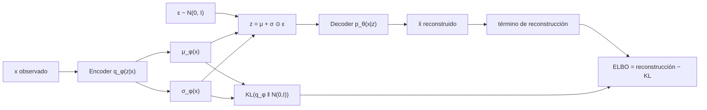

# 088 — Espacios latentes y autoencoders variacionales

> [← Clase anterior](../../../classes/part-06-foundation-models-and-llm-engineering/087-proyecto-servicio-llm-con-contratos-y-evals/README.md) · [Índice de la parte](../README.md) · [Clase siguiente →](../../../classes/part-07-generative-ai-across-media/089-gan-y-entrenamiento-adversarial/README.md)

**Parte:** 07 — IA generativa para texto, imagen, audio, video y 3D  
**Nivel:** avanzado · **Horas estimadas:** 6  
**Laboratorio:** `generation` · **Estado:** `EXECUTABLE_CORE`

## 🎯 Propósito

Comprender **espacios latentes y autoencoders variacionales** dentro de la evolución de la inteligencia
artificial, implementar un experimento mínimo verificable y distinguir qué parte
constituye evidencia frente a una afirmación todavía no comprobada.

## 📚 Resultados de aprendizaje

Al finalizar podrás:

1. Explicar espacios latentes y autoencoders variacionales usando los conceptos `VAE`, `latente`, `reconstrucción`, `muestreo`.
2. Ejecutar el laboratorio con una semilla explícita y revisar su contrato JSON.
3. Identificar al menos un supuesto, una limitación y un riesgo de aplicación.
4. Comparar el enfoque con la etapa anterior de la ruta de aprendizaje.
5. Producir una evidencia reproducible y una conclusión que no exceda los datos.

## 🧩 Conceptos centrales

`VAE`, `latente`, `reconstrucción`, `muestreo`

## 🗺️ Ubicación en el mapa de la IA

El autoencoder variacional (Kingma y Welling, 2013) inaugura la era moderna de los
modelos generativos profundos: es el primer método que entrena una red neuronal como
modelo probabilístico de variables latentes con gradiente de extremo a extremo. Hereda
la inferencia variacional de la estadística bayesiana y el autoencoder clásico del
aprendizaje de representaciones, y habilita lo que sigue en esta parte: los GAN (089)
compiten con él en calidad de muestra, y los modelos de difusión (090) generalizan su
cota variacional a una jerarquía de latentes. Los "espacios latentes" que hoy usan
Stable Diffusion o los tokenizadores de imagen descienden directamente de esta idea.

## 📖 Fundamentos

### 🎲 Modelos de variables latentes

Un modelo de variable latente asume que cada dato observado x fue generado en dos
pasos: se muestrea un vector latente z ~ p(z) (normalmente N(0, I)) y luego
x ~ p_θ(x|z), donde p_θ(x|z) es una red neuronal (el **decoder**). La verosimilitud
marginal es una integral intratable:

```text
p_θ(x) = ∫ p_θ(x|z) · p(z) dz
```

Intratable porque habría que integrar sobre todos los z posibles. La inferencia
inversa p_θ(z|x) (qué latente produjo este dato) también es intratable por Bayes.

### 🔧 Inferencia variacional amortizada y ELBO

El VAE introduce un **encoder** q_φ(z|x) — otra red neuronal que aproxima la
posterior verdadera, típicamente una gaussiana diagonal N(μ_φ(x), diag(σ_φ²(x))).
Con él se construye la **cota inferior de la evidencia** (ELBO):

```text
log p_θ(x) ≥ ELBO(x) = E_{z~q_φ(z|x)}[ log p_θ(x|z) ] − KL( q_φ(z|x) ‖ p(z) )
```

La desigualdad es exacta: la brecha entre log p_θ(x) y el ELBO es exactamente
KL(q_φ(z|x) ‖ p_θ(z|x)) ≥ 0. Maximizar el ELBO en θ y φ simultáneamente hace dos
cosas: empuja la verosimilitud hacia arriba y ajusta q_φ hacia la posterior real.

Los dos términos tienen lectura directa:

- **Reconstrucción** E_q[log p_θ(x|z)]: el decoder debe reconstruir x desde un z
  muestreado del encoder. Con decoder gaussiano de varianza fija equivale a un
  error cuadrático; con decoder Bernoulli, a entropía cruzada.
- **Regularización** KL(q_φ(z|x) ‖ p(z)): castiga que el encoder se aleje del prior.
  Para dos gaussianas diagonales tiene forma cerrada por dimensión:

```text
KL( N(μ_q, σ_q²) ‖ N(μ_p, σ_p²) ) = log(σ_p/σ_q) + (σ_q² + (μ_q − μ_p)²)/(2σ_p²) − 1/2
Con prior N(0,1):  KL = −log σ_q + (σ_q² + μ_q²)/2 − 1/2
```

### 🎯 Truco de reparametrización

El obstáculo: no se puede retropropagar a través de un muestreo z ~ N(μ, σ²),
porque "muestrear" no es diferenciable respecto a μ y σ. La solución de Kingma y
Welling es reescribir la aleatoriedad como entrada externa:

```text
ε ~ N(0, I)          (ruido independiente de los parámetros)
z = μ_φ(x) + σ_φ(x) ⊙ ε    (transformación determinista y diferenciable)
```

Ahora z es una función diferenciable de φ y el gradiente ∂ELBO/∂φ fluye a través
de μ y σ con un estimador de baja varianza. Sin este truco habría que usar
REINFORCE, con varianza mucho mayor.

### 🗺️ El espacio latente como representación

Al entrenar, el VAE organiza los latentes: datos parecidos caen en regiones
cercanas y el prior N(0, I) obliga a que el espacio esté "lleno" alrededor del
origen — por eso interpolar entre dos z produce decodificaciones intermedias
plausibles, algo que un autoencoder determinista no garantiza (su espacio latente
puede tener "huecos" sin significado). El precio: la gaussiana diagonal de q_φ y
el peso del término KL tienden a producir reconstrucciones borrosas, y si el
decoder es demasiado potente puede ignorar z (**posterior collapse**: KL → 0 y el
latente no codifica nada).

## 🧮 Ejemplo trabajado

VAE de juguete en 1D: prior p(z) = N(0, 1), encoder que para cierto x produce
μ_q = 0.5 y σ_q = 0.8, decoder gaussiano p_θ(x|z) = N(g(z), 1) con g(z) = 2z.
Observación real: x = 2.0. Calculamos el ELBO con una sola muestra de ε.

**Paso 1 — KL en forma cerrada** (prior estándar: μ_p = 0, σ_p = 1):

```text
KL = −log σ_q + (σ_q² + μ_q²)/2 − 1/2
   = −log 0.8 + (0.64 + 0.25)/2 − 0.5
   = 0.2231 + 0.4450 − 0.5
   = 0.1681
```

**Paso 2 — Reparametrización.** Muestreamos ε = 0.5:

```text
z = μ_q + σ_q · ε = 0.5 + 0.8 · 0.5 = 0.9
```

**Paso 3 — Término de reconstrucción.** El decoder predice g(z) = 2 · 0.9 = 1.8:

```text
log p(x|z) = −½ log(2π) − (x − g(z))²/2 = −0.9189 − (2.0 − 1.8)²/2
           = −0.9189 − 0.02 = −0.9389
```

**Paso 4 — ELBO (estimado con 1 muestra):**

```text
ELBO ≈ −0.9389 − 0.1681 = −1.1071   →   log p(x) ≥ −1.1071 (en esperanza)
```

Si el entrenamiento reduce el error de reconstrucción (g(z) más cerca de x) sin
inflar la KL, el ELBO sube y la cota sobre log p(x) se aprieta. Repite el cálculo
con ε = −0.5: z = 0.1, g(z) = 0.2, log p(x|z) = −2.5389 — la varianza entre
muestras de ε es exactamente lo que promedia la esperanza E_q.

## 📊 Propiedades y comparación

| Propiedad | VAE | Autoencoder clásico | GAN (clase 089) | Difusión (clase 090) |
|---|---|---|---|---|
| Objetivo | ELBO (cota de log-verosimilitud) | error de reconstrucción | juego minimax | cota variacional / ε-matching |
| Verosimilitud | cota inferior computable | no define densidad | implícita, no evaluable | cota computable |
| Muestreo | 1 pasada del decoder | no genera (sin prior) | 1 pasada del generador | decenas-miles de pasos |
| Espacio latente | continuo, regularizado | continuo, sin estructura garantizada | continuo (z del generador) | trayectoria de ruido |
| Fallo típico | muestras borrosas, posterior collapse | huecos latentes sin significado | colapso de modos | costo de muestreo |
| Entrenamiento | estable (un solo objetivo) | estable | inestable (dos redes) | estable |



## ⚠️ Errores conceptuales frecuentes

1. **"El ELBO es la verosimilitud."** Es una cota inferior; la brecha es
   KL(q_φ(z|x) ‖ p_θ(z|x)). Comparar modelos por ELBO mezcla calidad del modelo y
   calidad de la aproximación variacional.
2. **"El encoder comprime como un ZIP."** q_φ(z|x) es una distribución, no un
   código determinista: el mismo x produce z distintos en cada muestreo, y la KL
   fuerza a que esa nube se parezca al prior.
3. **"La reparametrización es un detalle de implementación."** Es la contribución
   central: sin ella no hay gradiente de baja varianza a través del muestreo y el
   entrenamiento conjunto encoder-decoder no funciona en la práctica.
4. **"KL pequeña es siempre buena."** KL ≈ 0 en todas las dimensiones suele indicar
   posterior collapse: el decoder ignora z y el 'espacio latente' no representa nada.
5. **"Las muestras borrosas son un bug."** Son consecuencia estructural del decoder
   gaussiano/Bernoulli factorizado y del promedio que induce la verosimilitud; por
   eso VQ-VAE, β-VAE y los VAE jerárquicos modifican precisamente esas piezas.

## 🚀 Del aprendizaje a la operación

Entre este núcleo (un ELBO calculado a mano en 1D) y un VAE útil median: encoders y
decoders convolucionales o transformer con millones de parámetros, ponderación del
término KL (β-VAE, KL annealing) para controlar el colapso posterior, métricas de
evaluación honestas (bits/dim, FID) además del ELBO, y en producción los VAE actúan
sobre todo como compresores latentes dentro de sistemas mayores — el "latent" de
Stable Diffusion es un autoencoder entrenado con este mismo marco.

## 🧪 Laboratorio

```bash
python lab.py
```

El laboratorio llama a `ai_evolution.labs.run_lab("generation")`. Esta
decisión evita 183 implementaciones divergentes: cada clase tiene un entrypoint
propio, pero los motores didácticos se prueban como una biblioteca común.

### 🔍 Evidencia esperada

- tipo de laboratorio y semilla;
- entradas o decisiones observables;
- resultado estructurado;
- lista `evidence` con hechos que pueden inspeccionarse;
- lista `limitations` que impide presentar la demo como producción.

## 📓 Notebooks

- [📓 `notebook.ipynb`](notebook.ipynb): recorrido guiado con la materia resumida.
- [✍️ `notebook_student.ipynb`](notebook_student.ipynb): ejercicios para resolver.
- [✅ `notebook_solution.ipynb`](notebook_solution.ipynb): solución de referencia explicada.

## 📝 Evaluación

| Criterio | Peso |
|---|---:|
| Comprensión conceptual | 25 % |
| Ejecución reproducible | 25 % |
| Interpretación basada en evidencia | 25 % |
| Riesgos, límites y mejora propuesta | 25 % |

Consulta [assessment.md](assessment.md) para preguntas y criterio de aceptación.

## ⚠️ Errores comunes

| Síntoma | Causa probable | Corrección |
|---|---|---|
| El código corre, pero no hay conclusión | Se confundió ejecución con aprendizaje | Explica qué demuestra y qué no demuestra |
| El resultado cambia sin explicación | No se registró semilla o configuración | Conserva semilla, versión y parámetros |
| Se promete uso real | Se extrapoló desde una demo educativa | Declara entorno, datos, límites y revisión humana |
| Se copia una métrica aislada | No existe baseline ni costo de error | Añade comparación y criterio de decisión |

## ❓ Preguntas frecuentes

**¿Debo usar una API comercial?**  
No. El núcleo funciona localmente. Las extensiones LIVE se documentan por separado.

**¿El laboratorio representa una implementación industrial?**  
No por sí solo. Enseña el contrato y el patrón; producción exige integración,
seguridad, observabilidad, pruebas y operación.

**¿Dónde profundizo?**  
Revisa las especializaciones enlazadas en el README raíz y la ruta siguiente.

## 🔗 Referencias

- Kingma, D. P. y Welling, M. (2013). *Auto-Encoding Variational Bayes*. Paper seminal del VAE. [arXiv:1312.6114](https://arxiv.org/abs/1312.6114) — uso: fuente primaria del mecanismo estudiado
- Kingma, D. P. y Welling, M. (2019). *An Introduction to Variational Autoencoders*. Foundations and Trends in Machine Learning. [arXiv:1906.02691](https://arxiv.org/abs/1906.02691) — uso: fuente primaria del mecanismo estudiado
- Doersch, C. (2016). *Tutorial on Variational Autoencoders*. [arXiv:1606.05908](https://arxiv.org/abs/1606.05908) — uso: fuente primaria del mecanismo estudiado
- Goodfellow, I., Bengio, Y. y Courville, A. (2016). *Deep Learning*, cap. 20 (Deep Generative Models). [deeplearningbook.org/contents/generative_models.html](https://www.deeplearningbook.org/contents/generative_models.html) — uso: desarrollo extendido del tema
- Rezende, D. J., Mohamed, S. y Wierstra, D. (2014). *Stochastic Backpropagation and Approximate Inference in Deep Generative Models*. [arXiv:1401.4082](https://arxiv.org/abs/1401.4082) — uso: fuente primaria del mecanismo estudiado
- Documentación de PyTorch: [`torch.distributions.kl.kl_divergence`](https://pytorch.org/docs/stable/distributions.html#torch.distributions.kl.kl_divergence) — uso: referencia consultada en su fuente original

<!-- papers:inicio -->

---

## 📜 Papers que fundamentan esta clase

> Bloque generado por `python scripts/link_papers_to_classes.py`. La fuente es [`papers/catalog/papers.json`](../../../papers/catalog/papers.json).

| Paper | Año | Qué desbloqueó | Miniatura |
|---|---:|---|---|
| [P38 · Bayes variacional con autocodificación](../../../papers/foundational/P38_vae/README.md) | 2013 | Hace entrenable un modelo generativo latente: el truco de reparametrización deja pasar el gradiente a través del muestreo. | [notebook](../../../notebooks/papers/P38_vae.ipynb) |

Cada ficha explica el problema anterior, la matemática mínima, los límites y los errores de atribución más frecuentes. Para leerlas con método: [cómo leer un paper de IA](../../../papers/guides/COMO_LEER_UN_PAPER_DE_IA.md) · [anexos matemáticos](../../../papers/annexes/README.md).
<!-- papers:fin -->
<!-- bibliografia:inicio -->

---

## 📚 Bibliografía de apoyo

> Bloque generado por `python scripts/link_sources_to_classes.py`. Cada obra lleva su localizador verificado en [`sources/bibliography.json`](../../../sources/bibliography.json).

Los papers dicen **de dónde salió** el mecanismo. Estas obras lo **desarrollan** con el espacio que una clase no tiene: teoría completa, demostraciones y ejercicios.

| Obra | Edición | Localizador | Papel en esta clase |
|---|---|---|---|
| Goodfellow, Ian, Bengio, Yoshua y Courville, Aaron — *Deep Learning* | 2016 | [ISBN 9780262035613](https://openlibrary.org/isbn/9780262035613) · [web de la obra](https://www.deeplearningbook.org/) | citada en las referencias de esta clase · cap. 20 · obra de referencia de la parte 07 |
<!-- bibliografia:fin -->

---

## ⬅️ Clase anterior

[087 — Proyecto: servicio LLM con contratos y evals](../../part-06-foundation-models-and-llm-engineering/087-proyecto-servicio-llm-con-contratos-y-evals/README.md)

## ➡️ Siguiente clase

[089 — GAN y entrenamiento adversarial](../../part-07-generative-ai-across-media/089-gan-y-entrenamiento-adversarial/README.md)
