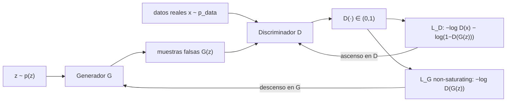

# 089 — GAN y entrenamiento adversarial

> [← Clase anterior](../../../classes/part-07-generative-ai-across-media/088-espacios-latentes-y-autoencoders-variacionales/README.md) · [Índice de la parte](../README.md) · [Clase siguiente →](../../../classes/part-07-generative-ai-across-media/090-modelos-de-difusion/README.md)

**Parte:** 07 — IA generativa para texto, imagen, audio, video y 3D  
**Nivel:** avanzado · **Horas estimadas:** 6  
**Laboratorio:** `generation` · **Estado:** `EXECUTABLE_CORE`

## 🎯 Propósito

Comprender **gan y entrenamiento adversarial** dentro de la evolución de la inteligencia
artificial, implementar un experimento mínimo verificable y distinguir qué parte
constituye evidencia frente a una afirmación todavía no comprobada.

## 📚 Resultados de aprendizaje

Al finalizar podrás:

1. Explicar gan y entrenamiento adversarial usando los conceptos `GAN`, `discriminador`, `generador`, `estabilidad`.
2. Ejecutar el laboratorio con una semilla explícita y revisar su contrato JSON.
3. Identificar al menos un supuesto, una limitación y un riesgo de aplicación.
4. Comparar el enfoque con la etapa anterior de la ruta de aprendizaje.
5. Producir una evidencia reproducible y una conclusión que no exceda los datos.

## 🧩 Conceptos centrales

`GAN`, `discriminador`, `generador`, `estabilidad`

## 🗺️ Ubicación en el mapa de la IA

Las redes generativas adversariales (Goodfellow et al., 2014) cambiaron la pregunta:
en vez de maximizar una verosimilitud (como el VAE de la clase 088), dos redes
compiten en un juego de suma cero y la calidad emerge del equilibrio. Entre 2014 y
2020 los GAN dominaron la síntesis de imágenes fotorrealistas (DCGAN, StyleGAN) y
dejaron dos legados permanentes: el entrenamiento adversarial como técnica general
(hoy reaparece en pérdidas perceptuales y en robustez) y la evidencia de que un
modelo puede generar sin definir una densidad explícita. Los modelos de difusión
(clase 090) los desplazaron precisamente atacando su punto débil: la inestabilidad.

## 📖 Fundamentos

### ⚔️ El juego minimax

Un GAN tiene dos redes con objetivos opuestos:

- **Generador** G: recibe ruido z ~ p(z) y produce muestras G(z) que intentan
  parecer datos reales.
- **Discriminador** D: recibe una muestra y estima la probabilidad D(x) ∈ (0, 1)
  de que sea real.

El objetivo original es un juego minimax sobre la función de valor V:

```text
min_G max_D  V(D, G) = E_{x~p_data}[ log D(x) ] + E_{z~p(z)}[ log(1 − D(G(z))) ]
```

D maximiza V (acertar reales y falsos); G la minimiza (engañar a D). El
entrenamiento alterna pasos de gradiente: k pasos de ascenso para D, un paso de
descenso para G, sobre minibatches.

### 🎯 Discriminador óptimo y divergencia de Jensen-Shannon

Para G fijo, el discriminador óptimo tiene forma cerrada punto a punto:

```text
D*(x) = p_data(x) / ( p_data(x) + p_g(x) )
```

donde p_g es la densidad de las muestras del generador. Sustituyendo D* en V se
obtiene:

```text
max_D V(D, G) = −log 4 + 2 · JSD( p_data ‖ p_g )
```

Es decir: con discriminador óptimo, entrenar G minimiza la **divergencia de
Jensen-Shannon** entre la distribución real y la generada. El mínimo global se
alcanza cuando p_g = p_data, y ahí D*(x) = 1/2 en todas partes (el discriminador
queda reducido a lanzar una moneda) y V = −log 4 ≈ −1.386.

### 🔥 Non-saturating loss

En la práctica, al inicio del entrenamiento D distingue las muestras falsas con
facilidad: D(G(z)) ≈ 0, y el gradiente de log(1 − D(G(z))) se satura (es casi
plano cerca de 0). Goodfellow et al. proponen que G maximice log D(G(z)) en lugar
de minimizar log(1 − D(G(z))):

```text
Pérdida saturante de G:      L_G = E_z[ log(1 − D(G(z))) ]   (gradiente débil si D gana)
Pérdida non-saturating:      L_G = −E_z[ log D(G(z)) ]       (gradiente fuerte si D gana)
```

Ambas tienen el mismo punto fijo, pero la segunda da gradientes grandes justamente
cuando el generador es malo — que es cuando más los necesita.

### 💥 Colapso de modos e inestabilidad

El equilibrio del juego es un punto de silla, no un mínimo: el descenso de
gradiente simultáneo puede orbitar u oscilar sin converger. Fallos característicos:

- **Colapso de modos**: G concentra toda su masa en unas pocas muestras que engañan
  a D e ignora el resto de la distribución (genera "siempre el mismo dígito").
- **Discriminador demasiado fuerte**: si D llega a ser casi perfecto, sus gradientes
  hacia G se anulan y el aprendizaje se detiene.
- **Soportes disjuntos**: si p_data y p_g viven en variedades de baja dimensión que
  no se solapan, la JSD vale log 2 constante y no da señal útil — motivación del
  WGAN, que sustituye la JSD por la distancia de Wasserstein con un crítico
  1-Lipschitz.

## 🧮 Ejemplo trabajado

Un paso del juego con números concretos. Minibatch: 2 muestras reales x⁽¹⁾, x⁽²⁾ y
2 falsas G(z⁽¹⁾), G(z⁽²⁾). Salidas actuales del discriminador:

```text
D(x⁽¹⁾) = 0.9    D(x⁽²⁾) = 0.7        (reales: quiere valores altos)
D(G(z⁽¹⁾)) = 0.4    D(G(z⁽²⁾)) = 0.2  (falsas: quiere valores bajos)
```

**Pérdida del discriminador** (negativo de su objetivo, promediando cada mitad):

```text
L_D = −½[log 0.9 + log 0.7] − ½[log(1−0.4) + log(1−0.2)]
    = −½[−0.1054 − 0.3567] − ½[−0.5108 − 0.2231]
    = 0.2310 + 0.3670 = 0.5980
```

**Pérdida del generador**, en sus dos variantes sobre las mismas falsas:

```text
Non-saturating:  L_G = −½[log 0.4 + log 0.2] = −½[−0.9163 − 1.6094] = 1.2629
Saturante:       L_G = ½[log 0.6 + log 0.8] = −0.3670
```

La versión non-saturating asigna a la muestra peor puntuada (D = 0.2) un término de
1.6094 frente a 0.9163 de la otra: el gradiente empuja más fuerte donde G más falla.
En el equilibrio ideal D(·) = 0.5 en todo punto y L_D = −2·log 0.5... es decir
L_D = 0.6931 por muestra (= log 2) y V = −log 4.

**Discriminador óptimo puntual**: si en una región del espacio p_data = 0.3 y
p_g = 0.1, entonces D*(x) = 0.3/(0.3 + 0.1) = **0.75** — el valor 0.75 delata que
ahí el generador pone menos masa de la que debería.

## 📊 Propiedades y comparación

| Propiedad | GAN (original) | WGAN | VAE (clase 088) | Difusión (clase 090) |
|---|---|---|---|---|
| Objetivo | minimax ↔ JSD | distancia de Wasserstein | ELBO | cota variacional / ε-matching |
| Densidad p(x) | implícita, no evaluable | implícita | cota inferior computable | cota computable |
| Muestreo | 1 pasada de G (rápido) | 1 pasada | 1 pasada del decoder | decenas-miles de pasos |
| Estabilidad | baja (punto de silla) | mejor (crítico Lipschitz) | alta | alta |
| Fallo típico | colapso de modos | recorte/penalización delicados | muestras borrosas | costo de muestreo |
| Señal con soportes disjuntos | nula (JSD constante) | sí (distancia geométrica) | n/a | n/a |



## ⚠️ Errores conceptuales frecuentes

1. **"El GAN aprende una densidad y luego muestrea."** No define p_g de forma
   evaluable: solo sabe transformar ruido en muestras. No se puede calcular la
   verosimilitud de un dato bajo un GAN estándar.
2. **"Pérdidas bajando = entrenamiento sano."** En un juego, las pérdidas de D y G
   son relativas al oponente: pueden oscilar en un GAN que funciona y estancarse en
   uno colapsado. Se valida mirando muestras y métricas (FID), no solo curvas.
3. **"Conviene entrenar D hasta el óptimo en cada paso."** Con D casi perfecto el
   gradiente hacia G se desvanece (con la pérdida saturante) o la señal JSD es
   constante con soportes disjuntos. El balance D/G es parte del diseño.
4. **"El colapso de modos es underfitting."** G puede producir muestras nítidas y
   de alta calidad y aun así cubrir una fracción mínima de la distribución: es un
   fallo de cobertura, no de capacidad.
5. **"D*(x) = 1/2 significa que el discriminador falló."** Al contrario: es la
   firma del equilibrio p_g = p_data; si D no puede hacer nada mejor que el azar,
   el generador ganó el juego.

## 🚀 Del aprendizaje a la operación

Entre este juego calculado a mano y un StyleGAN operativo median: arquitecturas
convolucionales con normalización espectral y regularización de gradiente (R1),
trucos de balance D/G y schedules ajustados empíricamente, métricas de evaluación
(FID, precision/recall de distribuciones) con sus propios sesgos, y datasets
curados a gran escala. Además, la capacidad de sintetizar caras realistas convierte
la procedencia del contenido (clase 098) en requisito operativo, no en opción.

## 🧪 Laboratorio

```bash
python lab.py
```

El laboratorio llama a `ai_evolution.labs.run_lab("generation")`. Esta
decisión evita 183 implementaciones divergentes: cada clase tiene un entrypoint
propio, pero los motores didácticos se prueban como una biblioteca común.

### 🔍 Evidencia esperada

- tipo de laboratorio y semilla;
- entradas o decisiones observables;
- resultado estructurado;
- lista `evidence` con hechos que pueden inspeccionarse;
- lista `limitations` que impide presentar la demo como producción.

## 📓 Notebooks

- [📓 `notebook.ipynb`](notebook.ipynb): recorrido guiado con la materia resumida.
- [✍️ `notebook_student.ipynb`](notebook_student.ipynb): ejercicios para resolver.
- [✅ `notebook_solution.ipynb`](notebook_solution.ipynb): solución de referencia explicada.

## 📝 Evaluación

| Criterio | Peso |
|---|---:|
| Comprensión conceptual | 25 % |
| Ejecución reproducible | 25 % |
| Interpretación basada en evidencia | 25 % |
| Riesgos, límites y mejora propuesta | 25 % |

Consulta [assessment.md](assessment.md) para preguntas y criterio de aceptación.

## ⚠️ Errores comunes

| Síntoma | Causa probable | Corrección |
|---|---|---|
| El código corre, pero no hay conclusión | Se confundió ejecución con aprendizaje | Explica qué demuestra y qué no demuestra |
| El resultado cambia sin explicación | No se registró semilla o configuración | Conserva semilla, versión y parámetros |
| Se promete uso real | Se extrapoló desde una demo educativa | Declara entorno, datos, límites y revisión humana |
| Se copia una métrica aislada | No existe baseline ni costo de error | Añade comparación y criterio de decisión |

## ❓ Preguntas frecuentes

**¿Debo usar una API comercial?**  
No. El núcleo funciona localmente. Las extensiones LIVE se documentan por separado.

**¿El laboratorio representa una implementación industrial?**  
No por sí solo. Enseña el contrato y el patrón; producción exige integración,
seguridad, observabilidad, pruebas y operación.

**¿Dónde profundizo?**  
Revisa las especializaciones enlazadas en el README raíz y la ruta siguiente.

## 🔗 Referencias

- Goodfellow, I. et al. (2014). *Generative Adversarial Networks*. Paper seminal. [arXiv:1406.2661](https://arxiv.org/abs/1406.2661)
- Arjovsky, M., Chintala, S. y Bottou, L. (2017). *Wasserstein GAN*. [arXiv:1701.07875](https://arxiv.org/abs/1701.07875)
- Radford, A., Metz, L. y Chintala, S. (2015). *Unsupervised Representation Learning with Deep Convolutional GANs* (DCGAN). [arXiv:1511.06434](https://arxiv.org/abs/1511.06434)
- Goodfellow, I. (2016). *NIPS 2016 Tutorial: Generative Adversarial Networks*. [arXiv:1701.00160](https://arxiv.org/abs/1701.00160)
- Goodfellow, I., Bengio, Y. y Courville, A. (2016). *Deep Learning*, cap. 20 (Deep Generative Models). [deeplearningbook.org/contents/generative_models.html](https://www.deeplearningbook.org/contents/generative_models.html)
- Documentación de PyTorch: [tutorial oficial DCGAN](https://pytorch.org/tutorials/beginner/dcgan_faces_tutorial.html)

---

## ⬅️ Clase anterior

[088 — Espacios latentes y autoencoders variacionales](../../part-07-generative-ai-across-media/088-espacios-latentes-y-autoencoders-variacionales/README.md)

## ➡️ Siguiente clase

[090 — Modelos de difusión](../../part-07-generative-ai-across-media/090-modelos-de-difusion/README.md)
