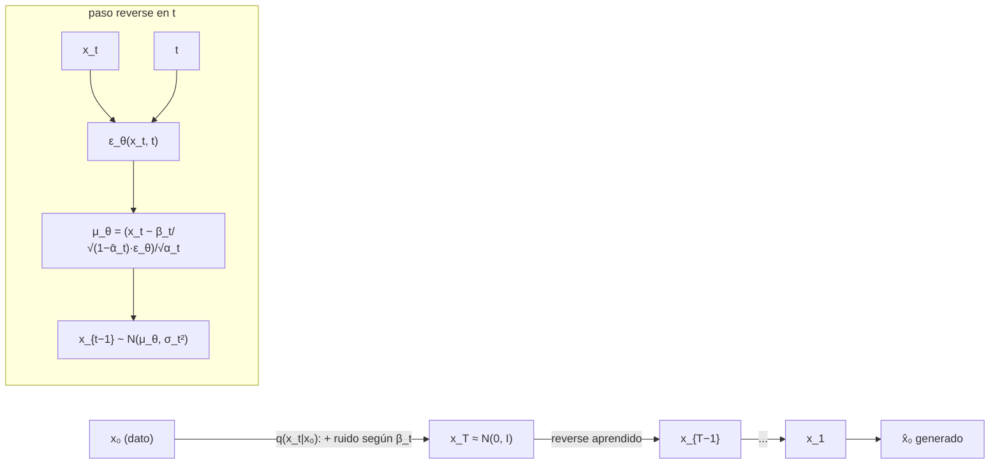

# 090 — Modelos de difusión

> [← Clase anterior](../../../classes/part-07-generative-ai-across-media/089-gan-y-entrenamiento-adversarial/README.md) · [Índice de la parte](../README.md) · [Clase siguiente →](../../../classes/part-07-generative-ai-across-media/091-texto-a-imagen-y-condicionamiento/README.md)

**Parte:** 07 — IA generativa para texto, imagen, audio, video y 3D  
**Nivel:** avanzado · **Horas estimadas:** 6  
**Laboratorio:** `generation` · **Estado:** `EXECUTABLE_CORE`

## 🎯 Propósito

Comprender **modelos de difusión** dentro de la evolución de la inteligencia
artificial, implementar un experimento mínimo verificable y distinguir qué parte
constituye evidencia frente a una afirmación todavía no comprobada.

## 📚 Resultados de aprendizaje

Al finalizar podrás:

1. Explicar modelos de difusión usando los conceptos `DDPM`, `denoising`, `scheduler`, `sampling`.
2. Ejecutar el laboratorio con una semilla explícita y revisar su contrato JSON.
3. Identificar al menos un supuesto, una limitación y un riesgo de aplicación.
4. Comparar el enfoque con la etapa anterior de la ruta de aprendizaje.
5. Producir una evidencia reproducible y una conclusión que no exceda los datos.

## 🧩 Conceptos centrales

`DDPM`, `denoising`, `scheduler`, `sampling`

## 🗺️ Ubicación en el mapa de la IA

Los modelos de difusión nacen en la termodinámica fuera de equilibrio
(Sohl-Dickstein et al., 2015) y maduran con DDPM (Ho et al., 2020), que demostró
calidad de imagen comparable o superior a los GAN con un entrenamiento estable de
un solo objetivo. Combinan lo mejor de las dos clases anteriores: como el VAE (088)
optimizan una cota variacional, y como el GAN (089) producen muestras nítidas —
sin juego adversarial. Son el motor de Stable Diffusion, DALL·E, Imagen y de los
generadores de audio y video de las clases siguientes, donde el condicionamiento
por texto (091) se monta sobre exactamente este proceso.

## 📖 Fundamentos

### 🌫️ Proceso forward: destruir con ruido gaussiano

El proceso forward es una cadena de Markov fija (sin parámetros aprendidos) que
corrompe el dato x₀ en T pasos añadiendo ruido gaussiano según un **scheduler de
varianzas** β₁, …, β_T (típicamente crecientes, p. ej. de 10⁻⁴ a 0.02 con T = 1000):

```text
q(x_t | x_{t−1}) = N( x_t ; √(1−β_t) · x_{t−1} ,  β_t · I )
```

El factor √(1−β_t) encoge la señal exactamente lo necesario para que la varianza
total se conserve. Definiendo α_t = 1 − β_t y ᾱ_t = ∏_{s=1}^{t} α_s, la composición
de t pasos gaussianos tiene **forma cerrada** — se puede saltar de x₀ a x_t sin
recorrer la cadena:

```text
q(x_t | x₀) = N( x_t ; √ᾱ_t · x₀ ,  (1−ᾱ_t) · I )
x_t = √ᾱ_t · x₀ + √(1−ᾱ_t) · ε ,   ε ~ N(0, I)
```

Como ᾱ_T → 0, al final x_T es indistinguible de ruido puro N(0, I): la
distribución de partida del muestreo es conocida.

### 🔄 Proceso reverse: aprender a des-ruido

Generar es invertir la cadena: partir de x_T ~ N(0, I) y quitar ruido paso a paso.
La inversa exacta q(x_{t−1}|x_t) es intratable (requiere la densidad de los datos),
pero para β_t pequeños es aproximadamente gaussiana, así que se aprende:

```text
p_θ(x_{t−1} | x_t) = N( x_{t−1} ; μ_θ(x_t, t) ,  σ_t² · I )
```

La observación clave de DDPM: en lugar de predecir μ directamente, la red predice
**el ruido ε** que se usó para llegar a x_t. De la forma cerrada se despeja
x₀ = (x_t − √(1−ᾱ_t)·ε)/√ᾱ_t, y la media óptima queda:

```text
μ_θ(x_t, t) = (1/√α_t) · ( x_t − β_t/√(1−ᾱ_t) · ε_θ(x_t, t) )
```

### 🎯 Objetivo simplificado

La derivación completa parte de la cota variacional (un ELBO como el del VAE, con
un término KL por paso), pero Ho et al. muestran que descartar los pesos de cada
término funciona mejor en la práctica. El objetivo de entrenamiento se reduce a:

```text
L_simple = E_{x₀, t, ε} [ ‖ ε − ε_θ( √ᾱ_t·x₀ + √(1−ᾱ_t)·ε ,  t ) ‖² ]
```

El algoritmo de entrenamiento cabe en cuatro líneas:

```text
repetir:
    x₀ ~ datos;  t ~ Uniforme{1..T};  ε ~ N(0, I)
    x_t = √ᾱ_t·x₀ + √(1−ᾱ_t)·ε
    paso de gradiente sobre ‖ε − ε_θ(x_t, t)‖²
```

Una sola red ε_θ (una U-Net o un transformer, condicionada en t) aprende todos los
niveles de ruido. No hay juego adversarial ni riesgo de colapso de modos: es una
regresión estable. Este objetivo equivale además a aprender la **función de score**
∇_x log q(x_t) (Song y Ermon), lo que conecta difusión con score matching.

### ⏱️ Muestreo y el costo de iterar

Generar exige recorrer la cadena reverse: T evaluaciones de la red (1000 en DDPM
original) frente a 1 sola pasada en GAN o VAE. DDIM reformula el proceso como no
markoviano y determinista, permitiendo saltar pasos (50-100 evaluaciones con poca
pérdida); la destilación posterior lo reduce a unas pocas. El scheduler de β y el
número de pasos de muestreo son los dos diales operativos principales.

## 🧮 Ejemplo trabajado

Difusión escalar (1D) con dos pasos y scheduler β₁ = 0.1, β₂ = 0.2.

**Paso 1 — alfas acumuladas:**

```text
α₁ = 1 − 0.1 = 0.9        α₂ = 1 − 0.2 = 0.8
ᾱ₁ = 0.9                  ᾱ₂ = 0.9 · 0.8 = 0.72
```

**Paso 2 — forward directo a t = 2** con x₀ = 1.0 y ruido muestreado ε = 0.5:

```text
x₂ = √ᾱ₂ · x₀ + √(1−ᾱ₂) · ε
   = √0.72 · 1.0 + √0.28 · 0.5
   = 0.8485 + 0.5292 · 0.5
   = 0.8485 + 0.2646 = 1.1131
```

La señal conserva el 84.85 % de su escala y el ruido aporta desviación √0.28 ≈ 0.53.
Con T grande, √ᾱ_T → 0 y x_T sería prácticamente ε puro.

**Paso 3 — reconstrucción de x₀ si la red acierta el ruido.** Un ε_θ perfecto
devolvería ε̂ = 0.5 y podríamos despejar:

```text
x̂₀ = ( x₂ − √(1−ᾱ₂) · ε̂ ) / √ᾱ₂ = ( 1.1131 − 0.2646 ) / 0.8485 = 1.0000 ✓
```

**Paso 4 — la pérdida castiga el error de ruido.** Si la red predice ε̂ = 0.3:

```text
L_simple = (0.5 − 0.3)² = 0.04
x̂₀ = (1.1131 − 0.5292·0.3)/0.8485 = 1.1247   (error de 0.1247 en el dato)
```

El mismo error de ruido produce un error en x̂₀ amplificado por √(1−ᾱ_t)/√ᾱ_t —
por eso los pasos muy ruidosos (t alto) son los más difíciles y los que fijan la
estructura global de la muestra.

## 📊 Propiedades y comparación

| Propiedad | DDPM | DDIM | GAN (089) | VAE (088) |
|---|---|---|---|---|
| Objetivo | ‖ε − ε_θ‖² (cota variacional simplificada) | mismo entrenamiento | juego minimax | ELBO |
| Muestreo | ~1000 pasos estocásticos | 20-100 pasos, determinista | 1 pasada | 1 pasada |
| Estabilidad de entrenamiento | alta (regresión) | alta | baja | alta |
| Cobertura de modos | alta | alta | riesgo de colapso | alta |
| Verosimilitud | cota computable | cota computable | no evaluable | cota computable |
| Fallo típico | costo de muestreo | leve pérdida de diversidad | colapso de modos | borrosidad |



## ⚠️ Errores conceptuales frecuentes

1. **"El modelo aprende a quitar todo el ruido de golpe."** ε_θ predice el ruido
   total presente en x_t, pero el muestreo solo retrocede un paso cada vez; la
   estimación de x₀ se rehace y refina en cada iteración.
2. **"El proceso forward se entrena."** No tiene parámetros: es una cadena fija
   definida por el scheduler β. Solo la red reverse ε_θ aprende.
3. **"Más pasos de muestreo siempre mejoran la calidad."** Hay rendimientos
   decrecientes rápidos; DDIM logra con 50 pasos casi lo mismo que DDPM con 1000.
   El número de pasos es un trade-off calidad/latencia, no una virtud en sí.
4. **"La pérdida ‖ε − ε̂‖² es un truco sin justificación."** Es la cota variacional
   con los pesos por paso igualados a 1; la teoría (y su equivalencia con score
   matching) está completa en Ho et al. y Song et al.
5. **"Difusión reemplaza a VAE y GAN en todo."** Paga su calidad con decenas de
   evaluaciones de red por muestra; en latencia estricta un generador de una pasada
   sigue ganando, y los sistemas reales (Stable Diffusion) usan un VAE por debajo.

## 🚀 Del aprendizaje a la operación

Entre este forward escalar a mano y un generador real median: una U-Net o DiT con
cientos de millones de parámetros condicionada en t (y en texto, clase 091),
schedulers coseno y espacios latentes comprimidos para abaratar cada paso,
muestreadores avanzados (DDIM, DPM-Solver) y destilación para bajar de 1000 a
menos de 10 evaluaciones, y guías de clasificador libre para controlar la
generación. La calidad fotorrealista resultante hace obligatoria la trazabilidad
de procedencia que cierra esta parte (clase 098).

## 🧪 Laboratorio

```bash
python lab.py
```

El laboratorio llama a `ai_evolution.labs.run_lab("generation")`. Esta
decisión evita 183 implementaciones divergentes: cada clase tiene un entrypoint
propio, pero los motores didácticos se prueban como una biblioteca común.

### 🔍 Evidencia esperada

- tipo de laboratorio y semilla;
- entradas o decisiones observables;
- resultado estructurado;
- lista `evidence` con hechos que pueden inspeccionarse;
- lista `limitations` que impide presentar la demo como producción.

## 📓 Notebooks

- [📓 `notebook.ipynb`](notebook.ipynb): recorrido guiado con la materia resumida.
- [✍️ `notebook_student.ipynb`](notebook_student.ipynb): ejercicios para resolver.
- [✅ `notebook_solution.ipynb`](notebook_solution.ipynb): solución de referencia explicada.

## 📝 Evaluación

| Criterio | Peso |
|---|---:|
| Comprensión conceptual | 25 % |
| Ejecución reproducible | 25 % |
| Interpretación basada en evidencia | 25 % |
| Riesgos, límites y mejora propuesta | 25 % |

Consulta [assessment.md](assessment.md) para preguntas y criterio de aceptación.

## ⚠️ Errores comunes

| Síntoma | Causa probable | Corrección |
|---|---|---|
| El código corre, pero no hay conclusión | Se confundió ejecución con aprendizaje | Explica qué demuestra y qué no demuestra |
| El resultado cambia sin explicación | No se registró semilla o configuración | Conserva semilla, versión y parámetros |
| Se promete uso real | Se extrapoló desde una demo educativa | Declara entorno, datos, límites y revisión humana |
| Se copia una métrica aislada | No existe baseline ni costo de error | Añade comparación y criterio de decisión |

## ❓ Preguntas frecuentes

**¿Debo usar una API comercial?**  
No. El núcleo funciona localmente. Las extensiones LIVE se documentan por separado.

**¿El laboratorio representa una implementación industrial?**  
No por sí solo. Enseña el contrato y el patrón; producción exige integración,
seguridad, observabilidad, pruebas y operación.

**¿Dónde profundizo?**  
Revisa las especializaciones enlazadas en el README raíz y la ruta siguiente.

## 🔗 Referencias

- Ho, J., Jain, A. y Abbeel, P. (2020). *Denoising Diffusion Probabilistic Models*. Paper seminal de DDPM. [arXiv:2006.11239](https://arxiv.org/abs/2006.11239)
- Sohl-Dickstein, J. et al. (2015). *Deep Unsupervised Learning using Nonequilibrium Thermodynamics*. Origen del marco de difusión. [arXiv:1503.03585](https://arxiv.org/abs/1503.03585)
- Song, J., Meng, C. y Ermon, S. (2020). *Denoising Diffusion Implicit Models* (DDIM). [arXiv:2010.02502](https://arxiv.org/abs/2010.02502)
- Song, Y. et al. (2020). *Score-Based Generative Modeling through Stochastic Differential Equations*. [arXiv:2011.13456](https://arxiv.org/abs/2011.13456)
- Rombach, R. et al. (2021). *High-Resolution Image Synthesis with Latent Diffusion Models* (Stable Diffusion). [arXiv:2112.10752](https://arxiv.org/abs/2112.10752)
- Documentación de Hugging Face Diffusers: [`DDPMScheduler`](https://huggingface.co/docs/diffusers/api/schedulers/ddpm)

---

## ⬅️ Clase anterior

[089 — GAN y entrenamiento adversarial](../../part-07-generative-ai-across-media/089-gan-y-entrenamiento-adversarial/README.md)

## ➡️ Siguiente clase

[091 — Texto a imagen y condicionamiento](../../part-07-generative-ai-across-media/091-texto-a-imagen-y-condicionamiento/README.md)
