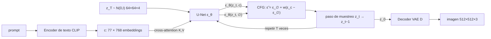

# 091 — Texto a imagen y condicionamiento

> [← Clase anterior](../../../classes/part-07-generative-ai-across-media/090-modelos-de-difusion/README.md) · [Índice de la parte](../README.md) · [Clase siguiente →](../../../classes/part-07-generative-ai-across-media/092-control-estructural-y-edicion-generativa/README.md)

**Parte:** 07 — IA generativa para texto, imagen, audio, video y 3D  
**Nivel:** avanzado · **Horas estimadas:** 6  
**Laboratorio:** `generation` · **Estado:** `EXECUTABLE_CORE`

## 🎯 Propósito

Comprender **texto a imagen y condicionamiento** dentro de la evolución de la inteligencia
artificial, implementar un experimento mínimo verificable y distinguir qué parte
constituye evidencia frente a una afirmación todavía no comprobada.

## 📚 Resultados de aprendizaje

Al finalizar podrás:

1. Explicar texto a imagen y condicionamiento usando los conceptos `text-to-image`, `conditioning`, `guidance`, `prompt`.
2. Ejecutar el laboratorio con una semilla explícita y revisar su contrato JSON.
3. Identificar al menos un supuesto, una limitación y un riesgo de aplicación.
4. Comparar el enfoque con la etapa anterior de la ruta de aprendizaje.
5. Producir una evidencia reproducible y una conclusión que no exceda los datos.

## 🧩 Conceptos centrales

`text-to-image`, `conditioning`, `guidance`, `prompt`

## 🗺️ Ubicación en el mapa de la IA

Los modelos de difusión de la clase 090 generan imágenes, pero sin control: muestrean
de la distribución completa aprendida. Esta clase añade la pieza que convirtió la
difusión en un producto masivo (2021-2022): **condicionar** la generación con texto
mediante cross-attention y **guiarla** con classifier-free guidance, todo dentro del
espacio latente de un autoencoder para que sea computacionalmente viable (Stable
Diffusion). Estas mismas técnicas de condicionamiento habilitan la clase 092 (control
estructural con ControlNet) y se reutilizan en generación de video y 3D.

## 📖 Fundamentos

### 📝 Del prompt al vector de condición

El texto no entra "crudo" al modelo. Un encoder de texto preentrenado —en Stable
Diffusion, el text encoder de **CLIP** (Radford et al., 2021)— tokeniza el prompt y
produce una secuencia de embeddings c = (c₁, …, c_L), un vector por token (en SD 1.x,
L = 77 tokens de 768 dimensiones). CLIP se entrenó con contraste imagen-texto sobre
cientos de millones de pares, así que sus embeddings ya codifican semántica visual:
"un gato naranja" queda cerca de fotos de gatos naranjas en el espacio conjunto.

### 🔀 Condicionamiento por cross-attention

La U-Net de difusión predice el ruido ε_θ(x_t, t, c). El texto se inyecta en capas de
**cross-attention** intercaladas en la U-Net: las queries Q vienen de las features
espaciales de la imagen ruidosa, y las keys K y values V vienen de los embeddings del
texto:

```text
Attention(Q, K, V) = softmax(Q·Kᵀ / √d) · V
Q = W_Q · φ(x_t)      (features de la imagen, una query por posición espacial)
K = W_K · c,  V = W_V · c   (una key/value por token del prompt)
```

Cada posición de la imagen "consulta" qué tokens del prompt le son relevantes: los
pesos de atención alinean regiones espaciales con palabras. Por eso los mapas de
atención permiten localizar qué píxeles atendieron a "gato" y cuáles a "naranja".

### 🎯 Classifier-free guidance (CFG)

Condicionar no basta: el modelo tiende a ignorar parcialmente el prompt. Ho y
Salimans (2022) propusieron entrenar el mismo modelo con y sin condición (durante el
entrenamiento se reemplaza c por el token vacío ∅ con probabilidad ~10-20 %) y, en
inferencia, **extrapolar** la predicción en la dirección que marca el texto:

```text
ε̃ = ε_θ(x_t, ∅) + w · (ε_θ(x_t, c) − ε_θ(x_t, ∅))
```

- w = 1 recupera la predicción condicional pura.
- w > 1 (típico: 7-8) amplifica la dirección "lo que el texto añade sobre lo
  incondicional": más adherencia al prompt, menos diversidad, y con w muy alto
  colores sobresaturados y artefactos.
- Cuesta **dos pasadas** de la U-Net por paso de muestreo (una con c, otra con ∅).

### 🗜️ Latent diffusion: difundir en el espacio de un autoencoder

Difundir en píxeles 512×512 es carísimo: cada paso de la U-Net opera sobre 786 432
valores. Rombach et al. (2022) entrenan primero un **autoencoder** (VAE con pérdida
perceptual y adversarial) que comprime la imagen x a un latente z = E(x) de
64×64×4, y ejecutan **toda la difusión en z**; al final, el decoder D(z₀) reconstruye
la imagen. El factor de reducción espacial es f = 8 por lado. La apuesta empírica:
la difusión se encarga de la composición semántica y el autoencoder de los detalles
perceptuales de alta frecuencia — separar ambos ahorra un orden de magnitud de
cómputo sin perder calidad apreciable.

```text
Pipeline de Stable Diffusion (inferencia):
1. c = CLIP_text(prompt);  z_T ~ N(0, I)   (latente 64×64×4)
2. para t = T … 1:
       ε̃ = ε_θ(z_t, ∅) + w·(ε_θ(z_t, c) − ε_θ(z_t, ∅))    # CFG, 2 pasadas
       z_{t−1} = paso_de_muestreo(z_t, ε̃, t)               # DDPM/DDIM
3. imagen = D(z₀)                                           # decoder del VAE
```

## 🧮 Ejemplo trabajado

**CFG con números concretos.** Supón que en cierto paso, para una coordenada del
latente, el modelo predice ruido incondicional ε_∅ = 0.20 y condicional ε_c = 0.32
(el prompt "empuja" esa coordenada). Con w = 7.5:

```text
ε̃ = 0.20 + 7.5 · (0.32 − 0.20) = 0.20 + 7.5 · 0.12 = 0.20 + 0.90 = 1.10
```

La diferencia condicional era +0.12; la guía la amplifica a +0.90. Nota que ε̃ = 1.10
queda **fuera** del intervalo [0.20, 0.32]: CFG extrapola, no interpola — por eso
w grande produce imágenes "quemadas". Con w = 1: ε̃ = 0.32 (condicional pura).

**Ahorro de latent diffusion.** Dimensión del problema por paso de difusión:

```text
Píxeles:  512 × 512 × 3 = 786 432 valores
Latente:   64 ×  64 × 4 =  16 384 valores    → factor 48× menos entradas
```

Como el costo de las convoluciones escala con el área espacial, pasar de 512² a 64²
reduce ~64× las operaciones espaciales por capa. Con 50 pasos de muestreo y 2 pasadas
por CFG son 100 evaluaciones de U-Net: hacerlas sobre 16 384 valores en vez de
786 432 es la diferencia entre segundos y minutos por imagen en una misma GPU. El
precio: una sola pasada extra de encoder/decoder del VAE y los artefactos propios de
su reconstrucción (texto pequeño, tramas finas).

## 📊 Propiedades y comparación

| Enfoque | Espacio | Condicionamiento | Costo de muestreo | Trade-off principal |
|---|---|---|---|---|
| Difusión en píxeles (DDPM, Imagen) | píxeles | cross-attention (+ cascada de superresolución) | muy alto (T pasos sobre imagen completa) | máxima fidelidad, cómputo prohibitivo |
| **Latent diffusion (Stable Diffusion)** | latente VAE 64×64×4 | cross-attention + CFG | alto pero ~48× menor por paso | artefactos del decoder del VAE |
| Autoregresivo sobre tokens (DALL·E 1, Parti) | tokens discretos VQ | prefijo de texto en el transformer | O(n) tokens secuenciales | orden de generación artificial en 2D |
| GAN condicional (clase 089) | píxeles | vector/embedding en G y D | 1 pasada (rapidísimo) | entrenamiento inestable, menor diversidad |
| DALL·E 2 (prior + decoder) | embedding CLIP → difusión | prior texto→imagen-embedding | alto | dos etapas: errores del prior se propagan |



## ⚠️ Errores conceptuales frecuentes

1. **"El modelo entiende el prompt como un LLM."** No: el encoder CLIP produce
   embeddings contrastivos con límite de 77 tokens; composiciones complejas
   ("el cubo rojo *sobre* la esfera azul") fallan a menudo porque la atención no
   garantiza vinculación correcta atributo-objeto.
2. **"Subir el guidance siempre mejora la imagen."** w alto aumenta adherencia al
   prompt pero reduce diversidad y satura colores; es una extrapolación, no un
   ajuste fino. Valores útiles suelen estar en 5-10.
3. **"La difusión ocurre sobre la imagen."** En latent diffusion ocurre sobre z
   (64×64×4); la imagen solo existe tras el decoder. Por eso defectos como texto
   ilegible son en parte atribuibles al VAE, no a la difusión.
4. **"CFG usa un clasificador."** Es *classifier-free* precisamente porque sustituye
   al clasificador externo del classifier guidance original (Dhariwal y Nichol) por
   la diferencia entre predicción condicional e incondicional del propio modelo.
5. **"La semilla fija garantiza la misma imagen en cualquier entorno."** Fija el
   ruido inicial, pero cambios de versión del modelo, scheduler, precisión numérica
   o hardware alteran el resultado: la reproducibilidad exige fijar todo el stack.

## 🚀 Del aprendizaje a la operación

Entre este núcleo y un servicio real de texto-a-imagen faltan: filtros de seguridad
de entrada (prompt) y de salida (clasificador de contenido), gestión de derechos
sobre los datos de entrenamiento y las salidas, procedencia verificable de lo
generado (C2PA/watermarking), optimización de inferencia (destilación de pasos,
cuantización) para servir a escala, y evaluación humana sistemática — FID y CLIP
score no capturan fallos de composición ni sesgos de representación.

## 🧪 Laboratorio

```bash
python lab.py
```

El laboratorio llama a `ai_evolution.labs.run_lab("generation")`. Esta
decisión evita 183 implementaciones divergentes: cada clase tiene un entrypoint
propio, pero los motores didácticos se prueban como una biblioteca común.

### 🔍 Evidencia esperada

- tipo de laboratorio y semilla;
- entradas o decisiones observables;
- resultado estructurado;
- lista `evidence` con hechos que pueden inspeccionarse;
- lista `limitations` que impide presentar la demo como producción.

## 📓 Notebooks

- [📓 `notebook.ipynb`](notebook.ipynb): recorrido guiado con la materia resumida.
- [✍️ `notebook_student.ipynb`](notebook_student.ipynb): ejercicios para resolver.
- [✅ `notebook_solution.ipynb`](notebook_solution.ipynb): solución de referencia explicada.

## 📝 Evaluación

| Criterio | Peso |
|---|---:|
| Comprensión conceptual | 25 % |
| Ejecución reproducible | 25 % |
| Interpretación basada en evidencia | 25 % |
| Riesgos, límites y mejora propuesta | 25 % |

Consulta [assessment.md](assessment.md) para preguntas y criterio de aceptación.

## ⚠️ Errores comunes

| Síntoma | Causa probable | Corrección |
|---|---|---|
| El código corre, pero no hay conclusión | Se confundió ejecución con aprendizaje | Explica qué demuestra y qué no demuestra |
| El resultado cambia sin explicación | No se registró semilla o configuración | Conserva semilla, versión y parámetros |
| Se promete uso real | Se extrapoló desde una demo educativa | Declara entorno, datos, límites y revisión humana |
| Se copia una métrica aislada | No existe baseline ni costo de error | Añade comparación y criterio de decisión |

## ❓ Preguntas frecuentes

**¿Debo usar una API comercial?**  
No. El núcleo funciona localmente. Las extensiones LIVE se documentan por separado.

**¿El laboratorio representa una implementación industrial?**  
No por sí solo. Enseña el contrato y el patrón; producción exige integración,
seguridad, observabilidad, pruebas y operación.

**¿Dónde profundizo?**  
Revisa las especializaciones enlazadas en el README raíz y la ruta siguiente.

## 🔗 Referencias

- Rombach, R., Blattmann, A., Lorenz, D., Esser, P. y Ommer, B. (2022). *High-Resolution Image Synthesis with Latent Diffusion Models* (Stable Diffusion). [arXiv:2112.10752](https://arxiv.org/abs/2112.10752) — uso: fuente primaria del mecanismo estudiado
- Ho, J. y Salimans, T. (2022). *Classifier-Free Diffusion Guidance*. [arXiv:2207.12598](https://arxiv.org/abs/2207.12598) — uso: fuente primaria del mecanismo estudiado
- Radford, A. et al. (2021). *Learning Transferable Visual Models From Natural Language Supervision* (CLIP). [arXiv:2103.00020](https://arxiv.org/abs/2103.00020) — uso: fuente primaria del mecanismo estudiado
- Ramesh, A. et al. (2022). *Hierarchical Text-Conditional Image Generation with CLIP Latents* (DALL·E 2). [arXiv:2204.06125](https://arxiv.org/abs/2204.06125) — uso: fuente primaria del mecanismo estudiado
- Documentación de Hugging Face Diffusers: [Stable Diffusion pipeline](https://huggingface.co/docs/diffusers/api/pipelines/stable_diffusion/overview) — uso: referencia consultada en su fuente original

<!-- papers:inicio -->

---

## 📜 Papers que fundamentan esta clase

> Bloque generado por `python scripts/link_papers_to_classes.py`. La fuente es [`papers/catalog/papers.json`](../../../papers/catalog/papers.json).

| Paper | Año | Qué desbloqueó | Miniatura |
|---|---:|---|---|
| [P17 · Modelos probabilísticos de difusión con eliminación de ruido](../../../papers/foundational/P17_diffusion/README.md) | 2020 | La generación deja de ser un salto en la oscuridad: se aprende a deshacer, paso a paso, un proceso de ruido conocido. | [notebook](../../../notebooks/papers/P17_diffusion.ipynb) |

Cada ficha explica el problema anterior, la matemática mínima, los límites y los errores de atribución más frecuentes. Para leerlas con método: [cómo leer un paper de IA](../../../papers/guides/COMO_LEER_UN_PAPER_DE_IA.md) · [anexos matemáticos](../../../papers/annexes/README.md).
<!-- papers:fin -->
<!-- bibliografia:inicio -->

---

## 📚 Bibliografía de apoyo

> Bloque generado por `python scripts/link_sources_to_classes.py`. Cada obra lleva su localizador verificado en [`sources/bibliography.json`](../../../sources/bibliography.json).

Los papers dicen **de dónde salió** el mecanismo. Estas obras lo **desarrollan** con el espacio que una clase no tiene: teoría completa, demostraciones y ejercicios.

| Obra | Edición | Localizador | Papel en esta clase |
|---|---|---|---|
| Goodfellow, Ian, Bengio, Yoshua y Courville, Aaron — *Deep Learning* | 2016 | [ISBN 9780262035613](https://openlibrary.org/isbn/9780262035613) · [web de la obra](https://www.deeplearningbook.org/) | obra de referencia de la parte 07 · capítulos de modelos generativos |
<!-- bibliografia:fin -->

---

## ⬅️ Clase anterior

[090 — Modelos de difusión](../../part-07-generative-ai-across-media/090-modelos-de-difusion/README.md)

## ➡️ Siguiente clase

[092 — Control estructural y edición generativa](../../part-07-generative-ai-across-media/092-control-estructural-y-edicion-generativa/README.md)
