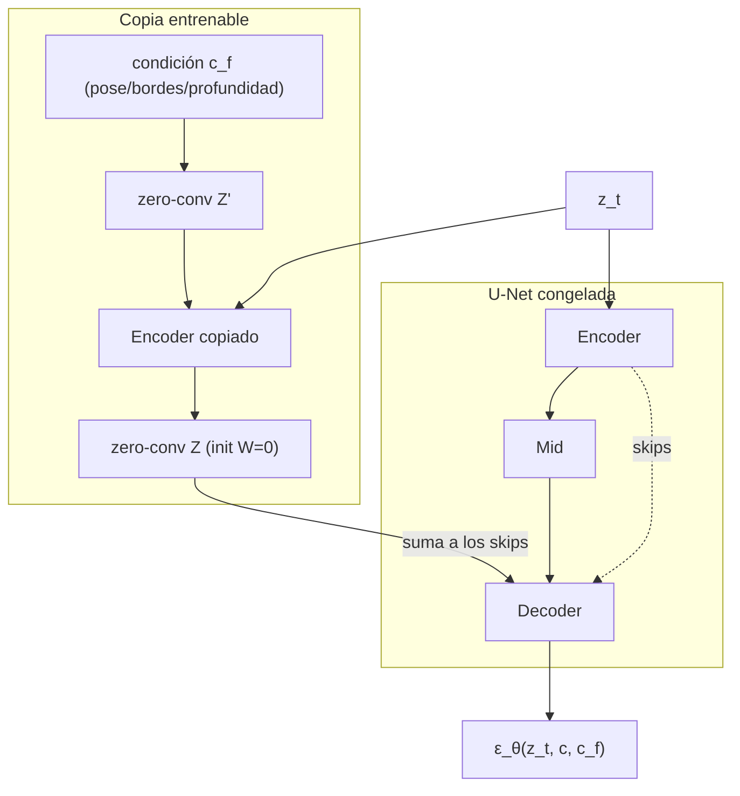

# 092 — Control estructural y edición generativa

> [← Clase anterior](../../../classes/part-07-generative-ai-across-media/091-texto-a-imagen-y-condicionamiento/README.md) · [Índice de la parte](../README.md) · [Clase siguiente →](../../../classes/part-07-generative-ai-across-media/093-generacion-musical-y-de-audio/README.md)

**Parte:** 07 — IA generativa para texto, imagen, audio, video y 3D  
**Nivel:** avanzado · **Horas estimadas:** 6  
**Laboratorio:** `generation` · **Estado:** `EXECUTABLE_CORE`

## 🎯 Propósito

Comprender **control estructural y edición generativa** dentro de la evolución de la inteligencia
artificial, implementar un experimento mínimo verificable y distinguir qué parte
constituye evidencia frente a una afirmación todavía no comprobada.

## 📚 Resultados de aprendizaje

Al finalizar podrás:

1. Explicar control estructural y edición generativa usando los conceptos `inpainting`, `control`, `pose`, `depth`.
2. Ejecutar el laboratorio con una semilla explícita y revisar su contrato JSON.
3. Identificar al menos un supuesto, una limitación y un riesgo de aplicación.
4. Comparar el enfoque con la etapa anterior de la ruta de aprendizaje.
5. Producir una evidencia reproducible y una conclusión que no exceda los datos.

## 🧩 Conceptos centrales

`inpainting`, `control`, `pose`, `depth`

## 🗺️ Ubicación en el mapa de la IA

El texto (clase 091) especifica *qué* generar, pero no *dónde ni cómo*: un prompt no
puede fijar la pose exacta de una figura ni el trazado de un edificio. Esta clase
cubre las técnicas que dan control espacial sobre un modelo de difusión ya entrenado
—ControlNet, img2img e inpainting— sin reentrenarlo desde cero. Son las que
convirtieron los generadores en herramientas de edición profesional y anticipan el
control por condiciones múltiples en video y 3D.

## 📖 Fundamentos

### 🎛️ ControlNet: una copia entrenable del encoder

ControlNet (Zhang, Rao y Agrawala, 2023) añade condiciones espaciales densas —mapas
de bordes (Canny), pose (OpenPose), profundidad, segmentación— a un modelo de
difusión **congelado**. La arquitectura:

- Se **congela** la U-Net original (preserva todo lo aprendido con miles de millones
  de imágenes).
- Se crea una **copia entrenable** de los bloques del encoder de la U-Net, que recibe
  el latente ruidoso z_t más el mapa de condición c_f (bordes/pose/profundidad).
- La salida de cada bloque copiado se suma a la conexión skip correspondiente del
  decoder congelado, pasando por una **zero-convolution**: una convolución 1×1 con
  pesos W y sesgo b inicializados a **cero**.

```text
salida_bloque = bloque_congelado(z_t)  +  Z(bloque_copiado(z_t + Z'(c_f)))
donde Z, Z' son convoluciones 1×1 con W = 0, b = 0 al inicio
```

Al comenzar el entrenamiento, Z(·) = 0, así que la red se comporta **exactamente**
como el modelo original: el control se incorpora de forma gradual sin destruir el
conocimiento previo. Aunque la salida inicial es 0, el gradiente respecto a los pesos
de la zero-convolution NO es cero (∂(W·x)/∂W = x ≠ 0), de modo que sí aprende desde
el primer paso.

### 🖼️ img2img: la fuerza de ruido decide cuánto se conserva

img2img (formalizado como SDEdit, Meng et al., 2022) parte de una imagen real en vez
de ruido puro. El parámetro **strength** s ∈ [0, 1] controla el punto de entrada al
proceso de difusión con T pasos totales:

```text
1. z₀ = E(imagen_original)                  # encodificar al latente
2. t_inicio = round(s · T)                  # cuánto ruido añadir
3. z_{t_inicio} = √(ᾱ_t)·z₀ + √(1−ᾱ_t)·ε   # difusión hacia delante, un salto
4. denoising desde t_inicio hasta 0 con el prompt como condición
```

Con s pequeño, se añade poco ruido y quedan pocos pasos de denoising: el resultado
conserva composición, colores y estructura del original. Con s → 1, el latente es
casi ruido puro y el original apenas influye. El costo también escala: se ejecutan
s·T pasos de U-Net, no T.

### 🎭 Inpainting: regenerar solo dentro de la máscara

El inpainting recibe una imagen y una máscara binaria m (1 = regenerar, 0 =
preservar). La variante sin reentrenamiento (RePaint, Lugmayr et al., 2022) fuerza en
cada paso las zonas conocidas a su valor verdadero ruidificado:

```text
en cada paso t:
    z_conocido  = difusión_forward(z₀_original, t)     # zona fuera de la máscara
    z_generado  = paso_de_denoising(z_t)               # predicción del modelo
    z_{t−1} = (1 − m) ⊙ z_conocido + m ⊙ z_generado    # componer con la máscara
```

El modelo solo "inventa" dentro de la máscara, pero cada paso ve el contexto real
circundante, lo que garantiza coherencia en los bordes. Los modelos de inpainting
dedicados (SD-inpainting) van más lejos: se afinan recibiendo la máscara y la imagen
enmascarada como canales extra de entrada de la U-Net.

## 🧮 Ejemplo trabajado

**La fuerza de img2img con T = 50.** Calcula el paso inicial y los pasos ejecutados:

```text
s = 0.2  →  t_inicio = round(0.2 · 50) = 10  →  10 pasos de denoising
s = 0.5  →  t_inicio = round(0.5 · 50) = 25  →  25 pasos
s = 0.8  →  t_inicio = round(0.8 · 50) = 40  →  40 pasos
s = 1.0  →  t_inicio = 50 (ruido casi puro)  →  50 pasos = texto-a-imagen normal
```

Con s = 0.2 el latente retiene √(ᾱ₁₀) ≈ la mayor parte de la señal original: el
modelo solo puede retocar texturas y estilo — la composición sobrevive. Con s = 0.8
queda poca señal original: el prompt domina y solo persisten rasgos globales (paleta,
disposición aproximada de masas). Regla práctica: retoque de estilo s ≈ 0.3-0.5;
reinterpretación fuerte s ≈ 0.7-0.9.

**Gradiente de la zero-convolution en el primer paso.** Sea la zero-conv
y = W·x + b con W = 0, b = 0, y una feature de entrada x = 3.0. En el forward,
y = 0: el ControlNet no altera al modelo congelado. En el backward, con gradiente
entrante ∂L/∂y = g = 0.5:

```text
∂L/∂W = g · x = 0.5 · 3.0 = 1.5   ≠ 0  → W se actualiza: W ← 0 − η·1.5
∂L/∂b = g     = 0.5               ≠ 0  → b se actualiza
∂L/∂x = g · W = 0.5 · 0   = 0          → el bloque copiado aún no recibe señal
```

Tras la primera actualización W ≠ 0, y a partir de ahí el gradiente también fluye
hacia el interior de la copia entrenable: el control se "enciende" progresivamente.

## 📊 Propiedades y comparación

| Técnica | Qué controla | ¿Requiere entrenamiento? | Parámetros extra | Límite principal |
|---|---|---|---|---|
| Prompt (clase 091) | contenido semántico global | no | 0 | sin control espacial preciso |
| img2img (SDEdit) | composición global vía imagen inicial | no | 0 (solo s) | trade-off rígido fidelidad/libertad |
| Inpainting (RePaint / SD-inpaint) | región enmascarada | no / fine-tuning ligero | 0 / canales extra | coherencia global si la máscara es grande |
| **ControlNet** | estructura densa (pose, bordes, profundidad) | sí (copia del encoder, ~50 % params de la U-Net) | cientos de M | un modelo por tipo de condición |
| LoRA (parte 06) | estilo/sujeto aprendido | sí (rango bajo) | pocos M | no es control espacial por imagen |



## ⚠️ Errores conceptuales frecuentes

1. **"ControlNet reentrena el modelo base."** No: la U-Net original queda congelada;
   solo se entrena la copia del encoder y las zero-convolutions. Por eso un
   ControlNet se acopla a cualquier checkpoint compatible del mismo modelo base.
2. **"Si la zero-convolution sale 0, no puede aprender."** El gradiente respecto a
   sus *pesos* es proporcional a la *entrada* (no a la salida), así que es distinto
   de cero desde el primer paso — solo el gradiente hacia atrás a través de W es 0
   inicialmente.
3. **"strength = 0.5 conserva el 50 % de los píxeles."** La fuerza fija el nivel de
   ruido de partida, no una mezcla lineal de píxeles: lo que se conserva es
   información de baja frecuencia (composición), no píxeles concretos.
4. **"El inpainting solo mira dentro de la máscara."** Al revés: en cada paso el
   modelo ve el contexto completo (la zona conocida ruidificada al nivel t); esa es
   la razón de que los bordes queden coherentes.
5. **"Más condiciones siempre dan mejor control."** Condiciones contradictorias
   (una pose que no cabe en el mapa de profundidad) degradan el resultado; los
   pesos de cada ControlNet deben balancearse y el prompt sigue mandando en lo
   semántico.

## 🚀 Del aprendizaje a la operación

Para un flujo de edición real faltan: preprocesadores robustos que extraigan la
condición (detector de pose, estimador de profundidad) con sus propios modos de
fallo, política de derechos cuando la imagen de partida no es del usuario,
trazabilidad de qué se editó (máscaras y semillas registradas, procedencia C2PA),
evaluación con usuarios de si el control es *suficiente* para la tarea, y límites de
uso que impidan ediciones de personas reales sin consentimiento.

## 🧪 Laboratorio

```bash
python lab.py
```

El laboratorio llama a `ai_evolution.labs.run_lab("generation")`. Esta
decisión evita 183 implementaciones divergentes: cada clase tiene un entrypoint
propio, pero los motores didácticos se prueban como una biblioteca común.

### 🔍 Evidencia esperada

- tipo de laboratorio y semilla;
- entradas o decisiones observables;
- resultado estructurado;
- lista `evidence` con hechos que pueden inspeccionarse;
- lista `limitations` que impide presentar la demo como producción.

## 📓 Notebooks

- [📓 `notebook.ipynb`](notebook.ipynb): recorrido guiado con la materia resumida.
- [✍️ `notebook_student.ipynb`](notebook_student.ipynb): ejercicios para resolver.
- [✅ `notebook_solution.ipynb`](notebook_solution.ipynb): solución de referencia explicada.

## 📝 Evaluación

| Criterio | Peso |
|---|---:|
| Comprensión conceptual | 25 % |
| Ejecución reproducible | 25 % |
| Interpretación basada en evidencia | 25 % |
| Riesgos, límites y mejora propuesta | 25 % |

Consulta [assessment.md](assessment.md) para preguntas y criterio de aceptación.

## ⚠️ Errores comunes

| Síntoma | Causa probable | Corrección |
|---|---|---|
| El código corre, pero no hay conclusión | Se confundió ejecución con aprendizaje | Explica qué demuestra y qué no demuestra |
| El resultado cambia sin explicación | No se registró semilla o configuración | Conserva semilla, versión y parámetros |
| Se promete uso real | Se extrapoló desde una demo educativa | Declara entorno, datos, límites y revisión humana |
| Se copia una métrica aislada | No existe baseline ni costo de error | Añade comparación y criterio de decisión |

## ❓ Preguntas frecuentes

**¿Debo usar una API comercial?**  
No. El núcleo funciona localmente. Las extensiones LIVE se documentan por separado.

**¿El laboratorio representa una implementación industrial?**  
No por sí solo. Enseña el contrato y el patrón; producción exige integración,
seguridad, observabilidad, pruebas y operación.

**¿Dónde profundizo?**  
Revisa las especializaciones enlazadas en el README raíz y la ruta siguiente.

## 🔗 Referencias

- Zhang, L., Rao, A. y Agrawala, M. (2023). *Adding Conditional Control to Text-to-Image Diffusion Models* (ControlNet). [arXiv:2302.05543](https://arxiv.org/abs/2302.05543)
- Meng, C. et al. (2022). *SDEdit: Guided Image Synthesis and Editing with Stochastic Differential Equations*. [arXiv:2108.01073](https://arxiv.org/abs/2108.01073)
- Lugmayr, A. et al. (2022). *RePaint: Inpainting using Denoising Diffusion Probabilistic Models*. [arXiv:2201.09865](https://arxiv.org/abs/2201.09865)
- Rombach, R. et al. (2022). *High-Resolution Image Synthesis with Latent Diffusion Models*. [arXiv:2112.10752](https://arxiv.org/abs/2112.10752)
- Documentación de Hugging Face Diffusers: [ControlNet](https://huggingface.co/docs/diffusers/api/pipelines/controlnet)

---

## ⬅️ Clase anterior

[091 — Texto a imagen y condicionamiento](../../part-07-generative-ai-across-media/091-texto-a-imagen-y-condicionamiento/README.md)

## ➡️ Siguiente clase

[093 — Generación musical y de audio](../../part-07-generative-ai-across-media/093-generacion-musical-y-de-audio/README.md)
